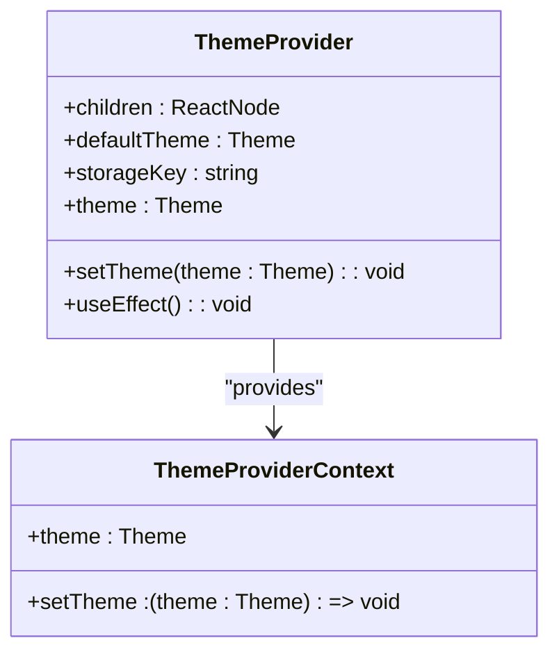

# Theme System and Dark Mode Implementation

<cite>
**Referenced Files in This Document**   
- [theme-provider.tsx](file://apps/web/src/components/theme-provider.tsx)
- [mode-toggle.tsx](file://apps/web/src/components/mode-toggle.tsx)
- [tailwind.config.js](file://apps/native/tailwind.config.js)
- [global.css](file://apps/native/global.css)
- [index.css](file://apps/web/src/index.css)
- [use-color-scheme.ts](file://apps/native/lib/use-color-scheme.ts)
- [constants.ts](file://apps/native/lib/constants.ts)
- [+html.tsx](file://apps/native/app/+html.tsx)
- [_layout.tsx](file://apps/native/app/_layout.tsx)
- [android-navigation-bar.tsx](file://apps/native/lib/android-navigation-bar.tsx)
</cite>

## Table of Contents
1. [Introduction](#introduction)
2. [Theme Provider Context Setup](#theme-provider-context-setup)
3. [CSS Variables and Color Mode Detection](#css-variables-and-color-mode-detection)
4. [Theme Persistence with localStorage](#theme-persistence-with-localstorage)
5. [Tailwind CSS Dark Mode Integration](#tailwind-css-dark-mode-integration)
6. [Mode Toggle Component](#mode-toggle-component)
7. [Custom Theme Extensions](#custom-theme-extensions)
8. [Flash of Incorrect Theme During Hydration](#flash-of-incorrect-theme-during-hydration)
9. [Performance Impacts of Theme Switching](#performance-impacts-of-theme-switching)
10. [Extending the Theme System](#extending-the-theme-system)
11. [Accessibility Considerations](#accessibility-considerations)

## Introduction
The theme system in this application provides a robust mechanism for managing light and dark modes, with support for system preference detection and user customization. The implementation leverages React context for state management, CSS variables for styling, and Tailwind CSS for responsive design. This document details the architecture, functionality, and best practices for extending and maintaining the theme system.

## Theme Provider Context Setup

The theme system is built around a React context that manages the current theme state and provides it to all components in the application. The `ThemeProvider` component initializes the context with a default theme, which can be overridden by user preferences stored in `localStorage`.



**Diagram sources**
- [theme-provider.tsx](file://apps/web/src/components/theme-provider.tsx#L1-L74)

**Section sources**
- [theme-provider.tsx](file://apps/web/src/components/theme-provider.tsx#L1-L74)

## CSS Variables and Color Mode Detection

The application uses CSS variables to define color palettes for both light and dark themes. These variables are defined in the `:root` and `.dark:root` selectors, allowing seamless transitions between themes. The `useEffect` hook in the `ThemeProvider` component detects the user's preferred color scheme using the `prefers-color-scheme` media query and applies the appropriate theme.

```css
:root {
  --background: 0 0% 100%;
  --foreground: 222.2 84% 4.9%;
  /* ... other variables */
}

.dark:root {
  --background: 222.2 84% 4.9%;
  --foreground: 210 40% 98%;
  /* ... other variables */
}
```

**Section sources**
- [global.css](file://apps/native/global.css#L1-L50)
- [index.css](file://apps/web/src/index.css#L1-L168)

## Theme Persistence with localStorage

User theme preferences are persisted using `localStorage`, ensuring that the selected theme is maintained across sessions. The `ThemeProvider` component reads the stored theme from `localStorage` on initialization and updates it whenever the user changes the theme.

```typescript
const [theme, setTheme] = useState<Theme>(
  () => (localStorage.getItem(storageKey) as Theme) || defaultTheme
);

// ...

setTheme: (theme: Theme) => {
  localStorage.setItem(storageKey, theme);
  setTheme(theme);
}
```

**Section sources**
- [theme-provider.tsx](file://apps/web/src/components/theme-provider.tsx#L1-L74)

## Tailwind CSS Dark Mode Integration

Tailwind CSS is configured to support dark mode using the `class` strategy, which adds a `dark` class to the root element when the dark theme is active. This allows developers to use Tailwind's `dark:` variant to apply styles conditionally.

```javascript
module.exports = {
  darkMode: "class",
  // ...
};
```

**Section sources**
- [tailwind.config.js](file://apps/native/tailwind.config.js#L1-L60)

## Mode Toggle Component

The `ModeToggle` component provides a user interface for switching between light, dark, and system themes. It uses the `useTheme` hook to access the current theme and update it when the user selects a new theme.

```tsx
export function ModeToggle() {
  const { setTheme } = useTheme();

  return (
    <DropdownMenu>
      <DropdownMenuTrigger asChild>
        <Button variant="outline" size="icon">
          <Sun className="h-[1.2rem] w-[1.2rem] scale-100 rotate-0 transition-all dark:scale-0 dark:-rotate-90" />
          <Moon className="absolute h-[1.2rem] w-[1.2rem] scale-0 rotate-90 transition-all dark:scale-100 dark:rotate-0" />
          <span className="sr-only">Toggle theme</span>
        </Button>
      </DropdownMenuTrigger>
      <DropdownMenuContent align="end">
        <DropdownMenuItem onClick={() => setTheme("light")}>
          Light
        </DropdownMenuItem>
        <DropdownMenuItem onClick={() => setTheme("dark")}>
          Dark
        </DropdownMenuItem>
        <DropdownMenuItem onClick={() => setTheme("system")}>
          System
        </DropdownMenuItem>
      </DropdownMenuContent>
    </DropdownMenu>
  );
}
```

**Section sources**
- [mode-toggle.tsx](file://apps/web/src/components/mode-toggle.tsx#L1-L38)

## Custom Theme Extensions

The theme system can be extended by adding new color palettes and theme variants. The `tailwind.config.js` file allows for custom color definitions using CSS variables, which can be easily modified to support additional themes.

```javascript
theme: {
  extend: {
    colors: {
      background: "hsl(var(--background))",
      foreground: "hsl(var(--foreground))",
      // ...
    },
    // ...
  },
}
```

**Section sources**
- [tailwind.config.js](file://apps/native/tailwind.config.js#L1-L60)

## Flash of Incorrect Theme During Hydration

To prevent a flash of incorrect theme during hydration, the application uses a combination of server-side rendering and client-side theme detection. The `+html.tsx` file includes raw CSS styles to ensure the background color is set correctly before the JavaScript is loaded.

```css
body {
  background-color: #fff;
}
@media (prefers-color-scheme: dark) {
  body {
    background-color: #000;
  }
}
```

**Section sources**
- [+html.tsx](file://apps/native/app/+html.tsx#L1-L50)

## Performance Impacts of Theme Switching

Theme switching is optimized to minimize performance impacts. The `useEffect` hook in the `ThemeProvider` component ensures that the theme is only updated when necessary, and the use of CSS variables allows for smooth transitions between themes without requiring a full page reload.

**Section sources**
- [theme-provider.tsx](file://apps/web/src/components/theme-provider.tsx#L1-L74)

## Extending the Theme System

The theme system can be extended by adding new theme variants and customizing the color palettes. Developers can define new CSS variables and update the `tailwind.config.js` file to include the new themes. Additionally, the `useTheme` hook can be used to access the current theme and apply custom styles based on the user's preference.

**Section sources**
- [tailwind.config.js](file://apps/native/tailwind.config.js#L1-L60)
- [global.css](file://apps/native/global.css#L1-L50)

## Accessibility Considerations

The theme system ensures accessibility by providing high contrast between text and background colors in both light and dark modes. The use of semantic HTML and ARIA attributes in the `ModeToggle` component ensures that the theme switcher is accessible to screen readers and keyboard users.

**Section sources**
- [mode-toggle.tsx](file://apps/web/src/components/mode-toggle.tsx#L1-L38)
- [global.css](file://apps/native/global.css#L1-L50)