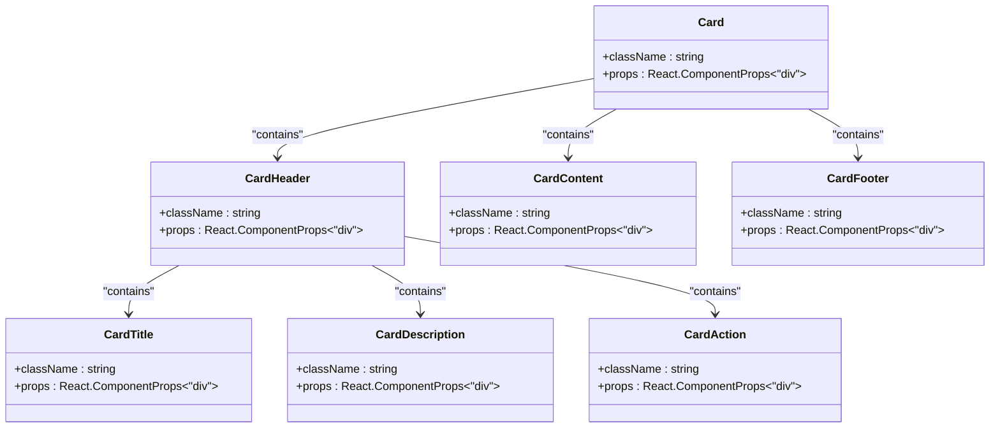

# Card Component

<cite>
**Referenced Files in This Document**   
- [card.tsx](file://apps/web/src/components/ui/card.tsx)
- [hipaa.tsx](file://apps/web/src/routes/dashboard/compliance/hipaa.tsx)
- [statistics.tsx](file://apps/web/src/routes/dashboard/alerts/statistics.tsx)
- [event-preview-calendar.tsx](file://apps/web/src/components/event-calendar/event-preview-calendar.tsx)
- [invitation-error.tsx](file://apps/web/src/components/organization/invitation-error.tsx)
- [accept-invitation/$id.tsx](file://apps/web/src/routes/accept-invitation/$id.tsx)
</cite>

## Table of Contents
1. [Introduction](#introduction)
2. [Core Components](#core-components)
3. [Styling and Responsive Behavior](#styling-and-responsive-behavior)
4. [Usage Examples](#usage-examples)
5. [Accessibility Features](#accessibility-features)
6. [Performance Considerations](#performance-considerations)
7. [Nesting and Interactive Elements](#nesting-and-interactive-elements)

## Introduction
The Card component is a foundational UI element used for content grouping and layout across the application. It provides a consistent, accessible, and responsive container for displaying related information in dashboards, settings panels, and data summaries. The component is composed of several subcomponents that work together to create a semantically structured and visually cohesive unit.

**Section sources**
- [card.tsx](file://apps/web/src/components/ui/card.tsx#L4-L75)

## Core Components

The Card component system consists of multiple parts that can be used individually or together:

- **CardRoot**: The main container (`Card`) that provides the base styling and layout
- **CardHeader**: A structured header section that organizes title, description, and action elements
- **CardTitle**: The primary heading within the card, styled for prominence
- **CardDescription**: Secondary text that provides context or additional information
- **CardContent**: The main content area with consistent padding
- **CardAction**: A dedicated space for interactive elements, positioned appropriately
- **CardFooter**: A footer section for supplementary information or controls

These components work together to create a consistent visual hierarchy and semantic structure.



**Diagram sources**
- [card.tsx](file://apps/web/src/components/ui/card.tsx#L4-L75)

**Section sources**
- [card.tsx](file://apps/web/src/components/ui/card.tsx#L4-L75)

## Styling and Responsive Behavior

The Card component system uses Tailwind CSS classes combined with the `cn` utility for conditional class composition. Key styling features include:

- **Responsive Grid Layout**: The header uses `@container/card-header` and grid layout that adapts based on content
- **Flexible Spacing**: Consistent gap and padding values (6px, 1.5px) for visual harmony
- **Semantic Data Attributes**: `data-slot` attributes for styling and testing hooks
- **Theme Integration**: Uses CSS variables like `bg-card` and `text-card-foreground` for theme consistency
- **Shadow and Border**: Subtle shadow (`shadow-sm`) and border for depth and separation

The component responds to different screen sizes through container queries and flexible grid layouts, ensuring content remains readable and well-organized across devices.

**Section sources**
- [card.tsx](file://apps/web/src/components/ui/card.tsx#L4-L75)

## Usage Examples

### Dashboard Data Summaries
In dashboard contexts, cards display key metrics and visualizations:

```mermaid
flowchart TD
A[Card Container] --> B[CardHeader]
B --> C[CardTitle: "By Severity"]
B --> D[CardAction: Interactive Button]
A --> E[CardContent]
E --> F[ChartContainer]
E --> G[BarChart/PieChart]
A --> H[CardFooter]
H --> I[Date Range Information]
```

**Diagram sources**
- [statistics.tsx](file://apps/web/src/routes/dashboard/alerts/statistics.tsx#L42-L61)
- [hipaa.tsx](file://apps/web/src/routes/dashboard/compliance/hipaa.tsx#L178-L215)

### Settings Panels
Cards organize settings options with clear visual separation:

```mermaid
sequenceDiagram
participant Card as "Card"
participant Header as "CardHeader"
participant Title as "CardTitle"
participant Description as "CardDescription"
participant Content as "CardContent"
participant Footer as "CardFooter"
Card->>Header : Render header section
Header->>Title : Display section title
Header->>Description : Show explanatory text
Card->>Content : Render form inputs
Card->>Footer : Display action buttons
```

**Diagram sources**
- [accept-invitation/$id.tsx](file://apps/web/src/routes/accept-invitation/$id.tsx#L94-L139)

### Data Grouping
Cards group related information in various contexts:

```mermaid
flowchart TD
A[Card] --> B[CardHeader]
B --> C[CardTitle: "Invitation Error"]
B --> D[CardDescription: Hidden for screen readers]
A --> E[CardContent: Error details]
A --> F[CardFooter: Action buttons]
```

**Diagram sources**
- [invitation-error.tsx](file://apps/web/src/components/organization/invitation-error.tsx#L14-L18)

**Section sources**
- [hipaa.tsx](file://apps/web/src/routes/dashboard/compliance/hipaa.tsx#L178-L255)
- [statistics.tsx](file://apps/web/src/routes/dashboard/alerts/statistics.tsx#L42-L61)
- [accept-invitation/$id.tsx](file://apps/web/src/routes/accept-invitation/$id.tsx#L94-L139)
- [invitation-error.tsx](file://apps/web/src/components/organization/invitation-error.tsx#L14-L18)

## Accessibility Features

The Card component system incorporates several accessibility features:

- **Proper Heading Hierarchy**: CardTitle serves as a semantic heading within the card structure
- **Screen Reader Support**: Use of `sr-only` class for visually hidden but screen-reader accessible content
- **Semantic HTML**: All components use appropriate HTML elements with proper ARIA roles implied by structure
- **Focus Management**: Interactive elements within CardAction maintain proper focus order
- **Color Contrast**: Text colors (`text-card-foreground`, `text-muted-foreground`) ensure sufficient contrast

The component maintains accessibility while providing visual flexibility through its composable parts.

**Section sources**
- [card.tsx](file://apps/web/src/components/ui/card.tsx#L4-L75)
- [accept-invitation/$id.tsx](file://apps/web/src/routes/accept-invitation/$id.tsx#L97)

## Performance Considerations

The Card component is optimized for efficient rendering and integration:

- **Lightweight Implementation**: Simple div elements with minimal runtime overhead
- **Composable Architecture**: Components can be used independently, reducing unnecessary DOM nodes
- **Theme Integration**: Uses CSS variables for fast theme switching without re-renders
- **Container Queries**: Responsive behavior through `@container` queries rather than JavaScript
- **Memoization Ready**: Stateless functional components work well with React.memo when needed

The component integrates seamlessly with data visualization libraries and form controls, making it suitable for dynamic content without performance penalties.

**Section sources**
- [card.tsx](file://apps/web/src/components/ui/card.tsx#L4-L75)
- [hipaa.tsx](file://apps/web/src/routes/dashboard/compliance/hipaa.tsx#L178-L255)

## Nesting and Interactive Elements

Cards can be nested and combined with interactive elements effectively:

- **Grid Layouts**: Multiple cards arranged in grid layouts for dashboards
- **Interactive Actions**: CardAction slot for buttons, dropdowns, or other controls
- **Conditional Rendering**: Header grid automatically adjusts when CardAction is present
- **Flexible Content**: CardContent can contain forms, charts, lists, or other complex components
- **Consistent Spacing**: Uniform padding and gap values maintain visual consistency

The component's design supports various interaction patterns while maintaining a cohesive visual language across the application.

**Section sources**
- [card.tsx](file://apps/web/src/components/ui/card.tsx#L17-L20)
- [event-preview-calendar.tsx](file://apps/web/src/components/event-calendar/event-preview-calendar.tsx#L39)
- [statistics.tsx](file://apps/web/src/routes/dashboard/alerts/statistics.tsx#L42-L61)