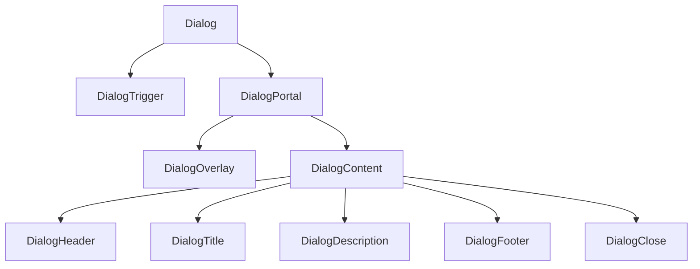
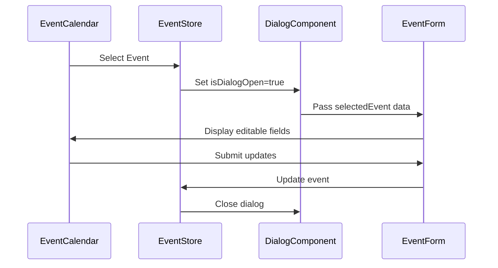
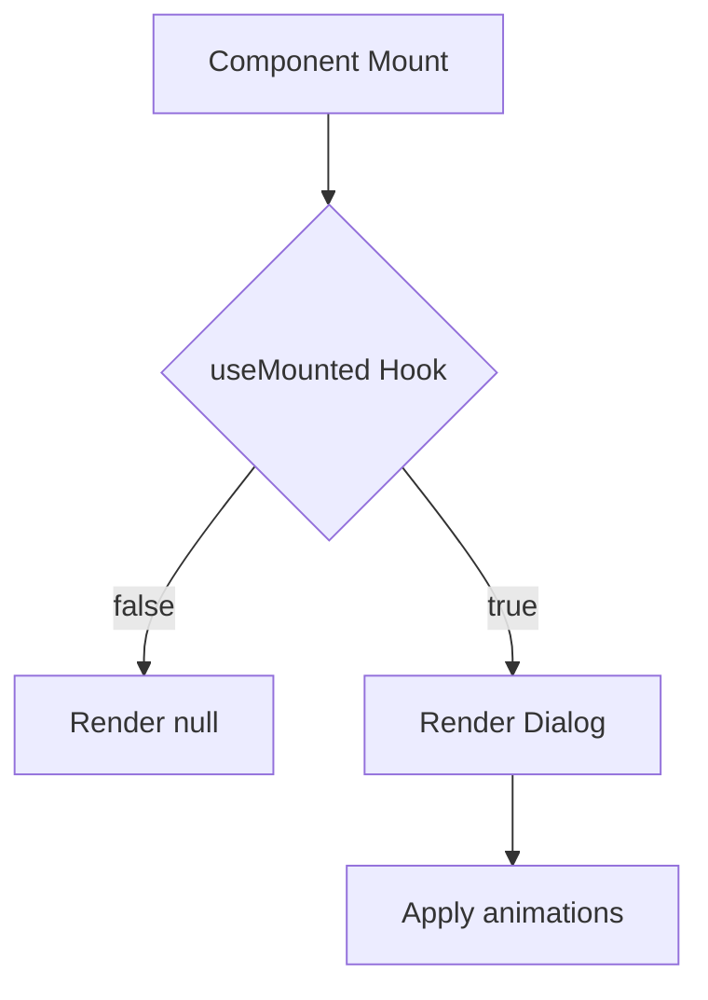

# Dialog Component

<cite>
**Referenced Files in This Document**   
- [dialog.tsx](file://apps/web/src/components/ui/dialog.tsx)
- [event-dialog.tsx](file://apps/web/src/components/event-calendar/event-dialog.tsx)
- [use-mounted.tsx](file://apps/web/src/hooks/use-mounted.tsx)
</cite>

## Table of Contents
1. [Introduction](#introduction)
2. [Composition Pattern](#composition-pattern)
3. [Core Components](#core-components)
4. [Props and Configuration](#props-and-configuration)
5. [Usage Examples](#usage-examples)
6. [Accessibility and Keyboard Navigation](#accessibility-and-keyboard-navigation)
7. [Performance Considerations](#performance-considerations)
8. [Integration Guidance](#integration-guidance)
9. [Conclusion](#conclusion)

## Introduction
The Dialog component is a reusable UI primitive built on top of Radix UI's `@radix-ui/react-dialog` to provide accessible, keyboard-navigable modal dialogs. It supports various use cases such as modals, confirmation prompts, and form overlays. The implementation ensures focus trapping, proper ARIA attributes, and smooth animations while maintaining flexibility for customization.

**Section sources**
- [dialog.tsx](file://apps/web/src/components/ui/dialog.tsx#L1-L10)

## Composition Pattern
The Dialog component follows a compositional pattern using several subcomponents that map directly to Radix UI primitives:

- **DialogRoot**: Manages the open/closed state of the dialog
- **DialogTrigger**: Toggles the dialog's visibility
- **DialogPortal**: Renders content into the document body to avoid clipping
- **DialogOverlay**: Dimmed background layer that blocks interaction with underlying content
- **DialogContent**: The main dialog container with positioning and animations
- **DialogHeader**, **DialogFooter**, **DialogTitle**, **DialogDescription**: Semantic layout and labeling components

This pattern enables flexible composition while ensuring accessibility and consistent behavior.

**Diagram sources**
- [dialog.tsx](file://apps/web/src/components/ui/dialog.tsx#L10-L144)

## Core Components

### DialogRoot
The root component that manages the open state and provides context to its children. It wraps Radix UI's `DialogPrimitive.Root` and adds a data-slot attribute for styling.

**Section sources**
- [dialog.tsx](file://apps/web/src/components/ui/dialog.tsx#L10-L13)

### DialogTrigger
A button or element that toggles the dialog open. It uses Radix UI's `Trigger` primitive and applies consistent data attributes.

**Section sources**
- [dialog.tsx](file://apps/web/src/components/ui/dialog.tsx#L14-L18)

### DialogPortal
Ensures the dialog is rendered at the end of the document body, preventing z-index and overflow clipping issues. This is essential for proper layering.

**Section sources**
- [dialog.tsx](file://apps/web/src/components/ui/dialog.tsx#L20-L24)

### DialogOverlay
Creates a semi-transparent backdrop behind the dialog. It includes fade-in/fade-out animations via data-state attributes and prevents interaction with background content.

**Section sources**
- [dialog.tsx](file://apps/web/src/components/ui/dialog.tsx#L32-L46)

### DialogContent
The main dialog container positioned centrally using absolute positioning and transform offsets. It includes zoom animations and responsive width constraints (max-w-lg on small screens).

**Section sources**
- [dialog.tsx](file://apps/web/src/components/ui/dialog.tsx#L48-L80)

## Props and Configuration

### State Control
- `open`: Boolean controlling dialog visibility
- `onOpenChange`: Callback function triggered when open state changes

### Accessibility Attributes
- Automatically includes ARIA roles (`dialog`, `heading`)
- `DialogTitle` provides accessible name
- `DialogDescription` offers additional context
- Focus is automatically trapped within the dialog

### Animation Props
Animations are controlled via data-state attributes:
- `data-[state=open]:animate-in`: Applies when opening
- `data-[state=closed]:animate-out`: Applies when closing
- Fade and zoom transitions with duration-200 class

### Customization
- `className`: Extend default styles
- `showCloseButton`: Optional prop to hide the X close button
- All Radix UI props are passed through via spread operator

**Section sources**
- [dialog.tsx](file://apps/web/src/components/ui/dialog.tsx#L48-L80)

## Usage Examples

### Event Management Dialog
Used in the event calendar system to display and edit event details. The dialog integrates with form libraries and scroll areas for long content.

**Diagram sources**
- [event-dialog.tsx](file://apps/web/src/components/event-calendar/event-dialog.tsx#L86-L126)

### Confirmation and Deletion
Integrated with `DeleteAlert` component to confirm destructive actions. Uses `DialogFooter` for action buttons and proper spacing.

**Section sources**
- [event-dialog.tsx](file://apps/web/src/components/event-calendar/event-dialog.tsx#L118-L125)

## Accessibility and Keyboard Navigation
The component supports full keyboard navigation:
- Tab/Shift+Tab: Cycle through focusable elements within the dialog
- Escape: Closes the dialog
- Click outside: Closes the dialog (configurable)
- Focus is trapped within the dialog while open
- Screen readers announce title and description appropriately

The implementation leverages Radix UI's built-in accessibility features including proper focus management and ARIA attributes.

**Section sources**
- [dialog.tsx](file://apps/web/src/components/ui/dialog.tsx#L10-L144)

## Performance Considerations

### Lazy Mounting
The `useMounted` hook prevents rendering until after initial mount, avoiding hydration mismatches and improving initial load performance.

**Diagram sources**
- [use-mounted.tsx](file://apps/web/src/hooks/use-mounted.tsx#L1-L13)
- [event-dialog.tsx](file://apps/web/src/components/event-calendar/event-dialog.tsx#L138-L140)

### Unmounting Strategy
Dialogs are conditionally rendered based on `isMounted` state, ensuring they are only present in the DOM when needed. This reduces memory usage and improves performance in complex applications with multiple potential dialogs.

**Section sources**
- [event-dialog.tsx](file://apps/web/src/components/event-calendar/event-dialog.tsx#L138-L140)

## Integration Guidance

### With Form Components
The dialog integrates seamlessly with React Hook Form and Zod validation. Pass form context through props and handle submission within dialog actions.

**Section sources**
- [event-dialog.tsx](file://apps/web/src/components/event-calendar/event-dialog.tsx#L108-L112)

### With Notification Systems
Uses `sonner` toast notifications to provide feedback after dialog actions. Success messages include descriptive text for accessibility.

**Section sources**
- [event-dialog.tsx](file://apps/web/src/components/event-calendar/event-dialog.tsx#L113-L117)

### Responsive Design
Utilizes Tailwind CSS classes for responsive behavior:
- Full width with padding on mobile (`max-w-[calc(100%-2rem)]`)
- Constrained width on larger screens (`sm:max-w-lg`)
- Responsive flex layout in footer

**Section sources**
- [dialog.tsx](file://apps/web/src/components/ui/dialog.tsx#L60-L62)

## Conclusion
The Dialog component provides a robust, accessible foundation for modal interfaces using Radix UI primitives. Its compositional pattern allows for flexible usage across various contexts including forms, confirmations, and detailed views. With built-in support for animations, keyboard navigation, and responsive design, it serves as a reliable building block for interactive UI elements.