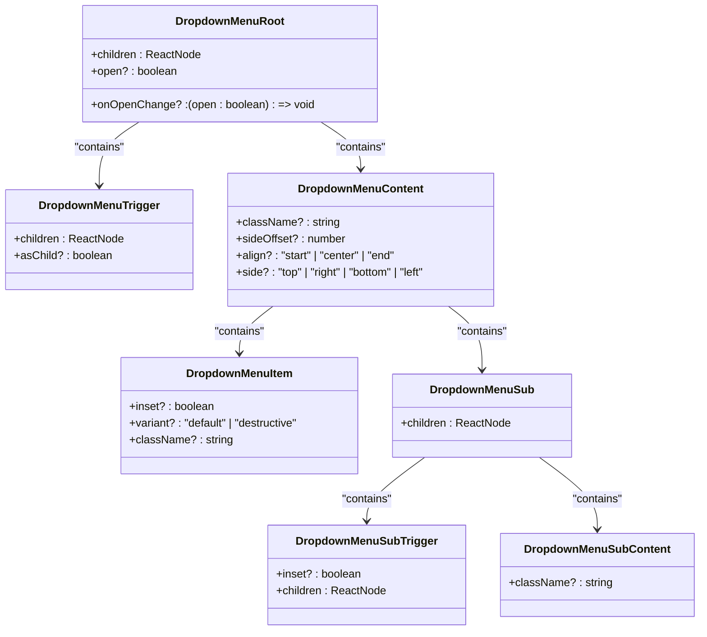
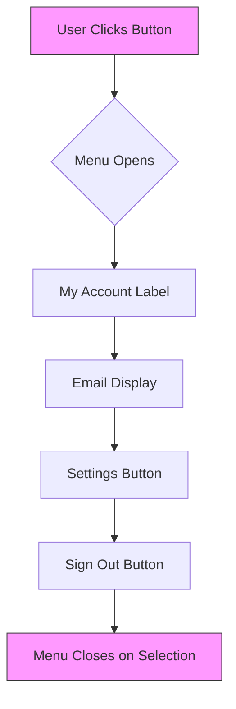

# Dropdown Menu Component

<cite>
**Referenced Files in This Document**   
- [dropdown-menu.tsx](file://apps/web/src/components/ui/dropdown-menu.tsx)
- [user-menu.tsx](file://apps/web/src/components/user-menu.tsx)
</cite>

## Table of Contents
1. [Introduction](#introduction)
2. [Core Components](#core-components)
3. [Props and Configuration](#props-and-configuration)
4. [Usage Examples](#usage-examples)
5. [Accessibility Compliance](#accessibility-compliance)
6. [Performance Considerations](#performance-considerations)
7. [Customization Options](#customization-options)

## Introduction
The Dropdown Menu component is a reusable UI element built on top of Radix UI's primitive components. It provides a fully accessible, keyboard-navigable dropdown menu system that supports various interaction patterns including submenus, checkboxes, radio groups, and shortcuts. This document details the implementation, usage, accessibility features, and performance characteristics of the component as used within the application.

## Core Components

The Dropdown Menu system is composed of several key components that work together to create a cohesive user experience:

- **DropdownMenuRoot**: The root container that manages the open/closed state of the menu
- **DropdownMenuTrigger**: The interactive element that toggles the menu visibility
- **DropdownMenuContent**: The panel that appears when the menu is open
- **DropdownMenuItem**: Individual selectable items within the menu
- **DropdownMenuSub**: Container for nested submenu items
- **DropdownMenuSubTrigger**: Trigger for opening a submenu
- **DropdownMenuSubContent**: Content container for a submenu

These components are implemented as wrapper functions around Radix UI primitives, adding consistent styling and data attributes while preserving all underlying functionality.

**Diagram sources**
- [dropdown-menu.tsx](file://apps/web/src/components/ui/dropdown-menu.tsx#L1-L256)

**Section sources**
- [dropdown-menu.tsx](file://apps/web/src/components/ui/dropdown-menu.tsx#L1-L256)

## Props and Configuration

### Positioning Props
The `DropdownMenuContent` component accepts several props for controlling positioning:

- **sideOffset**: Controls the distance between the trigger and content (default: 4)
- **align**: Controls horizontal alignment relative to the trigger ("start", "center", "end")
- **side**: Controls which side of the trigger the menu appears on ("top", "right", "bottom", "left")

### Animation and Styling
The component includes built-in animations using CSS classes that respond to Radix UI's data attributes:

- `data-[state=open]:animate-in` and `data-[state=closed]:animate-out` control entrance/exit animations
- Various fade, zoom, and slide transitions are applied based on menu state and position
- The content panel has a maximum height constraint using `--radix-dropdown-menu-content-available-height`

### Keyboard Navigation
The component fully supports keyboard navigation as implemented by Radix UI:

- Arrow keys navigate between items
- Enter/Space activate selected items
- Escape closes the menu
- Type-to-select functionality for quick navigation
- Submenu navigation with left/right arrow keys

**Section sources**
- [dropdown-menu.tsx](file://apps/web/src/components/ui/dropdown-menu.tsx#L40-L75)

## Usage Examples

### User Menu Implementation
The component is used in the user menu to provide account management options:

**Diagram sources**
- [user-menu.tsx](file://apps/web/src/components/user-menu.tsx#L1-L74)

#### Context Actions Menu
In the event calendar component, dropdown menus are used for view selection:

- Primary tabs show direct views
- Secondary tabs are accessed via dropdown
- Clicking a dropdown item updates the calendar view
- Menu respects disabled states for unavailable views

**Section sources**
- [dropdown-menu.tsx](file://apps/web/src/components/ui/dropdown-menu.tsx#L1-L256)
- [user-menu.tsx](file://apps/web/src/components/user-menu.tsx#L1-L74)

## Accessibility Compliance

### ARIA Roles and Attributes
The component implements proper ARIA semantics through Radix UI's accessible primitives:

- Proper role assignments (menu, menuitem, etc.)
- `aria-haspopup` and `aria-expanded` on triggers
- Focus management between trigger and menu
- Screen reader announcements for menu state changes

### Focus Management
The component handles focus automatically:

- Focus moves to the first menu item when opened
- Keyboard navigation maintains focus within the menu
- Focus returns to the trigger when menu closes
- Submenu focus management between parent and child menus

### Screen Reader Announcements
Radix UI provides appropriate announcements:

- Menu opening/closing is announced
- Item selection is announced
- Disabled items are announced as such
- Submenu availability is announced

**Section sources**
- [dropdown-menu.tsx](file://apps/web/src/components/ui/dropdown-menu.tsx#L1-L256)

## Performance Considerations

### Lazy Rendering
The component uses Radix UI's Portal and lazy mounting features:

- Menu content is only rendered when open
- Uses `DropdownMenuPortal` to render in document body
- Reduces initial render cost for closed menus

### Event Delegation
The implementation benefits from Radix UI's optimized event handling:

- Efficient keyboard event handling
- Pointer event optimization
- Minimal re-renders during interaction
- Proper cleanup of event listeners

**Section sources**
- [dropdown-menu.tsx](file://apps/web/src/components/ui/dropdown-menu.tsx#L1-L256)

## Customization Options

### Menu Item Variants
The `DropdownMenuItem` supports different visual variants:

- **Default**: Standard appearance
- **Destructive**: Red text for dangerous actions
- Custom styling through the `className` prop

### Icons and Visual Elements
The component supports various visual enhancements:

- Check icons for `DropdownMenuCheckboxItem`
- Circle icons for `DropdownMenuRadioItem`
- Chevron icons for submenu indicators
- Custom icons can be added within menu items

### Submenu Implementation
Nested menus are supported through the sub-components:

- `DropdownMenuSub` wraps submenu content
- `DropdownMenuSubTrigger` opens the submenu
- `DropdownMenuSubContent` contains submenu items
- Automatic positioning and animation

### Grouping and Separation
The component provides organizational elements:

- `DropdownMenuGroup` for logical grouping
- `DropdownMenuLabel` for section headings
- `DropdownMenuSeparator` for visual separation
- `DropdownMenuShortcut` for keyboard shortcut display

**Section sources**
- [dropdown-menu.tsx](file://apps/web/src/components/ui/dropdown-menu.tsx#L1-L256)