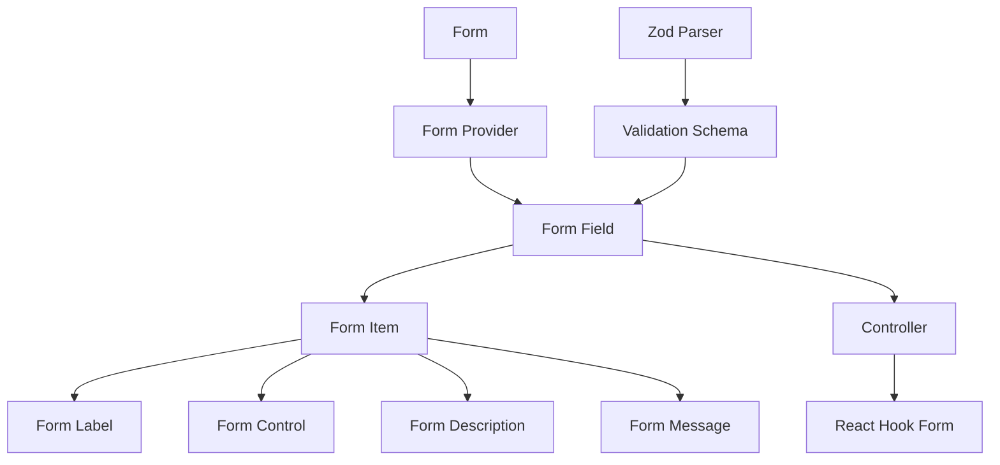
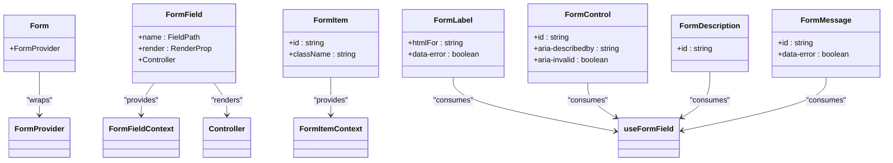
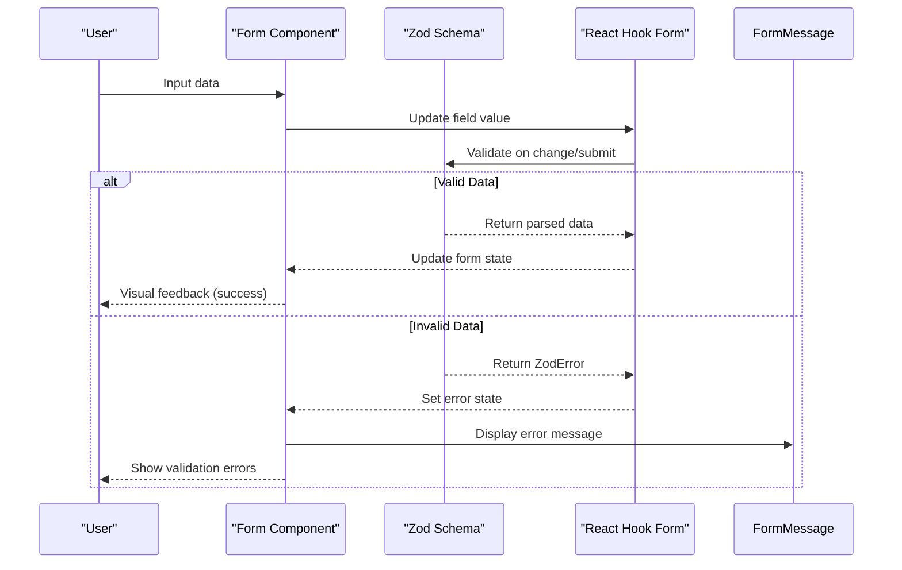
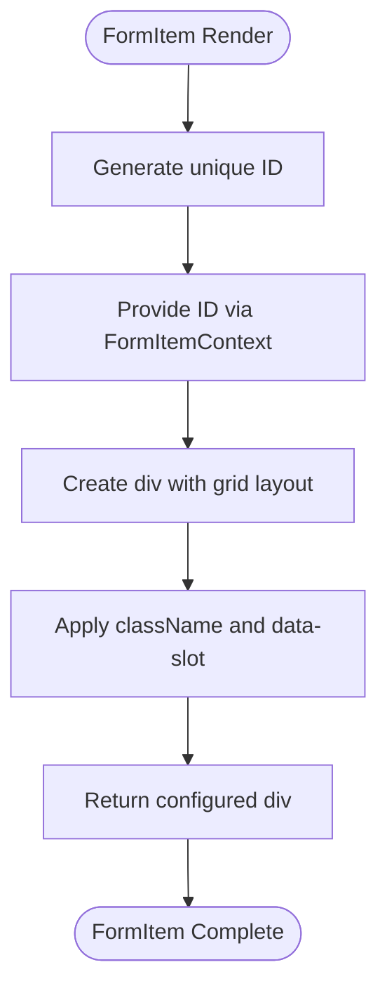
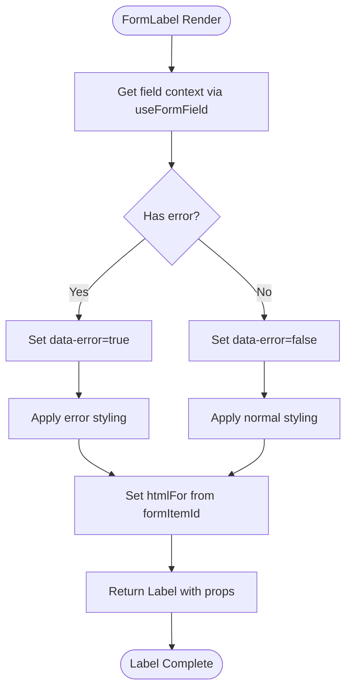
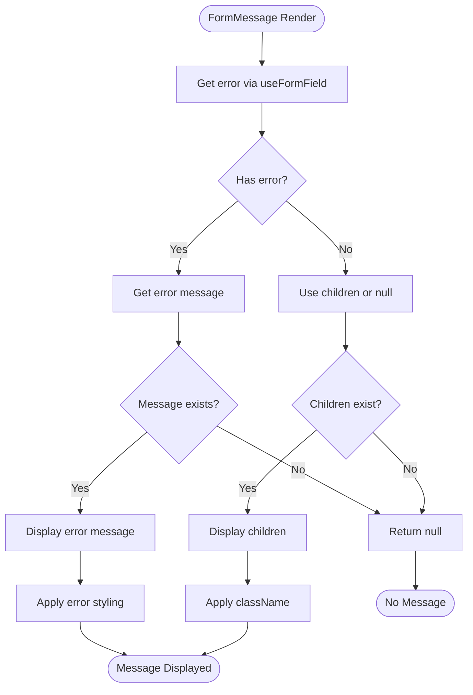
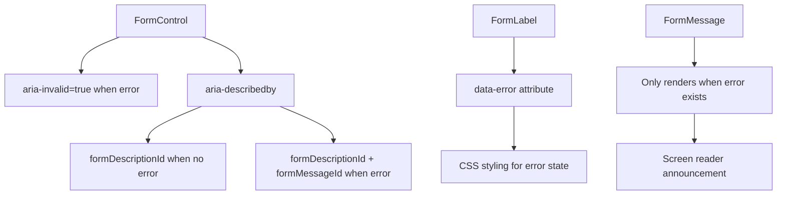
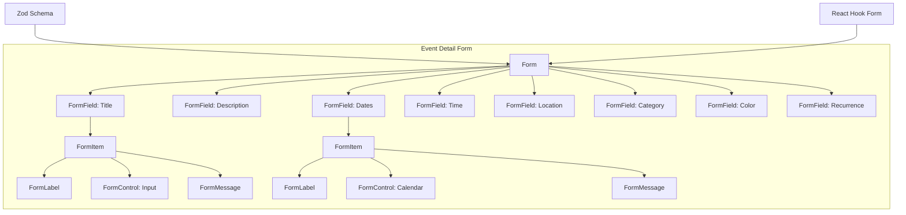
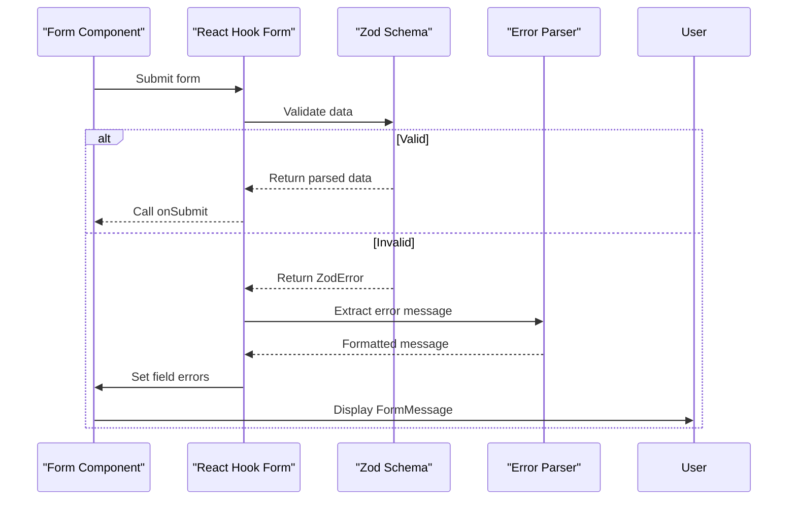

# Form Component

<cite>
**Referenced Files in This Document**   
- [form.tsx](file://apps/web/src/components/ui/form.tsx)
- [validations.ts](file://apps/web/src/lib/validations.ts)
- [event-detail-form.tsx](file://apps/web/src/components/event-calendar/event-detail-form.tsx)
- [zod-error.ts](file://apps/server/src/lib/errors/zod-error.ts)
</cite>

## Table of Contents
1. [Introduction](#introduction)
2. [Core Architecture](#core-architecture)
3. [Form Component Structure](#form-component-structure)
4. [Validation Schema Integration](#validation-schema-integration)
5. [Sub-Component Analysis](#sub-component-analysis)
6. [Accessibility Implementation](#accessibility-implementation)
7. [Usage Examples](#usage-examples)
8. [Best Practices](#best-practices)
9. [Error Handling Patterns](#error-handling-patterns)

## Introduction
The Form component is a comprehensive form management system built on React Hook Form and Zod validation. It provides a structured approach to form creation, validation, and error handling across the application. The implementation leverages React context for state management and offers a set of reusable sub-components that ensure consistency in form presentation and behavior.

**Section sources**
- [form.tsx](file://apps/web/src/components/ui/form.tsx#L1-L165)

## Core Architecture
The Form component architecture is built around React Hook Form's controller pattern, enhanced with custom context providers for seamless integration between form fields and their associated labels, descriptions, and error messages. The system uses TypeScript generics to maintain type safety throughout the form lifecycle.

**Diagram sources**
- [form.tsx](file://apps/web/src/components/ui/form.tsx#L1-L165)

**Section sources**
- [form.tsx](file://apps/web/src/components/ui/form.tsx#L1-L165)

## Form Component Structure
The Form component system consists of several interconnected components that work together to create a cohesive form experience. The base `Form` component wraps React Hook Form's `FormProvider`, while `FormField` serves as a context provider that connects individual fields to the form state.

**Diagram sources**
- [form.tsx](file://apps/web/src/components/ui/form.tsx#L1-L165)

**Section sources**
- [form.tsx](file://apps/web/src/components/ui/form.tsx#L1-L165)

## Validation Schema Integration
The form system integrates with Zod for schema-based validation, providing type-safe form validation across the application. Validation schemas are defined in the validations library and imported where needed, ensuring consistency in data validation rules.

**Diagram sources**
- [validations.ts](file://apps/web/src/lib/validations.ts#L1-L100)
- [form.tsx](file://apps/web/src/components/ui/form.tsx#L1-L165)

**Section sources**
- [validations.ts](file://apps/web/src/lib/validations.ts#L1-L100)

## Sub-Component Analysis
The form system provides several sub-components that work together to create a consistent form experience. Each sub-component has a specific responsibility and works in concert with others through shared context.

### FormField
The FormField component serves as the primary wrapper for form inputs, connecting them to React Hook Form's controller and providing context for other form elements.

**Section sources**
- [form.tsx](file://apps/web/src/components/ui/form.tsx#L29-L40)

### FormItem
FormItem acts as a container for form elements, providing layout structure and generating unique IDs for accessibility purposes.

**Diagram sources**
- [form.tsx](file://apps/web/src/components/ui/form.tsx#L73-L85)

**Section sources**
- [form.tsx](file://apps/web/src/components/ui/form.tsx#L73-L85)

### FormLabel
FormLabel connects to form field state to provide visual feedback when validation errors occur, automatically associating with the correct form control via htmlFor.

**Diagram sources**
- [form.tsx](file://apps/web/src/components/ui/form.tsx#L87-L102)

**Section sources**
- [form.tsx](file://apps/web/src/components/ui/form.tsx#L87-L102)

### FormMessage
FormMessage conditionally renders validation error messages, only displaying content when an error exists for the associated field.

**Diagram sources**
- [form.tsx](file://apps/web/src/components/ui/form.tsx#L135-L153)

**Section sources**
- [form.tsx](file://apps/web/src/components/ui/form.tsx#L135-L153)

## Accessibility Implementation
The form system implements comprehensive accessibility features, ensuring that all form elements are properly associated and that error states are communicated effectively to assistive technologies.

### Label Association
Form labels are automatically associated with their corresponding controls through the use of generated IDs and the htmlFor attribute, ensuring that screen readers can properly identify form fields.

### Error Announcements
Error messages are announced to screen readers through proper ARIA attributes, including aria-invalid and aria-describedby, which reference both description and error message elements.

**Diagram sources**
- [form.tsx](file://apps/web/src/components/ui/form.tsx#L1-L165)

**Section sources**
- [form.tsx](file://apps/web/src/components/ui/form.tsx#L1-L165)

## Usage Examples
The form components are used throughout the application in various contexts, from event creation to user management.

### Event Detail Form
The event detail form demonstrates the complete form system in action, integrating with a Zod validation schema and providing a comprehensive user interface for event management.

**Diagram sources**
- [event-detail-form.tsx](file://apps/web/src/components/event-calendar/event-detail-form.tsx#L1-L200)
- [validations.ts](file://apps/web/src/lib/validations.ts#L1-L100)

**Section sources**
- [event-detail-form.tsx](file://apps/web/src/components/event-calendar/event-detail-form.tsx#L1-L200)

## Best Practices
The form implementation follows several best practices for React form development, ensuring maintainability, accessibility, and performance.

### Form Layout
Forms use a consistent grid layout with appropriate spacing between elements, ensuring readability and ease of use. The FormItem component provides a standardized gap of 2 units between form elements.

### Submission Handling
Form submission is handled through React Hook Form's native onSubmit handler, which receives validated data directly from the Zod parser, eliminating the need for manual validation checks.

### Dynamic Field Management
The system supports dynamic fields through React Hook Form's array fields functionality, allowing for the addition and removal of form elements while maintaining proper validation and state management.

**Section sources**
- [form.tsx](file://apps/web/src/components/ui/form.tsx#L1-L165)
- [event-detail-form.tsx](file://apps/web/src/components/event-calendar/event-detail-form.tsx#L1-L200)

## Error Handling Patterns
The form system implements a comprehensive error handling strategy that provides clear feedback to users while maintaining application stability.

### Zod Error Processing
Zod validation errors are processed through a dedicated error parsing function that extracts meaningful error messages and paths, making them easier to display in the user interface.

**Diagram sources**
- [zod-error.ts](file://apps/server/src/lib/errors/zod-error.ts#L1-L13)
- [form.tsx](file://apps/web/src/components/ui/form.tsx#L1-L165)

**Section sources**
- [zod-error.ts](file://apps/server/src/lib/errors/zod-error.ts#L1-L13)