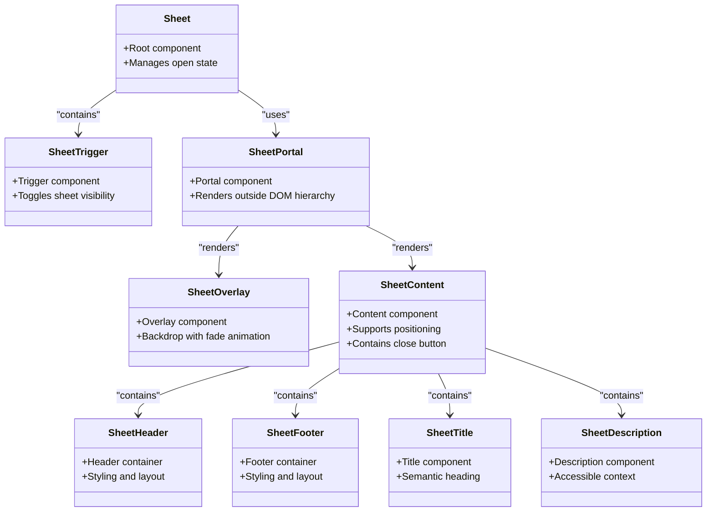
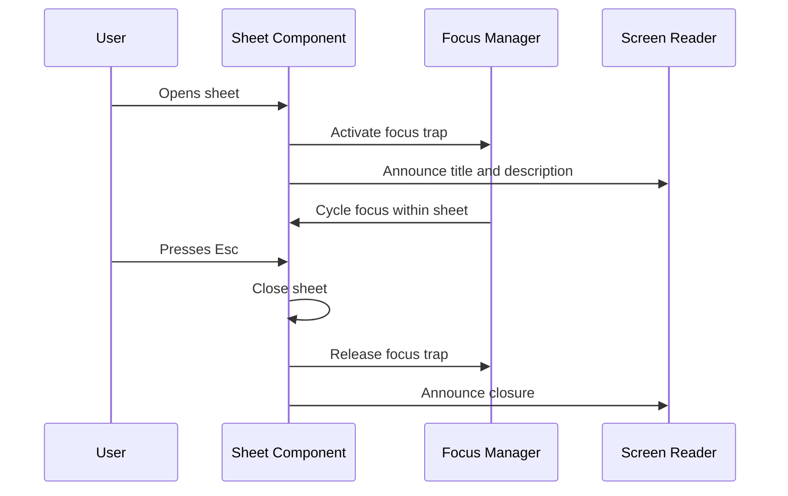

# Sheet Component

<cite>
**Referenced Files in This Document**   
- [sheet.tsx](file://apps/web/src/components/ui/sheet.tsx)
</cite>

## Table of Contents
1. [Introduction](#introduction)
2. [Core Components](#core-components)
3. [Positioning and Animation Controls](#positioning-and-animation-controls)
4. [Accessibility Features](#accessibility-features)
5. [Usage Examples](#usage-examples)
6. [Performance Considerations](#performance-considerations)
7. [Integration Patterns](#integration-patterns)
8. [Conclusion](#conclusion)

## Introduction
The Sheet component is a sliding panel implementation based on Radix UI's Dialog primitive, designed to provide a mobile-friendly, accessible interface for presenting content in a layered, dismissible manner. It supports multiple positioning options and integrates seamlessly with form workflows and responsive layouts.

**Section sources**
- [sheet.tsx](file://apps/web/src/components/ui/sheet.tsx#L1-L10)

## Core Components

The Sheet component is composed of several subcomponents that work together to create a cohesive user experience:

- **Sheet**: The root component that manages the open/closed state of the sheet.
- **SheetTrigger**: A button or element that toggles the visibility of the sheet.
- **SheetPortal**: Renders the sheet content into a DOM node outside the current hierarchy, ensuring proper stacking and accessibility.
- **SheetOverlay**: A backdrop element that dims the background and provides a click-outside dismissal behavior.
- **SheetContent**: The main panel that slides in from a specified direction and contains the sheet's content.
- **SheetHeader**, **SheetFooter**, **SheetTitle**, **SheetDescription**: Structural and semantic elements for organizing content within the sheet.

These components are built on top of Radix UI’s `@radix-ui/react-dialog`, ensuring full accessibility compliance and robust state management.

**Diagram sources**
- [sheet.tsx](file://apps/web/src/components/ui/sheet.tsx#L12-L138)

**Section sources**
- [sheet.tsx](file://apps/web/src/components/ui/sheet.tsx#L12-L138)

## Positioning and Animation Controls

The Sheet component supports four positioning options via the `side` prop on `SheetContent`: `"top"`, `"right"`, `"bottom"`, and `"left"`. By default, the sheet slides in from the right.

Each position applies specific Tailwind CSS utility classes that control:
- **Entry/exit animations**: Using `data-[state=open]:slide-in-from-*` and `data-[state=closed]:slide-out-to-*`
- **Positioning**: Absolute placement using `inset-*`, `top`, `bottom`, `left`, `right`
- **Dimensions**: Full height for side sheets, auto height for top/bottom, with responsive width constraints

Animation timing is controlled through:
- `data-[state=closed]:duration-300`: 300ms exit animation
- `data-[state=open]:duration-500`: 500ms entrance animation
- `transition ease-in-out`: Smooth timing function

The overlay uses fade-in/fade-out animations with the same timing system.

**Section sources**
- [sheet.tsx](file://apps/web/src/components/ui/sheet.tsx#L40-L73)

## Accessibility Features

The Sheet component includes comprehensive accessibility features:

- **Focus Trapping**: Radix UI's Dialog primitive automatically traps focus within the sheet when open, cycling through interactive elements and preventing focus from escaping to the background content.
- **Keyboard Navigation**: Supports `Esc` to close, and proper tab navigation within the sheet. The close button is programmatically focused when the sheet opens.
- **Screen Reader Announcements**: Uses `SheetTitle` and `SheetDescription` to provide semantic context. The close button includes a visually hidden label ("Close") via ``.
- **ARIA Compliance**: Inherits full ARIA role="dialog" semantics from Radix UI, including proper labeling and state announcements.
- **Dismiss Behavior**: Clicking the overlay or pressing `Esc` closes the sheet, with visual feedback on hover and focus states.

**Diagram sources**
- [sheet.tsx](file://apps/web/src/components/ui/sheet.tsx#L74-L76)

**Section sources**
- [sheet.tsx](file://apps/web/src/components/ui/sheet.tsx#L74-L76)

## Usage Examples

### Mobile Navigation
The Sheet component is ideal for mobile navigation drawers, typically triggered by a hamburger menu and sliding in from the left or right.

### Detailed Inspectors
Used to display detailed information about an item (e.g., event details, user profiles) without navigating away from the current view.

### Form Workflows
Integrates with form components to provide modal editing experiences. The sheet can contain a form with header (title), body (fields), and footer (submit/cancel buttons), ensuring a focused, distraction-free input environment.

Example integration with form components includes using `SheetHeader` for the form title, `SheetContent` for the form fields, and `SheetFooter` for action buttons.

**Section sources**
- [sheet.tsx](file://apps/web/src/components/ui/sheet.tsx#L80-L110)

## Performance Considerations

- **Lazy Mounting**: The `SheetPortal` ensures content is only rendered when the sheet is open, reducing initial load impact.
- **Efficient Transitions**: CSS transitions and animations are hardware-accelerated and use `transform` and `opacity` properties for smooth performance.
- **Conditional Rendering**: The component avoids unnecessary re-renders by leveraging React’s state management and Radix UI’s optimized primitives.
- **Mobile Optimization**: Responsive design ensures appropriate sizing on small screens (e.g., `sm:max-w-sm`), and touch-friendly hit areas.

**Section sources**
- [sheet.tsx](file://apps/web/src/components/ui/sheet.tsx#L60-L68)

## Integration Patterns

### With Form Components
The Sheet component integrates seamlessly with form libraries like `react-hook-form`. It can wrap a form to provide a modal editing interface, with proper submission handling and validation feedback.

### Responsive Design
The component adapts to screen size using Tailwind’s responsive utilities (e.g., `sm:max-w-sm`), ensuring optimal layout on both mobile and desktop.

### Custom Styling
Extensible via the `className` prop on all components, allowing for theme consistency and brand alignment without modifying core behavior.

**Section sources**
- [sheet.tsx](file://apps/web/src/components/ui/sheet.tsx#L40-L73)

## Conclusion
The Sheet component provides a robust, accessible, and performant solution for implementing sliding panels in web applications. Built on Radix UI, it ensures compliance with accessibility standards while offering flexible positioning, smooth animations, and seamless integration with forms and responsive layouts.