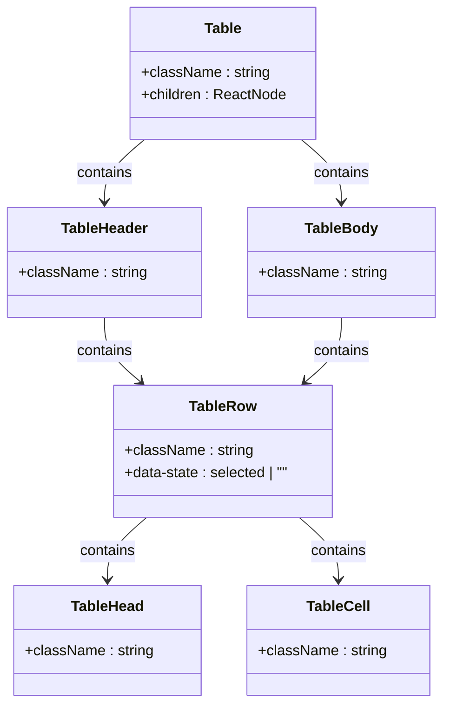
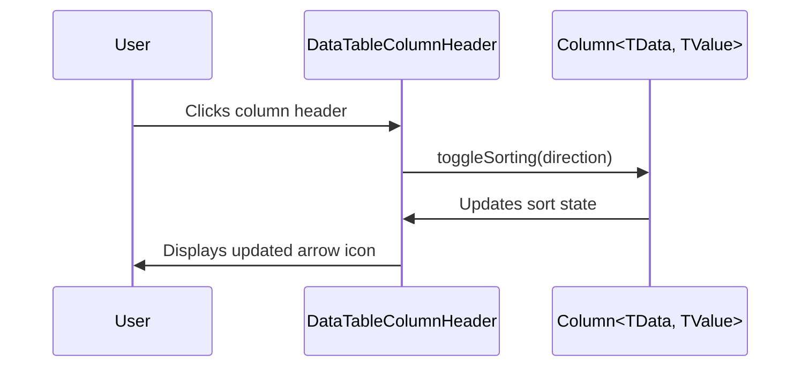
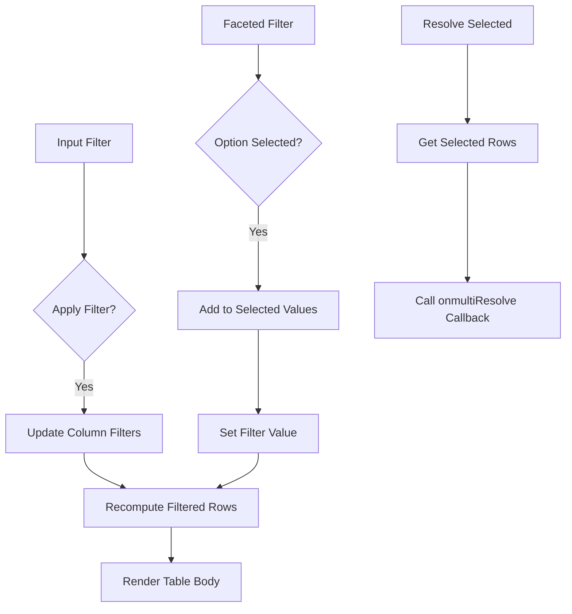

# Table Component

<cite>
**Referenced Files in This Document**   
- [table.tsx](file://apps/web/src/components/ui/table.tsx)
- [data-table.tsx](file://apps/web/src/components/alerts/data-table.tsx)
- [columns.tsx](file://apps/web/src/components/alerts/columns.tsx)
- [data-table-column-header.tsx](file://apps/web/src/components/ui/data-table-column-header.tsx)
- [data-table-faceted-filter.tsx](file://apps/web/src/components/ui/data-table-faceted-filter.tsx)
- [data-table-pagination.tsx](file://apps/web/src/components/ui/data-table-pagination.tsx)
- [data-table-view-options.tsx](file://apps/web/src/components/ui/data-table-view-options.tsx)
</cite>

## Table of Contents
1. [Introduction](#introduction)
2. [Core Components](#core-components)
3. [Composition Pattern](#composition-pattern)
4. [Integration with Data Controls](#integration-with-data-controls)
5. [Accessibility Features](#accessibility-features)
6. [Performance Optimization](#performance-optimization)
7. [Usage Examples](#usage-examples)
8. [Conclusion](#conclusion)

## Introduction
The Table component is a reusable UI structure designed for efficient data display across various contexts such as audit events, alerts, and compliance reports. Built using semantic HTML elements and styled with Tailwind CSS, it ensures accessibility, responsiveness, and consistency. The component leverages TanStack React Table for advanced interactions including sorting, filtering, and pagination.

**Section sources**
- [table.tsx](file://apps/web/src/components/ui/table.tsx)

## Core Components

The Table component suite consists of several modular parts that work together to create a fully functional data grid. These include `TableRoot`, `TableHeader`, `TableBody`, `TableRow`, `TableHead`, and `TableCell`, each corresponding to standard HTML table elements but enhanced with Tailwind styling and accessibility attributes.

**Diagram sources**
- [table.tsx](file://apps/web/src/components/ui/table.tsx)

**Section sources**
- [table.tsx](file://apps/web/src/components/ui/table.tsx)

## Composition Pattern

The Table component follows a compositional pattern that mirrors native HTML table semantics while adding React-based enhancements. This design allows developers to build tables in a declarative and accessible way.

- **TableRoot**: Wraps the entire table in a scrollable container with consistent styling.
- **TableHeader**: Styles header rows with bottom borders and proper text alignment.
- **TableBody**: Applies styling to body rows, excluding borders on the last row.
- **TableRow**: Adds hover effects, selection states, and transition animations.
- **TableHead**: Ensures header cells are left-aligned, bold, and properly spaced.
- **TableCell**: Applies consistent padding and alignment for data cells.

This composition enables semantic correctness and ensures screen readers can interpret table structure accurately.

**Section sources**
- [table.tsx](file://apps/web/src/components/ui/table.tsx)

## Integration with Data Controls

The Table component integrates seamlessly with advanced data management features through dedicated utility components. These include sorting, filtering, pagination, and column visibility controls powered by TanStack React Table.

### Sorting and Column Header Controls
The `DataTableColumnHeader` component enables sortable headers with visual indicators for sort direction. It uses a dropdown menu to allow users to toggle between ascending, descending, or hidden states.

**Diagram sources**
- [data-table-column-header.tsx](file://apps/web/src/components/ui/data-table-column-header.tsx)

### Faceted Filtering
The `DataTableFacetedFilter` provides multi-select filtering via a popover command menu. It displays available options with counts from `getFacetedUniqueValues()` and allows selection/deselection with immediate filtering updates.

**Section sources**
- [data-table-faceted-filter.tsx](file://apps/web/src/components/ui/data-table-faceted-filter.tsx)

### Pagination
`DataTablePagination` renders page controls including page size selection, current page indicator, and navigation buttons. It supports jumping to first/last pages and respects disabled states when at boundaries.

**Section sources**
- [data-table-pagination.tsx](file://apps/web/src/components/ui/data-table-pagination.tsx)

### View Options
`DataTableViewOptions` allows users to toggle column visibility via a dropdown checkbox list. Only columns with accessor functions and visibility toggles enabled are shown.

**Section sources**
- [data-table-view-options.tsx](file://apps/web/src/components/ui/data-table-view-options.tsx)

## Accessibility Features

The Table component prioritizes accessibility through proper semantic markup and ARIA attributes:

- **Proper Header-Cell Association**: Uses native `<th>` and `<td>` elements with correct `scope` and `headers` attributes implied by structure.
- **Screen Reader Support**: Includes `aria-label` on interactive elements like checkboxes and pagination controls.
- **Keyboard Navigation**: Fully navigable via keyboard due to standard HTML elements and focusable controls.
- **Selection States**: Visual and programmatic feedback via `data-state="selected"` on rows.
- **Hidden Text for Screen Readers**: Uses `sr-only` classes for contextual labels (e.g., "Go to first page").

These features ensure compliance with WCAG standards and support assistive technologies.

**Section sources**
- [table.tsx](file://apps/web/src/components/ui/table.tsx)
- [data-table-column-header.tsx](file://apps/web/src/components/ui/data-table-column-header.tsx)
- [data-table-pagination.tsx](file://apps/web/src/components/ui/data-table-pagination.tsx)

## Performance Optimization

For handling large datasets efficiently, the Table component employs several optimization techniques:

- **Virtualization**: While not explicitly implemented in base components, the architecture supports integration with virtualized rendering libraries.
- **Memoization**: Utilizes React.memo and TanStack Table’s internal memoization to prevent unnecessary re-renders.
- **Column Filtering and Pagination**: Offloads data processing to TanStack Table’s optimized model, reducing DOM size.
- **Debounced Filtering**: Although not shown, filtering inputs can be enhanced with debounce logic via `useDebounce` hook.
- **Efficient State Management**: Table state (sorting, filters, visibility) is managed at the React Table level, minimizing prop drilling.

These strategies ensure smooth performance even with thousands of rows.

**Section sources**
- [data-table.tsx](file://apps/web/src/components/alerts/data-table.tsx)

## Usage Examples

The Table component is used across multiple modules including alerts, HIPAA compliance, presets, and templates. Below is an example from the alerts module:

### Alerts Table Implementation
The `DataTable` component in the alerts module demonstrates full integration with filtering by severity and type, bulk actions, and pagination.

**Diagram sources**
- [data-table.tsx](file://apps/web/src/components/alerts/data-table.tsx)
- [columns.tsx](file://apps/web/src/components/alerts/columns.tsx)

The `createColumns` function defines column configurations with sorting, filtering, and custom cell rendering for severity and type fields, enabling rich data presentation.

**Section sources**
- [data-table.tsx](file://apps/web/src/components/alerts/data-table.tsx)
- [columns.tsx](file://apps/web/src/components/alerts/columns.tsx)

## Conclusion
The Table component provides a robust, accessible, and extensible solution for data display in the application. Its composition pattern aligns with semantic HTML principles, while integration with TanStack React Table enables powerful data interaction features. With strong support for accessibility and performance optimization, it serves as a foundational UI element across audit events, alerts, and reporting interfaces.