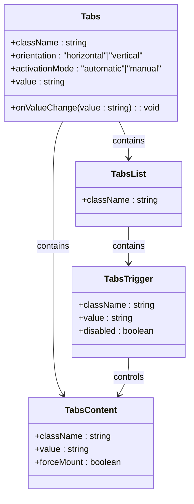
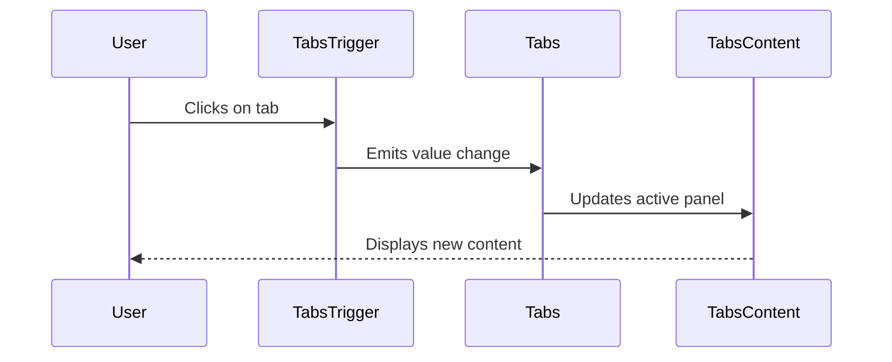

# Tabs Component

<cite>
**Referenced Files in This Document**   
- [tabs.tsx](file://apps/web/src/components/ui/tabs.tsx)
- [event-calendar-tabs.tsx](file://apps/web/src/components/event-calendar/event-calendar-tabs.tsx)
</cite>

## Table of Contents
1. [Introduction](#introduction)
2. [Core Components](#core-components)
3. [Implementation with Radix UI](#implementation-with-radix-ui)
4. [Props and Configuration](#props-and-configuration)
5. [Usage Examples](#usage-examples)
6. [Accessibility Features](#accessibility-features)
7. [Performance Considerations](#performance-considerations)
8. [Integration Patterns](#integration-patterns)

## Introduction
The Tabs component is a UI primitive used for organizing content into separate sections that are viewable one at a time. It provides an intuitive way to navigate between related content views within dashboards, settings pages, and data views. Built using Radix UI primitives, the component ensures high accessibility standards and seamless user interaction.

**Section sources**
- [tabs.tsx](file://apps/web/src/components/ui/tabs.tsx#L1-L65)

## Core Components
The Tabs system consists of four primary components that work together to create a cohesive tabbed interface:
- **Tabs**: The root container that manages the overall tab state
- **TabsList**: The wrapper for tab triggers, providing layout and styling
- **TabsTrigger**: Individual tab buttons that users click to activate content
- **TabsContent**: Panels that display content when their corresponding trigger is activated

These components are implemented as wrappers around Radix UI's primitives, enhancing them with project-specific styling and behavior while maintaining full accessibility compliance.

**Section sources**
- [tabs.tsx](file://apps/web/src/components/ui/tabs.tsx#L1-L65)

## Implementation with Radix UI
The Tabs component leverages Radix UI's accessible primitives to ensure proper keyboard navigation, ARIA attributes, and screen reader support. The implementation wraps Radix UI components with custom styling and data attributes while preserving all accessibility features.

**Diagram sources**
- [tabs.tsx](file://apps/web/src/components/ui/tabs.tsx#L1-L65)

**Section sources**
- [tabs.tsx](file://apps/web/src/components/ui/tabs.tsx#L1-L65)

## Props and Configuration
The Tabs component supports various configuration options to control its behavior and appearance:

### Orientation
The component supports both horizontal and vertical orientations through the `orientation` prop, allowing flexible layout options for different UI requirements.

### Activation Mode
Two activation modes are supported:
- **Automatic**: Tabs activate on focus (immediate navigation)
- **Manual**: Tabs activate only on click or Enter/Space key press

### Controlled State Management
The component supports controlled state through the `value` and `onValueChange` props, enabling integration with external state management systems and URL routing.

**Section sources**
- [tabs.tsx](file://apps/web/src/components/ui/tabs.tsx#L1-L65)

## Usage Examples
The Tabs component is used throughout the application in various contexts:

### Dashboard Sections
In dashboard interfaces, tabs organize different data views and metrics, allowing users to switch between summary, detailed, and historical views.

### Settings Pages
Settings interfaces use tabs to separate configuration options into logical groups such as General, Security, and Notifications.

### Data Views
The event calendar component implements tabs to switch between different calendar views (Day, Week, Month, Year) with additional dropdown functionality for custom date ranges.

**Diagram sources**
- [event-calendar-tabs.tsx](file://apps/web/src/components/event-calendar/event-calendar-tabs.tsx#L52-L432)

**Section sources**
- [event-calendar-tabs.tsx](file://apps/web/src/components/event-calendar/event-calendar-tabs.tsx#L52-L432)

## Accessibility Features
The Tabs component implements comprehensive accessibility features:

### Keyboard Navigation
- **Arrow keys**: Navigate between tabs (left/right for horizontal, up/down for vertical)
- **Home/End**: Jump to first/last tab
- **Enter/Space**: Activate focused tab in manual mode
- **Escape**: Close popup panels

### ARIA Attributes
- `aria-selected`: Indicates the active tab state
- `role="tab"`: Identifies tab elements
- `role="tablist"`: Identifies the tab container
- `role="tabpanel"`: Identifies content panels
- Proper `aria-controls` and `aria-labelledby` relationships

### Focus Management
The component maintains proper focus order and ensures keyboard users can navigate through tab interfaces efficiently.

**Section sources**
- [tabs.tsx](file://apps/web/src/components/ui/tabs.tsx#L1-L65)

## Performance Considerations
The implementation includes several performance optimizations:

### Lazy Loading
Tab content is rendered only when the tab becomes active, reducing initial load time and memory usage for complex views.

### Unmounting Inactive Panels
Inactive tab panels are unmounted by default to conserve memory and improve performance, with an option to keep them mounted using the `forceMount` prop when state preservation is needed.

### Efficient Re-renders
The component uses React's optimization techniques to minimize unnecessary re-renders during tab switching.

**Section sources**
- [tabs.tsx](file://apps/web/src/components/ui/tabs.tsx#L1-L65)

## Integration Patterns
The Tabs component integrates with various application systems:

### Routing Integration
Tab state can be synchronized with URL parameters, allowing users to bookmark specific tab views and maintain state across page reloads.

### State Management
The controlled component pattern enables integration with global state management solutions, allowing tab state to be shared across different components.

### Responsive Design
The implementation adapts to different screen sizes, with mobile-specific layouts and touch-friendly targets.

**Section sources**
- [event-calendar-tabs.tsx](file://apps/web/src/components/event-calendar/event-calendar-tabs.tsx#L52-L432)