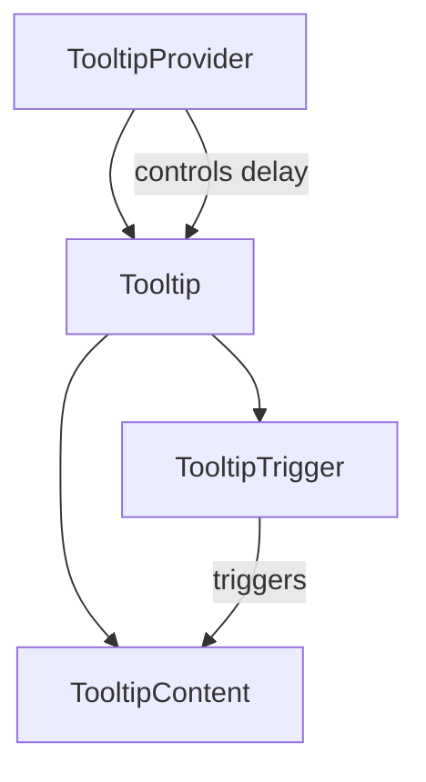
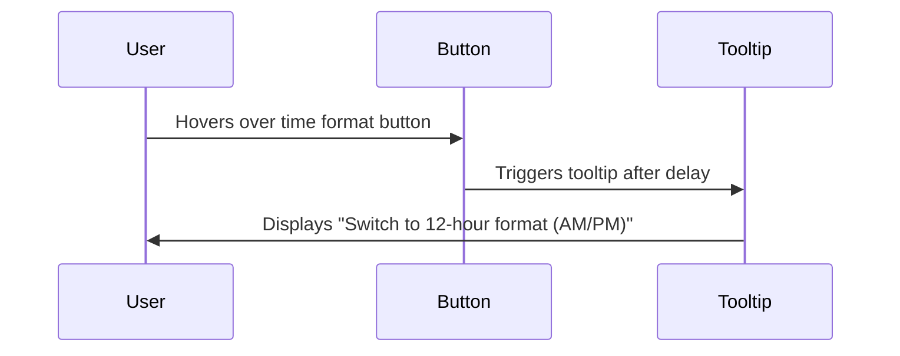

# Tooltip Component

<cite>
**Referenced Files in This Document**   
- [tooltip.tsx](file://apps/web/src/components/ui/tooltip.tsx)
- [time-format-toggel.tsx](file://apps/web/src/components/event-calendar/ui/time-format-toggel.tsx)
</cite>

## Table of Contents
1. [Introduction](#introduction)
2. [Core Components](#core-components)
3. [Props and Configuration](#props-and-configuration)
4. [Usage Examples](#usage-examples)
5. [Accessibility Compliance](#accessibility-compliance)
6. [Performance Considerations](#performance-considerations)
7. [Customization Options](#customization-options)

## Introduction
The Tooltip component is a user interface element built on Radix UI's `@radix-ui/react-tooltip` that provides contextual information when users hover over or focus on interactive elements. It is designed to enhance usability by offering non-intrusive explanations for buttons, form fields, and data points without disrupting the user experience.

This documentation details the implementation of the Tooltip component using its core parts: `TooltipProvider`, `TooltipRoot` (referred to as `Tooltip`), `TooltipTrigger`, and `TooltipContent`. It covers configuration options, accessibility features, performance optimizations, and customization capabilities.

**Section sources**
- [tooltip.tsx](file://apps/web/src/components/ui/tooltip.tsx#L1-L60)

## Core Components

The Tooltip system consists of four primary components that work together to deliver a fully functional tooltip experience:

- **TooltipProvider**: Manages global tooltip behavior such as delay duration.
- **Tooltip (TooltipRoot)**: Wraps the trigger and content, managing the open/close state.
- **TooltipTrigger**: The element that activates the tooltip (e.g., a button or icon).
- **TooltipContent**: The visual container displaying the tooltip text.

These components are implemented as wrapper functions around Radix UI primitives, ensuring consistent styling and behavior across the application.

**Diagram sources**
- [tooltip.tsx](file://apps/web/src/components/ui/tooltip.tsx#L1-L60)

**Section sources**
- [tooltip.tsx](file://apps/web/src/components/ui/tooltip.tsx#L1-L60)

## Props and Configuration

### TooltipProvider Props
Controls global tooltip behavior:
- `delayDuration`: Number of milliseconds to delay before showing the tooltip (default: 0)

### TooltipContent Props
Configures appearance and positioning:
- `sideOffset`: Distance in pixels from the trigger element (default: 0)
- `className`: Additional Tailwind CSS classes for styling
- `side`: Position relative to trigger (`top`, `bottom`, `left`, `right`)
- `align`: Alignment along the side (`start`, `center`, `end`)

### Disable Behavior
To disable a tooltip, wrap the `TooltipTrigger` with a condition or omit the `Tooltip` wrapper entirely. No explicit disable prop is required.

**Section sources**
- [tooltip.tsx](file://apps/web/src/components/ui/tooltip.tsx#L1-L60)

## Usage Examples

### Button Explanations
Used in the `TimeFormatToggle` component to explain the function of a time format switcher button.

**Diagram sources**
- [time-format-toggel.tsx](file://apps/web/src/components/event-calendar/ui/time-format-toggel.tsx#L85-L115)

### Form Field Hints
Can be applied to input labels or icons to provide guidance on expected data format or validation rules.

### Data Point Clarifications
Ideal for charts or tables where additional context is needed for specific values or metrics.

**Section sources**
- [time-format-toggel.tsx](file://apps/web/src/components/event-calendar/ui/time-format-toggel.tsx#L0-L117)

## Accessibility Compliance

The Tooltip component ensures full accessibility compliance through:

- **Screen Reader Handling**: Uses ARIA attributes to convey context without interrupting screen reader flow.
- **Focus Visibility**: Tooltip appears on both hover and focus, supporting keyboard navigation.
- **Non-Disruptive Presentation**: Tooltips do not trap focus or interfere with normal navigation.
- **ARIA Labels**: Trigger elements include descriptive `aria-label` attributes.
- **Reduced Motion Support**: Animations respect user preferences via CSS media queries.

All interactions are designed to meet WCAG 2.1 standards for perceivability, operability, and robustness.

**Section sources**
- [tooltip.tsx](file://apps/web/src/components/ui/tooltip.tsx#L1-L60)
- [time-format-toggel.tsx](file://apps/web/src/components/event-calendar/ui/time-format-toggel.tsx#L0-L117)

## Performance Considerations

### Efficient Rendering
- Utilizes React's composition pattern to minimize re-renders.
- Leverages Radix UI's optimized rendering pipeline.
- Content is rendered in a portal to avoid layout interference.

### Memory Management
- State is managed internally by Radix UI with minimal overhead.
- Event listeners are properly cleaned up on unmount.
- No memory leaks from animation or hover tracking.

The component is lightweight and suitable for high-frequency use across large interfaces.

**Section sources**
- [tooltip.tsx](file://apps/web/src/components/ui/tooltip.tsx#L1-L60)

## Customization Options

### Styling
The `className` prop allows for extensive customization using Tailwind CSS. Default styles include:
- Background color: `bg-primary`
- Text color: `text-primary-foreground`
- Rounded corners: `rounded-md`
- Padding: `px-3 py-1.5`
- Font size: `text-xs`

### Animation
Built-in animations include:
- Fade-in and zoom-in on appearance
- Slide-in based on position (`data-[side]`)
- Smooth exit transitions when closing

Custom animations can be added via the `className` prop or by overriding default classes.

**Section sources**
- [tooltip.tsx](file://apps/web/src/components/ui/tooltip.tsx#L42-L58)