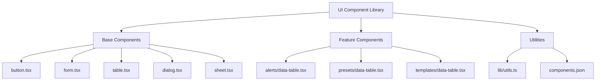
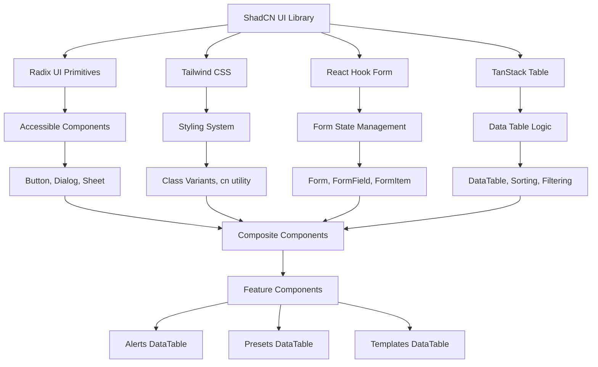
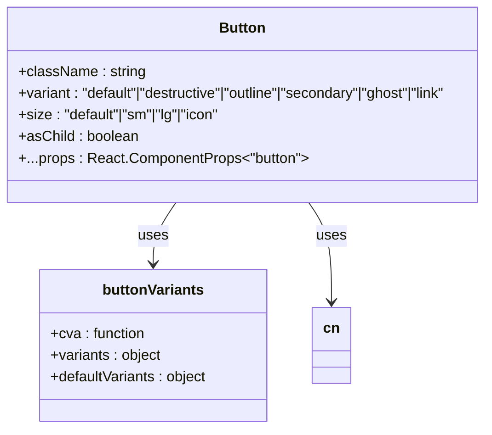
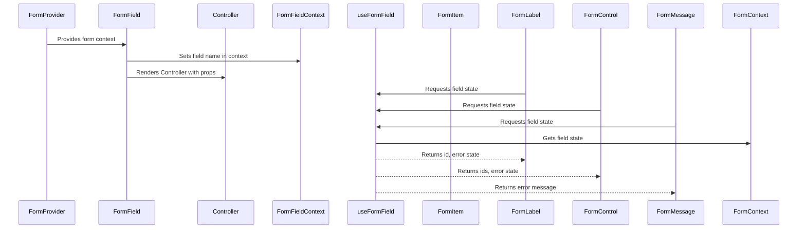
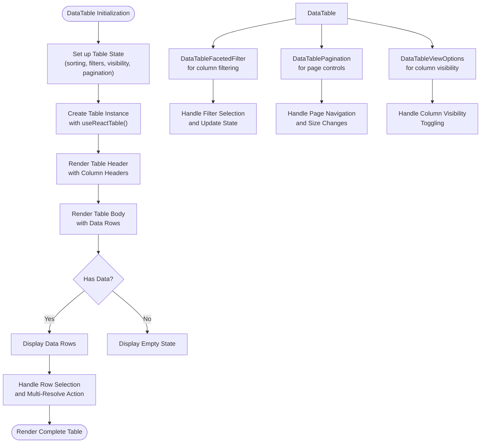
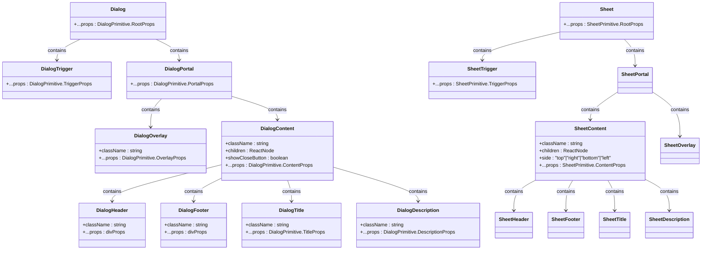

# UI Component Library and Design System

<cite>
**Referenced Files in This Document**   
- [components.json](file://apps/web/components.json)
- [button.tsx](file://apps/web/src/components/ui/button.tsx)
- [form.tsx](file://apps/web/src/components/ui/form.tsx)
- [table.tsx](file://apps/web/src/components/ui/table.tsx)
- [data-table.tsx](file://apps/web/src/components/alerts/data-table.tsx)
- [data-table-faceted-filter.tsx](file://apps/web/src/components/ui/data-table-faceted-filter.tsx)
- [data-table-pagination.tsx](file://apps/web/src/components/ui/data-table-pagination.tsx)
- [data-table-view-options.tsx](file://apps/web/src/components/ui/data-table-view-options.tsx)
- [dialog.tsx](file://apps/web/src/components/ui/dialog.tsx)
- [sheet.tsx](file://apps/web/src/components/ui/sheet.tsx)
- [utils.ts](file://apps/web/src/lib/utils.ts)
- [input.tsx](file://apps/web/src/components/ui/input.tsx)
</cite>

## Table of Contents
1. [Introduction](#introduction)
2. [Project Structure](#project-structure)
3. [Core Components](#core-components)
4. [Architecture Overview](#architecture-overview)
5. [Detailed Component Analysis](#detailed-component-analysis)
6. [Design System Principles](#design-system-principles)
7. [Component Composition Examples](#component-composition-examples)
8. [Accessibility and Performance](#accessibility-and-performance)
9. [Integration Guidance](#integration-guidance)
10. [Conclusion](#conclusion)

## Introduction
This document provides a comprehensive overview of the ShadCN-based UI component library used in the smart-logs application. The library leverages Radix UI primitives enhanced with Tailwind CSS for consistent styling and accessibility. It follows modern React patterns with TypeScript, focusing on reusability, composability, and developer experience. The system supports complex data interactions through components like data tables with faceted filtering and pagination, while maintaining high accessibility standards and performance optimization.

## Project Structure
The UI component library is organized in a modular structure within the web application. Base components are located in the `ui` directory, while feature-specific components are grouped by domain. The library uses ShadCN's configuration system for consistent theming and component generation.



**Diagram sources**
- [components.json](file://apps/web/components.json)
- [button.tsx](file://apps/web/src/components/ui/button.tsx)
- [form.tsx](file://apps/web/src/components/ui/form.tsx)

**Section sources**
- [components.json](file://apps/web/components.json)

## Core Components
The UI component library is built on ShadCN's design system, which combines Radix UI's accessible primitives with Tailwind CSS for styling. The `components.json` configuration file defines the library's settings, including the "new-york" style, TypeScript support, and Lucide icons. Components are organized with clear naming conventions and use aliases for consistent imports across the application.

The library implements a utility-first approach with the `cn` function from `tailwind-merge` and `clsx`, allowing for conditional class composition. This pattern is used throughout all components to combine default styles with custom overrides while avoiding class conflicts.

**Section sources**
- [components.json](file://apps/web/components.json)
- [utils.ts](file://apps/web/src/lib/utils.ts)

## Architecture Overview
The component library follows a layered architecture with clear separation between primitive components, composite components, and feature-specific implementations. Primitive components like Button, Input, and Dialog provide foundational building blocks with accessible markup and keyboard navigation. Composite components like Form and DataTable combine multiple primitives to create complex interactive elements. Feature components in directories like alerts and presets implement domain-specific functionality using these building blocks.



**Diagram sources**
- [button.tsx](file://apps/web/src/components/ui/button.tsx)
- [form.tsx](file://apps/web/src/components/ui/form.tsx)
- [table.tsx](file://apps/web/src/components/ui/table.tsx)
- [dialog.tsx](file://apps/web/src/components/ui/dialog.tsx)

## Detailed Component Analysis

### Button Component Analysis
The Button component demonstrates the library's approach to styling and variants using `class-variance-authority` (CVA). It defines multiple variants (default, destructive, outline, secondary, ghost, link) and sizes (default, sm, lg, icon) with comprehensive styling for different states including hover, focus, disabled, and invalid states.



**Diagram sources**
- [button.tsx](file://apps/web/src/components/ui/button.tsx#L15-L59)

**Section sources**
- [button.tsx](file://apps/web/src/components/ui/button.tsx#L1-L60)

### Form Component Analysis
The Form component implements a sophisticated pattern for form handling using React Hook Form with Radix UI primitives. It creates a context-based system where FormField wraps Controller from react-hook-form, providing access to field state through useFormField. The component hierarchy includes FormItem (container), FormLabel, FormControl, FormDescription, and FormMessage, each with appropriate ARIA attributes and error states.



**Diagram sources**
- [form.tsx](file://apps/web/src/components/ui/form.tsx#L1-L165)

**Section sources**
- [form.tsx](file://apps/web/src/components/ui/form.tsx#L1-L165)

### Data Table Component Analysis
The data table implementation demonstrates advanced composition of UI components for complex data presentation. The DataTable component uses TanStack Table for state management and integrates with several specialized UI components for filtering, pagination, and view options. It supports row selection, multi-column sorting, faceted filtering, and column visibility toggling.



**Diagram sources**
- [data-table.tsx](file://apps/web/src/components/alerts/data-table.tsx#L1-L190)
- [data-table-faceted-filter.tsx](file://apps/web/src/components/ui/data-table-faceted-filter.tsx#L1-L133)
- [data-table-pagination.tsx](file://apps/web/src/components/ui/data-table-pagination.tsx#L1-L93)
- [data-table-view-options.tsx](file://apps/web/src/components/ui/data-table-view-options.tsx#L1-L46)

**Section sources**
- [data-table.tsx](file://apps/web/src/components/alerts/data-table.tsx#L1-L190)

### Dialog and Sheet Components Analysis
The Dialog and Sheet components showcase the library's approach to modal interfaces with accessibility in mind. Both components are built on Radix UI's Dialog primitive but provide different presentation patterns - Dialog for centered modals and Sheet for side panels. They share similar structure with Header, Footer, Title, and Description components, ensuring consistent API and behavior.



**Diagram sources**
- [dialog.tsx](file://apps/web/src/components/ui/dialog.tsx#L1-L143)
- [sheet.tsx](file://apps/web/src/components/ui/sheet.tsx#L1-L139)

**Section sources**
- [dialog.tsx](file://apps/web/src/components/ui/dialog.tsx#L1-L143)
- [sheet.tsx](file://apps/web/src/components/ui/sheet.tsx#L1-L139)

## Design System Principles

### Spacing and Layout
The design system uses a consistent spacing scale derived from Tailwind CSS's spacing tokens (0.5, 1, 1.5, 2, etc.). Components use these tokens for padding, margins, and gaps, ensuring visual consistency across the application. The grid system is based on Flexbox and CSS Grid, with responsive breakpoints defined in Tailwind's configuration.

### Typography
Typography follows a hierarchical system with defined font sizes, weights, and line heights. The system uses a limited set of font weights (medium, semibold, bold) and sizes (sm, base, lg, xl) to maintain visual harmony. Text colors are standardized using semantic tokens (foreground, muted-foreground, destructive).

### Color Tokens
The color system uses semantic tokens rather than literal color names:
- **Primary**: Main brand color for buttons and important actions
- **Secondary**: Alternative color for less prominent elements
- **Destructive**: Color for delete actions and error states
- **Background**: Surface colors for components
- **Foreground**: Text and icon colors
- **Muted**: Subtle colors for secondary content
- **Accent**: Highlight color for interactive elements
- **Border**: Colors for component borders

### Responsive Breakpoints
The system follows Tailwind's responsive breakpoints:
- **sm**: 640px - Small screens and larger
- **md**: 768px - Medium screens and larger
- **lg**: 1024px - Large screens and larger
- **xl**: 1280px - Extra large screens and larger
- **2xl**: 1536px - 2x extra large screens and larger

Components adapt their layout and behavior at these breakpoints, with mobile-first design principles.

## Component Composition Examples

### Data Table with Faceted Filters and Pagination
The data table component demonstrates advanced composition by combining multiple UI elements into a cohesive interface. It integrates faceted filtering, pagination, and column visibility controls to create a powerful data management interface.

```tsx
<DataTable 
  columns={columns} 
  data={data}
  onmultiResolve={handleMultiResolve}
/>
```

This composition includes:
- Search input for global filtering
- Faceted filters for categorical columns (severity, type)
- Column visibility toggling via settings menu
- Pagination controls with page size selection
- Row selection with bulk action buttons

The component uses TanStack Table for state management, handling sorting, filtering, pagination, and row selection internally while exposing a clean API to consumers.

### Form with Validation and Error Handling
The form system demonstrates composition through its context-based architecture. A complete form implementation might look like:

```tsx
<Form {...form}>
  <form onSubmit={form.handleSubmit(onSubmit)}>
    <FormField
      name="email"
      render={({ field }) => (
        <FormItem>
          <FormLabel>Email</FormLabel>
          <FormControl>
            <Input placeholder="email@example.com" {...field} />
          </FormControl>
          <FormMessage />
        </FormItem>
      )}
    />
  </form>
</Form>
```

This composition provides:
- Automatic ARIA attributes for accessibility
- Error state management with visual feedback
- Descriptive messages for screen readers
- Consistent layout and spacing
- Type-safe field references

## Accessibility and Performance

### Accessibility Compliance
The component library prioritizes accessibility through several key practices:
- **ARIA Labels**: All interactive elements have appropriate ARIA attributes
- **Keyboard Navigation**: Full keyboard support for all components
- **Focus Management**: Proper focus trapping in modals and dialogs
- **Screen Reader Support**: Semantic HTML and ARIA roles
- **Color Contrast**: Sufficient contrast ratios for text and interactive elements
- **Error Identification**: Clear visual and programmatic indication of errors

For example, the Dialog component includes `sr-only` text for screen readers, proper focus management through Radix UI's primitives, and ARIA attributes to communicate state to assistive technologies.

### Performance Considerations
The library implements several performance optimizations:
- **Memoization**: Components use React.memo where appropriate
- **Lazy Loading**: Feature components can be code-split
- **Efficient Re-renders**: Context usage minimizes unnecessary re-renders
- **Virtualization**: Data tables can be enhanced with virtual scrolling
- **Bundle Optimization**: Tree-shakable components reduce bundle size

The use of `useImperativeHandle` in the DataTable component allows parent components to control the table state without forcing re-renders, while the context-based form system prevents unnecessary re-renders of the entire form when individual fields change.

## Integration Guidance

### Forms Integration
To integrate forms using the UI library:
1. Initialize a form with `useForm()` from react-hook-form
2. Wrap your form with the `Form` component
3. Use `FormField` for each form field, specifying the field name
4. Within each `FormField`, use `FormItem`, `FormLabel`, `FormControl`, and `FormMessage`
5. Use the library's input components (Input, Select, etc.) as form controls

### Data Tables Integration
To implement data tables:
1. Define column definitions using TanStack Table's `ColumnDef`
2. Create a data table component that accepts columns and data
3. Use the provided `DataTableFacetedFilter`, `DataTablePagination`, and `DataTableViewOptions` components
4. Handle row selection and bulk actions through the table instance
5. Customize filtering and sorting behavior as needed

### Dialogs and Navigation
For modal dialogs and navigation:
- Use `Dialog` for centered modals (e.g., confirmations, forms)
- Use `Sheet` for side panels (e.g., settings, details view)
- Implement proper focus management and keyboard navigation
- Use `AlertDialog` for destructive actions requiring confirmation
- Coordinate navigation state with URL parameters when appropriate

## Conclusion
The ShadCN-based UI component library provides a robust foundation for building consistent, accessible, and maintainable user interfaces. By combining Radix UI's accessible primitives with Tailwind CSS's utility-first approach, the library achieves a balance between flexibility and consistency. The component architecture promotes reusability and composability, enabling developers to build complex interfaces from simple building blocks. With strong support for forms, data tables, and modal interfaces, the library addresses common UI patterns while maintaining high standards for accessibility and performance.