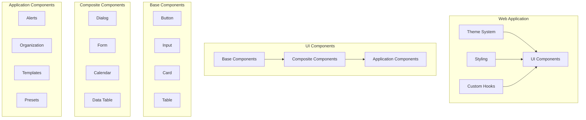
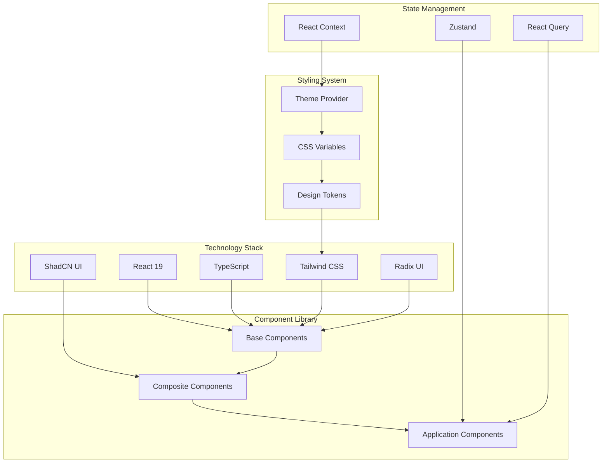
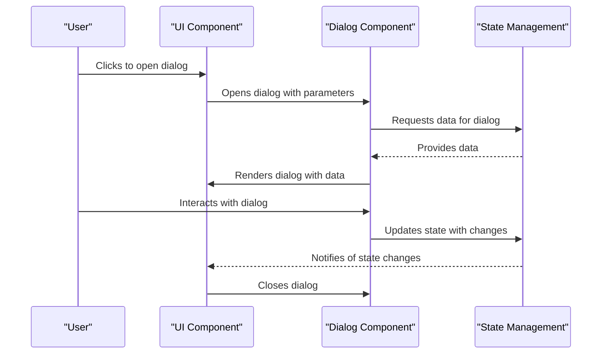
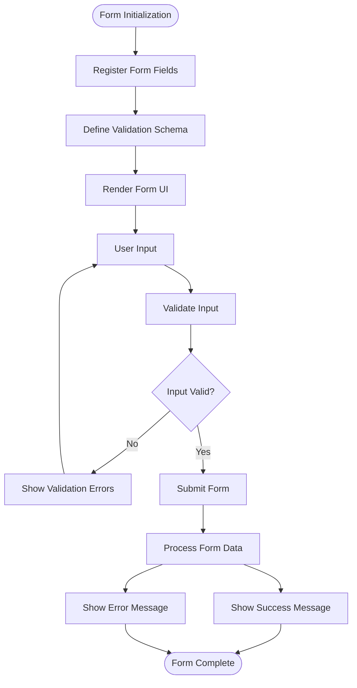
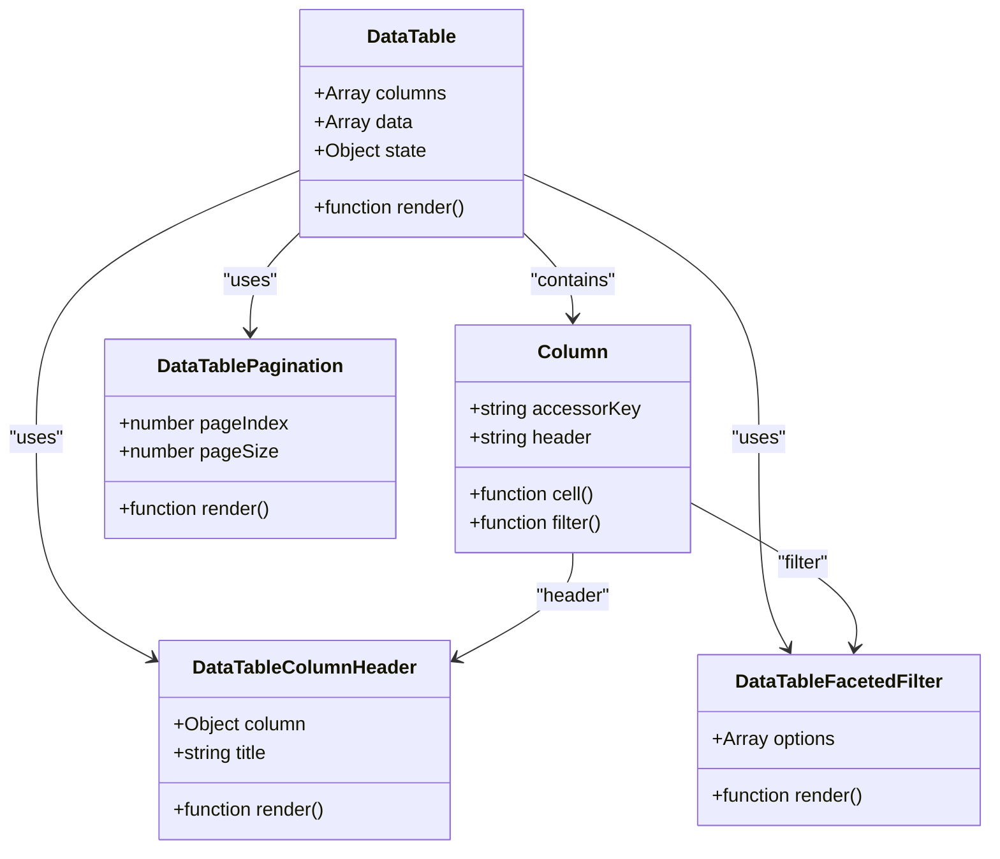
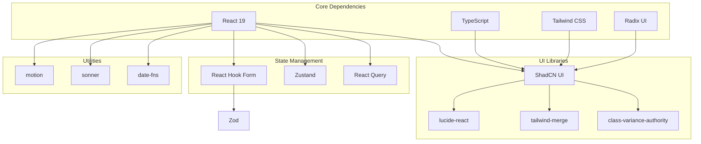
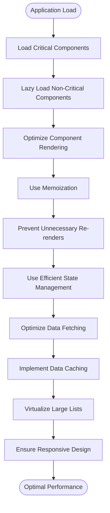

# UI System and Components

<cite>
**Referenced Files in This Document**   
- [tailwind.config.js](file://apps/native/tailwind.config.js)
- [theme-provider.tsx](file://apps/web/src/components/theme-provider.tsx)
- [mode-toggle.tsx](file://apps/web/src/components/mode-toggle.tsx)
- [components.json](file://apps/web/components.json)
- [button.tsx](file://apps/web/src/components/ui/button.tsx)
- [dialog.tsx](file://apps/web/src/components/ui/dialog.tsx)
- [form.tsx](file://apps/web/src/components/ui/form.tsx)
- [table.tsx](file://apps/web/src/components/ui/table.tsx)
- [column.tsx](file://apps/web/src/components/hipaa/column.tsx)
- [event-dialog.tsx](file://apps/web/src/components/event-calendar/event-dialog.tsx)
- [use-mobile.ts](file://apps/web/src/hooks/use-mobile.ts)
- [package.json](file://apps/web/package.json)
</cite>

## Table of Contents
1. [Introduction](#introduction)
2. [Project Structure](#project-structure)
3. [Core Components](#core-components)
4. [Architecture Overview](#architecture-overview)
5. [Detailed Component Analysis](#detailed-component-analysis)
6. [Dependency Analysis](#dependency-analysis)
7. [Performance Considerations](#performance-considerations)
8. [Troubleshooting Guide](#troubleshooting-guide)
9. [Conclusion](#conclusion)

## Introduction
This document provides comprehensive documentation for the UI System and Component Library used in the smart-logs application. The system is built using ShadCN UI components with Tailwind CSS for styling, leveraging Radix UI primitives for accessible and composable UI elements. The documentation covers the high-level design, component library structure, theme system, dark mode implementation, and key technical decisions. It also addresses cross-cutting concerns such as accessibility, responsive design, and performance optimization, providing a complete reference for developers working with the UI system.

## Project Structure
The UI system is primarily located in the web application within the monorepo structure. The component library follows a well-organized structure with clear separation of concerns. The core UI components are housed in the `apps/web/src/components/ui` directory, while application-specific components are organized in feature-based directories such as `alerts`, `event-calendar`, and `presets`. The theme system and dark mode functionality are implemented through a dedicated theme provider, and styling is managed through Tailwind CSS with design tokens defined in the configuration.



**Diagram sources**
- [tailwind.config.js](file://apps/native/tailwind.config.js)
- [theme-provider.tsx](file://apps/web/src/components/theme-provider.tsx)

**Section sources**
- [tailwind.config.js](file://apps/native/tailwind.config.js)
- [theme-provider.tsx](file://apps/web/src/components/theme-provider.tsx)

## Core Components
The core components of the UI system are built using ShadCN UI patterns, which provide a collection of reusable components based on Radix UI and Tailwind CSS. These components follow a consistent design language and implementation pattern, ensuring visual and behavioral consistency across the application. The component library includes foundational elements such as buttons, inputs, cards, and tables, as well as more complex composite components like dialogs, forms, and data tables.

The implementation leverages React's component model with TypeScript for type safety, ensuring robust and maintainable code. Each component is designed to be composable and extensible, allowing for customization while maintaining design consistency. The use of Radix UI primitives ensures that all components are accessible by default, with proper keyboard navigation, ARIA attributes, and screen reader support.

**Section sources**
- [button.tsx](file://apps/web/src/components/ui/button.tsx)
- [dialog.tsx](file://apps/web/src/components/ui/dialog.tsx)
- [form.tsx](file://apps/web/src/components/ui/form.tsx)

## Architecture Overview
The UI system architecture is built on a foundation of modern web technologies and design principles. At its core, the system uses React 19 with TypeScript for component development, providing a type-safe and efficient development experience. The styling is handled by Tailwind CSS, which enables utility-first styling with a consistent design system. The component library is structured around ShadCN UI patterns, which provide a collection of accessible and customizable components built on Radix UI primitives.

The theme system is implemented using a context-based approach, allowing for dynamic theme switching and persistence of user preferences. Dark mode is supported through CSS classes and media queries, with the ability to respect system preferences or allow user selection. The component library is organized in a hierarchical structure, with base components forming the foundation for more complex composite components.



**Diagram sources**
- [package.json](file://apps/web/package.json)
- [tailwind.config.js](file://apps/native/tailwind.config.js)
- [theme-provider.tsx](file://apps/web/src/components/theme-provider.tsx)

## Detailed Component Analysis

### Button Component Analysis
The Button component is a foundational element in the UI system, demonstrating the implementation pattern used throughout the component library. It leverages the class-variance-authority (CVA) library to define variants and styles, allowing for consistent and type-safe styling across different button types and sizes. The component supports composition through the `asChild` prop, enabling it to be used with different underlying elements while maintaining consistent styling.

```mermaid
classDiagram
class Button {
+string className
+string variant
+string size
+boolean asChild
+ReactNode children
+function Button()
}
class buttonVariants {
+function cva()
}
class cn {
+function cn()
}
Button --> buttonVariants : "uses"
Button --> cn : "uses"
buttonVariants ..> "class-variance-authority" : "import"
cn ..> "@/lib/utils" : "import"
```

**Diagram sources**
- [button.tsx](file://apps/web/src/components/ui/button.tsx)

**Section sources**
- [button.tsx](file://apps/web/src/components/ui/button.tsx)

### Dialog Management
Dialog components in the system are built using Radix UI's dialog primitives, ensuring accessibility and proper focus management. The implementation provides a composable API that allows for easy creation of modal dialogs with consistent styling and behavior. The dialog system supports various use cases, including form dialogs, confirmation dialogs, and information dialogs, with the ability to customize content and actions.

The event calendar application demonstrates the use of dialogs for managing events, with components like `EventDialog` and `DayEventsDialog` providing rich user interactions. These dialogs are integrated with the application's state management system, allowing for seamless data flow between the dialog and the parent component.



**Diagram sources**
- [dialog.tsx](file://apps/web/src/components/ui/dialog.tsx)
- [event-dialog.tsx](file://apps/web/src/components/event-calendar/event-dialog.tsx)

**Section sources**
- [dialog.tsx](file://apps/web/src/components/ui/dialog.tsx)
- [event-dialog.tsx](file://apps/web/src/components/event-calendar/event-dialog.tsx)

### Form Handling
Form handling in the application is implemented using React Hook Form with Zod for validation. This combination provides a robust and type-safe approach to form management, with excellent developer experience and performance characteristics. The form components are built on top of Radix UI primitives, ensuring accessibility and consistent styling.

The implementation follows a pattern where form fields are wrapped in `FormField`, `FormItem`, `FormLabel`, and `FormMessage` components, creating a structured and composable API. This approach allows for consistent error handling, validation, and user feedback across all forms in the application.



**Diagram sources**
- [form.tsx](file://apps/web/src/components/ui/form.tsx)
- [templates/form.tsx](file://apps/web/src/components/templates/form.tsx)

**Section sources**
- [form.tsx](file://apps/web/src/components/ui/form.tsx)
- [templates/form.tsx](file://apps/web/src/components/templates/form.tsx)

### Data Table Implementation
Data tables in the application are implemented using a combination of UI components and data processing logic. The table structure is built using the base table components from the UI library, while the data handling and presentation logic is implemented in feature-specific components. The implementation supports sorting, filtering, pagination, and column customization, providing a rich user experience for data exploration.

The column configuration follows a pattern where each column is defined with an accessor key, header, and optional cell renderer. This approach allows for flexible data presentation and customization based on the specific requirements of each data set.



**Diagram sources**
- [table.tsx](file://apps/web/src/components/ui/table.tsx)
- [column.tsx](file://apps/web/src/components/hipaa/column.tsx)

**Section sources**
- [table.tsx](file://apps/web/src/components/ui/table.tsx)
- [column.tsx](file://apps/web/src/components/hipaa/column.tsx)

## Dependency Analysis
The UI system has a well-defined dependency structure, with clear separation between direct dependencies, peer dependencies, and dev dependencies. The core dependencies include React 19, TypeScript, Tailwind CSS, and Radix UI, which form the foundation of the component library. Additional dependencies provide specific functionality such as form handling, state management, and animation.

The dependency management follows a monorepo pattern, with shared packages across different applications in the repository. This approach ensures consistency and reduces duplication, while allowing for independent versioning of specific components when needed.



**Diagram sources**
- [package.json](file://apps/web/package.json)

**Section sources**
- [package.json](file://apps/web/package.json)

## Performance Considerations
The UI system incorporates several performance optimization techniques to ensure a smooth and responsive user experience. These include efficient rendering patterns, lazy loading of components, and optimized data fetching strategies. The use of React 19 brings performance improvements such as automatic batching and improved memory management.

The component library is designed with performance in mind, using memoization and useCallback to prevent unnecessary re-renders. The data table implementation includes virtualization for large datasets, ensuring that only visible rows are rendered. The form handling system uses efficient validation strategies, minimizing the performance impact of real-time validation.

For responsive design, the system uses Tailwind CSS's responsive utilities to create layouts that adapt to different screen sizes. The `useIsMobile` hook provides a programmatic way to detect mobile devices, allowing for conditional rendering of components based on screen size.



**Section sources**
- [use-mobile.ts](file://apps/web/src/hooks/use-mobile.ts)

## Troubleshooting Guide
When encountering issues with the UI system, the following steps can help diagnose and resolve common problems:

1. **Component not rendering**: Check that the component is properly imported and that all required props are provided. Verify that the component is not conditionally rendered based on state that may prevent rendering.

2. **Styling issues**: Ensure that Tailwind CSS classes are correctly applied and that there are no conflicting styles. Check the browser's developer tools to inspect the applied styles and identify any overrides.

3. **Accessibility problems**: Verify that all interactive elements have proper ARIA attributes and keyboard navigation support. Use accessibility testing tools to identify and fix any issues.

4. **Performance bottlenecks**: Use React DevTools to identify unnecessary re-renders and optimize component memoization. For data tables with large datasets, ensure that virtualization is properly implemented.

5. **Theme switching not working**: Check that the theme provider is properly wrapped around the application and that the theme context is correctly consumed by components. Verify that the CSS variables are properly defined and applied.

**Section sources**
- [theme-provider.tsx](file://apps/web/src/components/theme-provider.tsx)
- [mode-toggle.tsx](file://apps/web/src/components/mode-toggle.tsx)

## Conclusion
The UI System and Component Library for the smart-logs application provides a robust and scalable foundation for building consistent and accessible user interfaces. By leveraging ShadCN UI components with Tailix UI primitives and Tailwind CSS for styling, the system achieves a balance between design consistency and implementation flexibility. The architecture supports dark mode, responsive design, and performance optimization, addressing key cross-cutting concerns in modern web applications.

The component library structure promotes reusability and maintainability, with a clear hierarchy from base components to application-specific components. The use of TypeScript ensures type safety and improves developer experience, while the integration of React Query and Zustand provides efficient state management for both local and server state.

Future enhancements could include additional component variants, improved documentation with interactive examples, and expanded accessibility testing to ensure compliance with WCAG standards. The current implementation provides a solid foundation that can be extended to meet evolving requirements while maintaining design and code quality standards.