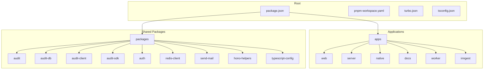
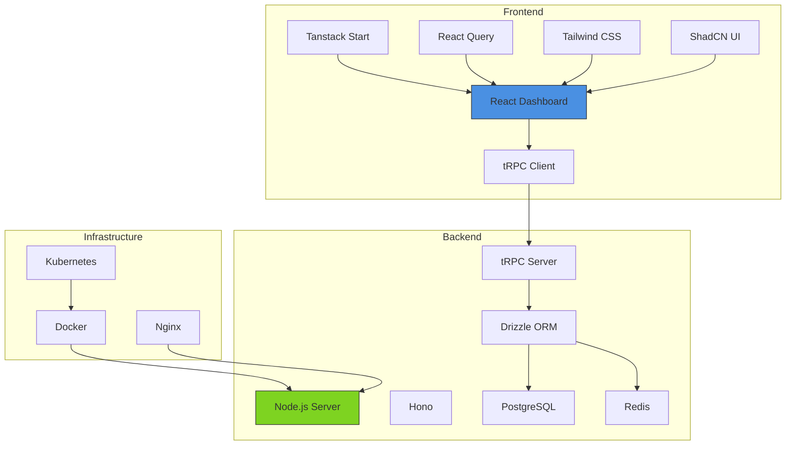
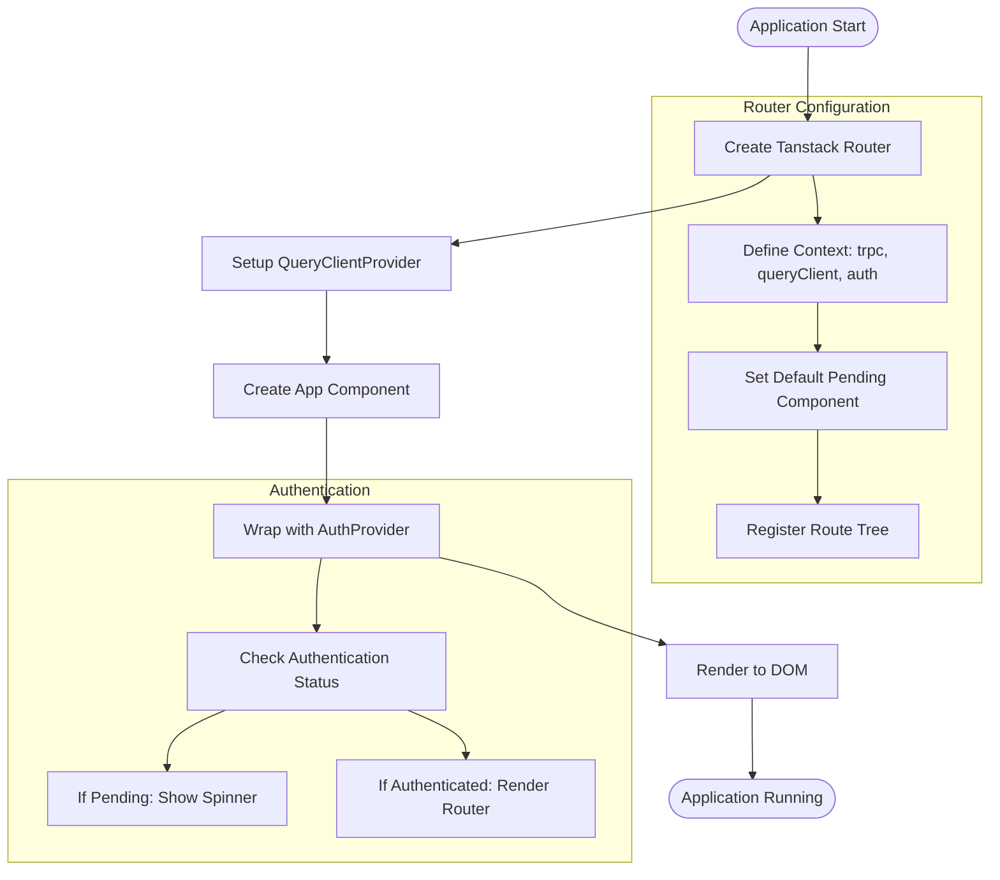
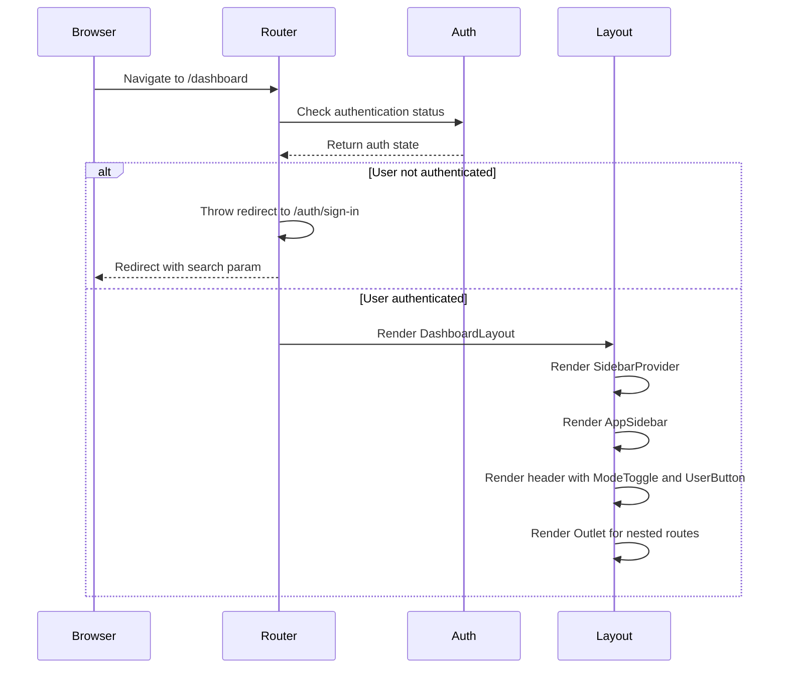
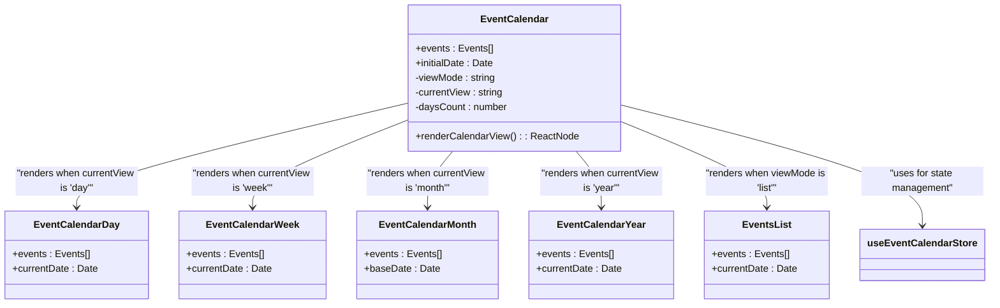
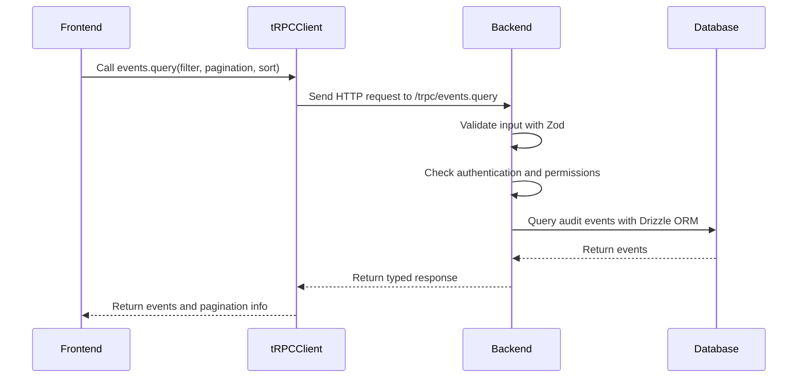
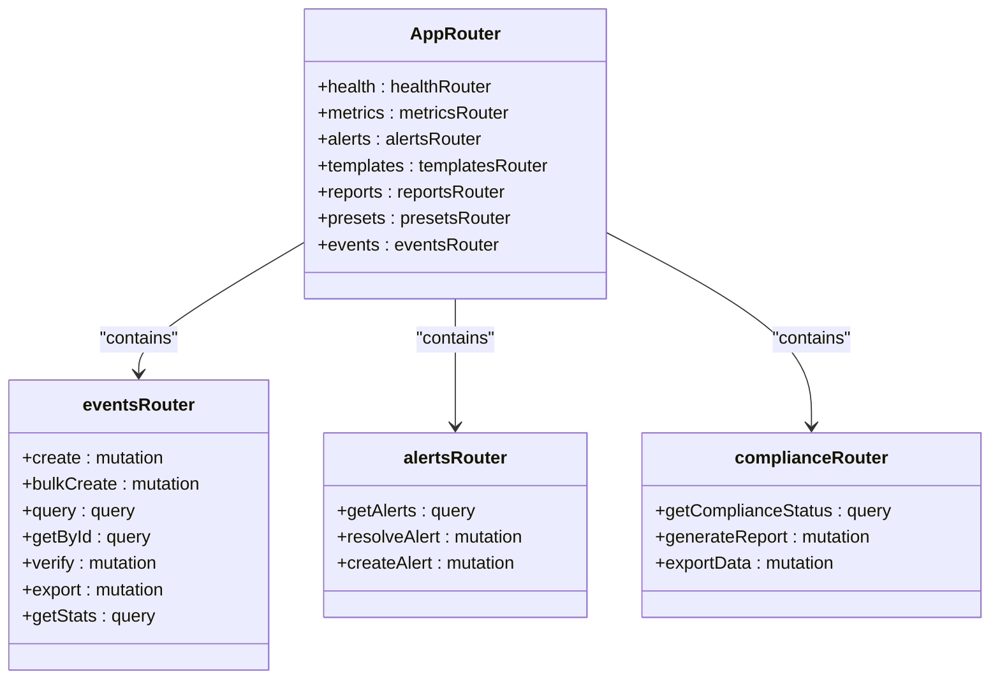
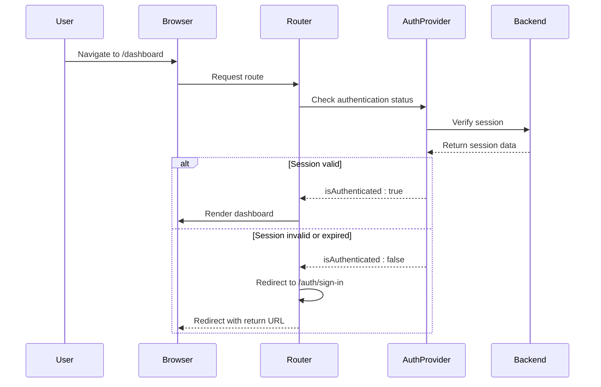

# Web Application

<cite>
**Referenced Files in This Document**   
- [main.tsx](file://apps/web/src/main.tsx)
- [route.tsx](file://apps/web/src/routes/dashboard/route.tsx)
- [trpc.ts](file://apps/web/src/utils/trpc.ts)
- [index.ts](file://apps/server/src/routers/index.ts)
- [events.ts](file://apps/server/src/routers/events.ts)
- [event-calendar.tsx](file://apps/web/src/components/event-calendar/event-calendar.tsx)
- [use-event.ts](file://apps/web/src/hooks/use-event.ts)
</cite>

## Table of Contents
1. [Introduction](#introduction)
2. [Project Structure](#project-structure)
3. [Core Components](#core-components)
4. [Architecture Overview](#architecture-overview)
5. [Detailed Component Analysis](#detailed-component-analysis)
6. [Data Flow and API Integration](#data-flow-and-api-integration)
7. [Technology Stack and Design Decisions](#technology-stack-and-design-decisions)
8. [Security and Authentication](#security-and-authentication)
9. [Performance and Scalability](#performance-and-scalability)
10. [Conclusion](#conclusion)

## Introduction
The Web Application is a comprehensive audit and compliance dashboard built with modern web technologies. It provides a React-based interface using Tanstack Start for routing and state management, with Tauri enabling desktop packaging capabilities. The application connects to a backend server via tRPC for type-safe API communication, enabling robust data exchange for audit events, compliance reporting, and alert management. Key features include an interactive event calendar, alert management system, and compliance reporting interfaces designed for healthcare and regulatory environments such as HIPAA and GDPR.

The system architecture follows a modular monorepo structure with distinct applications for web, native, server, documentation, and background workers. This documentation provides a comprehensive analysis of the application's architecture, component interactions, data flows, and technical implementation details.

## Project Structure
The project follows a monorepo architecture with a well-organized directory structure that separates concerns and facilitates maintainability. The root contains shared configuration files and package management setup, while the `apps` directory houses distinct applications, and the `packages` directory contains shared libraries and utilities.

**Diagram sources**
- [package.json](file://package.json)
- [pnpm-workspace.yaml](file://pnpm-workspace.yaml)

**Section sources**
- [package.json](file://package.json)
- [pnpm-workspace.yaml](file://pnpm-workspace.yaml)

## Core Components
The Web Application consists of several core components that work together to provide a seamless user experience for audit and compliance management. The main entry point is the `main.tsx` file, which initializes the React application with Tanstack Start routing, tRPC for API communication, and React Query for data fetching and caching.

The dashboard layout is defined in the `route.tsx` file, which implements authentication protection and provides a consistent interface with sidebar navigation, header controls, and theme toggling. The event calendar component serves as a central interface for visualizing audit events across different time periods, while the tRPC configuration enables type-safe communication with the backend server.

**Section sources**
- [main.tsx](file://apps/web/src/main.tsx)
- [route.tsx](file://apps/web/src/routes/dashboard/route.tsx)
- [event-calendar.tsx](file://apps/web/src/components/event-calendar/event-calendar.tsx)

## Architecture Overview
The Web Application follows a modern full-stack architecture with clear separation between frontend, backend, and shared components. The frontend is a React-based dashboard built with Tanstack Start, providing efficient routing and data loading capabilities. The backend server exposes API endpoints via tRPC, enabling type-safe communication with the frontend. Tauri is used for desktop packaging, allowing the web application to run as a native desktop application.

**Diagram sources**
- [main.tsx](file://apps/web/src/main.tsx)
- [index.ts](file://apps/server/src/routers/index.ts)

## Detailed Component Analysis

### Main Application Entry Point
The `main.tsx` file serves as the entry point for the web application, initializing the React application with essential providers and configuration. It sets up Tanstack Start routing, React Query for data management, and authentication context.

**Diagram sources**
- [main.tsx](file://apps/web/src/main.tsx#L1-L58)

**Section sources**
- [main.tsx](file://apps/web/src/main.tsx#L1-L58)

### Dashboard Layout and Routing
The dashboard layout is implemented in `route.tsx`, which defines the protected route structure and provides a consistent interface for the application. It implements authentication protection, ensuring that only authenticated users can access the dashboard.

**Diagram sources**
- [route.tsx](file://apps/web/src/routes/dashboard/route.tsx#L1-L52)

**Section sources**
- [route.tsx](file://apps/web/src/routes/dashboard/route.tsx#L1-L52)

### Event Calendar Component
The event calendar component provides a flexible interface for viewing audit events across different time periods. It uses a state management pattern with Zustand to manage the current view mode and date.

**Diagram sources**
- [event-calendar.tsx](file://apps/web/src/components/event-calendar/event-calendar.tsx#L1-L66)
- [use-event.ts](file://apps/web/src/hooks/use-event.ts)

**Section sources**
- [event-calendar.tsx](file://apps/web/src/components/event-calendar/event-calendar.tsx#L1-L66)
- [use-event.ts](file://apps/web/src/hooks/use-event.ts)

## Data Flow and API Integration
The Web Application uses tRPC for type-safe communication between the frontend and backend, ensuring that API calls are properly typed and validated. The tRPC client is configured in `trpc.ts` and provides a proxy interface for calling backend procedures.

### tRPC Configuration
The tRPC client is configured with HTTP batch links to optimize network requests and uses superjson for data serialization, enabling the transfer of complex data types like dates and maps.

**Diagram sources**
- [trpc.ts](file://apps/web/src/utils/trpc.ts#L1-L64)
- [events.ts](file://apps/server/src/routers/events.ts#L1-L1360)

**Section sources**
- [trpc.ts](file://apps/web/src/utils/trpc.ts#L1-L64)
- [events.ts](file://apps/server/src/routers/events.ts#L1-L1360)

### Backend Router Structure
The backend server uses a modular router structure with tRPC, where each feature has its own router file that is combined into a single application router. This approach promotes code organization and maintainability.

**Diagram sources**
- [index.ts](file://apps/server/src/routers/index.ts#L1-L24)
- [events.ts](file://apps/server/src/routers/events.ts#L1-L1360)

**Section sources**
- [index.ts](file://apps/server/src/routers/index.ts#L1-L24)
- [events.ts](file://apps/server/src/routers/events.ts#L1-L1360)

## Technology Stack and Design Decisions

### Frontend Technology Stack
The frontend is built with React and leverages several modern libraries and frameworks to provide a rich user experience:

- **Tanstack Start**: Provides routing, data loading, and server-side rendering capabilities
- **React Query**: Manages data fetching, caching, and synchronization
- **tRPC**: Enables type-safe API communication between frontend and backend
- **Tailwind CSS**: Utility-first CSS framework for styling
- **ShadCN UI**: Component library built on Radix UI and Tailwind CSS
- **Zustand**: Lightweight state management for React
- **Sonner**: Toast notifications
- **Hono**: Web framework used on the backend, but types are shared with frontend

### Backend Technology Stack
The backend server is built with Node.js and uses several technologies to provide a robust API:

- **Hono**: Lightweight web framework for building APIs
- **tRPC**: Type-safe API layer
- **Drizzle ORM**: Type-safe database ORM
- **PostgreSQL**: Primary database for storing audit events and related data
- **Redis**: Used for caching and session storage
- **Zod**: Schema validation for input validation
- **Superjson**: Enhanced JSON serialization for complex data types

### Design Decisions
Several key design decisions were made to ensure the application is maintainable, scalable, and secure:

1. **Monorepo Structure**: The use of a monorepo with pnpm workspaces allows for shared code and consistent tooling across multiple applications.

2. **Type Safety**: The extensive use of TypeScript, tRPC, and Zod ensures that data flows are type-safe from the frontend to the database.

3. **Modular Architecture**: The separation of concerns between frontend, backend, and shared packages promotes maintainability and reusability.

4. **Authentication and Authorization**: The application implements robust authentication and authorization mechanisms to protect sensitive audit data.

5. **Performance Optimization**: The use of React Query for data caching, HTTP batch links for tRPC, and database query optimization ensures good performance.

## Security and Authentication
The Web Application implements a comprehensive security model to protect sensitive audit and compliance data. Authentication is handled through a dedicated auth package, and authorization is enforced at both the application and API levels.

### Authentication Flow
The application uses a session-based authentication system with protected routes that redirect unauthenticated users to the sign-in page.

**Diagram sources**
- [route.tsx](file://apps/web/src/routes/dashboard/route.tsx#L1-L52)
- [main.tsx](file://apps/web/src/main.tsx#L1-L58)

**Section sources**
- [route.tsx](file://apps/web/src/routes/dashboard/route.tsx#L1-L52)

### API Security
The backend API implements multiple security measures to protect against unauthorized access and ensure data integrity:

- **Authentication Procedures**: Custom tRPC procedures (publicProcedure, protectedProcedure, auditReadProcedure, etc.) enforce authentication and authorization rules.
- **Input Validation**: All API inputs are validated using Zod schemas to prevent injection attacks and ensure data integrity.
- **Organization Isolation**: Queries include organization ID filters to prevent cross-organization data access.
- **Rate Limiting**: Middleware implements rate limiting to prevent abuse.
- **Error Handling**: Structured error responses provide meaningful feedback without exposing sensitive information.

## Performance and Scalability
The Web Application is designed with performance and scalability in mind, using several techniques to ensure responsiveness and efficient resource utilization.

### Frontend Performance
The frontend implements several performance optimizations:

- **Code Splitting**: Tanstack Start enables code splitting and lazy loading of routes.
- **Data Caching**: React Query caches API responses and intelligently invalidates stale data.
- **Batched Requests**: tRPC's HTTP batch link combines multiple requests into a single HTTP call.
- **Memoization**: React's useMemo and useCallback hooks prevent unnecessary re-renders.
- **Virtualization**: Large lists are virtualized to improve rendering performance.

### Backend Performance
The backend implements several performance optimizations:

- **Query Optimization**: Database queries are optimized with proper indexing and query planning.
- **Caching**: Redis is used to cache frequently accessed data and reduce database load.
- **Connection Pooling**: Database connection pooling ensures efficient use of database resources.
- **Asynchronous Processing**: Background tasks are handled by worker processes to avoid blocking the main server.
- **Monitoring**: Comprehensive logging and monitoring enable performance analysis and optimization.

### Scalability Considerations
The application architecture supports horizontal scaling:

- **Stateless Server**: The backend server is stateless, allowing multiple instances to be deployed behind a load balancer.
- **External Session Storage**: Sessions are stored in Redis, enabling shared access across server instances.
- **Database Scaling**: PostgreSQL supports various scaling options, including read replicas and partitioning.
- **Containerization**: Docker and Kubernetes enable easy deployment and scaling of the application.
- **CDN Support**: Static assets can be served through a CDN for improved global performance.

## Conclusion
The Web Application is a sophisticated audit and compliance dashboard that leverages modern web technologies to provide a robust and user-friendly interface for managing audit events. The architecture follows best practices with a clear separation of concerns, type safety throughout the stack, and comprehensive security measures.

Key strengths of the application include its modular monorepo structure, type-safe API communication with tRPC, and flexible event calendar interface. The use of established libraries like React, Tailwind CSS, and ShadCN UI ensures a high-quality user experience, while the backend's use of Hono, Drizzle ORM, and PostgreSQL provides a solid foundation for data management.

The application is well-positioned for future growth and enhancement, with a scalable architecture that can accommodate increasing data volumes and user demands. By following the documented patterns and practices, development teams can efficiently extend the application's functionality while maintaining code quality and performance.