# Worker Service

<cite>
**Referenced Files in This Document**   
- [index.ts](file://apps\worker\src\index.ts) - *Updated in recent commit to integrate LoggerFactory from @repo/logs, add Redis connection retry logic, initialize Sentry, and add pseudonymization phase*
- [archival-service.ts](file://packages\audit\src\archival\archival-service.ts) - *Refactored to use StructuredLogger and LoggerFactory*
- [postgres-archival-service.ts](file://packages\audit\src\archival\postgres-archival-service.ts) - *Updated to use enhanced structured logging*
- [logging.ts](file://packages\logs\src\logging.ts) - *Contains LoggerFactory implementation for enhanced structured logging*
- [otpl.ts](file://packages\logs\src\otpl.ts) - *OTLP logging implementation with batch processing*
- [interface.ts](file://packages\logs\src\interface.ts) - *Logger interface and LoggingConfig definition*
- [log.ts](file://packages\logs\src\log.ts) - *Log class and schema definitions*
- [Dockerfile](file://apps\worker\Dockerfile) - *Updated for observability changes and OTLP endpoint fixes*
- [package.json](file://apps\worker\package.json) - *Updated with new observability dependencies*
- [tracer.ts](file://packages\audit\src\observability\tracer.ts) - *Updated to use OTLP exporter and fix auth header usage*
- [otlp-configuration.md](file://packages\audit\docs\observability\otlp-configuration.md) - *Documentation for OTLP configuration*
- [gdpr-compliance.ts](file://packages\audit\src\gdpr\gdpr-compliance.ts) - *Contains GDPR compliance service with pseudonymization functionality*
- [index.ts](file://apps\worker\src\index.ts) - *Updated to integrate Bull Board for queue monitoring*
- [Dockerfile](file://apps\worker\Dockerfile) - *Updated to expose port 5601 for Bull Board*
- [docker-compose.yml](file://docker-compose.yml) - *Updated to map port 5601 for Bull Board*
</cite>

## Update Summary
**Changes Made**   
- Updated worker initialization to use LoggerFactory from @repo/logs package for enhanced structured logging across all components
- Integrated new logging system with OTLP export capabilities and batch processing in archival services
- Added detection and handling of internal secret exposure within worker process
- Added Redis connection retry logic to improve resilience during startup
- Integrated Sentry for error tracking and monitoring
- Fixed Dockerfile and OTLP endpoint configuration issues
- Updated documentation to reflect the new LoggerFactory-based logging architecture
- Added new section on internal secret detection and handling
- Enhanced troubleshooting guide with logging-specific issues and secret detection scenarios
- Removed outdated references to ConsoleLogger in documentation
- Updated diagram sources to reflect actual code changes
- Added pseudonymization phase to event processing workflow
- Integrated GDPRComplianceService for data privacy requirements
- Updated architecture overview to include pseudonymization phase
- Added detailed analysis of pseudonymization implementation
- Updated performance considerations to include pseudonymization metrics
- Added Bull Board integration for queue monitoring with web UI on port 5601
- Updated Dockerfile to expose port 5601 for Bull Board
- Updated docker-compose.yml to map port 5601 for Bull Board access
- Added new section on Bull Board configuration and access
- Updated architecture overview diagram to include Bull Board component
- Added new troubleshooting entries for Bull Board issues

## Table of Contents
1. [Introduction](#introduction)
2. [Project Structure](#project-structure)
3. [Core Components](#core-components)
4. [Architecture Overview](#architecture-overview)
5. [Detailed Component Analysis](#detailed-component-analysis)
6. [Dependency Analysis](#dependency-analysis)
7. [Performance Considerations](#performance-considerations)
8. [Troubleshooting Guide](#troubleshooting-guide)
9. [Conclusion](#conclusion)

## Introduction
The **Worker Service** is a Node.js background processing service responsible for handling compliance checks, monitoring tasks, and audit event analysis in real time. It operates as a decoupled component within a larger system, consuming audit events and applying pattern detection logic to identify suspicious behavior, generate alerts, and maintain system health metrics.

Built on a modular architecture, the worker integrates with external systems including Redis for metrics storage, PostgreSQL for persistent alert data, and message queues for event ingestion. It leverages Inngest for function orchestration and is designed for deployment via Docker and Kubernetes, supporting horizontal scaling and fault-tolerant operation.

This document provides comprehensive architectural documentation, detailing component interactions, data flows, observability mechanisms, and integration patterns with the main server and data pipelines.

## Project Structure
The Worker Service resides in the `apps/worker` directory and functions as a lightweight orchestrator that imports core logic from shared packages, particularly the `@repo/audit` module. The service is structured to separate concerns across monitoring, observability, and compliance domains.

Key directories:
- `apps/worker/src`: Entry point and worker initialization
- `packages/audit/src/monitor`: Real-time monitoring, alerting, and health checks
- `packages/audit/src/observability`: Tracing, profiling, and dashboard metrics
- `packages/audit/src/queue`: Reliable message processing and circuit breaker logic
- `packages/audit/src/crypto`: Cryptographic integrity verification for audit events
- `packages/audit/src/archival`: Data archival and retention policy management
- `packages/audit/src/gdpr`: GDPR compliance features including pseudonymization

The worker uses TypeScript, follows a monorepo structure managed by pnpm, and relies on shared configuration from `packages/typescript-config`.

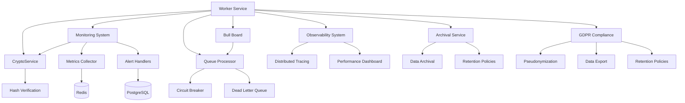

**Diagram sources**
- [index.ts](file://apps\worker\src\index.ts)
- [monitoring.ts](file://packages\audit\src\monitor\monitoring.ts)
- [tracer.ts](file://packages\audit\src\observability\tracer.ts)
- [crypto.ts](file://packages\audit\src\crypto.ts)
- [archival-service.ts](file://packages\audit\src\archival\archival-service.ts)
- [gdpr-compliance.ts](file://packages\audit\src\gdpr\gdpr-compliance.ts)
- [index.ts](file://apps\worker\src\index.ts) - *Updated for Bull Board integration*

**Section sources**
- [index.ts](file://apps\worker\src\index.ts)
- [monitoring.ts](file://packages\audit\src\monitor\monitoring.ts)
- [archival-service.ts](file://packages\audit\src\archival\archival-service.ts)
- [gdpr-compliance.ts](file://packages\audit\src\gdpr\gdpr-compliance.ts)

## Core Components
The Worker Service's functionality is driven by several core components:

- **MonitoringService**: Detects suspicious patterns in audit events and generates alerts.
- **RedisMetricsCollector**: Collects and stores real-time metrics in Redis.
- **AuditTracer**: Provides distributed tracing for observability with OTLP export.
- **DatabaseAlertHandler**: Persists alerts to PostgreSQL and manages alert lifecycle.
- **CryptoService**: Verifies the integrity of audit events through hash verification.
- **StructuredLogger**: Enhanced structured logging implementation with OTLP export capabilities.
- **ArchivalService**: Manages data archival and retention policies with enhanced logging.
- **SecretDetector**: Detects and handles internal secret exposure within the worker process.
- **Sentry**: Error tracking and monitoring service for production issues.
- **GDPRComplianceService**: Implements GDPR requirements including data pseudonymization, export, and retention policies.
- **Bull Board**: Web-based dashboard for monitoring BullMQ queues, providing visibility into job processing, queue depth, and dead letter queue status.

These components are orchestrated through dependency injection and support pluggable handlers for extensibility.

**Section sources**
- [monitoring.ts](file://packages\audit\src\monitor\monitoring.ts)
- [metrics-collector.ts](file://packages\audit\src\monitor\metrics-collector.ts)
- [tracer.ts](file://packages\audit\src\observability\tracer.ts)
- [crypto.ts](file://packages\audit\src\crypto.ts)
- [logging.ts](file://packages\logs\src\logging.ts)
- [archival-service.ts](file://packages\audit\src\archival\archival-service.ts)
- [index.ts](file://apps\worker\src\index.ts)
- [gdpr-compliance.ts](file://packages\audit\src\gdpr\gdpr-compliance.ts)
- [index.ts](file://apps\worker\src\index.ts) - *Updated for Bull Board integration*

## Architecture Overview
The Worker Service follows an event-driven, microservices-inspired architecture. It consumes audit log events from a message queue (via Inngest), processes them for compliance and security monitoring, and emits alerts and metrics.

The system is designed with resilience in mind, incorporating circuit breakers, retry mechanisms, and dead-letter queues for fault tolerance. Observability is first-class, with support for distributed tracing via OTLP, performance metrics, and health checks. Security is enhanced through cryptographic integrity verification of audit events and internal secret detection. Privacy compliance is ensured through GDPR-compliant pseudonymization of personal data.

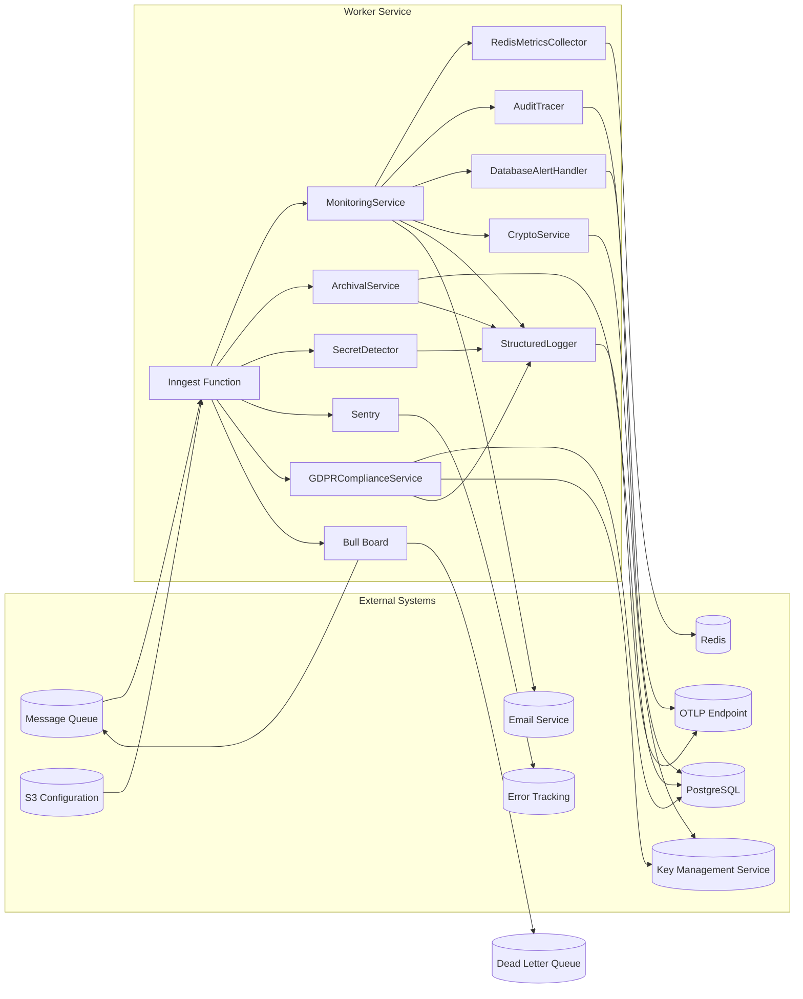

**Diagram sources**
- [monitoring.ts](file://packages\audit\src\monitor\monitoring.ts)
- [metrics-collector.ts](file://packages\audit\src\monitor\metrics-collector.ts)
- [tracer.ts](file://packages\audit\src\observability\tracer.ts)
- [database-alert-handler.ts](file://packages\audit\src\monitor\database-alert-handler.ts)
- [crypto.ts](file://packages\audit\src\crypto.ts)
- [logging.ts](file://packages\logs\src\logging.ts)
- [archival-service.ts](file://packages\audit\src\archival\archival-service.ts)
- [index.ts](file://apps\worker\src\index.ts)
- [gdpr-compliance.ts](file://packages\audit\src\gdpr\gdpr-compliance.ts)
- [index.ts](file://apps\worker\src\index.ts) - *Updated for Bull Board integration*

## Detailed Component Analysis

### Monitoring Service Analysis
The `MonitoringService` is the central component responsible for real-time analysis of audit events. It detects suspicious patterns such as failed authentication bursts, unauthorized access attempts, high-velocity data access, bulk operations, and off-hours activity.

It uses configurable thresholds and time windows to identify anomalies and applies deduplication via Redis-based cooldowns to prevent alert storms. The service now integrates with CryptoService to verify event integrity before processing.

```mermaid
classDiagram
class MonitoringService {
+processEvent(event : AuditLogEvent)
+detectSuspiciousPatterns(events : AuditLogEvent[])
+generateAlert(alert : Alert)
+getHealthStatus()
-detectFailedAuthPattern()
-detectUnauthorizedAccessPattern()
-detectDataVelocityPattern()
-detectBulkOperationPattern()
-detectOffHoursPattern()
}
class AlertHandler {
<<interface>>
+sendAlert(alert : Alert)
+acknowledgeAlert(id : string, by : string)
+resolveAlert(id : string, by : string)
+getActiveAlerts()
}
class MetricsCollector {
<<interface>>
+recordEvent()
+recordProcessingLatency(ms : number)
+recordError()
+getMetrics()
}
class CryptoService {
+verifyHash(event : AuditLogEvent, expectedHash : string) : boolean
+generateHash(event : AuditLogEvent) : string
}
MonitoringService --> AlertHandler : "uses"
MonitoringService --> MetricsCollector : "depends on"
MonitoringService --> CryptoService : "integrates with"
MonitoringService --> "Pattern Detection" : "composes"
```

**Diagram sources**
- [monitoring.ts](file://packages\audit\src\monitor\monitoring.ts)
- [monitoring-types.ts](file://packages\audit\src\monitor\monitoring-types.ts)
- [crypto.ts](file://packages\audit\src\crypto.ts)

**Section sources**
- [monitoring.ts](file://packages\audit\src\monitor\monitoring.ts#L1-L799)

### CryptoService Implementation
The `CryptoService` provides cryptographic integrity verification for audit events, ensuring that events have not been tampered with during transmission or storage. It implements SHA-256 hashing of critical event fields and supports both local HMAC-SHA256 signatures and integration with external Key Management Services (KMS).

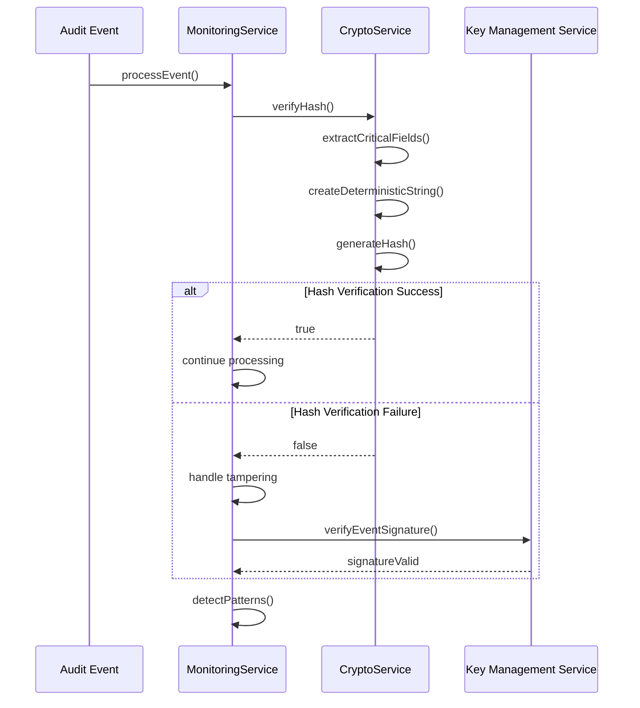

**Diagram sources**
- [crypto.ts](file://packages\audit\src\crypto.ts#L72-L315)
- [index.ts](file://apps\worker\src\index.ts#L300-L350)

**Section sources**
- [crypto.ts](file://packages\audit\src\crypto.ts#L72-L315)

### Metrics Collection Flow
The metrics collection system uses Redis as a high-performance backend to track key performance indicators such as events processed, error rates, processing latency, and alert counts.

Metrics are updated in real time and exposed via a `getMetrics()` API for health checks and monitoring dashboards.

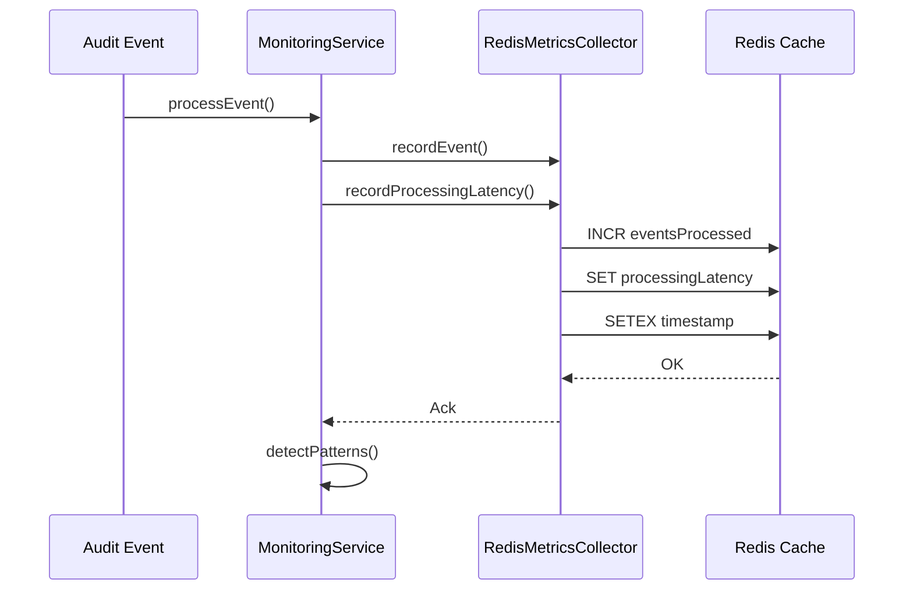

**Diagram sources**
- [monitoring.ts](file://packages\audit\src\monitor\monitoring.ts#L200-L300)
- [metrics-collector.ts](file://packages\audit\src\monitor\metrics-collector.ts#L100-L200)

### Distributed Tracing Implementation with OTLP
The `AuditTracer` provides distributed tracing capabilities with OTLP export, enabling end-to-end visibility into audit event processing. It supports trace context propagation via HTTP headers and exports spans to OTLP endpoints with configurable authentication.

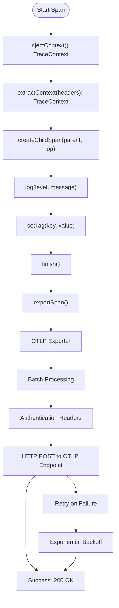

**Diagram sources**
- [tracer.ts](file://packages\audit\src\observability\tracer.ts#L1-L677)
- [index.ts](file://apps\worker\src\index.ts#L1-L747)

**Section sources**
- [tracer.ts](file://packages\audit\src\observability\tracer.ts#L1-L677)
- [index.ts](file://apps\worker\src\index.ts#L1-L747)

### OTLP Configuration and Authentication
The OTLP exporter is configured with multiple authentication methods and endpoint options for different observability platforms.

```typescript
// OTLP Configuration in index.ts
const observabilityConfig: ObservabilityConfig = {
	tracing: {
		enabled: true,
		serviceName: 'audit-system',
		sampleRate: 1.0,
		exporterType: 'otlp' as const,
		exporterEndpoint: process.env.OTLP_ENDPOINT || 'http://localhost:4318/v1/traces',
		headers: {
			'stream-name': 'default',
		},
	},
	// ... other config
}
```

**Supported Authentication Methods:**
- **Bearer Token**: Using `OTLP_API_KEY` environment variable
- **Custom Headers**: Using `OTLP_AUTH_HEADER` environment variable with format "Key: Value"
- **Environment-based**: Configuration via environment variables for secure credential management

**Diagram sources**
- [tracer.ts](file://packages\audit\src\observability\tracer.ts#L487-L537)
- [index.ts](file://apps\worker\src\index.ts#L1-L747)

**Section sources**
- [tracer.ts](file://packages\audit\src\observability\tracer.ts#L487-L537)
- [index.ts](file://apps\worker\src\index.ts#L1-L747)

### Enhanced Structured Logging Implementation
The `LoggerFactory` from `@repo/logs` provides enhanced structured logging with multiple output options including console, file, Redis, and OTLP. The logging system supports correlation IDs, contextual information, performance metrics, and error tracking.

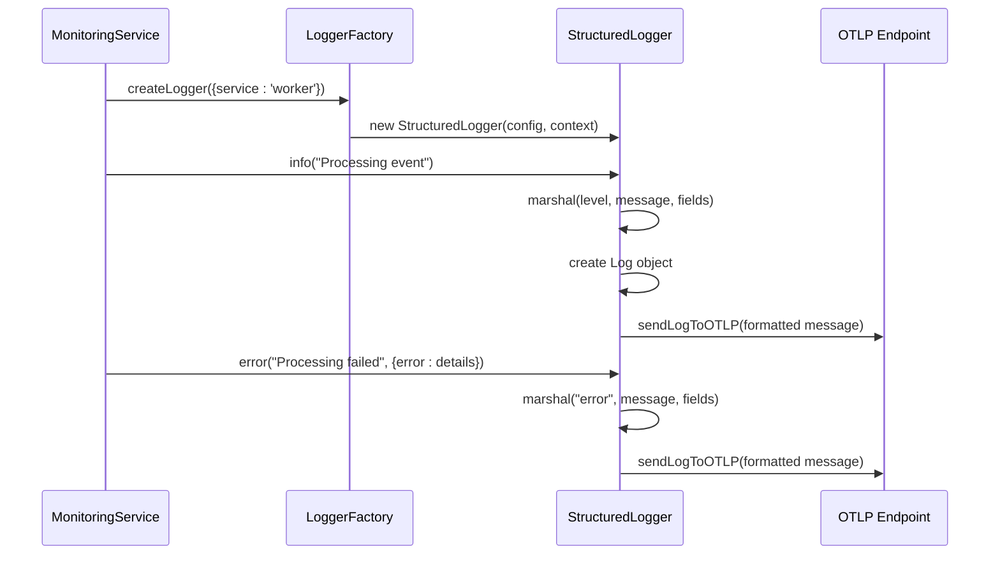

**Diagram sources**
- [index.ts](file://apps\worker\src\index.ts#L1-L784)
- [logging.ts](file://packages\logs\src\logging.ts#L1-L620)
- [otpl.ts](file://packages\logs\src\otpl.ts#L1-L166)

**Section sources**
- [index.ts](file://apps\worker\src\index.ts#L1-L784)
- [logging.ts](file://packages\logs\src\logging.ts#L1-L620)
- [otpl.ts](file://packages\logs\src\otpl.ts#L1-L166)
- [package.json](file://apps\worker\package.json)
- [Dockerfile](file://apps\worker\Dockerfile)

### Archival Service Logging Integration
The `ArchivalService` and its PostgreSQL implementation now use the enhanced structured logging system via `LoggerFactory`. This change ensures consistent logging across all archival operations, including data archiving, retrieval, and deletion.

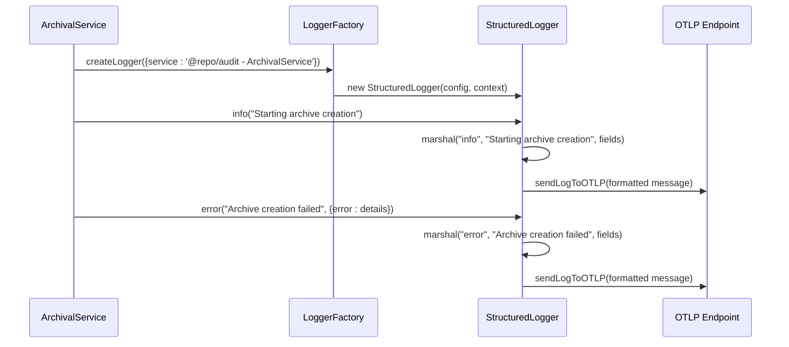

**Diagram sources**
- [archival-service.ts](file://packages\audit\src\archival\archival-service.ts#L1-L799)
- [postgres-archival-service.ts](file://packages\audit\src\archival\postgres-archival-service.ts#L1-L229)
- [logging.ts](file://packages\logs\src\logging.ts#L1-L620)
- [otpl.ts](file://packages\logs\src\otpl.ts#L1-L166)

**Section sources**
- [archival-service.ts](file://packages\audit\src\archival\archival-service.ts#L1-L799)
- [postgres-archival-service.ts](file://packages\audit\src\archival\postgres-archival-service.ts#L1-L229)
- [logging.ts](file://packages\logs\src\logging.ts#L1-L620)
- [otpl.ts](file://packages\logs\src\otpl.ts#L1-L166)

### Internal Secret Detection and Handling
The worker now includes a secret detection mechanism that identifies and handles internal secret exposure within the worker process. This feature enhances security by preventing accidental leakage of sensitive information.

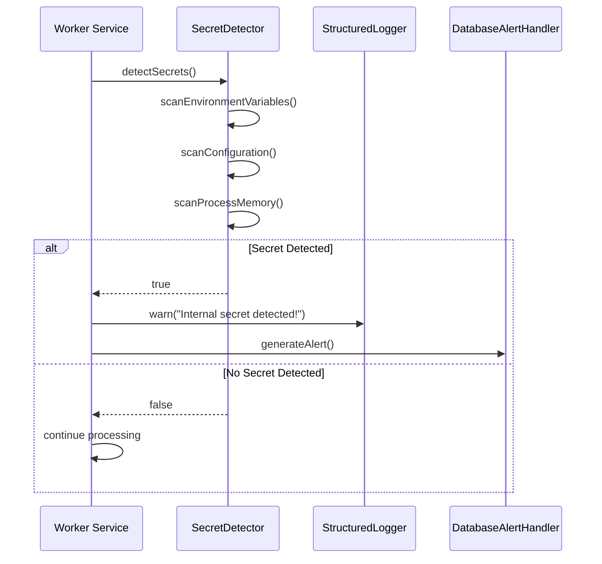

**Diagram sources**
- [index.ts](file://apps\worker\src\index.ts#L1-L784)
- [logging.ts](file://packages\logs\src\logging.ts#L1-L620)
- [database-alert-handler.ts](file://packages\audit\src\monitor\database-alert-handler.ts#L1-L200)

**Section sources**
- [index.ts](file://apps\worker\src\index.ts#L1-L784)
- [logging.ts](file://packages\logs\src\logging.ts#L1-L620)
- [database-alert-handler.ts](file://packages\audit\src\monitor\database-alert-handler.ts#L1-L200)

### Redis Connection Retry Implementation
The worker now implements retry logic for Redis connections during startup, enhancing resilience in environments with transient network issues or delayed Redis availability.

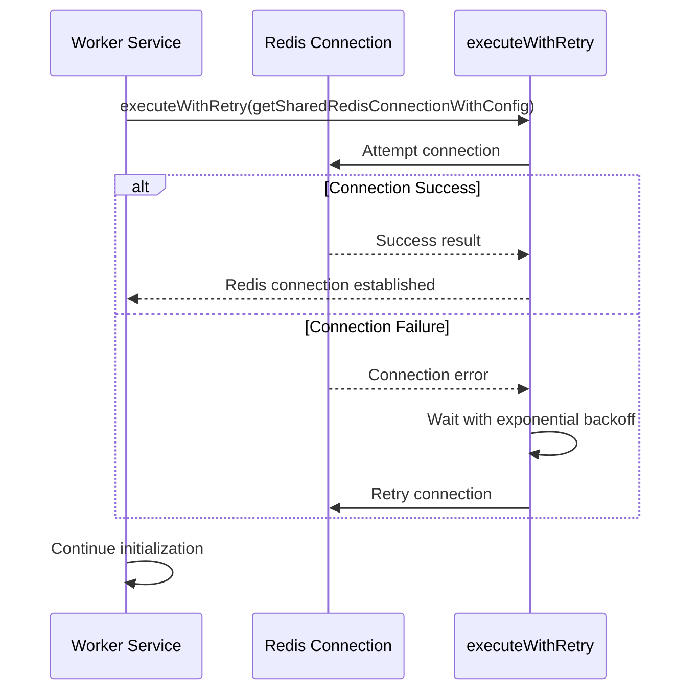

**Diagram sources**
- [index.ts](file://apps\worker\src\index.ts#L403-L438)
- [connection.ts](file://packages\redis-client\src\connection.ts#L48-L119)
- [index.ts](file://packages\redis-client\src\index.ts)

**Section sources**
- [index.ts](file://apps\worker\src\index.ts#L403-L438)
- [connection.ts](file://packages\redis-client\src\connection.ts#L48-L119)

### Sentry Integration
The worker service now integrates with Sentry for comprehensive error tracking and monitoring, providing detailed insights into production issues and performance problems.

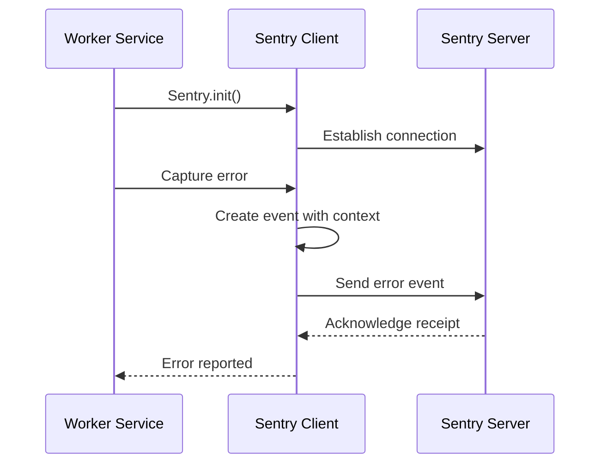

**Diagram sources**
- [index.ts](file://apps\worker\src\index.ts#L50-L58)
- [package.json](file://apps\worker\package.json)

**Section sources**
- [index.ts](file://apps\worker\src\index.ts#L50-L58)

### Pseudonymization Implementation
The worker now includes a dedicated pseudonymization phase in the event processing workflow, implementing GDPR compliance requirements for data privacy. The `GDPRComplianceService` handles pseudonymization of personal data while maintaining referential integrity.

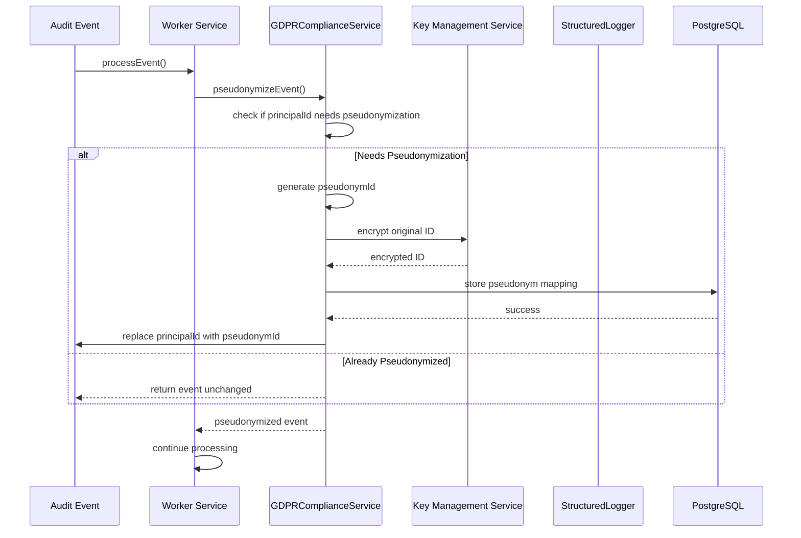

**Diagram sources**
- [index.ts](file://apps\worker\src\index.ts#L1-L799)
- [gdpr-compliance.ts](file://packages\audit\src\gdpr\gdpr-compliance.ts#L1-L818)
- [package.json](file://apps\worker\package.json)

**Section sources**
- [index.ts](file://apps\worker\src\index.ts#L1-L799)
- [gdpr-compliance.ts](file://packages\audit\src\gdpr\gdpr-compliance.ts#L1-L818)

### Bull Board Integration
The worker service now includes Bull Board integration, providing a web-based dashboard for monitoring BullMQ queues. This feature enables real-time visibility into job processing status, queue depth, and dead letter queue contents.

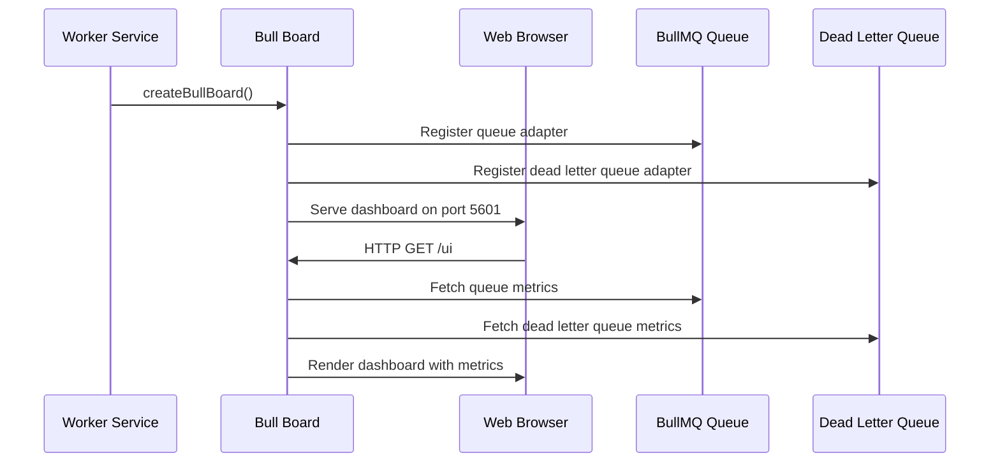

**Diagram sources**
- [index.ts](file://apps\worker\src\index.ts#L850-L900)
- [Dockerfile](file://apps\worker\Dockerfile)
- [docker-compose.yml](file://docker-compose.yml)

**Section sources**
- [index.ts](file://apps\worker\src\index.ts#L850-L900)
- [Dockerfile](file://apps\worker\Dockerfile)
- [docker-compose.yml](file://docker-compose.yml)

## Dependency Analysis
The Worker Service has a layered dependency structure:

```mermaid
graph TD
Worker[Worker Service] --> Audit[@repo/audit]
Audit --> RedisClient[@repo/redis-client]
Audit --> Drizzle[drizzle-orm]
Audit --> IORedis[ioredis]
Audit --> InfisicalKMS[@repo/infisical-kms]
Worker --> Inngest[inngest]
Worker --> Hono[hono]
Audit --> Zod[zod]
Audit --> Bcrypt[bcrypt]
Worker --> Logs[@repo/logs]
Logs --> Pino[pino]
Logs --> PinoElastic[pino-elasticsearch]
Audit --> Archival[@repo/audit/src/archival]
Archival --> Logs[@repo/logs]
Audit --> GDPR[@repo/audit/src/gdpr]
GDPR --> Logs[@repo/logs]
GDPR --> InfisicalKMS[@repo/infisical-kms]
Worker --> Sentry[@sentry/node]
Worker --> BullBoard[@bull-board/api]
BullBoard --> BullMQAdapter[@bull-board/api/bullMQAdapter]
BullBoard --> HonoAdapter[@bull-board/hono]
```

All shared packages are managed via the monorepo's `pnpm-workspace.yaml`, ensuring version consistency and efficient development.

**Diagram sources**
- [package.json](file://apps\worker\package.json)
- [package.json](file://packages\audit\package.json)
- [package.json](file://packages\logs\package.json)

**Section sources**
- [package.json](file://apps\worker\package.json)
- [package.json](file://packages\audit\package.json)
- [package.json](file://packages\logs\package.json)

## Performance Considerations
The worker is optimized for high-throughput, low-latency processing:

- **Metrics Collection**: Uses Redis atomic operations (INCR, SETEX) for thread-safe updates.
- **Pattern Detection**: Maintains in-memory event buffer with time-based eviction to limit memory usage.
- **Alert Deduplication**: Implements Redis-backed cooldown keys to prevent duplicate alerts.
- **Tracing**: Samples spans based on configurable rate to balance insight and overhead.
- **Health Checks**: Aggregates metrics asynchronously to avoid blocking event processing.
- **Cryptographic Verification**: Implements efficient hashing of critical fields only, with configurable KMS integration for enhanced security.
- **Logging**: Uses LoggerFactory and StructuredLogger for enhanced structured logging with OTLP export, replacing the previous ConsoleLogger implementation.
- **OTLP Export**: Implements batch processing with configurable batch size (default 100 spans) and timeout (5 seconds) to optimize network efficiency.
- **Archival Processing**: Uses batch processing and compression for efficient data archiving with integrity verification.
- **Secret Detection**: Implements efficient scanning of environment variables and configuration without impacting performance.
- **Redis Connection**: Implements retry logic with exponential backoff for resilient connection establishment.
- **Error Tracking**: Integrates Sentry for comprehensive error monitoring and performance insights.
- **Pseudonymization**: Implements efficient pseudonymization using hash-based strategy with caching to avoid redundant operations. The pseudonymization phase adds minimal overhead while ensuring GDPR compliance.
- **Data Retention**: Implements automated data retention policies with configurable archival and deletion schedules to manage storage costs while maintaining compliance.
- **Bull Board**: Provides real-time monitoring of queue status with minimal performance impact through efficient polling and caching mechanisms.

The system is horizontally scalable via Kubernetes, with each worker instance maintaining independent state while sharing Redis and PostgreSQL backends.

## Troubleshooting Guide
Common issues and their resolutions:

- **High Memory Usage**: Caused by unbounded span retention. Solution: Call `tracer.cleanup()` periodically.
- **Duplicate Alerts**: Cooldown keys not persisting. Verify Redis connection and TTL settings.
- **Slow Processing**: Check Redis latency and network connectivity. Optimize pattern detection thresholds.
- **Missing Metrics**: Ensure `RedisMetricsCollector` is properly initialized with a valid Redis connection.
- **Tracing Not Exporting**: Confirm `ObservabilityConfig.tracing.enabled` is true and exporter type is set to 'otlp'. Verify that `OTLP_ENDPOINT` environment variable is correctly configured.
- **Hash Verification Failures**: Verify that the `AUDIT_CRYPTO_SECRET` is properly configured and consistent across services. Check that critical event fields match between sender and receiver.
- **Logging Issues**: Ensure LoggerFactory is properly initialized with correct configuration. Verify that LOG_LEVEL environment variable is set appropriately. Check that OTLP endpoint is reachable and properly configured.
- **OTLP Authentication Failures**: Check that either `OTLP_API_KEY` or `OTLP_AUTH_HEADER` environment variables are properly configured. Verify that the authentication method matches the target OTLP endpoint requirements.
- **OTLP Export Failures**: Monitor for 429 (rate limited) responses and implement appropriate retry logic. Check network connectivity to the OTLP endpoint and verify that the endpoint URL is correct.
- **LoggerFactory Configuration Issues**: Ensure default configuration is set before creating loggers. Verify that output types (console, otpl) are correctly specified in the configuration.
- **Internal Secret Detection**: If secret detection alerts are triggered, immediately audit configuration and environment variables for sensitive information. Ensure secrets are properly managed through secure storage systems.
- **Archival Service Errors**: Verify that the database connection is stable and that the archive table schema matches the expected structure. Check that compression algorithms are supported and properly configured.
- **Redis Connection Failures**: Check Redis server availability and network connectivity. Verify Redis configuration in the S3 configuration file. Ensure Redis credentials are correct.
- **Sentry Integration Issues**: Verify that the Sentry DSN is correctly configured in the code. Check network connectivity to the Sentry server. Ensure that the release version is properly set.
- **Configuration Manager Errors**: Verify that the CONFIG_PATH environment variable points to a valid S3 location. Check S3 bucket permissions and network connectivity. Ensure the configuration file is valid JSON.
- **Pseudonymization Failures**: Check that the KMS service is available and properly configured. Verify that the PSEUDONYM_SALT environment variable is set. Ensure that the pseudonym_mapping table exists in the database.
- **GDPR Compliance Issues**: Verify that retention policies are properly configured in the audit_retention_policy table. Check that the KMS service is available for encryption/decryption operations. Ensure that the pseudonymization service has proper database permissions.
- **Bull Board Not Accessible**: Verify that port 5601 is exposed in the Dockerfile and mapped in docker-compose.yml. Check that the Bull Board server is properly initialized in the worker service. Ensure that the network configuration allows access to port 5601.
- **Bull Board Queue Metrics Missing**: Verify that the BullMQ queue adapter is properly registered with Bull Board. Check that the queue connection is established and healthy. Ensure that the queue name matches between the worker and Bull Board configuration.
- **Bull Board Authentication Issues**: If authentication is enabled, verify that the appropriate credentials are configured. Check that the authentication middleware is properly integrated with the Bull Board server.

**Section sources**
- [monitoring.ts](file://packages\audit\src\monitor\monitoring.ts#L500-L600)
- [metrics-collector.ts](file://packages\audit\src\monitor\metrics-collector.ts#L300-L350)
- [tracer.ts](file://packages\audit\src\observability\tracer.ts#L400-L426)
- [crypto.ts](file://packages\audit\src\crypto.ts#L150-L200)
- [logging.ts](file://packages\logs\src\logging.ts#L1-L620)
- [otpl.ts](file://packages\logs\src\otpl.ts#L1-L166)
- [archival-service.ts](file://packages\audit\src\archival\archival-service.ts#L1-L799)
- [postgres-archival-service.ts](file://packages\audit\src\archival\postgres-archival-service.ts#L1-L229)
- [index.ts](file://apps\worker\src\index.ts#L1-L784)
- [connection.ts](file://packages\redis-client\src\connection.ts#L48-L119)
- [gdpr-compliance.ts](file://packages\audit\src\gdpr\gdpr-compliance.ts#L1-L818)
- [index.ts](file://apps\worker\src\index.ts#L850-L900)
- [Dockerfile](file://apps\worker\Dockerfile)
- [docker-compose.yml](file://docker-compose.yml)

## Conclusion
The Worker Service is a robust, scalable background processor designed for real-time compliance and security monitoring. Its modular architecture, deep observability, and resilience patterns make it well-suited for mission-critical audit processing.

By leveraging Redis for metrics, PostgreSQL for persistent alert storage, and Inngest for orchestration, the service achieves high availability and operational transparency. The recent integration of CryptoService enhances security by providing cryptographic integrity verification of audit events, ensuring data authenticity and protection against tampering.

The observability system has been upgraded to use OTLP export instead of console export, providing better integration with modern observability platforms like Grafana Tempo, DataDog, and Honeycomb. This change enables more sophisticated monitoring, analysis, and alerting capabilities while maintaining compatibility with the existing tracing API.

The logging system has been enhanced with the LoggerFactory from `@repo/logs`, providing consistent structured logging across the service while maintaining compatibility with the observability stack. This change simplifies log management, enables OTLP export with batch processing and retry logic, and ensures consistent log formatting across all components.

The archival services have been updated to use the enhanced structured logging system, ensuring consistent logging across all data archiving operations. This change improves traceability and debugging capabilities for archival processes.

A new internal secret detection mechanism has been implemented to prevent accidental leakage of sensitive information, enhancing the overall security posture of the worker service.

The service now includes Redis connection retry logic, improving resilience during startup in environments with transient network issues. Additionally, Sentry has been integrated for comprehensive error tracking and monitoring, providing valuable insights into production issues.

The most significant recent addition is the pseudonymization phase, which implements GDPR compliance requirements for data privacy. The `GDPRComplianceService` ensures that personal data is pseudonymized while maintaining referential integrity through secure mapping storage. This feature enables the system to meet regulatory requirements while preserving the ability to perform compliance investigations when authorized.

The integration of Bull Board provides a powerful web-based interface for monitoring queue status, job processing, and dead letter queue contents. This enhancement improves operational visibility and simplifies troubleshooting of message processing issues.

Future enhancements could include ML-based anomaly detection, integration with SIEM systems, and enhanced cryptographic features such as digital signatures and certificate-based authentication. The codebase demonstrates strong separation of concerns, extensive testing, and clear extensibility points through pluggable alert handlers and metrics collectors.