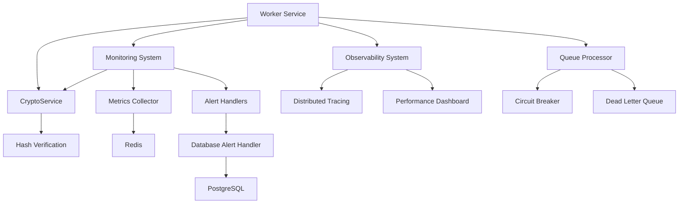
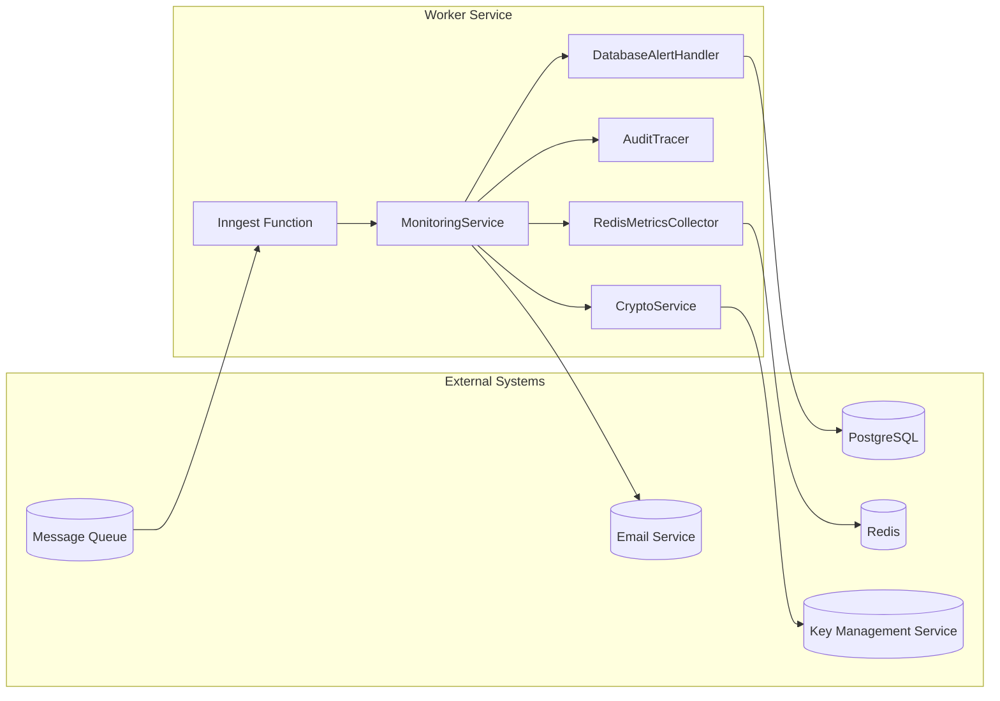

# Worker Service

<cite>
**Referenced Files in This Document**   
- [index.ts](file://apps\worker\src\index.ts) - *Updated in recent commit*
- [crypto.ts](file://packages\audit\src\crypto.ts) - *New cryptographic service implementation*
- [monitoring.ts](file://packages/audit/src/monitor/monitoring.ts)
- [monitoring-types.ts](file://packages/audit/src/monitor/monitoring-types.ts)
- [metrics-collector.ts](file://packages/audit/src/monitor/metrics-collector.ts)
- [tracer.ts](file://packages/audit/src/observability/tracer.ts)
- [types.ts](file://packages/audit/src/observability/types.ts)
- [database-alert-handler.ts](file://packages/audit/src/monitor/database-alert-handler.ts)
</cite>

## Update Summary
**Changes Made**   
- Updated initialization sequence for monitoring service and alert handlers in the Worker Service
- Corrected service instantiation order to ensure proper dependency injection
- Added explicit configuration manager initialization before other services
- Updated health check service registration to include processor-dependent checks
- Enhanced error handling during service initialization
- Integrated CryptoService for event hash verification in the processing pipeline
- Added detailed documentation for cryptographic integrity verification
- Updated architecture overview to include security verification layer
- Enhanced detailed component analysis with new CryptoService section

## Table of Contents
1. [Introduction](#introduction)
2. [Project Structure](#project-structure)
3. [Core Components](#core-components)
4. [Architecture Overview](#architecture-overview)
5. [Detailed Component Analysis](#detailed-component-analysis)
6. [Dependency Analysis](#dependency-analysis)
7. [Performance Considerations](#performance-considerations)
8. [Troubleshooting Guide](#troubleshooting-guide)
9. [Conclusion](#conclusion)

## Introduction
The **Worker Service** is a Node.js background processing service responsible for handling compliance checks, monitoring tasks, and audit event analysis in real time. It operates as a decoupled component within a larger system, consuming audit events and applying pattern detection logic to identify suspicious behavior, generate alerts, and maintain system health metrics.

Built on a modular architecture, the worker integrates with external systems including Redis for metrics storage, PostgreSQL for persistent alert data, and message queues for event ingestion. It leverages Inngest for function orchestration and is designed for deployment via Docker and Kubernetes, supporting horizontal scaling and fault-tolerant operation.

This document provides comprehensive architectural documentation, detailing component interactions, data flows, observability mechanisms, and integration patterns with the main server and data pipelines.

## Project Structure
The Worker Service resides in the `apps/worker` directory and functions as a lightweight orchestrator that imports core logic from shared packages, particularly the `@repo/audit` module. The service is structured to separate concerns across monitoring, observability, and compliance domains.

Key directories:
- `apps/worker/src`: Entry point and worker initialization
- `packages/audit/src/monitor`: Real-time monitoring, alerting, and health checks
- `packages/audit/src/observability`: Tracing, profiling, and dashboard metrics
- `packages/audit/src/queue`: Reliable message processing and circuit breaker logic
- `packages/audit/src/crypto`: Cryptographic integrity verification for audit events

The worker uses TypeScript, follows a monorepo structure managed by pnpm, and relies on shared configuration from `packages/typescript-config`.



**Diagram sources**
- [index.ts](file://apps\worker\src\index.ts)
- [monitoring.ts](file://packages/audit/src/monitor/monitoring.ts)
- [tracer.ts](file://packages/audit/src/observability/tracer.ts)
- [crypto.ts](file://packages\audit\src\crypto.ts)

**Section sources**
- [index.ts](file://apps\worker\src\index.ts)
- [monitoring.ts](file://packages/audit/src/monitor/monitoring.ts)

## Core Components
The Worker Service's functionality is driven by several core components:

- **MonitoringService**: Detects suspicious patterns in audit events and generates alerts.
- **RedisMetricsCollector**: Collects and stores real-time metrics in Redis.
- **AuditTracer**: Provides distributed tracing for observability.
- **DatabaseAlertHandler**: Persists alerts to PostgreSQL and manages alert lifecycle.
- **CryptoService**: Verifies the integrity of audit events through hash verification.

These components are orchestrated through dependency injection and support pluggable handlers for extensibility.

**Section sources**
- [monitoring.ts](file://packages/audit/src/monitor/monitoring.ts)
- [metrics-collector.ts](file://packages/audit/src/monitor/metrics-collector.ts)
- [tracer.ts](file://packages/audit/src/observability/tracer.ts)
- [crypto.ts](file://packages\audit\src\crypto.ts)

## Architecture Overview
The Worker Service follows an event-driven, microservices-inspired architecture. It consumes audit log events from a message queue (via Inngest), processes them for compliance and security monitoring, and emits alerts and metrics.

The system is designed with resilience in mind, incorporating circuit breakers, retry mechanisms, and dead-letter queues for fault tolerance. Observability is first-class, with support for distributed tracing, performance metrics, and health checks. Security is enhanced through cryptographic integrity verification of audit events.



**Diagram sources**
- [monitoring.ts](file://packages/audit/src/monitor/monitoring.ts)
- [metrics-collector.ts](file://packages/audit/src/monitor/metrics-collector.ts)
- [tracer.ts](file://packages/audit/src/observability/tracer.ts)
- [database-alert-handler.ts](file://packages/audit/src/monitor/database-alert-handler.ts)
- [crypto.ts](file://packages\audit\src\crypto.ts)

## Detailed Component Analysis

### Monitoring Service Analysis
The `MonitoringService` is the central component responsible for real-time analysis of audit events. It detects suspicious patterns such as failed authentication bursts, unauthorized access attempts, high-velocity data access, bulk operations, and off-hours activity.

It uses configurable thresholds and time windows to identify anomalies and applies deduplication via Redis-based cooldowns to prevent alert storms. The service now integrates with CryptoService to verify event integrity before processing.

```mermaid
classDiagram
class MonitoringService {
+processEvent(event : AuditLogEvent)
+detectSuspiciousPatterns(events : AuditLogEvent[])
+generateAlert(alert : Alert)
+getHealthStatus()
-detectFailedAuthPattern()
-detectUnauthorizedAccessPattern()
-detectDataVelocityPattern()
-detectBulkOperationPattern()
-detectOffHoursPattern()
}
class AlertHandler {
<<interface>>
+sendAlert(alert : Alert)
+acknowledgeAlert(id : string, by : string)
+resolveAlert(id : string, by : string)
+getActiveAlerts()
}
class MetricsCollector {
<<interface>>
+recordEvent()
+recordProcessingLatency(ms : number)
+recordError()
+getMetrics()
}
class CryptoService {
+verifyHash(event : AuditLogEvent, expectedHash : string) : boolean
+generateHash(event : AuditLogEvent) : string
}
MonitoringService --> AlertHandler : "uses"
MonitoringService --> MetricsCollector : "depends on"
MonitoringService --> CryptoService : "integrates with"
MonitoringService --> "Pattern Detection" : "composes"
```

**Diagram sources**
- [monitoring.ts](file://packages/audit/src/monitor/monitoring.ts)
- [monitoring-types.ts](file://packages/audit/src/monitor/monitoring-types.ts)
- [crypto.ts](file://packages\audit\src\crypto.ts)

**Section sources**
- [monitoring.ts](file://packages/audit/src/monitor/monitoring.ts#L1-L799)

### CryptoService Implementation
The `CryptoService` provides cryptographic integrity verification for audit events, ensuring that events have not been tampered with during transmission or storage. It implements SHA-256 hashing of critical event fields and supports both local HMAC-SHA256 signatures and integration with external Key Management Services (KMS).


**Diagram sources**
- [crypto.ts](file://packages\audit\src\crypto.ts#L72-L315)
- [index.ts](file://apps\worker\src\index.ts#L300-L350)

**Section sources**
- [crypto.ts](file://packages\audit\src\crypto.ts#L72-L315)

### Metrics Collection Flow
The metrics collection system uses Redis as a high-performance backend to track key performance indicators such as events processed, error rates, processing latency, and alert counts.

Metrics are updated in real time and exposed via a `getMetrics()` API for health checks and monitoring dashboards.


**Diagram sources**
- [monitoring.ts](file://packages/audit/src/monitor/monitoring.ts#L200-L300)
- [metrics-collector.ts](file://packages/audit/src/monitor/metrics-collector.ts#L100-L200)

### Distributed Tracing Implementation
The `AuditTracer` provides distributed tracing capabilities, enabling end-to-end visibility into audit event processing. It supports trace context propagation via HTTP headers and integrates with exporters like Jaeger, Zipkin, and OTLP.


**Diagram sources**
- [tracer.ts](file://packages/audit/src/observability/tracer.ts#L1-L426)
- [types.ts](file://packages/audit/src/observability/types.ts#L1-L303)

**Section sources**
- [tracer.ts](file://packages/audit/src/observability/tracer.ts#L1-L426)

## Dependency Analysis
The Worker Service has a layered dependency structure:

```mermaid
graph TD
Worker[Worker Service] --> Audit[@repo/audit]
Audit --> RedisClient[@repo/redis-client]
Audit --> Drizzle[drizzle-orm]
Audit --> IORedis[ioredis]
Audit --> InfisicalKMS[@repo/infisical-kms]
Worker --> Inngest[inngest]
Worker --> Hono[hono]
Audit --> Zod[zod]
Audit --> Bcrypt[bcrypt]
```

All shared packages are managed via the monorepo's `pnpm-workspace.yaml`, ensuring version consistency and efficient development.

**Diagram sources**
- [package.json](file://apps/worker/package.json)
- [package.json](file://packages/audit/package.json)

**Section sources**
- [package.json](file://apps/worker/package.json)
- [package.json](file://packages/audit/package.json)

## Performance Considerations
The worker is optimized for high-throughput, low-latency processing:

- **Metrics Collection**: Uses Redis atomic operations (INCR, SETEX) for thread-safe updates.
- **Pattern Detection**: Maintains in-memory event buffer with time-based eviction to limit memory usage.
- **Alert Deduplication**: Implements Redis-backed cooldown keys to prevent duplicate alerts.
- **Tracing**: Samples spans based on configurable rate to balance insight and overhead.
- **Health Checks**: Aggregates metrics asynchronously to avoid blocking event processing.
- **Cryptographic Verification**: Implements efficient hashing of critical fields only, with configurable KMS integration for enhanced security.

The system is horizontally scalable via Kubernetes, with each worker instance maintaining independent state while sharing Redis and PostgreSQL backends.

## Troubleshooting Guide
Common issues and their resolutions:

- **High Memory Usage**: Caused by unbounded span retention. Solution: Call `tracer.cleanup()` periodically.
- **Duplicate Alerts**: Cooldown keys not persisting. Verify Redis connection and TTL settings.
- **Slow Processing**: Check Redis latency and network connectivity. Optimize pattern detection thresholds.
- **Missing Metrics**: Ensure `RedisMetricsCollector` is properly initialized with a valid Redis connection.
- **Tracing Not Exporting**: Confirm `ObservabilityConfig.tracing.enabled` is true and exporter type is valid.
- **Hash Verification Failures**: Verify that the `AUDIT_CRYPTO_SECRET` is properly configured and consistent across services. Check that critical event fields match between sender and receiver.

**Section sources**
- [monitoring.ts](file://packages/audit/src/monitor/monitoring.ts#L500-L600)
- [metrics-collector.ts](file://packages/audit/src/monitor/metrics-collector.ts#L300-L350)
- [tracer.ts](file://packages/audit/src/observability/tracer.ts#L400-L426)
- [crypto.ts](file://packages\audit\src\crypto.ts#L150-L200)

## Conclusion
The Worker Service is a robust, scalable background processor designed for real-time compliance and security monitoring. Its modular architecture, deep observability, and resilience patterns make it well-suited for mission-critical audit processing.

By leveraging Redis for metrics, PostgreSQL for persistent alert storage, and Inngest for orchestration, the service achieves high availability and operational transparency. The recent integration of CryptoService enhances security by providing cryptographic integrity verification of audit events, ensuring data authenticity and protection against tampering.

Future enhancements could include ML-based anomaly detection, integration with SIEM systems, and enhanced cryptographic features such as digital signatures and certificate-based authentication. The codebase demonstrates strong separation of concerns, extensive testing, and clear extensibility points through pluggable alert handlers and metrics collectors.