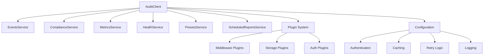

# Audit Client Library Overview

The `@smedrec/audit-client` is a powerful, type-safe client library that provides a comprehensive interface to the Smart Logs audit system. Built with TypeScript and designed for modern applications, it offers enterprise-grade features for healthcare and compliance-focused environments.

## Key Features

### 🔒 **Security & Compliance**
- **Cryptographic Integrity**: Built-in SHA-256 hashing and HMAC signatures
- **HIPAA/GDPR Ready**: Compliance validation and data handling
- **Secure Authentication**: Support for API keys, bearer tokens, and session tokens
- **Data Classification**: Automatic handling of PHI and sensitive data

### 🚀 **Performance & Reliability**
- **Intelligent Caching**: Configurable in-memory and persistent caching
- **Automatic Retries**: Exponential backoff with circuit breaker patterns
- **Batch Processing**: Efficient bulk operations for high-throughput scenarios
- **Connection Pooling**: Optimized HTTP client with keep-alive connections

### 🛠️ **Developer Experience**
- **Type Safety**: Full TypeScript support with comprehensive type definitions
- **Plugin Architecture**: Extensible middleware system for custom functionality
- **Framework Integration**: Ready-to-use integrations for popular frameworks
- **Rich APIs**: Intuitive service-based architecture with comprehensive documentation

### 📊 **Observability**
- **Request Logging**: Detailed request/response logging with configurable levels
- **Metrics Collection**: Built-in performance and usage metrics
- **Health Monitoring**: Comprehensive health checks and status reporting
- **Distributed Tracing**: Correlation ID support for distributed systems

## Architecture

The client is built around a service-oriented architecture:



## Core Services

### EventsService
- Create, query, and manage audit events
- Bulk operations for high-volume scenarios
- Real-time streaming and subscription support
- Cryptographic verification and integrity checking

### ComplianceService  
- Generate HIPAA and GDPR compliance reports
- Export data for Data Subject Access Requests (DSAR)
- Compliance validation and data classification

### MetricsService
- System performance metrics and monitoring
- Alert management and acknowledgment
- Custom metric collection and reporting

### HealthService
- System health checks and status monitoring
- Component-level health reporting
- Dependency status validation

### PresetsService
- Audit event templates and presets
- Event validation against predefined schemas
- Template management and versioning

### ScheduledReportsService
- Automated report generation and delivery
- Schedule management with cron expressions
- Report history and execution tracking

## Quick Start

Get started with the audit client in just a few lines:

```typescript
import { AuditClient } from '@smedrec/audit-client'

// Initialize the client
const client = new AuditClient({
  baseUrl: 'https://api.smartlogs.com',
  authentication: {
    type: 'apiKey',
    apiKey: 'your-api-key'
  }
})

// Create an audit event
const event = await client.events.create({
  action: 'user.login',
  principalId: 'user-123',
  organizationId: 'org-456',
  status: 'success',
  targetResourceType: 'User',
  targetResourceId: 'user-123'
})

console.log('Event created:', event.id)
```

## Use Cases

### Healthcare Applications
- **Patient Data Access**: Log and monitor access to electronic health records
- **FHIR Resource Auditing**: Track changes to healthcare data standards
- **PHI Data Handling**: Secure logging of protected health information access

### Compliance & Security
- **Regulatory Compliance**: HIPAA and GDPR audit trail generation
- **Security Monitoring**: Detect and log suspicious activities
- **Access Control**: Monitor user permissions and authorization events

### System Integration
- **API Auditing**: Log API calls and data exchanges
- **Microservices Monitoring**: Track inter-service communications
- **Data Pipeline Auditing**: Monitor data processing and transformations

## Next Steps

- **[Quick Start Guide](/audit-client/quick-start/)**: Get up and running in minutes
- **[Configuration](/audit-client/configuration/)**: Learn about advanced configuration options
- **[API Reference](/audit-client/api/)**: Explore all available methods and types
- **[Plugin Architecture](/audit-client/plugins/)**: Extend functionality with custom plugins
- **[Framework Integration](/audit-client/frameworks/)**: Integrate with your favorite frameworks