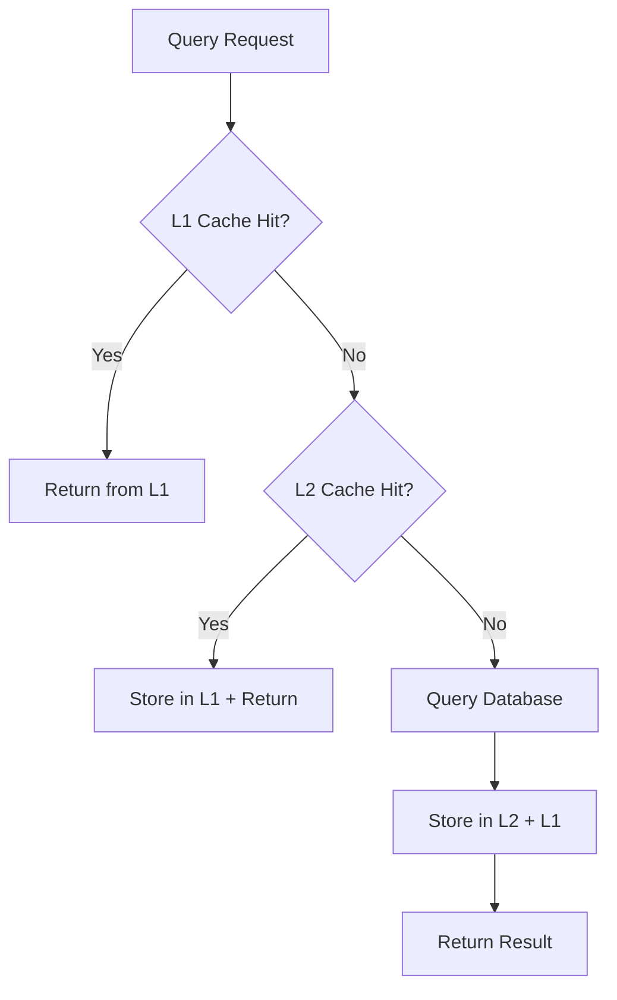

# Caching Strategies

Learn how to implement advanced Redis-based distributed caching for optimal audit database performance in healthcare environments.

## 🏗️ Cache Architecture Overview

### L1/L2 Cache Strategy

```typescript
import { EnhancedAuditDb } from '@repo/audit-db'

const auditDb = new EnhancedAuditDb({
  // L1 Cache (Local Memory)
  queryCache: {
    enabled: true,
    maxSizeMB: 100,
    defaultTTL: 300,
    maxQueries: 1000
  },
  // L2 Cache (Redis Distributed)
  redis: {
    redisKeyPrefix: 'audit_cache',
    enableLocalCache: true,
    localCacheSizeMB: 50,
    enableCompression: true,
    serializationFormat: 'msgpack'
  }
})
```

### Cache Hierarchy



## 🚀 Smart Cache Management

### Intelligent Cache Warming

```typescript
class IntelligentCacheWarmer {
  private client: EnhancedAuditDb
  private warmupQueries: Map<string, WarmupStrategy>
  
  constructor() {
    this.client = new EnhancedAuditDb(cacheConfig)
    this.setupWarmupStrategies()
  }
  
  private setupWarmupStrategies() {
    this.warmupQueries = new Map([
      ['dashboard_metrics', {
        query: 'SELECT COUNT(*) as total, COUNT(*) FILTER (WHERE status = $1) as successful FROM audit_log WHERE timestamp >= $2',
        params: ['success', () => new Date(Date.now() - 24 * 60 * 60 * 1000).toISOString()],
        ttl: 300,
        priority: 'high',
        schedule: '*/5 * * * *' // Every 5 minutes
      }],
      ['user_activity_summary', {
        query: 'SELECT principal_id, COUNT(*) as event_count, MAX(timestamp) as last_activity FROM audit_log WHERE timestamp >= $1 GROUP BY principal_id ORDER BY event_count DESC LIMIT 100',
        params: [() => new Date(Date.now() - 7 * 24 * 60 * 60 * 1000).toISOString()],
        ttl: 900,
        priority: 'medium',
        schedule: '0 */1 * * *' // Every hour
      }],
      ['compliance_metrics', {
        query: 'SELECT action, COUNT(*) as count FROM audit_log WHERE action LIKE $1 AND timestamp >= $2 GROUP BY action',
        params: ['patient.%', () => new Date(Date.now() - 30 * 24 * 60 * 60 * 1000).toISOString()],
        ttl: 3600,
        priority: 'low',
        schedule: '0 0 * * *' // Daily
      }]
    ])
  }
  
  async warmupCache() {
    console.log('Starting intelligent cache warmup...')
    
    const warmupPromises = Array.from(this.warmupQueries.entries()).map(
      async ([key, strategy]) => {
        try {
          const params = strategy.params.map(p => 
            typeof p === 'function' ? p() : p
          )
          
          await this.client.query(strategy.query, params, {
            cacheKey: key,
            ttl: strategy.ttl
          })
          
          console.log(`✅ Warmed up cache for ${key}`)
        } catch (error) {
          console.error(`❌ Failed to warm up cache for ${key}:`, error)
        }
      }
    )
    
    await Promise.allSettled(warmupPromises)
    console.log('Cache warmup completed')
  }
  
  async scheduleWarmup() {
    // Schedule warmup based on strategy schedules
    this.warmupQueries.forEach((strategy, key) => {
      setInterval(async () => {
        const params = strategy.params.map(p => 
          typeof p === 'function' ? p() : p
        )
        
        await this.client.query(strategy.query, params, {
          cacheKey: key,
          ttl: strategy.ttl
        })
      }, this.parseScheduleToMs(strategy.schedule))
    })
  }
  
  private parseScheduleToMs(schedule: string): number {
    // Simple cron-like parsing for demo
    if (schedule === '*/5 * * * *') return 5 * 60 * 1000 // 5 minutes
    if (schedule === '0 */1 * * *') return 60 * 60 * 1000 // 1 hour
    if (schedule === '0 0 * * *') return 24 * 60 * 60 * 1000 // 24 hours
    return 60 * 60 * 1000 // Default 1 hour
  }
}
```

### Cache Invalidation Strategies

```typescript
class SmartCacheInvalidator {
  private client: EnhancedAuditDb
  private invalidationRules: Map<string, InvalidationRule>
  
  constructor() {
    this.client = new EnhancedAuditDb(cacheConfig)
    this.setupInvalidationRules()
  }
  
  private setupInvalidationRules() {
    this.invalidationRules = new Map([
      ['user_events_*', {
        triggers: ['audit_log_insert', 'audit_log_update'],
        condition: (event: any) => event.table === 'audit_log',
        invalidatePattern: (event: any) => `user_events_${event.principal_id}*`
      }],
      ['dashboard_metrics', {
        triggers: ['audit_log_insert'],
        condition: (event: any) => event.table === 'audit_log',
        invalidatePattern: () => 'dashboard_metrics*'
      }],
      ['compliance_metrics', {
        triggers: ['audit_log_insert'],
        condition: (event: any) => event.action?.startsWith('patient.'),
        invalidatePattern: () => 'compliance_metrics*'
      }]
    ])
  }
  
  async invalidateOnEvent(event: DatabaseEvent) {
    const invalidationPromises = Array.from(this.invalidationRules.entries())
      .filter(([_, rule]) => 
        rule.triggers.includes(event.type) && rule.condition(event)
      )
      .map(async ([_, rule]) => {
        const pattern = rule.invalidatePattern(event)
        await this.client.clearCache(pattern)
        console.log(`Invalidated cache pattern: ${pattern}`)
      })
    
    await Promise.all(invalidationPromises)
  }
  
  async setupDatabaseTriggers() {
    // Set up database triggers to notify cache invalidation
    await this.client.query(`
      CREATE OR REPLACE FUNCTION notify_cache_invalidation()
      RETURNS TRIGGER AS $$
      BEGIN
        PERFORM pg_notify('cache_invalidation', json_build_object(
          'type', TG_OP,
          'table', TG_TABLE_NAME,
          'principal_id', COALESCE(NEW.principal_id, OLD.principal_id),
          'action', COALESCE(NEW.action, OLD.action),
          'timestamp', NOW()
        )::text);
        RETURN CASE WHEN TG_OP = 'DELETE' THEN OLD ELSE NEW END;
      END;
      $$ LANGUAGE plpgsql;
    `)
    
    await this.client.query(`
      DROP TRIGGER IF EXISTS audit_log_cache_invalidation ON audit_log;
      CREATE TRIGGER audit_log_cache_invalidation
        AFTER INSERT OR UPDATE OR DELETE ON audit_log
        FOR EACH ROW EXECUTE FUNCTION notify_cache_invalidation();
    `)
  }
}
```

## 🔄 Advanced Cache Patterns

### Read-Through Cache Pattern

```typescript
class ReadThroughCache {
  private client: EnhancedAuditDb
  
  constructor() {
    this.client = new EnhancedAuditDb(cacheConfig)
  }
  
  async getUserEvents(userId: string, options: CacheOptions = {}) {
    const cacheKey = `user_events_${userId}`
    
    // Try cache first
    let result = await this.client.getFromCache(cacheKey)
    
    if (!result) {
      // Cache miss - fetch from database
      result = await this.client.query(
        'SELECT * FROM audit_log WHERE principal_id = $1 ORDER BY timestamp DESC LIMIT 50',
        [userId]
      )
      
      // Store in cache
      await this.client.setCache(cacheKey, result, {
        ttl: options.ttl || 300,
        compress: options.compress || true
      })
    }
    
    return result
  }
  
  async getEventsByDateRange(startDate: Date, endDate: Date) {
    const cacheKey = `events_range_${startDate.toISOString()}_${endDate.toISOString()}`
    
    return await this.client.query(
      'SELECT * FROM audit_log WHERE timestamp BETWEEN $1 AND $2 ORDER BY timestamp DESC',
      [startDate.toISOString(), endDate.toISOString()],
      {
        cacheKey,
        ttl: 600, // 10 minutes for date range queries
        refreshCache: false
      }
    )
  }
}
```

### Write-Through Cache Pattern

```typescript
class WriteThroughCache {
  private client: EnhancedAuditDb
  private writeCache: Map<string, any[]> = new Map()
  
  constructor() {
    this.client = new EnhancedAuditDb(cacheConfig)
  }
  
  async createAuditEvent(event: AuditEvent) {
    // Write to database first
    const [createdEvent] = await this.client.query(
      'INSERT INTO audit_log (...) VALUES (...) RETURNING *',
      [event.data],
      { skipCache: true } // Don't cache writes
    )
    
    // Update relevant caches
    await this.updateCachesAfterWrite(createdEvent)
    
    return createdEvent
  }
  
  private async updateCachesAfterWrite(event: any) {
    // Update user events cache
    const userCacheKey = `user_events_${event.principal_id}`
    const userEvents = await this.client.getFromCache(userCacheKey)
    
    if (userEvents) {
      userEvents.unshift(event)
      if (userEvents.length > 50) userEvents.pop()
      
      await this.client.setCache(userCacheKey, userEvents, { ttl: 300 })
    }
    
    // Invalidate aggregate caches
    await this.client.clearCache('dashboard_metrics*')
    await this.client.clearCache('compliance_metrics*')
  }
}
```

### Cache-Aside Pattern

```typescript
class CacheAsidePattern {
  private client: EnhancedAuditDb
  
  constructor() {
    this.client = new EnhancedAuditDb(cacheConfig)
  }
  
  async getAggregatedMetrics(timeRange: string) {
    const cacheKey = `metrics_${timeRange}`
    
    // Check cache first
    let metrics = await this.client.getFromCache(cacheKey)
    
    if (!metrics) {
      // Compute metrics from database
      metrics = await this.computeMetrics(timeRange)
      
      // Store in cache
      await this.client.setCache(cacheKey, metrics, {
        ttl: this.getTTLForTimeRange(timeRange),
        compress: true
      })
    }
    
    return metrics
  }
  
  private async computeMetrics(timeRange: string) {
    const [startDate, endDate] = this.parseTimeRange(timeRange)
    
    const [
      totalEvents,
      successfulEvents,
      uniqueUsers,
      topActions
    ] = await Promise.all([
      this.client.query(
        'SELECT COUNT(*) as count FROM audit_log WHERE timestamp BETWEEN $1 AND $2',
        [startDate, endDate]
      ),
      this.client.query(
        'SELECT COUNT(*) as count FROM audit_log WHERE timestamp BETWEEN $1 AND $2 AND status = $3',
        [startDate, endDate, 'success']
      ),
      this.client.query(
        'SELECT COUNT(DISTINCT principal_id) as count FROM audit_log WHERE timestamp BETWEEN $1 AND $2',
        [startDate, endDate]
      ),
      this.client.query(
        'SELECT action, COUNT(*) as count FROM audit_log WHERE timestamp BETWEEN $1 AND $2 GROUP BY action ORDER BY count DESC LIMIT 10',
        [startDate, endDate]
      )
    ])
    
    return {
      totalEvents: totalEvents[0].count,
      successfulEvents: successfulEvents[0].count,
      successRate: (successfulEvents[0].count / totalEvents[0].count) * 100,
      uniqueUsers: uniqueUsers[0].count,
      topActions: topActions
    }
  }
  
  private parseTimeRange(timeRange: string): [string, string] {
    const now = new Date()
    let startDate: Date
    
    switch (timeRange) {
      case '1h':
        startDate = new Date(now.getTime() - 60 * 60 * 1000)
        break
      case '24h':
        startDate = new Date(now.getTime() - 24 * 60 * 60 * 1000)
        break
      case '7d':
        startDate = new Date(now.getTime() - 7 * 24 * 60 * 60 * 1000)
        break
      default:
        startDate = new Date(now.getTime() - 24 * 60 * 60 * 1000)
    }
    
    return [startDate.toISOString(), now.toISOString()]
  }
  
  private getTTLForTimeRange(timeRange: string): number {
    switch (timeRange) {
      case '1h': return 60 // 1 minute
      case '24h': return 300 // 5 minutes
      case '7d': return 900 // 15 minutes
      default: return 300
    }
  }
}
```

## 📊 Cache Performance Monitoring

### Cache Analytics Dashboard

```typescript
class CacheAnalytics {
  private client: EnhancedAuditDb
  
  constructor() {
    this.client = new EnhancedAuditDb(cacheConfig)
  }
  
  async getCachePerformanceReport() {
    const stats = await this.client.getCacheStats()
    const metrics = await this.client.getPerformanceMetrics()
    
    return {
      overview: {
        hitRate: stats.hitRate,
        missRate: stats.missRate,
        evictionRate: stats.evictionRate,
        memoryUtilization: stats.memoryUsage.percentage
      },
      topQueries: stats.topQueries.map(q => ({
        key: q.key,
        hits: q.hits,
        lastAccessed: q.lastAccessed,
        efficiency: this.calculateEfficiency(q)
      })),
      recommendations: this.generateCacheRecommendations(stats),
      trends: await this.getCacheTrends()
    }
  }
  
  private calculateEfficiency(query: any): number {
    const ageInHours = (Date.now() - query.lastAccessed.getTime()) / (1000 * 60 * 60)
    const hitsPerHour = query.hits / Math.max(ageInHours, 1)
    return Math.round(hitsPerHour * 100) / 100
  }
  
  private generateCacheRecommendations(stats: any) {
    const recommendations = []
    
    if (stats.hitRate < 75) {
      recommendations.push({
        type: 'hit_rate',
        priority: 'high',
        message: 'Cache hit rate is below 75%. Consider increasing TTL for frequently accessed data.',
        action: 'increase_ttl'
      })
    }
    
    if (stats.memoryUsage.percentage > 90) {
      recommendations.push({
        type: 'memory',
        priority: 'critical',
        message: 'Cache memory usage is above 90%. Consider increasing cache size or reducing TTL.',
        action: 'increase_memory_or_reduce_ttl'
      })
    }
    
    if (stats.evictionRate > 10) {
      recommendations.push({
        type: 'eviction',
        priority: 'medium',
        message: 'High eviction rate detected. Consider optimizing cache size or query patterns.',
        action: 'optimize_cache_size'
      })
    }
    
    return recommendations
  }
  
  private async getCacheTrends() {
    // Get cache performance trends over time
    const trends = await this.client.query(`
      SELECT 
        DATE_TRUNC('hour', timestamp) as hour,
        AVG(CASE WHEN action = 'cache.hit' THEN 1.0 ELSE 0.0 END) as hit_rate,
        COUNT(*) as total_operations
      FROM audit_log 
      WHERE action IN ('cache.hit', 'cache.miss') 
        AND timestamp >= NOW() - INTERVAL '24 hours'
      GROUP BY DATE_TRUNC('hour', timestamp)
      ORDER BY hour
    `)
    
    return trends
  }
}
```

### Real-time Cache Monitoring

```typescript
class RealTimeCacheMonitor {
  private client: EnhancedAuditDb
  private metrics: CacheMetrics = {
    hits: 0,
    misses: 0,
    evictions: 0,
    totalMemory: 0,
    usedMemory: 0
  }
  
  constructor() {
    this.client = new EnhancedAuditDb(cacheConfig)
    this.startMonitoring()
  }
  
  private startMonitoring() {
    // Monitor cache performance every 30 seconds
    setInterval(async () => {
      await this.collectMetrics()
      await this.checkAlerts()
    }, 30000)
  }
  
  private async collectMetrics() {
    const stats = await this.client.getCacheStats()
    
    this.metrics = {
      hits: stats.hits,
      misses: stats.misses,
      evictions: stats.evictions,
      totalMemory: stats.memoryUsage.total,
      usedMemory: stats.memoryUsage.used,
      hitRate: stats.hitRate,
      timestamp: new Date()
    }
    
    // Log metrics for historical analysis
    await this.client.query(
      `INSERT INTO audit_log (timestamp, action, status, principal_id, metadata) 
       VALUES ($1, $2, $3, $4, $5)`,
      [
        new Date().toISOString(),
        'cache.metrics.collect',
        'success',
        'cache_monitor',
        JSON.stringify(this.metrics)
      ]
    )
  }
  
  private async checkAlerts() {
    const alerts = []
    
    // Check hit rate
    if (this.metrics.hitRate < 70) {
      alerts.push({
        type: 'low_hit_rate',
        severity: 'warning',
        message: `Cache hit rate (${this.metrics.hitRate}%) is below 70%`,
        value: this.metrics.hitRate,
        threshold: 70
      })
    }
    
    // Check memory usage
    const memoryUsagePercent = (this.metrics.usedMemory / this.metrics.totalMemory) * 100
    if (memoryUsagePercent > 85) {
      alerts.push({
        type: 'high_memory_usage',
        severity: 'critical',
        message: `Cache memory usage (${memoryUsagePercent.toFixed(2)}%) is above 85%`,
        value: memoryUsagePercent,
        threshold: 85
      })
    }
    
    // Send alerts if any
    for (const alert of alerts) {
      await this.sendAlert(alert)
    }
  }
  
  private async sendAlert(alert: any) {
    await this.client.query(
      `INSERT INTO audit_log (timestamp, action, status, principal_id, metadata) 
       VALUES ($1, $2, $3, $4, $5)`,
      [
        new Date().toISOString(),
        'cache.alert.triggered',
        'warning',
        'cache_monitor',
        JSON.stringify(alert)
      ]
    )
    
    console.warn('Cache Alert:', alert)
  }
  
  getCurrentMetrics(): CacheMetrics {
    return { ...this.metrics }
  }
}
```

## 🛠️ Cache Configuration Tuning

### Environment-Specific Cache Settings

```typescript
const cacheConfigurations = {
  development: {
    queryCache: {
      enabled: true,
      maxSizeMB: 50,
      defaultTTL: 60,
      maxQueries: 100
    },
    redis: {
      enableLocalCache: false,
      enableCompression: false,
      serializationFormat: 'json'
    }
  },
  
  staging: {
    queryCache: {
      enabled: true,
      maxSizeMB: 200,
      defaultTTL: 300,
      maxQueries: 1000
    },
    redis: {
      enableLocalCache: true,
      localCacheSizeMB: 50,
      enableCompression: true,
      serializationFormat: 'msgpack'
    }
  },
  
  production: {
    queryCache: {
      enabled: true,
      maxSizeMB: 1000,
      defaultTTL: 900,
      maxQueries: 10000
    },
    redis: {
      enableLocalCache: true,
      localCacheSizeMB: 200,
      enableCompression: true,
      compressionLevel: 6,
      serializationFormat: 'msgpack'
    }
  }
}

function getCacheConfig(environment: string) {
  return cacheConfigurations[environment] || cacheConfigurations.development
}
```

### Dynamic Cache Tuning

```typescript
class DynamicCacheTuner {
  private client: EnhancedAuditDb
  private config: CacheConfig
  
  constructor(initialConfig: CacheConfig) {
    this.config = initialConfig
    this.client = new EnhancedAuditDb({ queryCache: this.config })
    this.startAutoTuning()
  }
  
  private startAutoTuning() {
    setInterval(async () => {
      await this.analyzeCachePerformance()
      await this.adjustCacheSettings()
    }, 300000) // Every 5 minutes
  }
  
  private async analyzeCachePerformance() {
    const stats = await this.client.getCacheStats()
    const metrics = await this.client.getPerformanceMetrics()
    
    // Analyze hit rates
    if (stats.hitRate < 60 && this.config.defaultTTL < 3600) {
      this.config.defaultTTL = Math.min(this.config.defaultTTL * 1.2, 3600)
      console.log(`Increased cache TTL to ${this.config.defaultTTL}s due to low hit rate`)
    }
    
    // Analyze memory usage
    if (stats.memoryUsage.percentage > 90) {
      this.config.maxSizeMB = Math.min(this.config.maxSizeMB * 1.1, 2000)
      console.log(`Increased cache size to ${this.config.maxSizeMB}MB due to high memory usage`)
    }
    
    // Analyze eviction rate
    if (stats.evictionRate > 15) {
      this.config.maxQueries = Math.min(this.config.maxQueries * 1.1, 50000)
      console.log(`Increased max queries to ${this.config.maxQueries} due to high eviction rate`)
    }
  }
  
  private async adjustCacheSettings() {
    await this.client.updateCacheConfig(this.config)
  }
}
```

## 🎯 Best Practices Summary

### 1. Cache Key Design

```typescript
// ✅ Good: Hierarchical, descriptive keys
const cacheKey = `user:${userId}:events:${timeRange}:${status}`

// ❌ Bad: Unclear, non-hierarchical keys
const cacheKey = `data_${userId}_${timeRange}`

// ✅ Good: Consistent naming pattern
const getCacheKey = (type: string, id: string, params?: any) => {
  const baseKey = `audit:${type}:${id}`
  return params ? `${baseKey}:${hashParams(params)}` : baseKey
}
```

### 2. TTL Strategy

```typescript
const ttlStrategy = {
  // Real-time data
  liveMetrics: 30,
  
  // Frequently changing data
  userActivity: 300,
  
  // Moderate change frequency
  dashboardMetrics: 900,
  
  // Infrequently changing data
  complianceReports: 3600,
  
  // Static reference data
  systemConfig: 86400
}
```

### 3. Cache Warming Priority

```typescript
const warmupPriority = {
  critical: ['dashboard_metrics', 'system_health'],
  high: ['user_activity_summary', 'recent_events'],
  medium: ['compliance_metrics', 'performance_stats'],
  low: ['historical_reports', 'archived_data']
}
```

## 📖 Next Steps

Continue optimizing your caching strategy:

- **[Database Partitioning](./partitioning-guide)** - Optimize data storage and retrieval
- **[Performance Optimization](./performance-optimization)** - Overall system performance
- **[Security](./security)** - Secure caching practices
- **[Monitoring](./monitoring)** - Cache monitoring and alerting

## 🎯 Summary

You've learned how to:

- ✅ Implement L1/L2 cache architecture
- ✅ Design intelligent cache warming strategies  
- ✅ Set up smart cache invalidation
- ✅ Use advanced cache patterns (read-through, write-through, cache-aside)
- ✅ Monitor cache performance in real-time
- ✅ Implement dynamic cache tuning
- ✅ Apply caching best practices for healthcare applications

These caching strategies will significantly improve your audit system's response times while maintaining data consistency and compliance requirements.