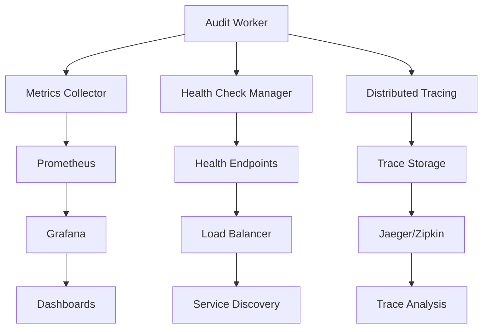

# Monitoring and Compliance Tutorial

This tutorial covers comprehensive monitoring setup, alerting configuration, and compliance features for the Smart Logs Audit Worker including Prometheus, Grafana, HIPAA, and GDPR compliance.

## Table of Contents

1. [Monitoring Architecture](#monitoring-architecture)
2. [Prometheus Integration](#prometheus-integration)
3. [Grafana Dashboard Setup](#grafana-dashboard-setup)
4. [Alerting Configuration](#alerting-configuration)
5. [Log Management](#log-management)
6. [HIPAA Compliance](#hipaa-compliance)
7. [GDPR Compliance](#gdpr-compliance)
8. [Audit Trail Management](#audit-trail-management)
9. [Security Monitoring](#security-monitoring)
10. [Performance Monitoring](#performance-monitoring)

## Monitoring Architecture

The audit worker provides enterprise-grade monitoring capabilities through multiple layers:

### Built-in Observability Stack

```typescript
// Core monitoring components
interface MonitoringStack {
  healthChecks: HealthCheckManager;     // Component health monitoring
  metrics: MetricsCollector;            // Performance and business metrics
  tracing: DistributedTracing;          // Request tracing and debugging
  alerting: AlertManager;               // Intelligent alerting system
  dashboard: ObservabilityDashboard;    // Real-time system overview
}
```

### Monitoring Data Flow



## Prometheus Integration

### Configuration Setup

Add Prometheus scraping configuration to your `prometheus.yml`:

```yaml
global:
  scrape_interval: 15s
  evaluation_interval: 15s

rule_files:
  - "audit_worker_rules.yml"

scrape_configs:
  - job_name: 'audit-worker'
    static_configs:
      - targets: ['worker-host-1:3001', 'worker-host-2:3001']
    metrics_path: '/observability/metrics/enhanced'
    params:
      format: ['prometheus']
    scrape_interval: 10s
    scrape_timeout: 8s
    honor_labels: true
    
  - job_name: 'audit-worker-health'
    static_configs:
      - targets: ['worker-host-1:3001', 'worker-host-2:3001']
    metrics_path: '/healthz'
    scrape_interval: 30s
    
  - job_name: 'audit-worker-detailed'
    static_configs:
      - targets: ['worker-host-1:3001']
    metrics_path: '/observability/metrics/detailed'
    scrape_interval: 60s

alerting:
  alertmanagers:
    - static_configs:
        - targets:
          - alertmanager:9093
```

### Worker Configuration for Prometheus

Update your worker configuration to enable detailed metrics:

```json
{
  "monitoring": {
    "enabled": true,
    "detailedMetrics": true,
    "prometheus": {
      "enabled": true,
      "path": "/observability/metrics/enhanced",
      "labels": {
        "service": "audit-worker",
        "environment": "production",
        "version": "2.1.0"
      }
    },
    "metricsCollection": {
      "interval": 10000,
      "aggregationWindow": 60000,
      "retentionDays": 30
    }
  }
}
```

### Available Metrics

The worker exposes comprehensive metrics:

#### System Metrics
```
# System performance
audit_worker_cpu_usage_percent
audit_worker_memory_usage_percent
audit_worker_memory_usage_bytes
audit_worker_disk_usage_percent
audit_worker_uptime_seconds

# Network
audit_worker_network_connections_total
audit_worker_network_bytes_sent_total
audit_worker_network_bytes_received_total
```

#### Application Metrics
```
# Event processing
audit_worker_events_processed_total
audit_worker_events_failed_total
audit_worker_events_processing_duration_seconds
audit_worker_events_queue_depth

# Database operations
audit_worker_db_queries_total
audit_worker_db_query_duration_seconds
audit_worker_db_connections_active
audit_worker_db_connections_idle

# Redis operations
audit_worker_redis_commands_total
audit_worker_redis_command_duration_seconds
audit_worker_redis_connections_active

# Circuit breaker
audit_worker_circuit_breaker_state
audit_worker_circuit_breaker_failures_total
audit_worker_circuit_breaker_successes_total
```

#### Business Metrics
```
# Compliance and audit
audit_worker_compliance_events_total
audit_worker_audit_trails_created_total
audit_worker_encryption_operations_total
audit_worker_key_rotations_total

# Alert generation
audit_worker_alerts_generated_total
audit_worker_alerts_by_severity
audit_worker_alert_resolution_time_seconds
```

### Custom Alerting Rules

Create `audit_worker_rules.yml`:

```yaml
groups:
- name: audit_worker_alerts
  interval: 30s
  rules:
  
  # High-level availability alerts
  - alert: AuditWorkerDown
    expr: up{job="audit-worker"} == 0
    for: 1m
    labels:
      severity: critical
      service: audit-worker
    annotations:
      summary: "Audit worker instance is down"
      description: "Audit worker on {{ $labels.instance }} has been down for more than 1 minute"
      
  # Performance alerts  
  - alert: HighEventProcessingLatency
    expr: audit_worker_events_processing_duration_seconds{quantile="0.95"} > 5
    for: 5m
    labels:
      severity: warning
      service: audit-worker
    annotations:
      summary: "High event processing latency detected"
      description: "95th percentile processing latency is {{ $value }}s on {{ $labels.instance }}"
      
  - alert: EventProcessingErrors
    expr: rate(audit_worker_events_failed_total[5m]) > 0.05
    for: 2m
    labels:
      severity: critical
      service: audit-worker
    annotations:
      summary: "High event processing error rate"
      description: "Event processing error rate is {{ $value | humanizePercentage }} on {{ $labels.instance }}"
      
  # Resource alerts
  - alert: HighMemoryUsage
    expr: audit_worker_memory_usage_percent > 85
    for: 10m
    labels:
      severity: warning
      service: audit-worker
    annotations:
      summary: "High memory usage detected"
      description: "Memory usage is {{ $value }}% on {{ $labels.instance }}"
      
  - alert: DatabaseConnectionPoolExhaustion
    expr: audit_worker_db_connections_active / (audit_worker_db_connections_active + audit_worker_db_connections_idle) > 0.90
    for: 5m
    labels:
      severity: critical
      service: audit-worker
    annotations:
      summary: "Database connection pool near exhaustion"
      description: "{{ $value | humanizePercentage }} of database connections are in use on {{ $labels.instance }}"
      
  # Queue depth alerts
  - alert: HighQueueDepth
    expr: audit_worker_events_queue_depth > 10000
    for: 5m
    labels:
      severity: warning
      service: audit-worker
    annotations:
      summary: "High queue depth detected"
      description: "Queue depth is {{ $value }} events on {{ $labels.instance }}"
      
  # Circuit breaker alerts
  - alert: CircuitBreakerOpen
    expr: audit_worker_circuit_breaker_state == 1
    for: 1m
    labels:
      severity: critical
      service: audit-worker
    annotations:
      summary: "Circuit breaker is open"
      description: "Circuit breaker is open on {{ $labels.instance }}, processing is halted"

  # Compliance alerts
  - alert: ComplianceAuditFailure
    expr: increase(audit_worker_compliance_events_total{type="failure"}[1h]) > 5
    for: 0m
    labels:
      severity: critical
      service: audit-worker
      compliance: "true"
    annotations:
      summary: "Multiple compliance audit failures detected"
      description: "{{ $value }} compliance audit failures in the last hour on {{ $labels.instance }}"
```

## Grafana Dashboard Setup

### Dashboard Configuration

Create a comprehensive Grafana dashboard for the audit worker:

```json
{
  "dashboard": {
    "id": null,
    "title": "Smart Logs Audit Worker - Production",
    "tags": ["audit", "worker", "compliance"],
    "timezone": "UTC",
    "refresh": "10s",
    "time": {
      "from": "now-1h",
      "to": "now"
    },
    "panels": [
      {
        "id": 1,
        "title": "System Overview",
        "type": "stat",
        "targets": [
          {
            "expr": "up{job=\"audit-worker\"}",
            "legendFormat": "Instances Up"
          },
          {
            "expr": "sum(rate(audit_worker_events_processed_total[5m]))",
            "legendFormat": "Events/sec"
          }
        ],
        "fieldConfig": {
          "defaults": {
            "color": {
              "mode": "thresholds"
            },
            "thresholds": {
              "steps": [
                {"color": "red", "value": 0},
                {"color": "yellow", "value": 0.8},
                {"color": "green", "value": 1}
              ]
            }
          }
        }
      },
      {
        "id": 2,
        "title": "Event Processing Rate",
        "type": "graph",
        "targets": [
          {
            "expr": "sum(rate(audit_worker_events_processed_total[1m])) by (instance)",
            "legendFormat": "{{instance}} - Success"
          },
          {
            "expr": "sum(rate(audit_worker_events_failed_total[1m])) by (instance)",
            "legendFormat": "{{instance}} - Failed"
          }
        ],
        "yAxes": [
          {
            "label": "Events per second",
            "min": 0
          }
        ]
      }
    ]
  }
}
```

### Key Dashboard Panels

#### 1. System Health Overview
- **Service Status**: Up/down status of all worker instances
- **Response Time**: 95th percentile response times
- **Error Rate**: Percentage of failed operations
- **Throughput**: Events processed per second

#### 2. Performance Monitoring
- **Processing Latency**: Event processing time distribution
- **Queue Depth**: Backlog of events waiting processing  
- **Memory Usage**: Heap and system memory consumption
- **CPU Usage**: System CPU utilization

#### 3. Database Monitoring
- **Connection Pool**: Active vs idle connections
- **Query Performance**: Database query response times
- **Slow Queries**: Queries exceeding threshold
- **Transaction Rate**: Database transactions per second

#### 4. Compliance Dashboard
- **Audit Events**: Count and types of compliance events
- **Encryption Operations**: Key rotations and encryption stats
- **Access Violations**: Unauthorized access attempts
- **Data Retention**: Compliance with retention policies

### Dashboard Import

Save the dashboard as `audit-worker-dashboard.json` and import:

```bash
# Import dashboard via API
curl -X POST \
  http://grafana:3000/api/dashboards/db \
  -H 'Content-Type: application/json' \
  -H 'Authorization: Bearer YOUR_API_KEY' \
  -d @audit-worker-dashboard.json

# Or import through UI:
# Grafana UI -> Dashboards -> Import -> Upload JSON file
```

## Alerting Configuration

### AlertManager Configuration

Configure `alertmanager.yml`:

```yaml
global:
  smtp_smarthost: 'smtp.company.com:587'
  smtp_from: 'alerts@company.com'
  
route:
  group_by: ['alertname', 'service']
  group_wait: 30s
  group_interval: 5m
  repeat_interval: 4h
  receiver: 'audit-team'
  routes:
    - match:
        severity: critical
      receiver: 'critical-alerts'
      continue: true
    - match:
        compliance: "true"
      receiver: 'compliance-team'
      continue: true

receivers:
  - name: 'audit-team'
    email_configs:
      - to: 'audit-team@company.com'
        subject: '[AUDIT] {{ .GroupLabels.service }}: {{ .GroupLabels.alertname }}'
        body: |
          {{ range .Alerts }}
          Alert: {{ .Annotations.summary }}
          Description: {{ .Annotations.description }}
          {{ end }}
          
  - name: 'critical-alerts'
    slack_configs:
      - api_url: 'https://hooks.slack.com/services/YOUR/SLACK/WEBHOOK'
        channel: '#critical-alerts'
        title: 'Critical Alert: {{ .GroupLabels.alertname }}'
        text: '{{ range .Alerts }}{{ .Annotations.description }}{{ end }}'
    pagerduty_configs:
      - service_key: 'YOUR_PAGERDUTY_SERVICE_KEY'
        description: '{{ .GroupLabels.service }}: {{ .GroupLabels.alertname }}'
        
  - name: 'compliance-team'
    email_configs:
      - to: 'compliance@company.com'
        subject: '[COMPLIANCE] Audit Worker Alert: {{ .GroupLabels.alertname }}'
        body: |
          COMPLIANCE ALERT
          
          {{ range .Alerts }}
          Alert: {{ .Annotations.summary }}
          Description: {{ .Annotations.description }}
          Instance: {{ .Labels.instance }}
          Time: {{ .StartsAt }}
          {{ end }}
```

### Smart Alerting Features

Enable intelligent alerting in worker configuration:

```json
{
  "monitoring": {
    "alerting": {
      "enabled": true,
      "smartAlerting": {
        "enabled": true,
        "cooldownMinutes": 15,
        "escalationLevels": 3,
        "suppressionRules": [
          {
            "name": "maintenance-window",
            "cron": "0 2 * * *",
            "durationMinutes": 120
          }
        ]
      },
      "channels": [
        {
          "name": "slack",
          "webhook": "${SLACK_WEBHOOK_URL}",
          "severity": ["warning", "critical"]
        },
        {
          "name": "pagerduty",
          "serviceKey": "${PAGERDUTY_SERVICE_KEY}",
          "severity": ["critical"]
        }
      ]
    }
  }
}
```

## Log Management

### Structured Logging Configuration

Configure structured logging for compliance and monitoring:

```json
{
  "logging": {
    "level": "info",
    "format": "json",
    "destination": "stdout",
    "structuredLogging": true,
    "correlationId": true,
    "compliance": {
      "auditLogging": true,
      "piiRedaction": true,
      "retentionDays": 2555,  // 7 years for compliance
      "encryption": true
    },
    "fields": {
      "timestamp": "ISO8601",
      "level": "string",
      "message": "string",
      "service": "audit-worker",
      "version": "2.1.0",
      "correlationId": "uuid",
      "userId": "string",
      "action": "string",
      "resource": "string",
      "result": "string",
      "metadata": "object"
    }
  }
}
```

### ELK Stack Integration

Configure Filebeat for log shipping:

```yaml
# filebeat.yml
filebeat.inputs:
- type: container
  paths:
    - '/var/lib/docker/containers/*/*.log'
  processors:
    - add_docker_metadata:
        host: "unix:///var/run/docker.sock"
  multiline.pattern: '^\d{4}-\d{2}-\d{2}'
  multiline.negate: true
  multiline.match: after

output.elasticsearch:
  hosts: ["elasticsearch:9200"]
  index: "audit-worker-logs-%{+yyyy.MM.dd}"

setup.template.settings:
  index.number_of_shards: 3
  index.number_of_replicas: 1

processors:
  - decode_json_fields:
      fields: ["message"]
      target: ""
      overwrite_keys: true
```

### Log Analysis Queries

Common Elasticsearch/Kibana queries for audit logs:

```json
{
  "compliance_events": {
    "query": {
      "bool": {
        "must": [
          {"term": {"service": "audit-worker"}},
          {"term": {"action": "compliance_check"}},
          {"range": {"timestamp": {"gte": "now-1h"}}}
        ]
      }
    }
  },
  
  "failed_authentications": {
    "query": {
      "bool": {
        "must": [
          {"term": {"service": "audit-worker"}},
          {"term": {"result": "failure"}},
          {"wildcard": {"action": "*auth*"}}
        ]
      }
    }
  },
  
  "data_access_patterns": {
    "query": {
      "bool": {
        "must": [
          {"term": {"service": "audit-worker"}},
          {"exists": {"field": "userId"}},
          {"exists": {"field": "resource"}}
        ]
      }
    },
    "aggs": {
      "users": {
        "terms": {"field": "userId"},
        "aggs": {
          "resources": {
            "terms": {"field": "resource"}
          }
        }
      }
    }
  }
}
```

## HIPAA Compliance

### Configuration for HIPAA

Enable HIPAA-specific features:

```json
{
  "compliance": {
    "hipaa": {
      "enabled": true,
      "baaCompliant": true,
      "auditLogging": {
        "enabled": true,
        "detailedAuditing": true,
        "retentionYears": 6,
        "immutableLogs": true
      },
      "encryption": {
        "atRest": true,
        "inTransit": true,
        "keyManagement": "aws-kms",
        "algorithm": "aes-256-gcm"
      },
      "accessControls": {
        "minimumAccess": true,
        "roleBasedAccess": true,
        "sessionTimeouts": true,
        "automaticLogoff": true
      },
      "dataIntegrity": {
        "checksums": true,
        "digitalSignatures": true,
        "tamperDetection": true
      }
    }
  }
}
```

### HIPAA Audit Requirements

The worker automatically generates HIPAA-compliant audit logs:

```typescript
// Example HIPAA audit log entry
{
  "timestamp": "2024-01-15T10:30:00.000Z",
  "event_type": "data_access",
  "user_id": "user_12345",
  "patient_id": "patient_67890", // Encrypted
  "action": "view_medical_record",
  "resource": "/api/patients/67890/records",
  "result": "success",
  "ip_address": "10.0.1.100",
  "user_agent": "Mozilla/5.0...",
  "session_id": "sess_abc123",
  "location": "workstation_05",
  "data_elements_accessed": ["diagnosis", "medications"],
  "authorization_basis": "treatment",
  "hipaa_compliance": {
    "phi_accessed": true,
    "minimum_necessary": true,
    "patient_consent": true,
    "audit_logged": true
  }
}
```

### HIPAA Monitoring Alerts

Configure HIPAA-specific monitoring:

```yaml
# HIPAA compliance alerts
- alert: UnauthorizedPHIAccess
  expr: increase(audit_worker_compliance_events_total{type="unauthorized_phi_access"}[1h]) > 0
  for: 0m
  labels:
    severity: critical
    compliance: hipaa
  annotations:
    summary: "Unauthorized PHI access detected"
    description: "Unauthorized access to PHI detected on {{ $labels.instance }}"
    
- alert: AuditLogTampering
  expr: increase(audit_worker_compliance_events_total{type="audit_log_integrity_violation"}[1h]) > 0
  for: 0m
  labels:
    severity: critical
    compliance: hipaa
  annotations:
    summary: "Potential audit log tampering detected"
    description: "Audit log integrity violation detected on {{ $labels.instance }}"
```

## GDPR Compliance

### GDPR Configuration

Enable GDPR compliance features:

```json
{
  "compliance": {
    "gdpr": {
      "enabled": true,
      "lawfulBasis": "consent",
      "dataProcessing": {
        "purposes": ["audit", "compliance", "security"],
        "retentionPolicy": {
          "defaultDays": 1095,  // 3 years
          "personalDataDays": 730,  // 2 years
          "auditLogsDays": 2555   // 7 years
        }
      },
      "dataSubjectRights": {
        "rightToAccess": true,
        "rightToRectification": true,
        "rightToErasure": true,
        "rightToPortability": true,
        "rightToRestriction": true
      },
      "privacy": {
        "pseudonymization": true,
        "encryption": true,
        "accessControls": true,
        "dataMinimization": true
      },
      "breachNotification": {
        "enabled": true,
        "timeoutHours": 72,
        "supervisoryAuthority": "data-protection@company.com",
        "dataSubjects": true
      }
    }
  }
}
```

### Data Subject Rights Implementation

The worker provides APIs for GDPR data subject rights:

```typescript
// Data Subject Access Request (DSAR) endpoint
GET /compliance/gdpr/data-subject/{id}
Response: {
  "personal_data": [...],
  "processing_activities": [...],
  "retention_periods": {...},
  "lawful_basis": "consent"
}

// Right to Erasure ("Right to be Forgotten")
DELETE /compliance/gdpr/data-subject/{id}
Response: {
  "status": "completed",
  "data_erased": [...],
  "retention_exceptions": [...],
  "completion_time": "2024-01-15T10:30:00.000Z"
}

// Data Portability
GET /compliance/gdpr/data-export/{id}
Response: {
  "format": "json",
  "data": {...},
  "created_at": "2024-01-15T10:30:00.000Z"
}
```

### GDPR Monitoring

```yaml
# GDPR compliance monitoring
- alert: DataRetentionViolation
  expr: audit_worker_gdpr_retention_violations_total > 0
  for: 0m
  labels:
    severity: critical
    compliance: gdpr
  annotations:
    summary: "Data retention policy violation"
    description: "Data retained beyond GDPR limits detected"

- alert: UnprocessedDataSubjectRequest
  expr: audit_worker_gdpr_requests_pending > 0 and audit_worker_gdpr_requests_age_hours > 720  # 30 days
  for: 1h
  labels:
    severity: warning
    compliance: gdpr
  annotations:
    summary: "Unprocessed data subject request"
    description: "GDPR data subject request pending for over 30 days"
```

## Audit Trail Management

### Comprehensive Audit Logging

The worker maintains detailed audit trails for all operations:

```typescript
interface AuditTrail {
  id: string;
  timestamp: Date;
  event_type: string;
  actor: {
    user_id: string;
    role: string;
    ip_address: string;
    user_agent: string;
  };
  target: {
    resource_type: string;
    resource_id: string;
    resource_name: string;
  };
  action: string;
  result: 'success' | 'failure' | 'partial';
  details: {
    changes?: any;
    reason?: string;
    metadata?: any;
  };
  compliance: {
    hipaa?: boolean;
    gdpr?: boolean;
    sox?: boolean;
  };
  integrity: {
    checksum: string;
    signature: string;
  };
}
```

### Audit Trail Analysis

Built-in audit trail analysis endpoints:

```bash
# Audit trail queries
curl "http://worker:3001/audit/trails?user_id=user123&start_date=2024-01-01&end_date=2024-01-31"

# Compliance reports
curl "http://worker:3001/audit/compliance/hipaa?report_type=access_report&date_range=last_30_days"

# Suspicious activity detection
curl "http://worker:3001/audit/security/anomalies?threshold=high&time_window=24h"

# Data lineage tracking
curl "http://worker:3001/audit/data-lineage/patient123?include_transformations=true"
```

## Security Monitoring

### Security Event Detection

Configure security monitoring:

```json
{
  "security": {
    "monitoring": {
      "enabled": true,
      "threatDetection": {
        "enabled": true,
        "algorithms": ["statistical", "machine_learning", "rule_based"],
        "sensitivity": "high"
      },
      "anomalyDetection": {
        "enabled": true,
        "baselineWindow": "7d",
        "alertThreshold": 2.5,
        "learningPeriod": "14d"
      },
      "patterns": [
        {
          "name": "brute_force_login",
          "condition": "failed_logins > 5 within 5m from same IP",
          "action": "block_ip",
          "severity": "high"
        },
        {
          "name": "unusual_access_pattern",
          "condition": "access outside business hours AND new location",
          "action": "alert",
          "severity": "medium"
        }
      ]
    }
  }
}
```

### Security Alerts

```yaml
# Security monitoring alerts
- alert: SuspiciousLoginActivity
  expr: increase(audit_worker_security_events_total{type="suspicious_login"}[15m]) > 3
  for: 0m
  labels:
    severity: critical
    category: security
  annotations:
    summary: "Suspicious login activity detected"
    description: "Multiple suspicious login attempts detected"

- alert: DataExfiltrationAttempt
  expr: audit_worker_data_transfer_bytes > 1000000000  # 1GB
  for: 5m
  labels:
    severity: critical
    category: security
  annotations:
    summary: "Potential data exfiltration detected"
    description: "Unusually large data transfer detected"

- alert: PrivilegeEscalation
  expr: increase(audit_worker_security_events_total{type="privilege_escalation"}[1h]) > 0
  for: 0m
  labels:
    severity: critical
    category: security
  annotations:
    summary: "Privilege escalation attempt detected"
    description: "Unauthorized privilege escalation attempt"
```

## Performance Monitoring

### Performance Metrics Collection

Enable detailed performance monitoring:

```json
{
  "monitoring": {
    "performance": {
      "enabled": true,
      "profiling": {
        "enabled": true,
        "cpu": true,
        "memory": true,
        "io": true
      },
      "tracing": {
        "enabled": true,
        "samplingRate": 0.1,
        "jaeger": {
          "endpoint": "jaeger-collector:14268"
        }
      },
      "benchmarking": {
        "enabled": true,
        "interval": "1h",
        "scenarios": ["peak_load", "normal_load", "error_conditions"]
      }
    }
  }
}
```

### Performance Dashboards

Key performance indicators to monitor:

1. **Throughput Metrics**
   - Events processed per second
   - Peak processing rates
   - Sustained processing capacity

2. **Latency Metrics**  
   - Event processing time (p50, p95, p99)
   - Database query latency
   - Queue wait times

3. **Resource Utilization**
   - CPU usage patterns
   - Memory allocation and GC pressure
   - I/O wait times and disk usage

4. **Bottleneck Analysis**
   - Database connection pool utilization
   - Redis command queuing
   - Network bandwidth usage

### Automated Performance Analysis

```bash
# Generate performance report
curl "http://worker:3001/observability/performance-report?timeframe=24h" > performance-report.json

# Bottleneck analysis
curl "http://worker:3001/observability/bottlenecks" | jq '.bottlenecks[] | select(.severity > 0.7)'

# Resource optimization recommendations
curl "http://worker:3001/observability/optimization-recommendations"
```

---

## Next Steps

- **[Performance Tuning Guide](performance.md)** - Detailed optimization techniques  
- **[Troubleshooting Guide](../troubleshooting.md)** - Common issues and solutions
- **[Configuration Tutorial](configuration.md)** - Advanced configuration options

For monitoring templates and example configurations, see the `monitoring-templates/` directory in the repository.