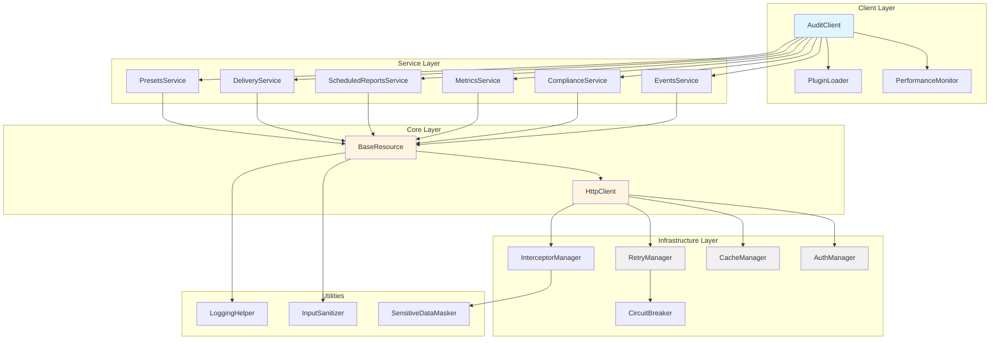
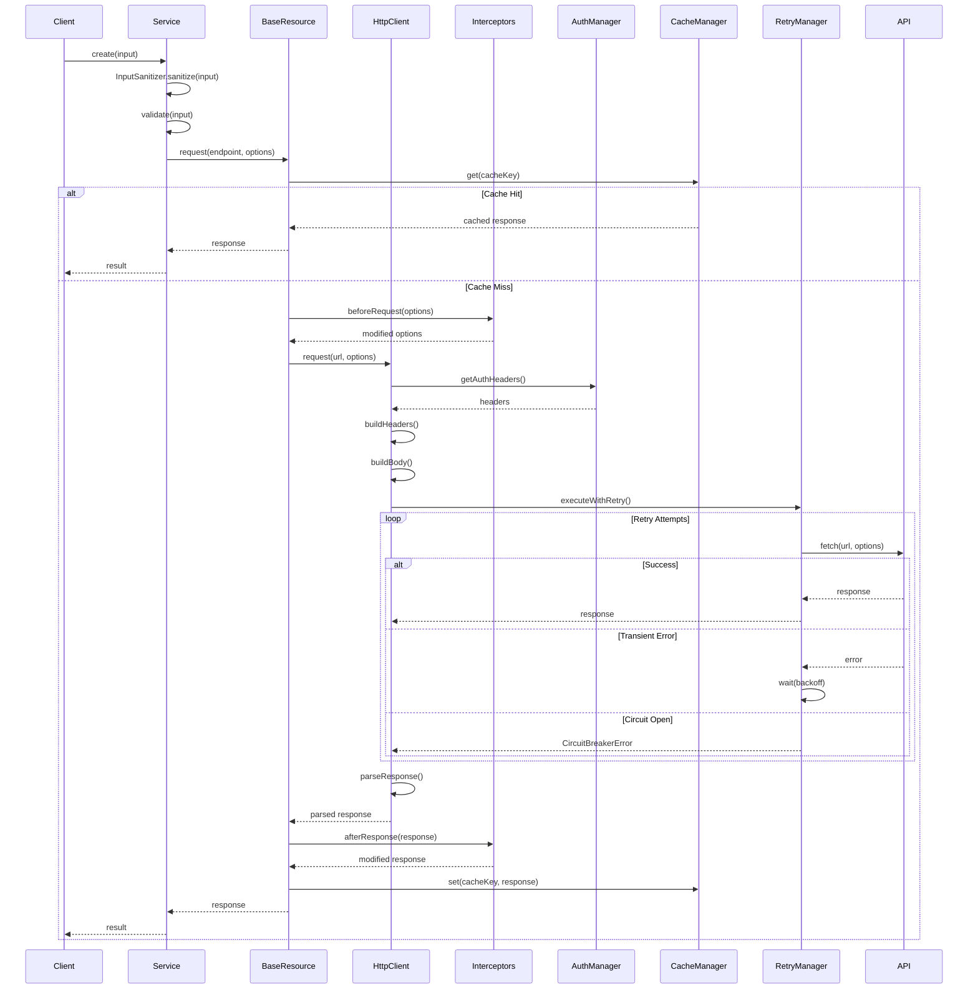
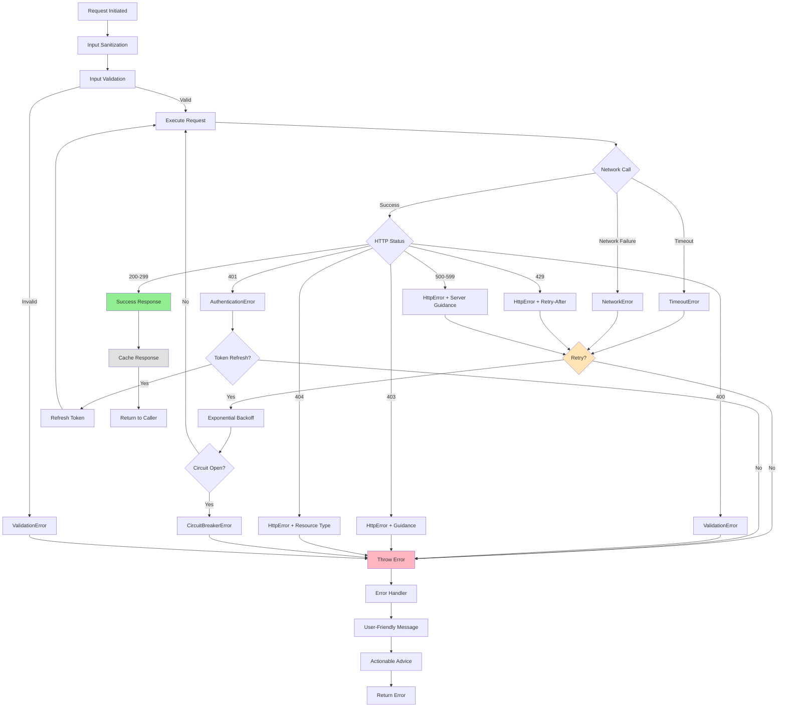
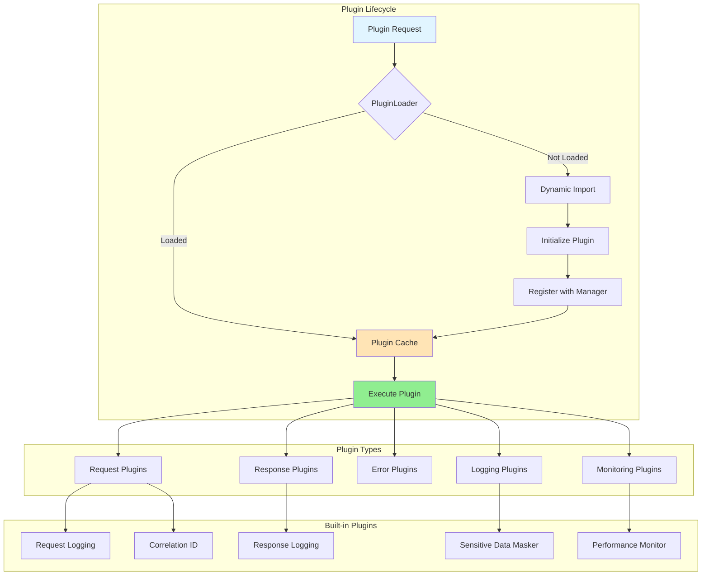
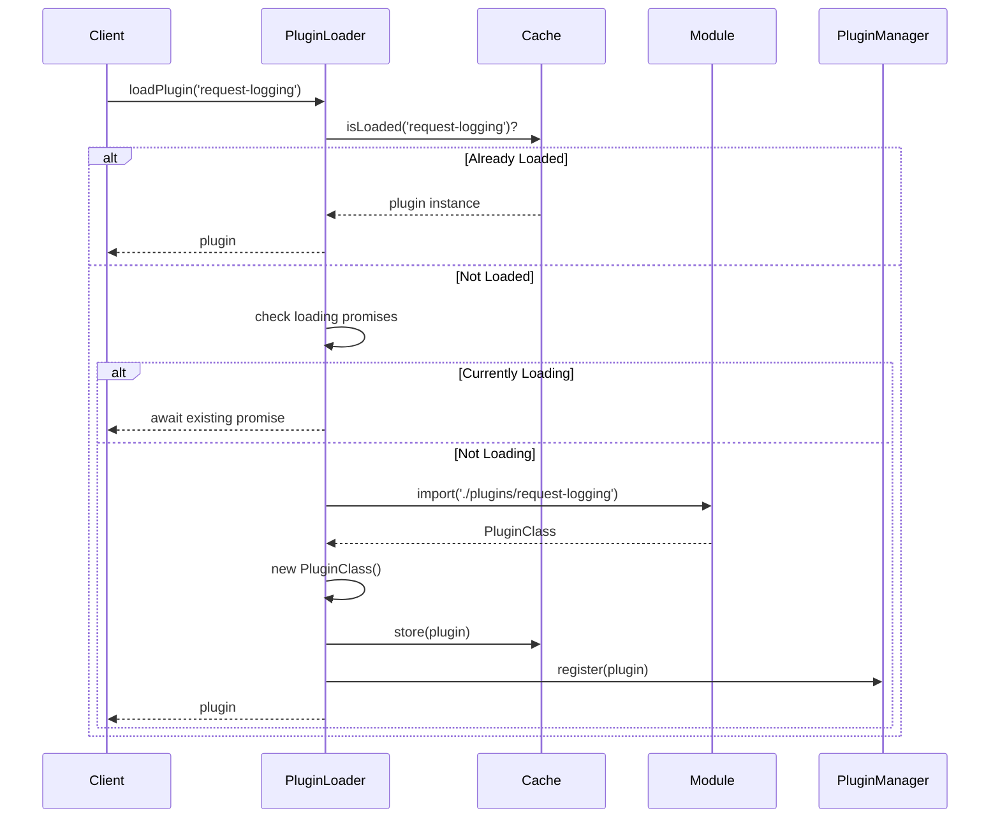
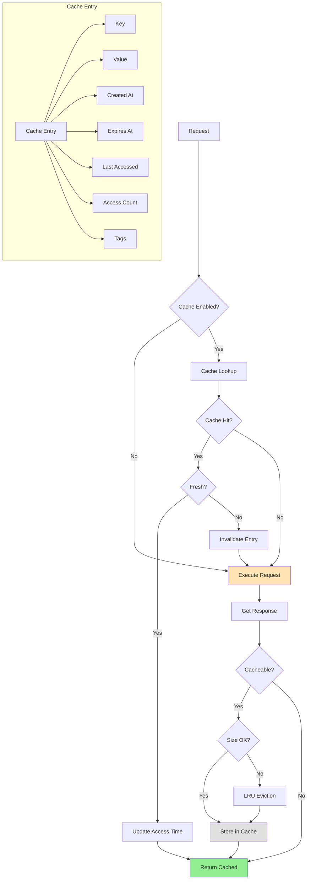
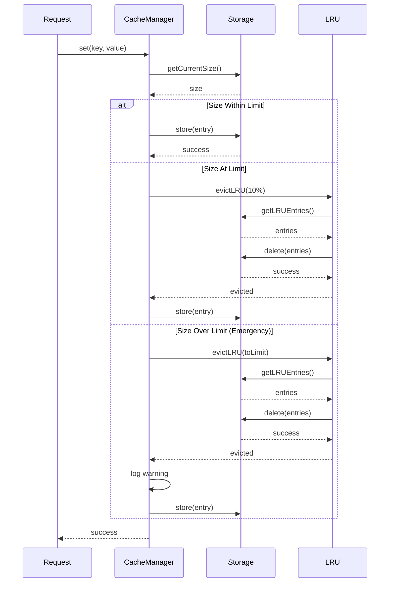

# Architecture Documentation

This document provides a comprehensive overview of the `@smedrec/audit-client` architecture, including system design, request flows, error handling, plugin system, and caching strategies.

## Table of Contents

- [System Architecture](#system-architecture)
- [Request Flow](#request-flow)
- [Error Handling Flow](#error-handling-flow)
- [Plugin System](#plugin-system)
- [Cache Strategy](#cache-strategy)

## System Architecture

The audit client follows a layered architecture with clear separation of concerns:



### Component Responsibilities

#### Client Layer

- **AuditClient**: Main entry point, orchestrates services, manages lifecycle
- **PerformanceMonitor**: Tracks metrics and enforces performance budgets
- **PluginLoader**: Lazy loads plugins on-demand

#### Service Layer

- **EventsService**: Manages audit events (CRUD, streaming, subscriptions)
- **ComplianceService**: Handles compliance reports and validation
- **MetricsService**: Provides analytics and metrics
- **ScheduledReportsService**: Manages scheduled report generation
- **DeliveryService**: Handles report delivery mechanisms
- **PresetsService**: Manages configuration presets

#### Core Layer

- **BaseResource**: Base class for all services, provides common functionality
- **HttpClient**: Handles all HTTP operations (requests, responses, headers)

#### Infrastructure Layer

- **AuthManager**: Manages authentication (API keys, tokens, cookies)
- **CacheManager**: Implements caching with LRU eviction
- **RetryManager**: Handles retry logic with exponential backoff
- **CircuitBreaker**: Prevents cascading failures
- **InterceptorManager**: Manages request/response interceptors

#### Utilities

- **InputSanitizer**: Sanitizes user input to prevent injection attacks
- **LoggingHelper**: Centralizes logging patterns
- **SensitiveDataMasker**: Masks sensitive data in logs

## Request Flow

This diagram shows the complete lifecycle of an API request:



### Request Flow Steps

1. **Input Sanitization**: Remove potentially malicious content
2. **Validation**: Ensure input meets schema requirements
3. **Cache Check**: Look for cached response
4. **Request Interceptors**: Modify request before sending
5. **Authentication**: Add auth headers
6. **Retry Logic**: Handle transient failures with backoff
7. **Response Parsing**: Parse response based on content type
8. **Response Interceptors**: Modify response after receiving
9. **Cache Storage**: Store successful responses
10. **Return Result**: Return to caller

## Error Handling Flow

This diagram illustrates how errors are handled and recovered:



### Error Recovery Strategies

1. **Token Refresh**: Automatically refresh expired authentication tokens
2. **Cache Invalidation**: Clear cache on 401/403 errors
3. **Exponential Backoff**: Wait progressively longer between retries
4. **Circuit Breaker**: Stop requests when failure rate is high
5. **User Guidance**: Provide actionable error messages

### Error Types

- **ValidationError**: Input validation failed
- **AuthenticationError**: Authentication failed (401)
- **HttpError**: HTTP error with status code and guidance
- **TimeoutError**: Request exceeded timeout
- **NetworkError**: Network connectivity issue
- **CircuitBreakerError**: Circuit breaker is open

## Plugin System

The plugin system enables extensibility through lazy-loaded modules:



### Plugin Loading Strategy



### Plugin Benefits

1. **Lazy Loading**: Plugins loaded only when needed
2. **Code Splitting**: Reduces initial bundle size
3. **Extensibility**: Easy to add custom plugins
4. **Isolation**: Plugins don't affect each other
5. **Performance**: Faster initialization

## Cache Strategy

The caching system uses LRU (Least Recently Used) eviction with size limits:



### Cache Eviction Strategy



### Cache Features

1. **LRU Eviction**: Removes least recently used entries
2. **Size Limits**: Enforces maximum cache size
3. **TTL Support**: Entries expire after configured time
4. **Tag-based Invalidation**: Invalidate related entries
5. **Compression**: Compress large entries
6. **Access Tracking**: Track access patterns for optimization

### Cache Configuration

```typescript
{
  enabled: true,
  ttl: 300000,              // 5 minutes
  maxSize: 100,             // 100 entries
  compression: true,        // Compress large entries
  compressionThreshold: 1024 // 1KB
}
```

### Cache Metrics

- **Hit Rate**: Percentage of requests served from cache
- **Miss Rate**: Percentage of requests requiring API calls
- **Eviction Rate**: Frequency of cache evictions
- **Average Entry Size**: Memory usage per entry
- **Access Patterns**: Most/least accessed entries

## Performance Considerations

### Bundle Size Optimization

- **Lazy Loading**: Plugins loaded on-demand
- **Tree Shaking**: Unused code eliminated
- **Code Splitting**: Features split into chunks
- **Compression**: Gzip/Brotli compression

### Memory Management

- **Cache Size Limits**: Prevent unbounded growth
- **Event Handler Cleanup**: Remove listeners on disconnect
- **Weak References**: Use WeakMap for temporary data
- **Garbage Collection**: Explicit cleanup in destroy()

### Request Optimization

- **Request Deduplication**: Prevent duplicate concurrent requests
- **Connection Pooling**: Reuse HTTP connections
- **Compression**: Compress request/response bodies
- **Batching**: Combine multiple requests

## Security Considerations

### Input Sanitization

- Remove HTML tags and scripts
- Validate URL protocols
- Remove event handlers
- Escape special characters

### Sensitive Data Protection

- Mask sensitive fields in logs
- Secure token storage
- HTTPS enforcement
- CORS configuration

### Timeout Protection

- Request timeouts prevent DoS
- Circuit breaker prevents cascading failures
- Rate limiting on client side
- Resource cleanup on timeout

## Monitoring and Observability

### Performance Metrics

- Request duration (p50, p95, p99)
- Error rates by type
- Cache hit/miss rates
- Memory usage
- Bundle size

### Logging

- Structured logging with correlation IDs
- Log levels (debug, info, warn, error)
- Sensitive data masking
- Request/response logging

### Tracing

- Request ID propagation
- Correlation ID tracking
- Distributed tracing support
- Performance profiling

## Future Enhancements

### Planned Features

1. **Request Batching**: Combine multiple requests
2. **GraphQL Support**: Native GraphQL client
3. **WebSocket Support**: Real-time bidirectional communication
4. **Offline Support**: Queue requests when offline
5. **Service Worker Integration**: Background sync

### Experimental Features

1. **HTTP/3 Support**: QUIC protocol
2. **Edge Caching**: CDN integration
3. **Predictive Prefetching**: ML-based prefetching
4. **Adaptive Retry**: ML-based retry strategies

## References

- [API Reference](./API_REFERENCE.md)
- [Getting Started Guide](./GETTING_STARTED.md)
- [Performance Optimization](./PERFORMANCE_OPTIMIZATION.md)
- [Plugin Architecture](./PLUGIN_ARCHITECTURE.md)
- [Troubleshooting](./TROUBLESHOOTING_AND_FAQ.md)
