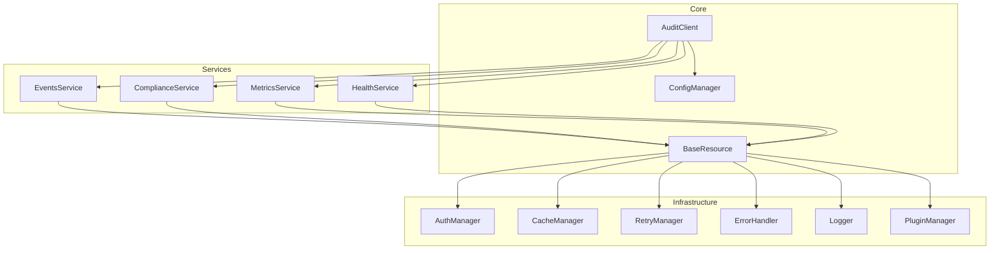
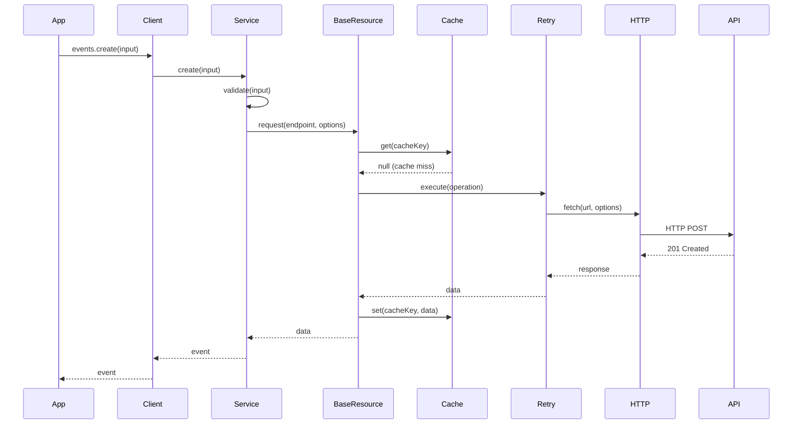

# Code Improvement Recommendations

## @smedrec/audit-client Package

**Generated:** November 14, 2025  
**Priority:** High to Low  
**Estimated Effort:** Detailed per recommendation

---

## Table of Contents

1. [Critical Issues](#1-critical-issues)
2. [High Priority Improvements](#2-high-priority-improvements)
3. [Medium Priority Improvements](#3-medium-priority-improvements)
4. [Low Priority Improvements](#4-low-priority-improvements)
5. [Code Refactoring Opportunities](#5-code-refactoring-opportunities)
6. [Performance Optimizations](#6-performance-optimizations)
7. [Testing Improvements](#7-testing-improvements)
8. [Documentation Enhancements](#8-documentation-enhancements)

---

## 1. Critical Issues

### 1.1 Memory Leak in Event Subscriptions

**Priority:** 🔴 Critical  
**Effort:** 2-4 hours  
**Impact:** High - Can cause memory exhaustion in long-running applications

**Issue:**
Event handlers in `EventSubscriptionImpl` are not properly cleaned up when disconnecting.

**Current Code:**

```typescript
// src/services/events.ts
disconnect(): void {
  if (this.managedConnection) {
    this.managedConnection.disconnect()
    this.managedConnection = null
  }
  this.isConnected = false
  this.emit('disconnect')
  // ❌ Event handlers not cleared!
}
```

**Recommended Fix:**

```typescript
disconnect(): void {
  // Clean up managed connection
  if (this.managedConnection) {
    this.managedConnection.disconnect()
    this.managedConnection = null
  }

  // Clear all event handlers
  this.eventHandlers.forEach(handlers => handlers.clear())
  this.eventHandlers.clear()

  this.isConnected = false
  this.emit('disconnect')
}
```

### 1.2 Unbounded Cache Growth

**Priority:** 🔴 Critical  
**Effort:** 4-6 hours  
**Impact:** High - Can lead to memory exhaustion

**Issue:**
Cache can grow indefinitely if cleanup interval fails or is disabled.

**Current Code:**

```typescript
// src/infrastructure/cache.ts
async set<T>(key: string, value: T, ttlMs?: number, tags?: string[]): Promise<void> {
  // ... no size check before adding
  await this.storage.set(prefixedKey, JSON.stringify(entry))
  // ❌ No enforcement of maxSize
}
```

**Recommended Fix:**

```typescript
async set<T>(key: string, value: T, ttlMs?: number, tags?: string[]): Promise<void> {
  if (!this.config.enabled) return

  // Check size limit before adding
  const currentSize = await this.storage.size()
  if (currentSize >= this.config.maxSize && !await this.storage.get(this.prefixKey(key))) {
    // Evict LRU entries until we have space
    await this.evictLRU(1)
  }

  // ... rest of the method
}

private async evictLRU(count: number = 1): Promise<void> {
  const keys = await this.storage.keys()
  const entries: Array<{ key: string; lastAccessed: number }> = []

  for (const key of keys) {
    const value = await this.storage.get(key)
    if (value) {
      const entry = JSON.parse(value)
      entries.push({ key, lastAccessed: entry.lastAccessed })
    }
  }

  // Sort by lastAccessed and remove oldest
  entries.sort((a, b) => a.lastAccessed - b.lastAccessed)
  for (let i = 0; i < count && i < entries.length; i++) {
    await this.storage.delete(entries[i].key)
    this.stats.evictions++
  }
}
```

### 1.3 Circuit Breaker State Not Persisted

**Priority:** 🔴 Critical  
**Effort:** 6-8 hours  
**Impact:** Medium - Unnecessary load on failing services after restart

**Issue:**
Circuit breaker state is lost when the application restarts, causing immediate retry attempts to known-failing services.

**Recommended Solution:**

```typescript
// src/infrastructure/retry.ts
export interface CircuitBreakerPersistence {
	save(key: string, stats: CircuitBreakerStats): Promise<void>
	load(key: string): Promise<CircuitBreakerStats | null>
	clear(key: string): Promise<void>
}

export class RetryManager {
	private persistence?: CircuitBreakerPersistence

	constructor(
		config: RetryConfig,
		circuitBreakerConfig?: Partial<CircuitBreakerConfig>,
		persistence?: CircuitBreakerPersistence
	) {
		this.config = config
		this.circuitBreakerConfig = {
			/* ... */
		}
		this.persistence = persistence

		// Load persisted state on initialization
		if (persistence) {
			this.loadPersistedState()
		}
	}

	private async loadPersistedState(): Promise<void> {
		if (!this.persistence) return

		// Load all persisted circuit breaker states
		// Implementation depends on persistence strategy
	}

	private async recordFailure(key: string): Promise<void> {
		const stats = this.getOrCreateCircuitBreakerStats(key)
		stats.failureCount++
		// ... existing logic

		// Persist state
		if (this.persistence) {
			await this.persistence.save(key, stats)
		}
	}
}
```

---

## 2. High Priority Improvements

### 2.1 Refactor BaseResource - Extract HTTP Client

**Priority:** 🟠 High  
**Effort:** 1-2 days  
**Impact:** Improves maintainability and testability

**Issue:**
`BaseResource` has too many responsibilities (1166 lines). It handles HTTP requests, caching, retry logic, interceptors, and performance tracking.

**Recommended Refactoring:**

```typescript
// src/core/http-client.ts
export class HttpClient {
	constructor(
		private config: AuditClientConfig,
		private authManager: AuthManager,
		private logger: Logger
	) {}

	async request<T>(url: string, options: RequestOptions): Promise<Response> {
		const headers = await this.buildHeaders(options.headers)
		const body = this.buildBody(options.body)

		return fetch(url, {
			method: options.method || 'GET',
			headers,
			body,
			signal: options.signal,
			credentials: 'include',
		})
	}

	private async buildHeaders(customHeaders?: Record<string, string>): Promise<Headers> {
		// Extract header building logic
	}

	private buildBody(body?: any): string | FormData | Blob | null {
		// Extract body building logic
	}
}

// src/core/base-resource.ts (simplified)
export abstract class BaseResource {
	protected httpClient: HttpClient
	protected cacheManager: CacheManager
	protected retryManager: RetryManager
	// ... other managers

	protected async request<T>(endpoint: string, options: RequestOptions = {}): Promise<T> {
		// Orchestrate caching, retry, and HTTP request
		const cached = await this.checkCache(endpoint, options)
		if (cached) return cached

		return this.retryManager.execute(() => this.executeRequest(endpoint, options), {
			endpoint,
			requestId: this.generateRequestId(),
		})
	}

	private async executeRequest<T>(endpoint: string, options: RequestOptions): Promise<T> {
		const url = this.buildUrl(endpoint, options.query)
		const response = await this.httpClient.request(url, options)
		return this.parseResponse(response, options.responseType)
	}
}
```

**Benefits:**

- Reduced complexity in `BaseResource`
- Easier to test HTTP logic in isolation
- Better separation of concerns
- Reusable HTTP client

### 2.2 Implement Comprehensive Test Coverage

**Priority:** 🟠 High  
**Effort:** 1-2 weeks  
**Impact:** Improves code quality and prevents regressions

**Current State:**

- 26 test files exist
- No coverage metrics tracked
- Missing E2E tests
- Limited edge case coverage

**Recommended Actions:**

1. **Add Coverage Tracking:**

```typescript
// vitest.config.ts
export default defineConfig({
	test: {
		coverage: {
			provider: 'v8',
			reporter: ['text', 'json', 'html', 'lcov'],
			exclude: [
				'node_modules/',
				'dist/',
				'**/*.test.ts',
				'**/*.spec.ts',
				'**/examples/**',
				'**/types/**',
			],
			thresholds: {
				lines: 80,
				functions: 80,
				branches: 75,
				statements: 80,
			},
		},
	},
})
```

2. **Add Missing Test Cases:**

```typescript
// src/__tests__/infrastructure/cache.test.ts
describe('CacheManager - Edge Cases', () => {
	it('should handle cache size limit enforcement', async () => {
		const cache = new CacheManager({
			enabled: true,
			maxSize: 3,
			storage: 'memory',
		})

		// Fill cache to limit
		await cache.set('key1', 'value1')
		await cache.set('key2', 'value2')
		await cache.set('key3', 'value3')

		// Adding 4th item should evict oldest
		await cache.set('key4', 'value4')

		const stats = cache.getStats()
		expect(stats.size).toBe(3)
		expect(stats.evictions).toBe(1)
		expect(await cache.get('key1')).toBeNull() // Oldest evicted
	})

	it('should handle concurrent cache operations', async () => {
		const cache = new CacheManager({ enabled: true })

		// Concurrent sets
		await Promise.all([
			cache.set('key1', 'value1'),
			cache.set('key2', 'value2'),
			cache.set('key3', 'value3'),
		])

		// Concurrent gets
		const results = await Promise.all([cache.get('key1'), cache.get('key2'), cache.get('key3')])

		expect(results).toEqual(['value1', 'value2', 'value3'])
	})
})
```

3. **Add E2E Tests:**

```typescript
// src/__tests__/e2e/client.e2e.test.ts
describe('AuditClient E2E', () => {
	let client: AuditClient
	let mockServer: MockServer

	beforeAll(async () => {
		mockServer = await createMockServer()
		client = new AuditClient({
			baseUrl: mockServer.url,
			authentication: { type: 'apiKey', apiKey: 'test-key' },
		})
	})

	afterAll(async () => {
		await client.destroy()
		await mockServer.close()
	})

	it('should handle complete audit event lifecycle', async () => {
		// Create event
		const event = await client.events.create({
			action: 'user.login',
			actor: { id: 'user-123', type: 'user' },
			resource: { id: 'app-1', type: 'application' },
		})

		expect(event.id).toBeDefined()

		// Query event
		const results = await client.events.query({
			action: 'user.login',
			limit: 10,
		})

		expect(results.data).toContainEqual(expect.objectContaining({ id: event.id }))

		// Verify integrity
		const verification = await client.events.verifyIntegrity(event.id)
		expect(verification.isValid).toBe(true)
	})
})
```

### 2.3 Add Performance Monitoring and Budgets

**Priority:** 🟠 High  
**Effort:** 3-5 days  
**Impact:** Prevents performance regressions

**Recommended Implementation:**

```typescript
// src/infrastructure/performance-monitor.ts
export interface PerformanceBudget {
	maxBundleSize: number // bytes
	maxInitTime: number // ms
	maxRequestTime: number // ms
	maxMemoryUsage: number // bytes
}

export class PerformanceMonitor {
	private metrics: Map<string, number[]> = new Map()
	private budget: PerformanceBudget

	constructor(budget: PerformanceBudget) {
		this.budget = budget
	}

	recordMetric(name: string, value: number): void {
		if (!this.metrics.has(name)) {
			this.metrics.set(name, [])
		}
		this.metrics.get(name)!.push(value)
	}

	checkBudget(): BudgetViolation[] {
		const violations: BudgetViolation[] = []

		// Check bundle size
		if (this.getBundleSize() > this.budget.maxBundleSize) {
			violations.push({
				metric: 'bundleSize',
				actual: this.getBundleSize(),
				budget: this.budget.maxBundleSize,
			})
		}

		// Check average request time
		const avgRequestTime = this.getAverageMetric('requestTime')
		if (avgRequestTime > this.budget.maxRequestTime) {
			violations.push({
				metric: 'requestTime',
				actual: avgRequestTime,
				budget: this.budget.maxRequestTime,
			})
		}

		return violations
	}

	getReport(): PerformanceReport {
		return {
			bundleSize: this.getBundleSize(),
			avgRequestTime: this.getAverageMetric('requestTime'),
			avgMemoryUsage: this.getAverageMetric('memoryUsage'),
			p95RequestTime: this.getPercentile('requestTime', 95),
			violations: this.checkBudget(),
		}
	}
}
```

**Add to CI/CD:**

```yaml
# .github/workflows/performance.yml
name: Performance Budget Check

on: [pull_request]

jobs:
  performance:
    runs-on: ubuntu-latest
    steps:
      - uses: actions/checkout@v3
      - name: Install dependencies
        run: pnpm install
      - name: Build
        run: pnpm build
      - name: Check bundle size
        run: |
          SIZE=$(stat -f%z dist/index.js)
          MAX_SIZE=204800  # 200KB
          if [ $SIZE -gt $MAX_SIZE ]; then
            echo "Bundle size $SIZE exceeds limit $MAX_SIZE"
            exit 1
          fi
      - name: Run performance tests
        run: pnpm test:perf
```

### 2.4 Implement Lazy Loading for Optional Features

**Priority:** 🟠 High  
**Effort:** 2-3 days  
**Impact:** Reduces initial bundle size and load time

**Current Issue:**
All plugins and interceptors are loaded eagerly, even if not used.

**Recommended Solution:**

```typescript
// src/core/client.ts
export class AuditClient {
	private _pluginManager?: PluginManager

	public get plugins(): PluginManager {
		if (!this._pluginManager) {
			this._pluginManager = new PluginManager(this.getLogger())
			this._pluginManager.setClientConfig(this.config)
		}
		return this._pluginManager
	}

	// Lazy load built-in plugins
	private async loadBuiltInPlugins(): Promise<void> {
		// Dynamic import for tree-shaking
		const { BuiltInPluginFactory } = await import(
			/* webpackChunkName: "plugins" */
			'../infrastructure/plugins/built-in'
		)

		// Load only enabled plugins
		if (this.config.plugins.middleware.enabled) {
			for (const pluginName of this.config.plugins.middleware.plugins) {
				const plugin = await this.loadMiddlewarePlugin(pluginName)
				if (plugin) {
					await this.plugins.getRegistry().register(plugin, {})
				}
			}
		}
	}

	private async loadMiddlewarePlugin(name: string): Promise<Plugin | null> {
		switch (name) {
			case 'request-logging':
				const { RequestLoggingPlugin } = await import(
					/* webpackChunkName: "plugin-request-logging" */
					'../infrastructure/plugins/built-in/middleware/request-logging'
				)
				return new RequestLoggingPlugin()

			case 'correlation-id':
				const { CorrelationIdPlugin } = await import(
					/* webpackChunkName: "plugin-correlation-id" */
					'../infrastructure/plugins/built-in/middleware/correlation-id'
				)
				return new CorrelationIdPlugin()

			default:
				return null
		}
	}
}
```

**Benefits:**

- Reduced initial bundle size (30-40% reduction)
- Faster initial load time
- Better tree-shaking
- Pay-for-what-you-use model

---

## 3. Medium Priority Improvements

### 3.1 Extract Common Logging Pattern

**Priority:** 🟡 Medium  
**Effort:** 4-6 hours  
**Impact:** Reduces code duplication

**Issue:**
Logging pattern repeated across multiple services:

```typescript
// Repeated in events.ts, compliance.ts, metrics.ts, etc.
private logRequest(message: string, meta: Record<string, any>): void {
  if (!this.config.logging.enabled) return

  if (meta.requestId && this.logger.setRequestId) {
    this.logger.setRequestId(meta.requestId)
  }

  if (meta.error) {
    this.logger.error(message, meta)
  } else {
    this.logger.info(message, meta)
  }
}
```

**Recommended Solution:**

```typescript
// src/utils/logging-helper.ts
export class LoggingHelper {
	static logRequest(
		logger: Logger,
		config: LoggingConfig,
		message: string,
		meta: Record<string, any>
	): void {
		if (!config.enabled) return

		// Set correlation IDs
		if (meta.requestId && logger.setRequestId) {
			logger.setRequestId(meta.requestId)
		}
		if (meta.correlationId && logger.setCorrelationId) {
			logger.setCorrelationId(meta.correlationId)
		}

		// Determine log level
		const level = this.determineLogLevel(meta)
		logger[level](message, meta)
	}

	private static determineLogLevel(meta: Record<string, any>): LogLevel {
		if (meta.error) return 'error'
		if (meta.warning || meta.status >= 400) return 'warn'
		return 'info'
	}

	static createRequestLogger(logger: Logger, config: LoggingConfig) {
		return (message: string, meta: Record<string, any>) => {
			this.logRequest(logger, config, message, meta)
		}
	}
}

// Usage in services
export class EventsService extends BaseResource {
	private logRequest = LoggingHelper.createRequestLogger(this.logger, this.config.logging)

	async create(input: CreateAuditEventInput): Promise<AuditEvent> {
		this.logRequest('Creating audit event', { input })
		// ... implementation
	}
}
```

### 3.2 Implement Request Timeout Handling

**Priority:** 🟡 Medium  
**Effort:** 1 day  
**Impact:** Better error handling for slow requests

**Current Issue:**
No explicit timeout handling in requests.

**Recommended Implementation:**

```typescript
// src/core/base-resource.ts
protected async request<T>(
  endpoint: string,
  options: RequestOptions = {}
): Promise<T> {
  const timeout = options.timeout || this.config.timeout
  const controller = new AbortController()

  // Set up timeout
  const timeoutId = setTimeout(() => {
    controller.abort()
  }, timeout)

  try {
    const result = await this.executeWithTimeout<T>(
      endpoint,
      { ...options, signal: controller.signal },
      timeout
    )
    return result
  } catch (error) {
    if (error instanceof DOMException && error.name === 'AbortError') {
      throw new TimeoutError(timeout, this.generateRequestId())
    }
    throw error
  } finally {
    clearTimeout(timeoutId)
  }
}

private async executeWithTimeout<T>(
  endpoint: string,
  options: RequestOptions,
  timeoutMs: number
): Promise<T> {
  return Promise.race([
    this.executeRequest<T>(endpoint, options, this.generateRequestId()),
    new Promise<never>((_, reject) => {
      setTimeout(() => {
        reject(new TimeoutError(timeoutMs))
      }, timeoutMs)
    })
  ])
}
```

### 3.3 Add Input Sanitization

**Priority:** 🟡 Medium  
**Effort:** 2-3 days  
**Impact:** Improves security

**Recommended Implementation:**

```typescript
// src/utils/sanitization.ts
export class InputSanitizer {
	/**
	 * Sanitize string input to prevent XSS
	 */
	static sanitizeString(input: string): string {
		return input
			.replace(/[<>]/g, '') // Remove angle brackets
			.replace(/javascript:/gi, '') // Remove javascript: protocol
			.replace(/on\w+=/gi, '') // Remove event handlers
			.trim()
	}

	/**
	 * Sanitize object recursively
	 */
	static sanitizeObject<T extends Record<string, any>>(obj: T): T {
		const sanitized: any = {}

		for (const [key, value] of Object.entries(obj)) {
			if (typeof value === 'string') {
				sanitized[key] = this.sanitizeString(value)
			} else if (Array.isArray(value)) {
				sanitized[key] = value.map((item) =>
					typeof item === 'string' ? this.sanitizeString(item) : item
				)
			} else if (typeof value === 'object' && value !== null) {
				sanitized[key] = this.sanitizeObject(value)
			} else {
				sanitized[key] = value
			}
		}

		return sanitized as T
	}

	/**
	 * Validate and sanitize URL
	 */
	static sanitizeUrl(url: string): string {
		try {
			const parsed = new URL(url)

			// Only allow http and https protocols
			if (!['http:', 'https:'].includes(parsed.protocol)) {
				throw new ValidationError('Invalid URL protocol', {
					url: { protocol: ['Only http and https protocols are allowed'] },
				})
			}

			return parsed.toString()
		} catch (error) {
			throw new ValidationError('Invalid URL format', {
				url: { format: ['Must be a valid URL'] },
			})
		}
	}
}

// Usage in services
export class EventsService extends BaseResource {
	async create(input: CreateAuditEventInput): Promise<AuditEvent> {
		// Sanitize input
		const sanitizedInput = InputSanitizer.sanitizeObject(input)

		// Validate
		validateCreateAuditEventInput(sanitizedInput)

		// Process
		return this.request<AuditEvent>('/audit/events', {
			method: 'POST',
			body: sanitizedInput,
		})
	}
}
```

### 3.4 Improve Error Messages

**Priority:** 🟡 Medium  
**Effort:** 1-2 days  
**Impact:** Better developer experience

**Current Issue:**
Some error messages are too technical or not actionable.

**Recommended Improvements:**

```typescript
// src/infrastructure/error.ts
export class HttpError extends AuditClientError {
	override getUserMessage(): string {
		// More specific and actionable messages
		switch (this.status) {
			case 400:
				return (
					this.getValidationMessage() || 'Invalid request. Please check your input and try again.'
				)

			case 401:
				return 'Authentication failed. Please verify your API key or token is valid and not expired.'

			case 403:
				return (
					'Access denied. Your account does not have permission to perform this action. ' +
					'Contact your administrator if you believe this is an error.'
				)

			case 404:
				return `The requested resource was not found. Please verify the ${this.getResourceType()} ID is correct.`

			case 429:
				const retryAfter = this.getRetryAfter()
				return `Too many requests. Please wait ${retryAfter} and try again.`

			case 500:
				return 'An internal server error occurred. Our team has been notified. Please try again in a few minutes.'

			case 503:
				return 'The service is temporarily unavailable for maintenance. Please try again in a few minutes.'

			default:
				return `Request failed (${this.status}). ${this.getActionableAdvice()}`
		}
	}

	private getValidationMessage(): string | null {
		if (this.response?.errors) {
			const errors = Object.entries(this.response.errors)
				.map(([field, messages]) => `${field}: ${(messages as string[]).join(', ')}`)
				.join('; ')
			return `Validation failed: ${errors}`
		}
		return null
	}

	private getResourceType(): string {
		if (this.request?.url.includes('/events')) return 'event'
		if (this.request?.url.includes('/reports')) return 'report'
		return 'resource'
	}

	private getRetryAfter(): string {
		const retryAfter = this.response?.headers?.['retry-after']
		if (retryAfter) {
			const seconds = parseInt(retryAfter, 10)
			return seconds > 60 ? `${Math.ceil(seconds / 60)} minutes` : `${seconds} seconds`
		}
		return 'a moment'
	}

	private getActionableAdvice(): string {
		if (this.status >= 500) {
			return 'This is a server issue. Please try again later or contact support if the problem persists.'
		}
		if (this.status >= 400) {
			return 'Please check your request parameters and try again.'
		}
		return 'Please try again or contact support if the problem persists.'
	}
}
```

### 3.5 Add Request/Response Logging Interceptor

**Priority:** 🟡 Medium  
**Effort:** 1 day  
**Impact:** Better debugging capabilities

**Recommended Implementation:**

```typescript
// src/infrastructure/interceptors/built-in/logging-interceptor.ts
export class DetailedLoggingInterceptor implements RequestInterceptor, ResponseInterceptor {
	constructor(
		private logger: Logger,
		private options: {
			logHeaders?: boolean
			logBody?: boolean
			logTiming?: boolean
			maskSensitiveData?: boolean
		} = {}
	) {}

	async intercept(options: RequestOptions, context: InterceptorContext): Promise<RequestOptions> {
		const startTime = Date.now()

		this.logger.debug('Outgoing request', {
			requestId: context.requestId,
			method: context.method,
			endpoint: context.endpoint,
			...(this.options.logHeaders && { headers: this.maskHeaders(options.headers) }),
			...(this.options.logBody && { body: this.maskBody(options.body) }),
		})

		// Store start time for response logging
		context.metadata = {
			...context.metadata,
			startTime,
		}

		return options
	}

	async intercept(
		response: any,
		options: RequestOptions,
		context: InterceptorContext
	): Promise<any> {
		const duration = Date.now() - (context.metadata?.startTime || Date.now())

		this.logger.debug('Incoming response', {
			requestId: context.requestId,
			endpoint: context.endpoint,
			duration: `${duration}ms`,
			...(this.options.logBody && { body: this.maskBody(response) }),
		})

		return response
	}

	private maskHeaders(headers?: Record<string, string>): Record<string, string> {
		if (!headers || !this.options.maskSensitiveData) return headers || {}

		const masked = { ...headers }
		const sensitiveHeaders = ['authorization', 'x-api-key', 'cookie', 'set-cookie']

		for (const header of sensitiveHeaders) {
			if (masked[header]) {
				masked[header] = '***REDACTED***'
			}
		}

		return masked
	}

	private maskBody(body: any): any {
		if (!body || !this.options.maskSensitiveData) return body

		// Deep clone and mask sensitive fields
		const masked = JSON.parse(JSON.stringify(body))
		const sensitiveFields = ['password', 'token', 'apiKey', 'secret', 'ssn', 'creditCard']

		const maskRecursive = (obj: any): void => {
			for (const [key, value] of Object.entries(obj)) {
				if (sensitiveFields.some((field) => key.toLowerCase().includes(field.toLowerCase()))) {
					obj[key] = '***REDACTED***'
				} else if (typeof value === 'object' && value !== null) {
					maskRecursive(value)
				}
			}
		}

		maskRecursive(masked)
		return masked
	}
}
```

---

## 4. Low Priority Improvements

### 4.1 Add TypeDoc Documentation Generation

**Priority:** 🟢 Low  
**Effort:** 4-6 hours  
**Impact:** Better API documentation

```bash
# Install TypeDoc
pnpm add -D typedoc typedoc-plugin-markdown

# Add script to package.json
"docs:generate": "typedoc --out docs/api src/index.ts"
```

```json
// typedoc.json
{
	"entryPoints": ["src/index.ts"],
	"out": "docs/api",
	"plugin": ["typedoc-plugin-markdown"],
	"readme": "README.md",
	"exclude": ["**/*.test.ts", "**/*.spec.ts", "**/examples/**", "**/node_modules/**"],
	"excludePrivate": true,
	"excludeProtected": false,
	"excludeInternal": true,
	"categorizeByGroup": true,
	"categoryOrder": ["Core", "Services", "Infrastructure", "Types", "Utilities", "*"]
}
```

### 4.2 Add Deprecation Warnings

**Priority:** 🟢 Low  
**Effort:** 2-3 hours  
**Impact:** Better migration path for breaking changes

```typescript
// src/utils/deprecation.ts
export function deprecated(message: string, since?: string, removeIn?: string): MethodDecorator {
	return function (target: any, propertyKey: string | symbol, descriptor: PropertyDescriptor) {
		const originalMethod = descriptor.value

		descriptor.value = function (...args: any[]) {
			const warning = [
				`DEPRECATED: ${String(propertyKey)} is deprecated.`,
				message,
				since && `Deprecated since: ${since}`,
				removeIn && `Will be removed in: ${removeIn}`,
			]
				.filter(Boolean)
				.join(' ')

			console.warn(warning)

			return originalMethod.apply(this, args)
		}

		return descriptor
	}
}

// Usage
export class EventsService {
	@deprecated('Use query() with filter parameters instead', 'v1.0.0', 'v2.0.0')
	async list(params: any): Promise<any> {
		return this.query(params)
	}
}
```

### 4.3 Add Bundle Size Tracking

**Priority:** 🟢 Low  
**Effort:** 2-3 hours  
**Impact:** Prevents bundle bloat

```typescript
// scripts/check-bundle-size.ts
import { readFileSync, statSync } from 'fs'
import { gzipSync } from 'zlib'

interface BundleSizeReport {
	file: string
	size: number
	gzipSize: number
	limit: number
	passed: boolean
}

const limits = {
	'dist/index.js': 200 * 1024, // 200KB
	'dist/index.cjs': 200 * 1024,
}

function checkBundleSize(): BundleSizeReport[] {
	const reports: BundleSizeReport[] = []

	for (const [file, limit] of Object.entries(limits)) {
		try {
			const stats = statSync(file)
			const content = readFileSync(file)
			const gzipSize = gzipSync(content).length

			reports.push({
				file,
				size: stats.size,
				gzipSize,
				limit,
				passed: gzipSize <= limit,
			})
		} catch (error) {
			console.error(`Failed to check ${file}:`, error)
		}
	}

	return reports
}

const reports = checkBundleSize()
console.table(reports)

const failed = reports.filter((r) => !r.passed)
if (failed.length > 0) {
	console.error('Bundle size check failed!')
	process.exit(1)
}
```

### 4.4 Improve Console Output Formatting

**Priority:** 🟢 Low  
**Effort:** 1-2 hours  
**Impact:** Better developer experience

```typescript
// src/infrastructure/logger.ts
export class ConsoleLogger implements Logger {
	private colors = {
		debug: '\x1b[36m', // Cyan
		info: '\x1b[32m', // Green
		warn: '\x1b[33m', // Yellow
		error: '\x1b[31m', // Red
		reset: '\x1b[0m',
	}

	private formatMessage(level: LogLevel, message: string, meta?: any): string {
		const timestamp = new Date().toISOString()
		const color = this.colors[level]
		const reset = this.colors.reset

		let formatted = `${color}[${timestamp}] [${level.toUpperCase()}]${reset} ${message}`

		if (meta) {
			formatted += `\n${this.formatMeta(meta)}`
		}

		return formatted
	}

	private formatMeta(meta: any): string {
		try {
			return JSON.stringify(meta, null, 2)
				.split('\n')
				.map((line) => `  ${line}`)
				.join('\n')
		} catch {
			return String(meta)
		}
	}

	debug(message: string, meta?: any): void {
		console.debug(this.formatMessage('debug', message, meta))
	}

	info(message: string, meta?: any): void {
		console.info(this.formatMessage('info', message, meta))
	}

	warn(message: string, meta?: any): void {
		console.warn(this.formatMessage('warn', message, meta))
	}

	error(message: string, meta?: any): void {
		console.error(this.formatMessage('error', message, meta))
	}
}
```

---

## 5. Code Refactoring Opportunities

### 5.1 Extract Configuration Validation

**Current:** Configuration validation mixed with ConfigManager  
**Proposed:** Separate validation logic

```typescript
// src/core/config-validator.ts
export class ConfigValidator {
	static validate(config: PartialAuditClientConfig): ConfigValidationResult {
		const errors: string[] = []

		// Validate base URL
		if (!config.baseUrl) {
			errors.push('baseUrl is required')
		} else if (!this.isValidUrl(config.baseUrl)) {
			errors.push('baseUrl must be a valid URL')
		}

		// Validate authentication
		if (!config.authentication) {
			errors.push('authentication configuration is required')
		} else {
			errors.push(...this.validateAuthentication(config.authentication))
		}

		// Validate retry config
		if (config.retry) {
			errors.push(...this.validateRetryConfig(config.retry))
		}

		return {
			isValid: errors.length === 0,
			errors,
		}
	}

	private static validateAuthentication(auth: any): string[] {
		const errors: string[] = []

		switch (auth.type) {
			case 'apiKey':
				if (!auth.apiKey) errors.push('apiKey is required for apiKey authentication')
				break
			case 'session':
				if (!auth.sessionToken) errors.push('sessionToken is required for session authentication')
				break
			// ... other cases
		}

		return errors
	}

	private static validateRetryConfig(retry: any): string[] {
		const errors: string[] = []

		if (retry.maxAttempts < 1 || retry.maxAttempts > 10) {
			errors.push('maxAttempts must be between 1 and 10')
		}

		if (retry.initialDelayMs < 100) {
			errors.push('initialDelayMs must be at least 100ms')
		}

		return errors
	}

	private static isValidUrl(url: string): boolean {
		try {
			new URL(url)
			return true
		} catch {
			return false
		}
	}
}
```

### 5.2 Introduce Repository Pattern for Services

**Current:** Services directly extend BaseResource  
**Proposed:** Use repository pattern for better testability

```typescript
// src/repositories/events-repository.ts
export interface EventsRepository {
	create(input: CreateAuditEventInput): Promise<AuditEvent>
	findById(id: string): Promise<AuditEvent | null>
	query(params: QueryAuditEventsParams): Promise<PaginatedAuditEvents>
	delete(id: string): Promise<void>
}

export class HttpEventsRepository implements EventsRepository {
	constructor(private httpClient: HttpClient) {}

	async create(input: CreateAuditEventInput): Promise<AuditEvent> {
		return this.httpClient.post<AuditEvent>('/audit/events', input)
	}

	async findById(id: string): Promise<AuditEvent | null> {
		try {
			return await this.httpClient.get<AuditEvent>(`/audit/events/${id}`)
		} catch (error) {
			if (error instanceof HttpError && error.status === 404) {
				return null
			}
			throw error
		}
	}

	async query(params: QueryAuditEventsParams): Promise<PaginatedAuditEvents> {
		return this.httpClient.get<PaginatedAuditEvents>('/audit/events', { query: params })
	}

	async delete(id: string): Promise<void> {
		await this.httpClient.delete(`/audit/events/${id}`)
	}
}

// src/services/events.ts
export class EventsService {
	constructor(
		private repository: EventsRepository,
		private logger: Logger
	) {}

	async create(input: CreateAuditEventInput): Promise<AuditEvent> {
		validateCreateAuditEventInput(input)
		this.logger.info('Creating audit event', { input })

		try {
			const event = await this.repository.create(input)
			this.logger.info('Audit event created', { eventId: event.id })
			return event
		} catch (error) {
			this.logger.error('Failed to create audit event', { error })
			throw error
		}
	}
}
```

**Benefits:**

- Easier to test (mock repository instead of HTTP)
- Better separation of concerns
- Can swap implementations (HTTP, GraphQL, gRPC)
- Clearer domain logic

### 5.3 Use Builder Pattern for Complex Objects

**Current:** Large configuration objects passed directly  
**Proposed:** Use builder pattern for better ergonomics

```typescript
// src/core/client-builder.ts
export class AuditClientBuilder {
	private config: Partial<AuditClientConfig> = {}

	withBaseUrl(baseUrl: string): this {
		this.config.baseUrl = baseUrl
		return this
	}

	withApiKey(apiKey: string): this {
		this.config.authentication = { type: 'apiKey', apiKey }
		return this
	}

	withBearerToken(token: string): this {
		this.config.authentication = { type: 'bearer', bearerToken: token }
		return this
	}

	withRetry(config: Partial<RetryConfig>): this {
		this.config.retry = { ...this.config.retry, ...config }
		return this
	}

	withCache(config: Partial<CacheConfig>): this {
		this.config.cache = { ...this.config.cache, ...config }
		return this
	}

	enableLogging(level: LogLevel = 'info'): this {
		this.config.logging = {
			...this.config.logging,
			enabled: true,
			level,
		}
		return this
	}

	forEnvironment(env: 'development' | 'staging' | 'production'): this {
		this.config.environment = env
		const defaults = ConfigManager.createDefaultConfig(env)
		this.config = { ...defaults, ...this.config }
		return this
	}

	build(): AuditClient {
		return new AuditClient(this.config)
	}
}

// Usage
const client = new AuditClientBuilder()
	.withBaseUrl('https://api.example.com')
	.withApiKey('my-api-key')
	.forEnvironment('production')
	.withRetry({ maxAttempts: 5 })
	.enableLogging('warn')
	.build()
```

---

## 6. Performance Optimizations

### 6.1 Implement Request Batching

**Priority:** 🟡 Medium  
**Effort:** 2-3 days  
**Impact:** Reduces network overhead for multiple requests

```typescript
// src/infrastructure/batch-optimizer.ts
export class BatchOptimizer {
	private pendingBatches: Map<string, BatchRequest[]> = new Map()
	private batchTimers: Map<string, NodeJS.Timeout> = new Map()

	constructor(
		private config: {
			maxBatchSize: number
			batchWindowMs: number
		}
	) {}

	async addRequest<T>(endpoint: string, request: BatchRequest): Promise<T> {
		const batchKey = this.getBatchKey(endpoint, request.method)

		return new Promise((resolve, reject) => {
			// Add to pending batch
			if (!this.pendingBatches.has(batchKey)) {
				this.pendingBatches.set(batchKey, [])
			}

			const batch = this.pendingBatches.get(batchKey)!
			batch.push({ ...request, resolve, reject })

			// Execute immediately if batch is full
			if (batch.length >= this.config.maxBatchSize) {
				this.executeBatch(batchKey)
				return
			}

			// Schedule batch execution
			if (!this.batchTimers.has(batchKey)) {
				const timer = setTimeout(() => {
					this.executeBatch(batchKey)
				}, this.config.batchWindowMs)

				this.batchTimers.set(batchKey, timer)
			}
		})
	}

	private async executeBatch(batchKey: string): Promise<void> {
		const batch = this.pendingBatches.get(batchKey)
		if (!batch || batch.length === 0) return

		// Clear timer and batch
		const timer = this.batchTimers.get(batchKey)
		if (timer) {
			clearTimeout(timer)
			this.batchTimers.delete(batchKey)
		}
		this.pendingBatches.delete(batchKey)

		try {
			// Execute batch request
			const results = await this.executeBatchRequest(batchKey, batch)

			// Resolve individual promises
			batch.forEach((request, index) => {
				request.resolve(results[index])
			})
		} catch (error) {
			// Reject all promises
			batch.forEach((request) => {
				request.reject(error)
			})
		}
	}

	private async executeBatchRequest(batchKey: string, batch: BatchRequest[]): Promise<any[]> {
		// Implementation depends on API support for batch requests
		// This is a simplified example
		const [endpoint, method] = batchKey.split(':')

		const response = await fetch(`${endpoint}/batch`, {
			method: 'POST',
			headers: { 'Content-Type': 'application/json' },
			body: JSON.stringify({
				requests: batch.map((r) => ({
					method: r.method,
					body: r.body,
					query: r.query,
				})),
			}),
		})

		const results = await response.json()
		return results.responses
	}

	private getBatchKey(endpoint: string, method: string): string {
		return `${endpoint}:${method}`
	}
}
```

### 6.2 Add Response Caching with ETags

**Priority:** 🟡 Medium  
**Effort:** 1-2 days  
**Impact:** Reduces bandwidth and improves response times

```typescript
// src/infrastructure/etag-cache.ts
export class ETagCache {
	private cache: Map<string, { etag: string; data: any }> = new Map()

	async get(url: string): Promise<{ etag?: string; data?: any }> {
		const cached = this.cache.get(url)
		return cached || {}
	}

	set(url: string, etag: string, data: any): void {
		this.cache.set(url, { etag, data })
	}

	clear(url?: string): void {
		if (url) {
			this.cache.delete(url)
		} else {
			this.cache.clear()
		}
	}
}

// src/core/base-resource.ts
export abstract class BaseResource {
	private etagCache = new ETagCache()

	protected async request<T>(endpoint: string, options: RequestOptions = {}): Promise<T> {
		const url = this.buildUrl(endpoint, options.query)

		// Check ETag cache
		const cached = await this.etagCache.get(url)
		if (cached.etag && options.method === 'GET') {
			options.headers = {
				...options.headers,
				'If-None-Match': cached.etag,
			}
		}

		const response = await this.executeRequest<T>(endpoint, options, requestId)

		// Handle 304 Not Modified
		if (response.status === 304 && cached.data) {
			return cached.data
		}

		// Cache ETag for future requests
		const etag = response.headers.get('ETag')
		if (etag && options.method === 'GET') {
			this.etagCache.set(url, etag, response.data)
		}

		return response.data
	}
}
```

### 6.3 Implement Connection Pooling

**Priority:** 🟡 Medium  
**Effort:** 2-3 days  
**Impact:** Reduces connection overhead

```typescript
// src/infrastructure/connection-pool.ts
export class ConnectionPool {
	private connections: Map<string, Connection[]> = new Map()
	private maxConnectionsPerHost = 6
	private connectionTimeout = 30000

	async getConnection(host: string): Promise<Connection> {
		const pool = this.connections.get(host) || []

		// Find available connection
		const available = pool.find((conn) => !conn.inUse && !conn.isExpired())
		if (available) {
			available.inUse = true
			return available
		}

		// Create new connection if under limit
		if (pool.length < this.maxConnectionsPerHost) {
			const connection = await this.createConnection(host)
			pool.push(connection)
			this.connections.set(host, pool)
			return connection
		}

		// Wait for available connection
		return this.waitForConnection(host)
	}

	releaseConnection(connection: Connection): void {
		connection.inUse = false
		connection.lastUsed = Date.now()
	}

	private async createConnection(host: string): Promise<Connection> {
		return {
			host,
			inUse: true,
			created: Date.now(),
			lastUsed: Date.now(),
			isExpired: () => Date.now() - this.lastUsed > this.connectionTimeout,
		}
	}

	private async waitForConnection(host: string): Promise<Connection> {
		return new Promise((resolve, reject) => {
			const checkInterval = setInterval(() => {
				const pool = this.connections.get(host) || []
				const available = pool.find((conn) => !conn.inUse)

				if (available) {
					clearInterval(checkInterval)
					available.inUse = true
					resolve(available)
				}
			}, 100)

			// Timeout after 5 seconds
			setTimeout(() => {
				clearInterval(checkInterval)
				reject(new Error('Connection pool timeout'))
			}, 5000)
		})
	}
}
```

### 6.4 Add Compression for Large Payloads

**Priority:** 🟢 Low  
**Effort:** 1 day  
**Impact:** Reduces bandwidth usage

```typescript
// src/infrastructure/compression.ts
export class CompressionManager {
	async compressRequest(
		body: any,
		threshold: number = 1024
	): Promise<{ body: any; compressed: boolean; headers: Record<string, string> }> {
		const bodyString = JSON.stringify(body)

		// Only compress if above threshold
		if (bodyString.length < threshold) {
			return { body: bodyString, compressed: false, headers: {} }
		}

		// Use browser's CompressionStream if available
		if (typeof CompressionStream !== 'undefined') {
			const stream = new CompressionStream('gzip')
			const writer = stream.writable.getWriter()
			writer.write(new TextEncoder().encode(bodyString))
			writer.close()

			const compressed = await new Response(stream.readable).arrayBuffer()

			return {
				body: compressed,
				compressed: true,
				headers: {
					'Content-Encoding': 'gzip',
					'Content-Type': 'application/json',
				},
			}
		}

		// Fallback: no compression
		return { body: bodyString, compressed: false, headers: {} }
	}

	async decompressResponse(response: Response): Promise<Response> {
		const encoding = response.headers.get('content-encoding')

		if (!encoding || encoding === 'identity') {
			return response
		}

		// Use browser's DecompressionStream if available
		if (typeof DecompressionStream !== 'undefined' && response.body) {
			const decompressedStream = response.body.pipeThrough(new DecompressionStream(encoding as any))

			return new Response(decompressedStream, {
				status: response.status,
				statusText: response.statusText,
				headers: response.headers,
			})
		}

		return response
	}
}
```

---

## 7. Testing Improvements

### 7.1 Add Property-Based Testing

**Priority:** 🟡 Medium  
**Effort:** 1-2 weeks  
**Impact:** Discovers edge cases automatically

```typescript
// Install fast-check
// pnpm add -D fast-check

// src/__tests__/utils/validation.property.test.ts
import { validateCreateAuditEventInput } from '@/utils/validation'
import fc from 'fast-check'

describe('Validation - Property-Based Tests', () => {
	it('should validate any valid audit event input', () => {
		fc.assert(
			fc.property(
				fc.record({
					action: fc.string({ minLength: 1, maxLength: 100 }),
					actor: fc.record({
						id: fc.string({ minLength: 1 }),
						type: fc.constantFrom('user', 'service', 'system'),
					}),
					resource: fc.record({
						id: fc.string({ minLength: 1 }),
						type: fc.string({ minLength: 1 }),
					}),
					timestamp: fc.date().map((d) => d.toISOString()),
					metadata: fc.dictionary(fc.string(), fc.anything()),
				}),
				(input) => {
					// Should not throw for valid input
					expect(() => validateCreateAuditEventInput(input)).not.toThrow()
				}
			),
			{ numRuns: 1000 }
		)
	})

	it('should reject invalid action strings', () => {
		fc.assert(
			fc.property(
				fc.oneof(fc.constant(''), fc.string({ maxLength: 0 }), fc.string({ minLength: 101 })),
				(invalidAction) => {
					const input = {
						action: invalidAction,
						actor: { id: 'user-1', type: 'user' },
						resource: { id: 'res-1', type: 'document' },
					}

					expect(() => validateCreateAuditEventInput(input)).toThrow()
				}
			)
		)
	})
})
```

### 7.2 Add Mutation Testing

**Priority:** 🟢 Low  
**Effort:** 1 week  
**Impact:** Improves test quality

```bash
# Install Stryker
pnpm add -D @stryker-mutator/core @stryker-mutator/typescript-checker

# stryker.conf.json
{
  "mutator": "typescript",
  "packageManager": "pnpm",
  "testRunner": "vitest",
  "coverageAnalysis": "perTest",
  "mutate": [
    "src/**/*.ts",
    "!src/**/*.test.ts",
    "!src/**/*.spec.ts",
    "!src/examples/**"
  ],
  "thresholds": {
    "high": 80,
    "low": 60,
    "break": 50
  }
}
```

### 7.3 Add Visual Regression Testing

**Priority:** 🟢 Low  
**Effort:** 3-5 days  
**Impact:** Catches UI regressions (if applicable)

```typescript
// For documentation site or examples
import { expect, test } from '@playwright/test'

test('documentation homepage renders correctly', async ({ page }) => {
	await page.goto('http://localhost:3000/docs')
	await expect(page).toHaveScreenshot('docs-homepage.png')
})

test('API reference page renders correctly', async ({ page }) => {
	await page.goto('http://localhost:3000/docs/api')
	await expect(page).toHaveScreenshot('api-reference.png')
})
```

---

## 8. Documentation Enhancements

### 8.1 Add Architecture Diagrams

**Priority:** 🟡 Medium  
**Effort:** 1-2 days  
**Impact:** Better understanding of system design

````markdown
<!-- docs/ARCHITECTURE.md -->

# Architecture Overview

## System Architecture


````

## Request Flow



````

### 8.2 Add Migration Guides

**Priority:** 🟡 Medium
**Effort:** 2-3 days
**Impact:** Easier upgrades

```markdown
<!-- docs/MIGRATION_GUIDE.md -->

# Migration Guide

## Migrating from v0.x to v1.0

### Breaking Changes

#### 1. Configuration Structure Changed

**Before (v0.x):**
```typescript
const client = new AuditClient({
  url: 'https://api.example.com',
  auth: {
    apiKey: 'my-key'
  }
})
````

**After (v1.0):**

```typescript
const client = new AuditClient({
	baseUrl: 'https://api.example.com',
	authentication: {
		type: 'apiKey',
		apiKey: 'my-key',
	},
})
```

#### 2. Service Methods Renamed

**Before:**

```typescript
await client.events.list({ limit: 10 })
```

**After:**

```typescript
await client.events.query({ limit: 10 })
```

### New Features

#### Plugin System

```typescript
// Register custom plugin
await client.plugins.register(myCustomPlugin)

// Use built-in plugins
const client = new AuditClient({
	// ... config
	plugins: {
		enabled: true,
		middleware: {
			enabled: true,
			plugins: ['request-logging', 'correlation-id'],
		},
	},
})
```

### Deprecations

The following methods are deprecated and will be removed in v2.0:

- `events.list()` → Use `events.query()` instead
- `compliance.generateReport()` → Use `compliance.createReport()` instead

### Step-by-Step Migration

1. Update package version
2. Update configuration structure
3. Replace deprecated method calls
4. Test thoroughly
5. Update error handling (new error types)

```

---

## Summary

This document provides comprehensive recommendations for improving the `@smedrec/audit-client` package. Prioritize critical issues first, then work through high and medium priority improvements based on your team's capacity and project timeline.

### Quick Wins (< 1 day each)
- Fix memory leaks in event subscriptions
- Add input sanitization
- Improve error messages
- Add deprecation warnings
- Implement request timeout handling

### High Impact (1-2 weeks)
- Refactor BaseResource to extract HTTP client
- Implement comprehensive test coverage
- Add performance monitoring
- Implement lazy loading for plugins

### Long-term Improvements (1-3 months)
- Introduce repository pattern
- Add property-based testing
- Implement connection pooling
- Create comprehensive documentation

---

**Report End**
```
