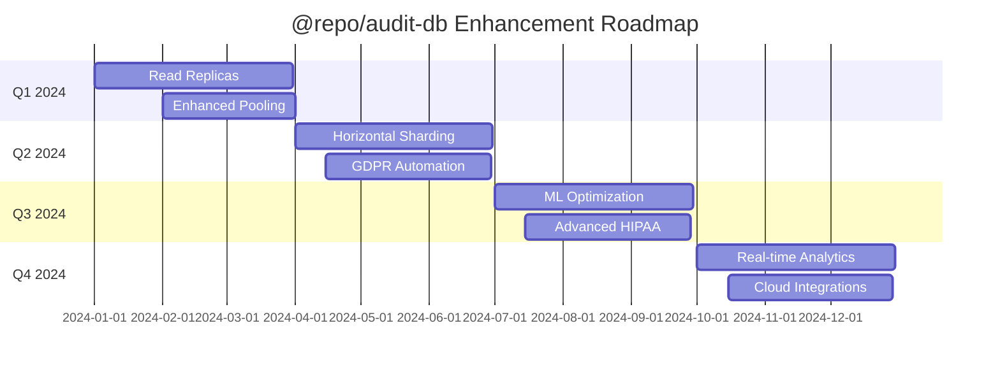

# Future Enhancements

This document outlines planned improvements and upcoming features for the `@repo/audit-db` package. These enhancements are based on the roadmap mentioned in the existing `PERFORMANCE_OPTIMIZATION.md` file and additional improvements identified for healthcare audit logging.

## Roadmap Overview

The development roadmap is organized into quarterly phases, focusing on scalability, advanced analytics, enhanced compliance, and developer experience improvements.

### 2025 Q3: Scalability Enhancements

#### Read Replica Support

**Status**: Planned  
**Priority**: High

- **Automatic read/write splitting**
  - Route read queries to replica instances
  - Maintain write operations on primary
  - Configurable routing policies

- **Load balancing strategies**
  - Round-robin distribution
  - Geographically-aware routing
  - Health-based routing

- **Implementation approach**:
  ```typescript
  const enhancedDb = new EnhancedAuditDb({
  	replication: {
  		enabled: true,
  		readReplicas: ['postgresql://replica1:5432/audit_db', 'postgresql://replica2:5432/audit_db'],
  		routingStrategy: 'round-robin',
  		fallbackToMaster: true,
  	},
  })
  ```

#### Enhanced Connection Pooling

**Status**: Planned  
**Priority**: Medium

- **Adaptive pool sizing** based on workload patterns
- **Connection pooling per tenant** for multi-tenant applications
- **Connection quality monitoring** and automatic failover

### 2025 Q4: Horizontal Sharding

#### Database Sharding Strategy

**Status**: Research Phase  
**Priority**: Medium

- **Shard key strategies**
  - Time-based sharding (by timestamp)
  - Hash-based sharding (by principal_id)
  - Composite sharding strategies

- **Automatic shard management**
  - Dynamic shard creation
  - Shard rebalancing
  - Cross-shard query optimization

- **Configuration example**:
  ```typescript
  const shardedDb = new EnhancedAuditDb({
  	sharding: {
  		enabled: true,
  		strategy: 'time-based',
  		shardInterval: 'quarterly',
  		shards: [
  			{ name: 'shard-2024-q1', url: 'postgresql://shard1:5432/audit_db' },
  			{ name: 'shard-2024-q2', url: 'postgresql://shard2:5432/audit_db' },
  		],
  	},
  })
  ```

### 2026 Q1: Machine Learning and Predictive Analytics

#### ML-Based Performance Optimization

**Status**: Research Phase  
**Priority**: Medium

- **Query pattern analysis**
  - Automatic index recommendation based on query patterns
  - Predictive caching of frequently accessed data
  - Anomaly detection in access patterns

- **Predictive scaling**
  - Automatic resource scaling based on predicted load
  - Proactive partition creation
  - Cache warming predictions

- **Security analytics**
  - Behavioral analysis for fraud detection
  - Unusual access pattern alerts
  - Risk scoring for audit events

#### Implementation Vision:

```typescript
const aiEnhancedDb = new EnhancedAuditDb({
	machineLearning: {
		enabled: true,
		features: {
			queryOptimization: true,
			anomalyDetection: true,
			predictiveScaling: true,
		},
		modelUpdateInterval: '24h',
	},
})

// ML-powered insights
const insights = await aiEnhancedDb.getMLInsights()
```

### 2026 Q2: Advanced Monitoring and Observability

#### Real-Time Analytics Dashboard

**Status**: Planned  
**Priority**: High

- **Grafana integration**
  - Pre-built dashboards for audit metrics
  - Custom metric visualization
  - Real-time alerting

- **Prometheus metrics export**
  - Standard audit metrics
  - Custom business metrics
  - Performance counters

#### Advanced Alerting System

**Status**: Planned  
**Priority**: Medium

- **Intelligent alerting**
  - Context-aware alert prioritization
  - Alert correlation and deduplication
  - Escalation policies

- **Integration capabilities**
  - Slack/Teams notifications
  - PagerDuty integration
  - Custom webhook support

## Compliance and Security Enhancements

### Enhanced GDPR Support

#### Automated Data Subject Rights

**Status**: Development  
**Priority**: High

- **Right to Access automation**

  ```typescript
  const dataSubjectData = await auditDb.executeDataSubjectRequest({
  	type: 'access',
  	subjectId: 'patient-123',
  	includeMetadata: true,
  	format: 'json',
  })
  ```

- **Right to Erasure with audit trail**
  ```typescript
  await auditDb.executeDataSubjectRequest({
  	type: 'erasure',
  	subjectId: 'patient-123',
  	retainAuditTrail: true,
  	legalBasis: 'gdpr-article-17',
  })
  ```

#### Data Lineage Tracking

**Status**: Planned  
**Priority**: Medium

- Track data flow across systems
- Automated compliance reporting
- Impact analysis for data changes

### Advanced HIPAA Features

#### Enhanced Access Controls

**Status**: Development  
**Priority**: High

- **Role-based access control (RBAC)**
- **Attribute-based access control (ABAC)**
- **Minimum necessary principle enforcement**

#### Comprehensive Audit Reporting

**Status**: Planned  
**Priority**: Medium

- **Automated HIPAA compliance reports**
- **Risk assessment dashboards**
- **Incident response workflows**

## Developer Experience Improvements

### Enhanced TypeScript Support

#### Generated Types

**Status**: Planned  
**Priority**: Medium

- **Automatic type generation** from database schema
- **Enhanced IntelliSense** for metadata structures
- **Type-safe query builders**

```typescript
// Future enhanced types
const typedEvent = await db.insert(auditLog).values({
	// Full type checking for all fields
	metadata: {
		// Type-safe metadata based on action type
		department: 'cardiology', // Only valid departments allowed
	},
})
```

### Improved CLI Tools

#### Interactive CLI

**Status**: Planned  
**Priority**: Low

- **Guided setup wizard**
- **Interactive performance tuning**
- **Visual ASCII charts for metrics**

#### Enhanced Debugging

**Status**: Development  
**Priority**: Medium

- **Query execution visualization**
- **Performance bottleneck identification**
- **Step-by-step optimization guides**

## Integration Enhancements

### Multi-Database Support

#### Additional Database Backends

**Status**: Research Phase  
**Priority**: Low

- **MySQL support** for existing systems
- **MongoDB support** for document-based audit logs
- **Elasticsearch integration** for advanced search capabilities

### Cloud-Native Features

#### Cloud Provider Integrations

**Status**: Planned  
**Priority**: Medium

- **AWS RDS/Aurora optimization**
- **Google Cloud SQL integration**
- **Azure Database for PostgreSQL support**

#### Kubernetes Operators

**Status**: Research Phase  
**Priority**: Low

- **Automated deployment and scaling**
- **Configuration management**
- **Backup and restore automation**

## Performance Improvements

### Advanced Caching Strategies

#### Multi-Level Caching

**Status**: Development  
**Priority**: High

- **L1**: In-memory process cache
- **L2**: Redis distributed cache
- **L3**: CDN edge caching for static reports

#### Smart Cache Invalidation

**Status**: Planned  
**Priority**: Medium

- **Dependency-based invalidation**
- **Time-based invalidation policies**
- **Event-driven cache updates**

### Query Optimization

#### Automatic Query Rewriting

**Status**: Research Phase  
**Priority**: Medium

- **Semantic query optimization**
- **Index hint injection**
- **Subquery optimization**

## Testing and Quality Assurance

### Enhanced Testing Framework

#### Compliance Testing Suite

**Status**: Development  
**Priority**: High

- **Automated GDPR compliance tests**
- **HIPAA requirement validation**
- **Security audit automation**

#### Performance Testing

**Status**: Planned  
**Priority**: Medium

- **Load testing scenarios**
- **Stress testing automation**
- **Performance regression detection**

## Documentation and Community

### Interactive Documentation

#### Live Examples

**Status**: Planned  
**Priority**: Low

- **Browser-based code playground**
- **Interactive tutorials**
- **Real-time API testing**

#### Video Tutorials

**Status**: Planned  
**Priority**: Low

- **Getting started videos**
- **Advanced feature demonstrations**
- **Best practices workshops**

## Migration and Compatibility

### Version Migration Tools

#### Automated Migration Assistant

**Status**: Planned  
**Priority**: Medium

- **Schema migration planning**
- **Data migration validation**
- **Rollback capabilities**

#### Backward Compatibility

**Status**: Ongoing  
**Priority**: High

- **Legacy API support**
- **Graceful deprecation policies**
- **Migration path documentation**

## Timeline Summary



## Contributing to Future Development

### How to Contribute

1. **Feature Requests**
   - Submit detailed feature proposals
   - Include use cases and business justification
   - Provide implementation suggestions

2. **Prototype Development**
   - Contribute proof-of-concept implementations
   - Share performance benchmarks
   - Document integration experiences

3. **Testing and Feedback**
   - Beta test new features
   - Report issues and edge cases
   - Suggest usability improvements

### Research Areas

We're actively researching these areas and welcome community input:

- **Zero-downtime migrations** for large audit datasets
- **Federated query capabilities** across multiple audit systems
- **Blockchain integration** for immutable audit trails
- **Advanced encryption schemes** for enhanced data protection

## Feedback and Prioritization

The development roadmap is continuously refined based on:

- **User feedback** and feature requests
- **Performance requirements** from production deployments
- **Compliance regulation changes**
- **Technology ecosystem evolution**

To influence the roadmap or request priority changes, please:

1. Create GitHub issues with detailed requirements
2. Participate in community discussions
3. Share real-world use cases and constraints
4. Contribute to design discussions

This roadmap represents our current vision for the future of `@repo/audit-db`. Timelines and priorities may adjust based on community needs, technical discoveries, and changing compliance requirements.
