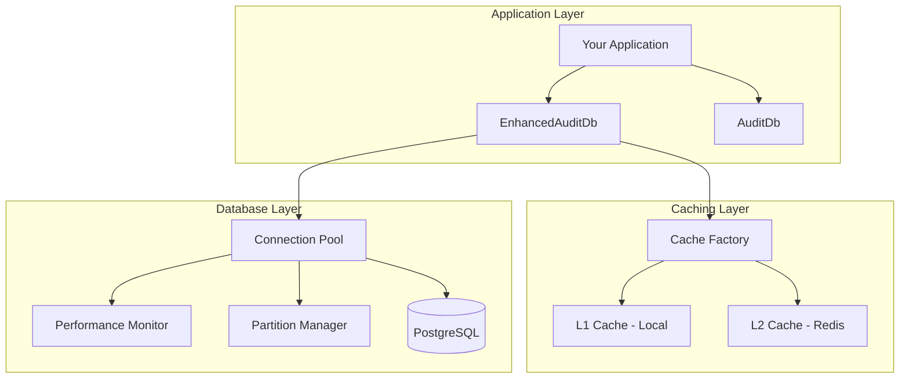

# Getting Started with @repo/audit-db

Welcome to the `@repo/audit-db` package! This section will help you get up and running quickly with the audit database client and its advanced features.

## What is @repo/audit-db?

The `@repo/audit-db` package is a comprehensive database client library designed specifically for audit logging in healthcare applications. It provides:

- **Multiple Client Types**: From basic database operations to advanced performance-optimized clients
- **Performance Optimization**: Built-in connection pooling, query caching, and monitoring
- **Compliance Ready**: GDPR and HIPAA compliance features out of the box
- **Scalable Architecture**: Support for database partitioning and distributed caching
- **Type Safety**: Full TypeScript support with Drizzle ORM integration

## Architecture Overview



## Quick Start Path

Follow this recommended path to get started:

1. **[Installation](./installation.md)** - Install the package and set up dependencies
2. **[Quick Start](./quick-start.md)** - Run your first queries in 5 minutes
3. **[Configuration](./configuration.md)** - Configure for your environment

## Client Types Overview

### 1. AuditDb (Basic Client)
Perfect for simple use cases and getting started.

```typescript
import { AuditDb } from '@repo/audit-db'

const auditDb = new AuditDb()
const db = auditDb.getDrizzleInstance()
```

**Use when:**
- Simple audit logging needs
- Development and testing
- Single-instance deployments
- Learning the package

### 2. AuditDbWithConfig (Configured Client)
Adds configuration management to the basic client.

```typescript
import { AuditDbWithConfig } from '@repo/audit-db'

const auditDb = new AuditDbWithConfig({
  connectionString: process.env.AUDIT_DB_URL,
  pool: { max: 10, min: 2 }
})
```

**Use when:**
- Need custom configuration
- Multiple environment support
- Basic performance tuning
- Production deployments

### 3. EnhancedAuditDb (Advanced Client)
Full-featured client with all optimization capabilities.

```typescript
import { EnhancedAuditDb } from '@repo/audit-db'

const auditDb = new EnhancedAuditDb({
  connectionPool: { maxConnections: 20 },
  queryCache: { enabled: true, maxSizeMB: 100 },
  partitioning: { enabled: true, interval: 'monthly' },
  monitoring: { enabled: true, autoOptimization: true }
})
```

**Use when:**
- High-performance requirements
- Large-scale deployments
- Advanced monitoring needs
- Compliance requirements
- Multi-instance architecture

## Feature Comparison

| Feature | AuditDb | AuditDbWithConfig | EnhancedAuditDb |
|---------|---------|-------------------|-----------------|
| Basic Operations | ✅ | ✅ | ✅ |
| Configuration | ❌ | ✅ | ✅ |
| Connection Pooling | Basic | Basic | Advanced |
| Query Caching | ❌ | ❌ | ✅ |
| Performance Monitoring | ❌ | ❌ | ✅ |
| Database Partitioning | ❌ | ❌ | ✅ |
| Redis Integration | ❌ | ❌ | ✅ |
| Compliance Features | ❌ | ❌ | ✅ |
| Health Monitoring | ❌ | ❌ | ✅ |
| CLI Tools | ❌ | ❌ | ✅ |

## Environment Requirements

### Development
- Node.js 18+
- PostgreSQL 12+
- pnpm 10+

### Production (Enhanced Features)
- Node.js 18+
- PostgreSQL 12+ with pg_stat_statements extension
- Redis 6+ (for distributed caching)
- pnpm 10+

## Performance Characteristics

### Basic Client (AuditDb)
- **Latency**: 5-15ms per query
- **Throughput**: 100-500 queries/second
- **Memory**: 10-50MB
- **Setup Time**: < 1 minute

### Enhanced Client (EnhancedAuditDb)
- **Latency**: 1-5ms per query (with caching)
- **Throughput**: 1000-5000 queries/second
- **Memory**: 50-500MB (configurable)
- **Setup Time**: 5-15 minutes

## Next Steps

### For New Users
1. Complete the [Installation](./installation.md) process
2. Follow the [Quick Start Tutorial](./quick-start.md)
3. Explore [Basic Usage Examples](../tutorials/basic-usage.md)

### For Performance-Focused Users
1. Set up the [Enhanced Client](../tutorials/performance-optimization.md)
2. Configure [Redis Caching](../tutorials/redis-caching.md)
3. Implement [Database Partitioning](../tutorials/partitioning-setup.md)

### For Compliance-Focused Users
1. Review [Compliance Configuration](../tutorials/compliance-configuration.md)
2. Set up [Security Best Practices](../guides/security-compliance.md)
3. Implement [Compliance Reporting](../examples/compliance-reporting.md)

## Common Use Cases

### 1. Healthcare Audit Logging
```typescript
// Log patient data access
await auditDb.logEvent({
  action: 'patient.data.access',
  principalId: 'doctor-123',
  resourceId: 'patient-456',
  metadata: { department: 'cardiology' }
})
```

### 2. Compliance Reporting
```typescript
// Generate GDPR compliance report
const report = await auditDb.generateGDPRReport({
  startDate: '2024-01-01',
  endDate: '2024-12-31',
  dataSubject: 'patient-456'
})
```

### 3. Performance Monitoring
```typescript
// Get performance insights
const performance = await auditDb.getPerformanceReport()
console.log(`Query performance: ${performance.averageQueryTime}ms`)
```

## Support and Resources

- **Issues**: Report issues in the monorepo GitHub repository
- **Documentation**: Comprehensive guides in this documentation
- **Examples**: Practical code examples in the [examples section](../examples/)
- **CLI Help**: Run `audit-db --help` for command-line assistance

Ready to get started? Head to the [Installation Guide](./installation.md)!