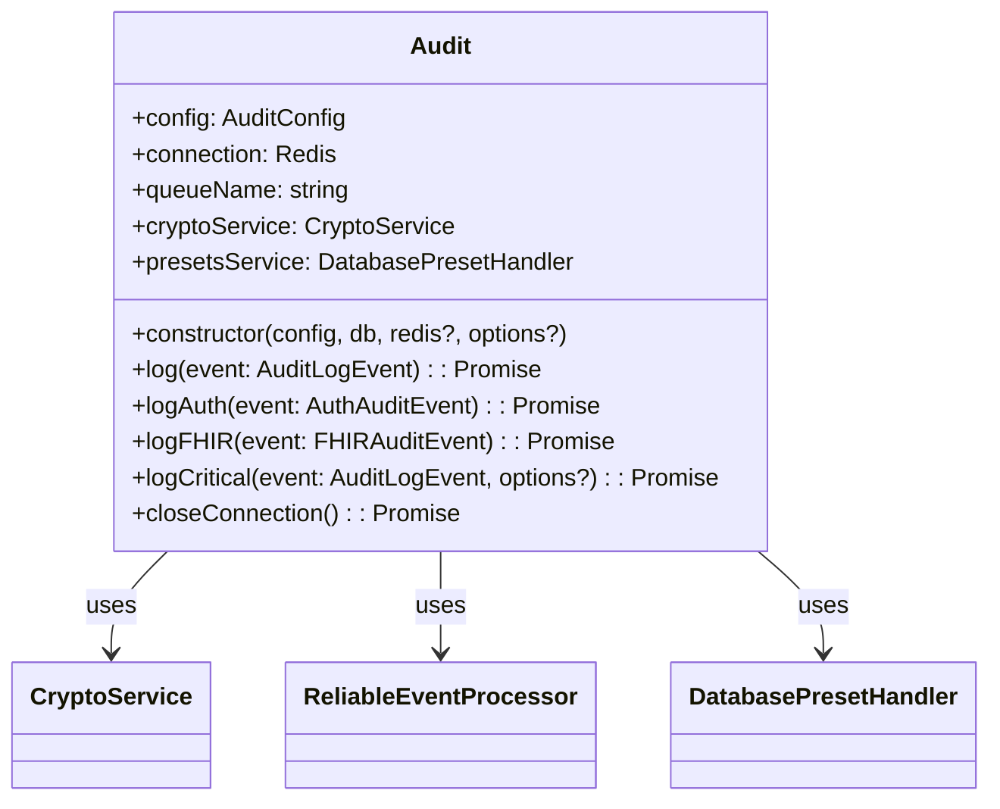
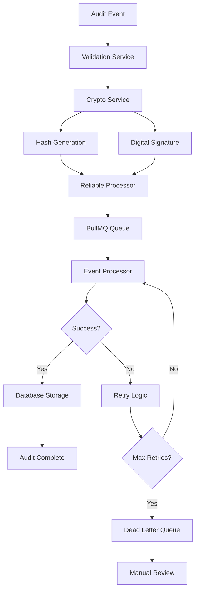
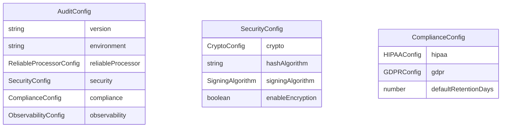

# @repo/audit Package Documentation Setup Design

## Overview

This design outlines the comprehensive documentation structure for the `@repo/audit` package, the core audit logging system for healthcare applications. The package provides cryptographically secure, HIPAA/GDPR-compliant audit event processing with guaranteed delivery, tamper detection, and real-time monitoring capabilities.

The documentation will be structured as a technical reference for developers implementing audit logging in healthcare systems, focusing on practical implementation guidance, troubleshooting, and compliance requirements.

## Technology Stack & Dependencies

**Core Framework**: TypeScript-based audit logging system
**Queue System**: BullMQ + Redis for reliable event processing  
**Database**: PostgreSQL with Drizzle ORM
**Security**: SHA-256 hashing + HMAC-SHA256 signatures
**Monitoring**: Built-in metrics collection and health checks
**Compliance**: HIPAA and GDPR validation and reporting

## Documentation Architecture

### Directory Structure

```
packages/audit/docs/
├── README.md                          # Main documentation hub
├── getting-started/
│   ├── index.md                      # Getting started overview
│   ├── installation.md               # Installation guide
│   ├── configuration.md              # Basic configuration
│   └── first-audit-event.md          # Quick start tutorial
├── tutorials/
│   ├── index.md                      # Tutorials overview
│   ├── basic-implementation.md       # Basic audit setup
│   ├── healthcare-compliance.md     # HIPAA/GDPR setup
│   ├── fhir-integration.md          # FHIR audit events
│   ├── security-configuration.md    # Cryptographic setup
│   ├── monitoring-setup.md          # Observability configuration
│   └── advanced-patterns.md         # Complex use cases
├── api-reference/
│   ├── index.md                      # API overview
│   ├── audit-class.md               # Core Audit class
│   ├── event-types.md               # Event types and interfaces
│   ├── configuration.md             # Configuration options
│   ├── cryptography.md              # Security functions
│   ├── monitoring.md                # Monitoring APIs
│   ├── compliance.md                # Compliance APIs
│   └── utilities.md                 # Helper functions
├── guides/
│   ├── index.md                     # Guides overview
│   ├── compliance-implementation.md # HIPAA/GDPR compliance
│   ├── security-best-practices.md  # Security guidelines
│   ├── performance-optimization.md  # Performance tuning
│   ├── error-handling.md            # Error management
│   ├── testing-strategies.md        # Testing approaches
│   ├── deployment-patterns.md       # Production deployment
│   └── migration-guide.md           # Version migration
├── examples/
│   ├── index.md                     # Examples overview
│   ├── basic-usage.md               # Simple implementations
│   ├── healthcare-scenarios.md     # Medical use cases
│   ├── fhir-workflows.md           # FHIR implementations
│   ├── authentication-flows.md     # Auth audit patterns
│   ├── batch-processing.md         # High-volume scenarios
│   └── integration-patterns.md     # System integrations
├── troubleshooting/
│   ├── index.md                     # Troubleshooting guide
│   ├── common-issues.md             # Frequent problems
│   ├── configuration-problems.md   # Config issues
│   ├── performance-issues.md       # Performance problems
│   ├── security-concerns.md        # Security troubleshooting
│   └── monitoring-alerts.md        # Alert resolution
├── faq/
│   ├── index.md                     # FAQ overview
│   ├── general.md                   # General questions
│   ├── compliance.md                # Compliance questions
│   ├── security.md                  # Security questions
│   ├── performance.md               # Performance questions
│   └── integration.md               # Integration questions
└── future-enhancements/
    ├── index.md                     # Enhancement overview
    ├── roadmap.md                   # Development roadmap
    ├── unimplemented-features.md   # Missing features
    └── contribution-guide.md       # How to contribute
```

## Component Documentation Structure

### Core Audit Class Documentation

**Purpose**: Document the main `Audit` class interface and usage patterns

**Key Sections**:

- Constructor options and Redis connection patterns
- Event logging methods (`log`, `logAuth`, `logFHIR`, `logCritical`)
- Configuration management and validation
- Connection lifecycle management
- Error handling patterns
- Performance considerations

**Diagrams**:



### Event Processing Architecture

**Purpose**: Document the event processing pipeline and reliability mechanisms

**Key Components**:

- Event ingestion and validation
- Cryptographic hashing and signing
- Queue processing with BullMQ
- Dead letter queue handling
- Circuit breaker patterns
- Retry strategies with exponential backoff

**Diagrams**:



### Configuration Management System

**Purpose**: Document the comprehensive configuration system with validation and security

**Key Features**:

- Environment-specific configurations (development, staging, production, test)
- Hot reloading capabilities
- Encrypted configuration storage (AES-256-GCM with PBKDF2)
- Configuration validation with comprehensive schema
- Version tracking and change management
- Integration with AWS S3 and local file storage

**Configuration Schema**:



### Security and Cryptography

**Purpose**: Document tamper detection, data integrity, and compliance security measures

**Security Features**:

- SHA-256 cryptographic hashing for immutability
- HMAC-SHA256 digital signatures for authenticity
- KMS integration with Infisical for key management
- Multiple signing algorithms support (RSA, ECDSA)
- Secure configuration storage with encryption
- PHI data handling and pseudonymization

### Compliance Implementation

**Purpose**: Document HIPAA and GDPR compliance features and implementation patterns

**HIPAA Compliance**:

- Required field validation for audit events
- 6-year retention policy management
- Security incident reporting
- Access control logging
- PHI access tracking

**GDPR Compliance**:

- Data subject rights implementation (export, delete)
- Legal basis tracking and validation
- Data pseudonymization and anonymization
- Retention policy enforcement
- Consent management tracking

### Monitoring and Observability

**Purpose**: Document comprehensive monitoring, alerting, and performance tracking

**Monitoring Components**:

- Real-time metrics collection (processing latency, queue depth, success/failure rates)
- Health check services (database, Redis, queue, circuit breaker)
- Alert management with severity levels and organization filtering
- Performance metrics and bottleneck analysis
- Distributed tracing for audit event lifecycle

**Alert Types**:

- System alerts (high latency, queue overflow, connection failures)
- Security alerts (tamper detection, unauthorized access)
- Compliance alerts (retention violations, missing required fields)
- Organizational alerts (department-specific monitoring)

## Implementation Patterns

### Basic Usage Pattern

```typescript
// Standard implementation with shared Redis connection
import { Audit, AuditConfig } from '@repo/audit'

import { db } from './database'

const config: AuditConfig = {
	version: '1.0',
	environment: 'production',
	reliableProcessor: {
		queueName: 'healthcare-audit',
		maxRetries: 3,
		retryDelay: 1000,
	},
	security: {
		crypto: { algorithm: 'SHA-256' },
		enableEncryption: true,
	},
	compliance: {
		hipaa: { enabled: true, retentionYears: 6 },
		gdpr: { enabled: true, retentionDays: 365 },
	},
}

const auditService = new Audit(config, db)

// Log a FHIR patient access event
await auditService.logFHIR({
	principalId: 'practitioner-123',
	action: 'fhir.patient.read',
	resourceType: 'Patient',
	resourceId: 'patient-456',
	status: 'success',
	sessionContext: {
		sessionId: 'sess-789',
		ipAddress: '10.0.1.100',
		userAgent: 'EMR-System/2.1',
	},
	fhirContext: {
		version: 'R4',
		interaction: 'read',
		compartment: 'Patient/patient-456',
	},
})
```

### Healthcare Compliance Pattern

```typescript
// Healthcare-specific configuration with strict compliance
const healthcareConfig: AuditConfig = {
	compliance: {
		hipaa: {
			enabled: true,
			requiredFields: ['principalId', 'targetResourceType', 'sessionContext'],
			retentionYears: 6,
			enableSecurityIncidentReporting: true,
		},
		gdpr: {
			enabled: true,
			defaultLegalBasis: 'legitimate_interest',
			retentionDays: 2190, // 6 years in days
			enableDataSubjectRights: true,
		},
	},
	security: {
		crypto: {
			algorithm: 'SHA-256',
			signingAlgorithm: 'HMAC-SHA256',
		},
		enableTamperDetection: true,
		requireDigitalSignatures: true,
	},
}
```

### High-Performance Pattern

```typescript
// Configuration for high-volume healthcare environments
const performanceConfig: AuditConfig = {
	reliableProcessor: {
		queueName: 'high-volume-audit',
		batchSize: 100,
		concurrency: 10,
		maxRetries: 5,
		retryDelay: 2000,
		enableCircuitBreaker: true,
		circuitBreakerThreshold: 50,
	},
	observability: {
		enableMetrics: true,
		metricsInterval: 30000,
		enableTracing: true,
		enableProfiling: true,
	},
}
```

## Testing Strategy

### Comprehensive Test Coverage

**Test Categories**:

1. **Unit Tests** - Individual component testing (cryptography, validation, configuration)
2. **Integration Tests** - Component interaction testing (audit service with database/Redis)
3. **End-to-End Tests** - Complete audit lifecycle testing with real dependencies
4. **Load Tests** - High-volume scenario testing (10,000+ events)
5. **Chaos Engineering Tests** - System resilience under failure conditions
6. **Compliance Tests** - HIPAA/GDPR requirement validation
7. **Security Tests** - Tamper detection and cryptographic verification

**Test Infrastructure**:

- Dedicated test databases (PostgreSQL)
- Isolated Redis instances
- Mock external services (KMS, S3)
- Performance benchmarking
- Compliance validation suites

### Test Execution Patterns

```bash
# Comprehensive test suite
pnpm test:all          # All tests including load and chaos
pnpm test:unit         # Unit tests only
pnpm test:integration  # Integration tests
pnpm test:e2e          # End-to-end tests
pnpm test:load         # Performance tests
pnpm test:chaos        # Resilience tests
pnpm test:compliance   # HIPAA/GDPR tests
```

## Troubleshooting Framework

### Common Issue Categories

**Configuration Issues**:

- Invalid Redis connection parameters
- Missing required environment variables
- Incorrect database schema versions
- Malformed configuration files

**Performance Issues**:

- High processing latency (>1000ms)
- Queue overflow conditions
- Database connection pool exhaustion
- Memory pressure from large batches

**Security Issues**:

- Hash verification failures
- Signature validation errors
- KMS key access problems
- Tamper detection alerts

**Compliance Issues**:

- Missing required HIPAA fields
- GDPR retention policy violations
- Audit trail integrity concerns
- Regulatory reporting failures

### Diagnostic Tools

**Health Check Endpoints**:

- Database connectivity and schema validation
- Redis connection and queue status
- Circuit breaker state monitoring
- Cryptographic service validation

**Monitoring Dashboards**:

- Real-time event processing metrics
- Queue depth and processing latency
- Error rates and failure patterns
- Compliance status indicators

## Future Enhancements

### Planned Features

**Enhanced Security**:

- Hardware Security Module (HSM) integration
- Multi-signature verification
- Blockchain-based immutable audit trails
- Advanced threat detection

**Scalability Improvements**:

- Horizontal queue partitioning
- Event streaming with Apache Kafka
- Multi-region replication
- Elastic scaling based on load

**Compliance Extensions**:

- SOC 2 Type II compliance
- FDA 21 CFR Part 11 validation
- ISO 27001 audit requirements
- Custom regulatory frameworks

**Integration Enhancements**:

- GraphQL audit event queries
- REST API for external integrations
- Webhook notifications for critical events
- Real-time dashboard widgets

### Unimplemented Features

**Archival System Enhancements**:

- Automated cold storage migration
- Compression algorithms for historical data
- Cross-region backup strategies
- Data lifecycle management policies

**Advanced Analytics**:

- Machine learning-based anomaly detection
- Predictive compliance monitoring
- Automated security incident classification
- Behavioral pattern analysis

**Developer Experience**:

- Interactive API documentation
- Code generation for common patterns
- Visual configuration builder
- Integration testing framework

This documentation structure provides comprehensive coverage for technical personnel implementing the @repo/audit package in healthcare environments, with emphasis on security, compliance, and operational reliability.
