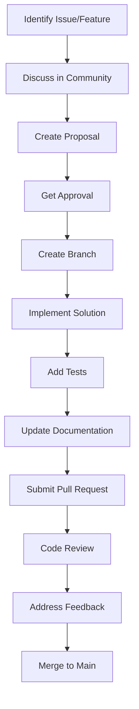

# Future Enhancements

This section outlines the development roadmap, planned features, and contribution opportunities for the `@repo/audit` package. We welcome community input and contributions to help shape the future of healthcare audit logging.

## 🗺️ Development Roadmap

### Short-term Goals (3-6 months)

#### Enhanced Security Features
- **Hardware Security Module (HSM) Integration**
  - Direct HSM support for key storage and operations
  - Enhanced cryptographic operations for high-security environments
  - FIPS 140-2 Level 3/4 compliance support

- **Multi-signature Verification**
  - Support for multiple digital signatures per event
  - Role-based signature requirements for critical events
  - Signature delegation and approval workflows

- **Advanced Threat Detection**
  - Machine learning-based anomaly detection
  - Behavioral pattern analysis for insider threats
  - Real-time risk scoring for audit events

#### Performance Optimizations
- **Event Streaming Support**
  - Apache Kafka integration for high-throughput scenarios
  - Event sourcing patterns for complex workflows
  - Real-time event processing and analytics

- **Horizontal Scaling**
  - Redis Cluster support for distributed queuing
  - Database sharding strategies for massive scale
  - Auto-scaling worker processes based on load

- **Memory Optimization**
  - Reduced memory footprint for edge deployments
  - Streaming JSON processing for large events
  - Optimized batch processing algorithms

### Medium-term Goals (6-12 months)

#### Enhanced Compliance Support
- **Additional Regulatory Frameworks**
  - SOC 2 Type II audit requirements
  - FDA 21 CFR Part 11 validation
  - ISO 27001 audit controls
  - State privacy laws (CCPA, BIPA, etc.)

- **Automated Compliance Reporting**
  - Scheduled compliance report generation
  - Template-based report formatting
  - Multi-format exports (PDF, Excel, JSON)
  - Regulatory submission automation

- **Data Governance Integration**
  - Data lineage tracking for audit events
  - Data quality metrics and monitoring
  - Retention policy automation
  - Cross-border data transfer compliance

#### Advanced Integration Features
- **GraphQL API Support**
  - Full GraphQL schema for audit data queries
  - Real-time subscriptions for audit events
  - Advanced filtering and pagination
  - Type-safe client generation

- **REST API Endpoints**
  - Comprehensive REST API for external integrations
  - OpenAPI 3.0 specification
  - Rate limiting and authentication
  - Webhook support for real-time notifications

- **Cloud-Native Features**
  - Kubernetes operators for deployment
  - Helm charts for easy installation
  - Cloud storage integration (S3, GCS, Azure Blob)
  - Serverless function support

### Long-term Goals (12+ months)

#### Next-Generation Architecture
- **Blockchain Integration**
  - Immutable audit trails using blockchain technology
  - Smart contracts for automated compliance
  - Distributed ledger for multi-organization auditing
  - Cryptographic proof of audit integrity

- **Edge Computing Support**
  - Edge device audit logging capabilities
  - Offline-first audit collection
  - Eventual consistency models
  - IoT device integration for medical equipment

- **AI/ML Integration**
  - Intelligent audit event classification
  - Predictive compliance monitoring
  - Automated anomaly detection and response
  - Natural language processing for audit descriptions

## 🚀 Planned Features

### Enhanced Security
- **Zero-Knowledge Proofs**: Verify audit integrity without revealing sensitive data
- **Homomorphic Encryption**: Perform computations on encrypted audit data
- **Secure Multi-party Computation**: Enable collaborative auditing across organizations
- **Post-Quantum Cryptography**: Future-proof cryptographic algorithms

### Advanced Analytics
- **Real-time Dashboards**: Interactive audit data visualization
- **Predictive Analytics**: Identify potential compliance issues before they occur
- **Behavioral Analytics**: User behavior profiling and anomaly detection
- **Compliance Scoring**: Automated risk assessment and scoring

### Integration Enhancements
- **EHR Integration**: Pre-built connectors for major EHR systems
- **FHIR R5 Support**: Latest FHIR specification compliance
- **HL7 v2 Integration**: Legacy healthcare system support
- **SMART on FHIR**: Enhanced app-based audit logging

### Developer Experience
- **Visual Configuration Builder**: GUI for configuration management
- **Code Generation**: Automatic client code generation for multiple languages
- **Interactive Documentation**: Executable API documentation
- **Development Tools**: CLI tools for testing and debugging

## 🔬 Unimplemented Features

### High-Priority Features

#### Advanced Archival System
**Current State**: Basic data retention and deletion
**Enhancement Needed**:
- Automated cold storage migration based on access patterns
- Compression algorithms optimized for audit data
- Cross-region backup and disaster recovery
- Data lifecycle management with compliance considerations

**Implementation Approach**:
```typescript
// Proposed archival service interface
interface AdvancedArchivalService {
  async migrateTocoldStorage(criteria: ArchivalCriteria): Promise<ArchivalResult>
  async compressHistoricalData(timeRange: TimeRange): Promise<CompressionResult>
  async restoreFromArchive(eventIds: string[]): Promise<RestorationResult>
  async validateArchiveIntegrity(): Promise<IntegrityReport>
}
```

#### Machine Learning Anomaly Detection
**Current State**: Rule-based threat detection
**Enhancement Needed**:
- Machine learning models for anomaly detection
- Behavioral baseline establishment
- Adaptive threat detection algorithms
- False positive reduction mechanisms

**Proposed Architecture**:
```typescript
// ML-based anomaly detection
interface AnomalyDetectionService {
  async trainModel(historicalEvents: AuditLogEvent[]): Promise<MLModel>
  async detectAnomalies(events: AuditLogEvent[]): Promise<Anomaly[]>
  async updateModel(newEvents: AuditLogEvent[]): Promise<void>
  async getModelMetrics(): Promise<ModelPerformance>
}
```

#### Cross-Organization Auditing
**Current State**: Single organization support
**Enhancement Needed**:
- Multi-tenant audit event correlation
- Cross-organization consent tracking
- Federated audit search capabilities
- Inter-organization compliance reporting

### Medium-Priority Features

#### Advanced Cryptographic Features
- **Threshold Cryptography**: Distributed key management
- **Ring Signatures**: Anonymous audit logging with accountability
- **Merkle Trees**: Efficient integrity verification for large datasets
- **Commitment Schemes**: Non-repudiation with delayed revelation

#### Enhanced Monitoring and Alerting
- **Predictive Monitoring**: Forecast potential issues before they occur
- **Intelligent Alerting**: Context-aware alert prioritization
- **Root Cause Analysis**: Automated incident investigation
- **Performance Optimization Recommendations**: AI-driven optimization suggestions

#### Compliance Automation
- **Policy Engine**: Rule-based compliance enforcement
- **Automated Remediation**: Self-healing compliance violations
- **Regulatory Change Tracking**: Automatic updates for regulation changes
- **Compliance Testing**: Automated compliance validation testing

### Low-Priority Features

#### Advanced Visualization
- **3D Audit Visualization**: Complex relationship mapping
- **Timeline Analytics**: Interactive audit event timelines
- **Geospatial Analysis**: Location-based audit event analysis
- **Network Graph Analysis**: Relationship visualization between entities

#### Experimental Technologies
- **Quantum-Safe Cryptography**: Preparation for quantum computing threats
- **Distributed Computing**: Peer-to-peer audit networks
- **Augmented Reality**: AR-based audit data exploration
- **Voice-Activated Auditing**: Voice commands for audit operations

## 🤝 Contribution Opportunities

### For Healthcare Professionals

#### Clinical Workflow Expertise
- **Clinical Use Case Development**: Define real-world audit scenarios
- **Regulatory Guidance**: Provide insights on compliance requirements
- **Workflow Optimization**: Identify opportunities for audit automation
- **User Experience Testing**: Validate interfaces and workflows

**How to Contribute**:
1. Join healthcare-focused discussions in project forums
2. Provide feedback on clinical workflow implementations
3. Share anonymized use cases and requirements
4. Participate in user experience research

#### Compliance and Legal
- **Regulatory Analysis**: Research and document compliance requirements
- **Policy Development**: Create audit policy templates
- **Legal Framework Guidance**: Provide legal compliance insights
- **Risk Assessment**: Evaluate compliance risks and mitigation strategies

### For Developers

#### Core Development
**Areas Needing Contribution**:
- Performance optimization and benchmarking
- New database adapter implementations
- Enhanced error handling and recovery
- Advanced configuration management

**Current Priority Areas**:
```typescript
// Example: Database adapter interface that needs implementations
interface DatabaseAdapter {
  async connect(config: DatabaseConfig): Promise<Connection>
  async executeBatch(operations: Operation[]): Promise<BatchResult>
  async queryEvents(criteria: QueryCriteria): Promise<AuditLogEvent[]>
  async createIndex(indexSpec: IndexSpecification): Promise<void>
}

// Needed implementations:
// - MongoDB adapter for document-based storage
// - ClickHouse adapter for analytics workloads
// - TimescaleDB adapter for time-series optimization
```

#### Testing and Quality Assurance
- **Test Coverage Expansion**: Increase test coverage to >95%
- **Performance Testing**: Develop comprehensive benchmarking suites
- **Compliance Testing**: Create automated compliance validation tests
- **Integration Testing**: End-to-end testing with real healthcare systems

#### Documentation
- **Tutorial Development**: Create step-by-step implementation guides
- **Example Applications**: Build complete demo applications
- **Video Tutorials**: Develop visual learning materials
- **Translation**: Translate documentation for international users

### For Security Experts

#### Security Research
**Current Research Areas**:
- Post-quantum cryptographic algorithm evaluation
- Zero-knowledge proof implementations for audit privacy
- Advanced threat detection using machine learning
- Secure multi-party computation for collaborative auditing

#### Penetration Testing
- **Security Assessment**: Conduct comprehensive security audits
- **Vulnerability Research**: Identify and report security issues
- **Threat Modeling**: Develop threat models for healthcare environments
- **Security Architecture Review**: Evaluate and improve security design

### For Data Scientists

#### Analytics and Machine Learning
**Contribution Opportunities**:
- Anomaly detection algorithm development
- Predictive compliance modeling
- User behavior analytics
- Performance optimization using ML

**Example Research Areas**:
```python
# Proposed ML research areas
class AuditAnalytics:
    def predict_compliance_risk(self, events: List[Event]) -> RiskScore:
        """Predict likelihood of compliance violations"""
        pass
    
    def detect_insider_threats(self, user_behavior: UserBehavior) -> ThreatLevel:
        """Identify potential insider threat patterns"""
        pass
    
    def optimize_processing(self, system_metrics: Metrics) -> OptimizationPlan:
        """Recommend system optimizations based on usage patterns"""
        pass
```

## 📋 Contribution Guidelines

### Getting Started
1. **Review the Project**: Understand the codebase and architecture
2. **Join the Community**: Participate in discussions and planning
3. **Identify Opportunities**: Choose areas matching your expertise
4. **Start Small**: Begin with documentation or small bug fixes
5. **Scale Up**: Take on larger features as you become familiar

### Development Process


### Quality Standards
- **Code Quality**: Follow TypeScript best practices and project conventions
- **Testing**: Maintain >90% test coverage for new features
- **Documentation**: Include comprehensive documentation for all new features
- **Security**: All security-related changes require security review
- **Compliance**: Healthcare features must include compliance validation

### Communication Channels
- **GitHub Issues**: Feature requests and bug reports
- **GitHub Discussions**: Community discussions and Q&A
- **Discord/Slack**: Real-time communication (if available)
- **Email Lists**: Important announcements and updates

## 🎯 Feature Request Process

### Submitting Feature Requests

#### 1. Research and Planning
- **Check Existing Issues**: Ensure the feature hasn't been requested
- **Research Requirements**: Understand regulatory and technical needs
- **Define Use Cases**: Provide specific healthcare scenarios
- **Consider Impact**: Evaluate benefits and implementation complexity

#### 2. Create Detailed Proposal
```markdown
# Feature Request Template

## Summary
Brief description of the proposed feature

## Healthcare Context
Specific healthcare use cases and regulatory requirements

## Technical Requirements
- Functional requirements
- Non-functional requirements (performance, security, etc.)
- Integration requirements

## Implementation Approach
Proposed technical implementation strategy

## Testing Strategy
How the feature will be validated and tested

## Documentation Requirements
What documentation will need to be created/updated

## Timeline and Priority
Suggested implementation timeline and business priority
```

#### 3. Community Review
- **Technical Review**: Evaluate technical feasibility and architecture fit
- **Healthcare Review**: Validate clinical and compliance requirements
- **Security Review**: Assess security implications and requirements
- **Community Feedback**: Gather input from other users and contributors

#### 4. Implementation Planning
- **Sprint Planning**: Break down into implementable tasks
- **Resource Allocation**: Identify contributors and expertise needed
- **Milestone Definition**: Set clear deliverables and timelines
- **Risk Assessment**: Identify potential challenges and mitigation strategies

### Priority Criteria

Features are prioritized based on:

1. **Regulatory Compliance Impact**: Features supporting HIPAA, GDPR, or other regulations
2. **Security Enhancements**: Features improving audit security and integrity
3. **Performance Improvements**: Features supporting high-volume healthcare environments
4. **Community Demand**: Features requested by multiple organizations
5. **Implementation Complexity**: Balance of value vs. development effort

## 🌟 Vision for the Future

### Healthcare Transformation
The `@repo/audit` package aims to become the de facto standard for healthcare audit logging, supporting:

- **Interoperability**: Seamless audit data exchange between healthcare organizations
- **Global Compliance**: Support for healthcare regulations worldwide
- **Real-time Analytics**: Instant insights into healthcare system usage and compliance
- **Predictive Healthcare**: AI-powered predictions for better patient outcomes

### Technology Leadership
We strive to incorporate cutting-edge technologies while maintaining:

- **Security First**: Always prioritizing security and privacy
- **Standards Compliance**: Adhering to healthcare and technology standards
- **Performance Excellence**: Optimizing for high-volume healthcare environments
- **Developer Experience**: Making implementation straightforward and reliable

### Community Growth
Building a vibrant community of:

- **Healthcare Professionals**: Providing clinical and regulatory expertise
- **Software Developers**: Contributing technical innovations
- **Security Experts**: Ensuring robust security implementations
- **Compliance Specialists**: Maintaining regulatory compliance

## 📞 Getting Involved

### Immediate Actions
1. **Star the Repository**: Show your support for the project
2. **Join Discussions**: Participate in community planning sessions
3. **Report Issues**: Help identify bugs and improvement opportunities
4. **Suggest Features**: Propose enhancements based on your healthcare needs

### Long-term Commitment
- **Become a Maintainer**: Take ownership of specific areas
- **Lead Feature Development**: Champion major new capabilities
- **Mentor New Contributors**: Help others get started with contributions
- **Advocate for Adoption**: Promote usage in your organization

### Professional Opportunities
The project may offer opportunities for:
- **Consulting Engagements**: Help organizations implement audit logging
- **Training and Education**: Develop and deliver training programs
- **Research Collaboration**: Partner on healthcare technology research
- **Speaking Opportunities**: Present at conferences and industry events

---

**Ready to contribute?** Check out our [contribution guidelines](./contribution-guide.md) and join the community in building the future of healthcare audit logging!