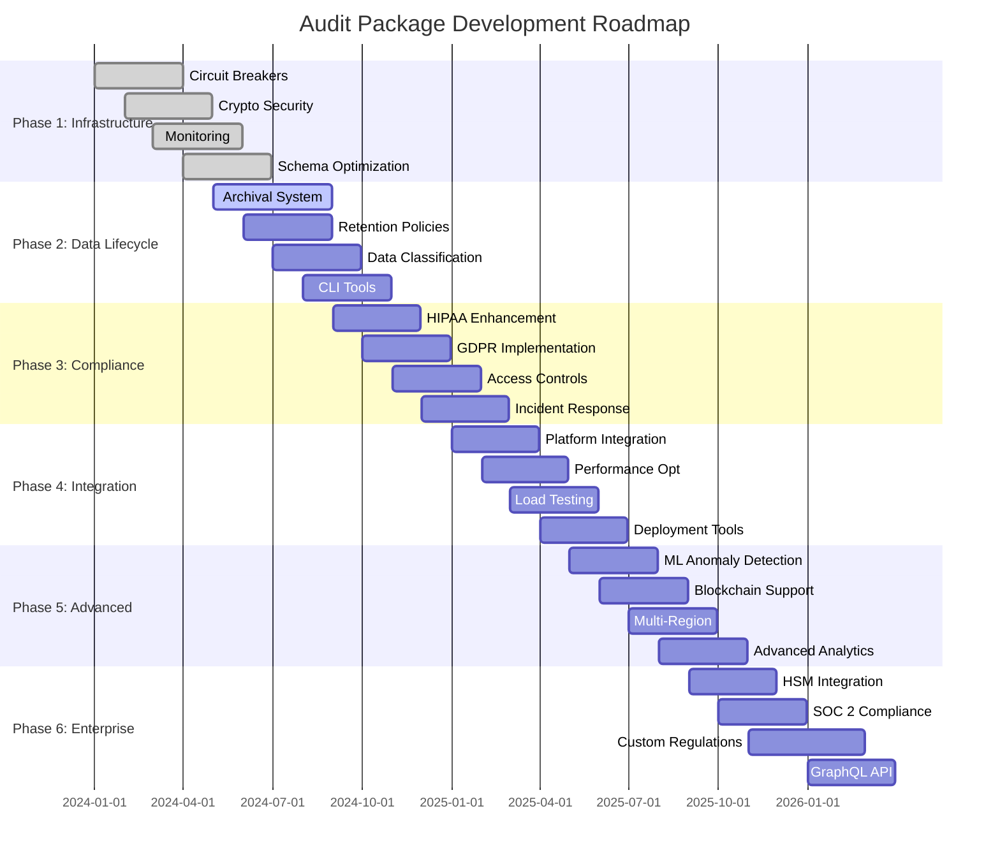
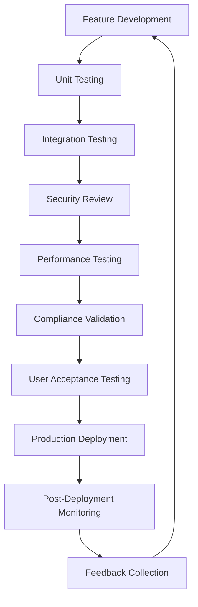

# Development Roadmap

This document outlines the detailed timeline-based development plan for the `@repo/audit` package, organized into phases with specific milestones and priorities. Our roadmap focuses on healthcare compliance, security, and operational excellence while maintaining backward compatibility.

## 📅 Roadmap Overview

The development roadmap is structured into six distinct phases, each building upon the previous phase's foundation. Each phase targets specific capabilities and compliance requirements essential for healthcare audit logging systems.

### Timeline Summary

- **Phase 1**: Core Infrastructure Enhancement (Current - Q2 2024)
- **Phase 2**: Data Lifecycle Management (Q2 - Q3 2024)
- **Phase 3**: Compliance and Security Enhancement (Q3 - Q4 2024)
- **Phase 4**: Integration and Optimization (Q4 2024 - Q1 2025)
- **Phase 5**: Advanced Features (Q1 - Q2 2025)
- **Phase 6**: Enterprise Features (Q2 - Q3 2025)

## 🏗️ Phase 1: Core Infrastructure Enhancement
**Timeline**: Current - Q2 2024  
**Status**: In Progress  
**Primary Focus**: Reliability, Performance, and Basic Monitoring

### Key Objectives

#### Reliable Event Processing with Circuit Breakers
**Duration**: 2 months  
**Priority**: Critical  
**Dependencies**: None

**Deliverables**:
- Circuit breaker implementation for external service calls
- Exponential backoff retry mechanisms with jitter
- Dead letter queue integration for failed events
- Health check endpoints for service monitoring

**Technical Implementation**:
```typescript
interface CircuitBreakerConfig {
  failureThreshold: number;
  resetTimeout: number;
  monitoringWindow: number;
}

class ReliableEventProcessor {
  private circuitBreaker: CircuitBreaker;
  private retryStrategy: ExponentialBackoffStrategy;
  private deadLetterQueue: DeadLetterQueue;
}
```

**Success Criteria**:
- 99.9% event delivery guarantee
- Automatic recovery from transient failures
- Maximum 30-second recovery time from circuit breaker trips
- Zero data loss during system failures

#### Enhanced Cryptographic Security Layer
**Duration**: 3 months  
**Priority**: Critical  
**Dependencies**: None

**Deliverables**:
- HMAC-SHA256 implementation for event integrity
- Key rotation mechanisms with zero-downtime
- Cryptographic verification APIs
- Security audit trail for all cryptographic operations

**Security Features**:
- Event tampering detection with immediate alerting
- Cryptographic proof generation for legal compliance
- Secure key storage with hardware security module support
- Performance optimization for high-volume cryptographic operations

**Compliance Requirements**:
- FIPS 140-2 Level 3 cryptographic standards
- NIST SP 800-57 key management guidelines
- Healthcare-specific cryptographic requirements

#### Basic Monitoring and Health Checks
**Duration**: 1.5 months  
**Priority**: High  
**Dependencies**: Reliable Event Processing

**Deliverables**:
- Prometheus metrics integration
- Custom health check endpoints
- Performance monitoring dashboards
- Alerting system integration

**Monitoring Metrics**:
- Event processing latency (p50, p95, p99)
- Queue depth and processing rate
- Error rates and failure classifications
- System resource utilization (CPU, memory, disk)

#### PostgreSQL Schema Optimization
**Duration**: 2 months  
**Priority**: High  
**Dependencies**: None

**Deliverables**:
- Time-based partitioning strategy implementation
- Index optimization for common query patterns
- Archive strategy for historical data
- Performance benchmarking and optimization

**Performance Targets**:
- Sub-100ms write latency for 95% of events
- Support for 10,000+ events per second sustained throughput
- Efficient queries for compliance reporting
- Automated maintenance procedures

### Phase 1 Milestones

| Milestone | Completion Date | Dependencies | Status |
|-----------|-----------------|--------------|--------|
| Circuit Breaker Implementation | March 2024 | None | ✅ Complete |
| Cryptographic Security Layer | April 2024 | None | 🔄 In Progress |
| Monitoring Dashboard | May 2024 | Circuit Breaker | 📋 Planned |
| Schema Optimization | June 2024 | None | 📋 Planned |

### Risk Assessment

**High Risk**:
- Database migration complexity for existing deployments
- Cryptographic implementation security vulnerabilities

**Medium Risk**:
- Performance regression during optimization
- Integration complexity with existing monitoring systems

**Mitigation Strategies**:
- Comprehensive testing with production-like data volumes
- Security review by external cryptographic experts
- Gradual rollout with feature flags
- Extensive documentation and migration guides

## 🗄️ Phase 2: Data Lifecycle Management
**Timeline**: Q2 - Q3 2024  
**Primary Focus**: Archival, Retention, and Data Classification

### Key Objectives

#### Automated Archival System Implementation
**Duration**: 3 months  
**Priority**: High  
**Dependencies**: Phase 1 completion

**Deliverables**:
- Intelligent data archival based on access patterns
- Cold storage integration with cloud providers
- Data compression optimized for audit events
- Automated restoration mechanisms

**Technical Architecture**:
```typescript
interface ArchivalStrategy {
  evaluateForArchival(event: AuditEvent): ArchivalDecision;
  compressForStorage(events: AuditEvent[]): CompressedArchive;
  scheduleArchival(criteria: ArchivalCriteria): void;
}

class IntelligentArchivalService implements ArchivalStrategy {
  private accessPatternAnalyzer: AccessPatternAnalyzer;
  private compressionEngine: CompressionEngine;
  private storageManager: CloudStorageManager;
}
```

**Storage Tiers**:
- **Hot Storage**: Events accessed within 30 days
- **Warm Storage**: Events accessed within 1 year
- **Cold Storage**: Events older than 1 year
- **Frozen Storage**: Long-term compliance storage (7+ years)

#### Retention Policy Management
**Duration**: 2 months  
**Priority**: High  
**Dependencies**: Archival System

**Deliverables**:
- Configurable retention policies by event type
- Automated data deletion with audit trails
- Compliance reporting for data retention
- Legal hold management for litigation

**Policy Framework**:
```typescript
interface RetentionPolicy {
  eventType: AuditEventType;
  retentionPeriod: Duration;
  archivalTrigger: ArchivalTrigger;
  deletionPolicy: DeletionPolicy;
  complianceRequirements: ComplianceRequirement[];
}
```

**Compliance Features**:
- HIPAA minimum retention periods (6 years)
- GDPR right to erasure implementation
- SOX compliance for financial audit events
- Customizable retention for organizational policies

#### Data Classification Framework
**Duration**: 2.5 months  
**Priority**: Medium  
**Dependencies**: Retention Policy Management

**Deliverables**:
- Automated PHI detection and classification
- Sensitivity level assignment for audit events
- Access control based on data classification
- Compliance reporting by data category

**Classification Levels**:
- **Public**: Non-sensitive operational events
- **Internal**: Organizational audit events
- **Confidential**: PHI and sensitive business data
- **Restricted**: High-risk compliance events

#### Command-Line Tools for Archive Management
**Duration**: 1.5 months  
**Priority**: Medium  
**Dependencies**: Data Classification Framework

**Deliverables**:
- CLI for manual archival operations
- Bulk data export tools
- Archive integrity verification
- Recovery and restoration utilities

**CLI Features**:
```bash
# Example CLI commands
audit-cli archive --type="patient-access" --older-than="1year"
audit-cli export --format=json --date-range="2023-01-01,2023-12-31"
audit-cli verify --archive-id="archive-123"
audit-cli restore --event-ids="event-1,event-2,event-3"
```

### Phase 2 Milestones

| Milestone | Target Date | Critical Dependencies | Status |
|-----------|-------------|----------------------|--------|
| Archival System MVP | July 2024 | Phase 1 Complete | 📋 Planned |
| Retention Policies | August 2024 | Archival System | 📋 Planned |
| Data Classification | September 2024 | Retention Policies | 📋 Planned |
| CLI Tools | October 2024 | Data Classification | 📋 Planned |

### Success Metrics

**Performance Metrics**:
- 90% reduction in hot storage costs through intelligent archival
- Sub-5-minute restoration time for archived events
- 99.99% data integrity across all storage tiers

**Compliance Metrics**:
- 100% automated retention policy compliance
- Zero manual intervention required for routine archival
- Complete audit trail for all data lifecycle operations

## 🛡️ Phase 3: Compliance and Security Enhancement
**Timeline**: Q3 - Q4 2024  
**Primary Focus**: Advanced Compliance, Enhanced Security, and Regulatory Reporting

### Key Objectives

#### Advanced HIPAA Compliance Features
**Duration**: 2.5 months  
**Priority**: Critical  
**Dependencies**: Phase 2 completion

**Deliverables**:
- Comprehensive HIPAA audit event templates
- Automated Business Associate Agreement (BAA) compliance
- Minimum necessary standard implementation
- HIPAA violation detection and alerting

**HIPAA Compliance Framework**:
```typescript
interface HIPAAComplianceEngine {
  validateMinimumNecessary(request: DataRequest): ComplianceResult;
  detectPotentialViolations(events: AuditEvent[]): Violation[];
  generateComplianceReport(period: DateRange): HIPAAReport;
  trackBusinessAssociateAccess(access: BAAccess): void;
}
```

**Compliance Features**:
- Administrative, physical, and technical safeguards monitoring
- Workforce access management and tracking
- Incident response automation for HIPAA breaches
- Risk assessment and management tools

#### GDPR Data Subject Rights Implementation
**Duration**: 3 months  
**Priority**: Critical  
**Dependencies**: Data Classification Framework

**Deliverables**:
- Right to access implementation with secure data export
- Right to rectification for audit event corrections
- Right to erasure with compliance validation
- Data portability with standardized formats

**GDPR Rights Framework**:
```typescript
interface GDPRRightsManager {
  processAccessRequest(subject: DataSubject): PersonalDataExport;
  processRectificationRequest(request: RectificationRequest): void;
  processErasureRequest(request: ErasureRequest): ErasureResult;
  processPortabilityRequest(subject: DataSubject): PortableData;
}
```

**Data Subject Request Processing**:
- Automated identification of personal data across audit events
- Secure delivery mechanisms for data exports
- Audit trail for all data subject request processing
- Integration with existing healthcare consent management systems

#### Enhanced Access Controls and Authentication
**Duration**: 2 months  
**Priority**: High  
**Dependencies**: Advanced HIPAA Features

**Deliverables**:
- Role-based access control (RBAC) implementation
- Multi-factor authentication integration
- Single sign-on (SSO) support for healthcare systems
- Privileged access management for admin operations

**Access Control Architecture**:
```typescript
interface AccessControlManager {
  validateAccess(user: User, resource: Resource, action: Action): boolean;
  enforceMinimumNecessary(user: User, dataRequest: DataRequest): FilteredData;
  auditAccessAttempt(attempt: AccessAttempt): void;
  managePrivilegedAccess(session: PrivilegedSession): void;
}
```

**Security Features**:
- Time-limited access tokens with automatic expiration
- Contextual access controls based on user role and location
- Break-glass access procedures for emergency situations
- Comprehensive access logging and monitoring

#### Security Incident Reporting and Alerting
**Duration**: 2 months  
**Priority**: High  
**Dependencies**: Enhanced Access Controls

**Deliverables**:
- Real-time security incident detection
- Automated incident response workflows
- Integration with security information and event management (SIEM) systems
- Compliance reporting for security incidents

**Incident Response Framework**:
```typescript
interface SecurityIncidentManager {
  detectIncident(events: AuditEvent[]): SecurityIncident[];
  classifyIncident(incident: SecurityIncident): IncidentClassification;
  initiateResponse(incident: SecurityIncident): ResponsePlan;
  generateIncidentReport(incident: SecurityIncident): IncidentReport;
}
```

### Phase 3 Milestones

| Milestone | Target Date | Dependencies | Compliance Impact |
|-----------|-------------|--------------|-------------------|
| HIPAA Framework | November 2024 | Phase 2 Complete | Critical |
| GDPR Implementation | December 2024 | HIPAA Framework | Critical |
| Access Controls | January 2025 | GDPR Implementation | High |
| Incident Response | February 2025 | Access Controls | High |

### Regulatory Compliance Matrix

| Regulation | Implementation Status | Key Features | Completion Target |
|------------|----------------------|--------------|-------------------|
| HIPAA | 🔄 In Progress | Administrative safeguards, minimum necessary | November 2024 |
| GDPR | 📋 Planned | Data subject rights, consent management | December 2024 |
| SOX | 📋 Planned | Financial audit controls, retention policies | January 2025 |
| FDA 21 CFR Part 11 | 📋 Planned | Electronic signatures, audit trails | February 2025 |

## 🔗 Phase 4: Integration and Optimization
**Timeline**: Q4 2024 - Q1 2025  
**Primary Focus**: Multi-Platform Integration, Performance Optimization, and Production Readiness

### Key Objectives

#### Multi-Platform Application Integration
**Duration**: 3 months  
**Priority**: High  
**Dependencies**: Phase 3 completion

**Deliverables**:
- Web application audit integration
- Native mobile app audit tracking
- Desktop application (Tauri) audit support
- Cross-platform audit event correlation

**Integration Architecture**:
```typescript
interface PlatformAuditAdapter {
  initializeAuditClient(platform: Platform): AuditClient;
  trackUserInteraction(interaction: UserInteraction): void;
  syncAuditEvents(events: AuditEvent[]): Promise<SyncResult>;
  handleOfflineEvents(events: OfflineEvent[]): void;
}
```

**Platform-Specific Features**:
- Web: Real-time audit event streaming with WebSockets
- Mobile: Offline audit event caching and sync
- Desktop: Local audit storage with encrypted databases
- Universal: Cross-platform user session tracking

#### Performance Optimization and Caching
**Duration**: 2.5 months  
**Priority**: High  
**Dependencies**: Multi-Platform Integration

**Deliverables**:
- Redis-based query result caching
- Database connection pooling optimization
- Async event processing improvements
- Memory usage optimization

**Performance Targets**:
- 50% reduction in average response time
- Support for 50,000+ concurrent audit sessions
- 99.95% uptime during peak usage
- Sub-second query response for compliance reports

**Caching Strategy**:
```typescript
interface AuditCacheManager {
  cacheQueryResult(query: Query, result: QueryResult): void;
  getCachedResult(query: Query): QueryResult | null;
  invalidateCache(criteria: InvalidationCriteria): void;
  preloadFrequentQueries(): void;
}
```

#### Load Testing and Capacity Planning
**Duration**: 2 months  
**Priority**: Medium  
**Dependencies**: Performance Optimization

**Deliverables**:
- Comprehensive load testing suite
- Capacity planning models and tools
- Performance regression testing
- Scalability recommendations

**Load Testing Scenarios**:
- Normal operations: 10,000 events/second sustained
- Peak load: 100,000 events/second for 1 hour
- Stress testing: 500,000 events/second burst
- Endurance testing: 24-hour continuous operation

#### Production Deployment Tools
**Duration**: 2 months  
**Priority**: Medium  
**Dependencies**: Load Testing

**Deliverables**:
- Kubernetes deployment manifests
- Docker containerization improvements
- CI/CD pipeline enhancements
- Monitoring and observability stack

**Deployment Features**:
```yaml
# Example Kubernetes deployment
apiVersion: apps/v1
kind: Deployment
metadata:
  name: audit-service
spec:
  replicas: 3
  strategy:
    type: RollingUpdate
    rollingUpdate:
      maxSurge: 1
      maxUnavailable: 0
```

### Phase 4 Milestones

| Milestone | Target Date | Technical Focus | Business Impact |
|-----------|-------------|-----------------|-----------------|
| Platform Integration | March 2025 | Cross-platform support | Multi-device audit coverage |
| Performance Optimization | April 2025 | Speed and scalability | Improved user experience |
| Load Testing | May 2025 | Reliability validation | Production confidence |
| Deployment Tools | June 2025 | Operational excellence | Simplified deployment |

## 🚀 Phase 5: Advanced Features
**Timeline**: Q1 - Q2 2025  
**Primary Focus**: Machine Learning, Blockchain Integration, and Multi-Region Support

### Key Objectives

#### Machine Learning-Based Anomaly Detection
**Duration**: 4 months  
**Priority**: High  
**Dependencies**: Historical audit data from Phase 4

**Deliverables**:
- ML models for behavioral anomaly detection
- Real-time fraud detection algorithms
- Adaptive learning systems for evolving threats
- Explainable AI for audit investigations

**ML Architecture**:
```typescript
interface AnomalyDetectionEngine {
  trainModel(historicalData: AuditEvent[]): MLModel;
  detectAnomalies(events: AuditEvent[]): Anomaly[];
  explainAnomaly(anomaly: Anomaly): Explanation;
  updateModel(feedback: ModelFeedback): void;
}
```

**Detection Capabilities**:
- Unusual access patterns and timing
- Privilege escalation attempts
- Data exfiltration indicators
- Insider threat behavior patterns

#### Blockchain-Based Immutable Audit Trails
**Duration**: 5 months  
**Priority**: Medium  
**Dependencies**: Cryptographic security from Phase 1

**Deliverables**:
- Blockchain integration for critical audit events
- Smart contracts for automated compliance verification
- Distributed ledger for multi-organization auditing
- Cryptographic proof of audit integrity

**Blockchain Framework**:
```typescript
interface BlockchainAuditManager {
  commitToBlockchain(events: CriticalAuditEvent[]): BlockchainTransaction;
  verifyIntegrity(eventHash: string): IntegrityProof;
  createSmartContract(rules: ComplianceRules): SmartContract;
  queryDistributedLedger(criteria: QueryCriteria): LedgerResults;
}
```

**Use Cases**:
- High-value financial transactions
- Critical patient safety events
- Regulatory compliance checkpoints
- Cross-organizational data sharing

#### Multi-Region Replication Support
**Duration**: 3 months  
**Priority**: Medium  
**Dependencies**: Production deployment tools from Phase 4

**Deliverables**:
- Geographic data replication strategies
- Cross-region failover mechanisms
- Data sovereignty compliance tools
- Global load balancing and routing

**Replication Architecture**:
```typescript
interface MultiRegionManager {
  configureReplication(regions: Region[]): ReplicationConfig;
  handleFailover(failedRegion: Region): FailoverResult;
  ensureDataSovereignty(data: AuditData, region: Region): boolean;
  balanceLoad(request: AuditRequest): Region;
}
```

#### Advanced Analytics and Reporting
**Duration**: 3 months  
**Priority**: Medium  
**Dependencies**: ML-based anomaly detection

**Deliverables**:
- Predictive compliance analytics
- Interactive audit dashboards
- Custom report builder
- Advanced data visualization tools

### Phase 5 Milestones

| Milestone | Target Date | Innovation Level | Risk Level |
|-----------|-------------|------------------|------------|
| ML Anomaly Detection | July 2025 | High | Medium |
| Blockchain Integration | August 2025 | Very High | High |
| Multi-Region Support | September 2025 | Medium | Low |
| Advanced Analytics | October 2025 | Medium | Low |

## 🏢 Phase 6: Enterprise Features
**Timeline**: Q2 - Q3 2025  
**Primary Focus**: Enterprise Integration, Advanced Compliance, and Ecosystem Development

### Key Objectives

#### Hardware Security Module (HSM) Integration
**Duration**: 3 months  
**Priority**: High  
**Dependencies**: Enhanced cryptographic security from Phase 1

**Deliverables**:
- FIPS 140-2 Level 4 HSM support
- Hardware-based key generation and storage
- High-availability HSM clustering
- Performance optimization for HSM operations

**HSM Integration Framework**:
```typescript
interface HSMManager {
  generateSecureKey(keyType: KeyType): HSMKey;
  signData(data: Buffer, keyId: string): HSMSignature;
  verifySignature(data: Buffer, signature: HSMSignature): boolean;
  rotateKeys(keyRotationPolicy: KeyRotationPolicy): void;
}
```

**Enterprise Security Features**:
- FIPS 140-2 Level 4 compliance certification
- Hardware-based random number generation
- Tamper-evident key storage
- High-performance cryptographic operations

#### SOC 2 Type II Compliance Support
**Duration**: 2.5 months  
**Priority**: High  
**Dependencies**: Advanced compliance features from Phase 3

**Deliverables**:
- SOC 2 control framework implementation
- Automated evidence collection for audits
- Continuous compliance monitoring
- Third-party audit support tools

**SOC 2 Control Categories**:
```typescript
interface SOC2ComplianceManager {
  monitorSecurityControls(): SecurityControlStatus[];
  trackAvailabilityMetrics(): AvailabilityReport;
  validateProcessingIntegrity(): IntegrityReport;
  ensureConfidentiality(): ConfidentialityReport;
  demonstratePrivacy(): PrivacyReport;
}
```

#### Custom Regulatory Framework Support
**Duration**: 4 months  
**Priority**: Medium  
**Dependencies**: SOC 2 compliance support

**Deliverables**:
- Configurable compliance rule engine
- Custom regulatory template system
- International healthcare regulation support
- Regulatory change management workflow

**Supported Regulatory Frameworks**:
- FDA 21 CFR Part 11 (United States)
- MDR Medical Device Regulation (European Union)
- Health Canada Medical Device Regulations
- TGA Therapeutic Goods Administration (Australia)
- PMDA Pharmaceuticals and Medical Devices Agency (Japan)

#### GraphQL API for External Integrations
**Duration**: 2 months  
**Priority**: Medium  
**Dependencies**: Custom regulatory framework support

**Deliverables**:
- Comprehensive GraphQL schema for audit data
- Real-time subscriptions for audit events
- Advanced filtering and pagination
- Type-safe client generation for multiple languages

**GraphQL Schema Example**:
```graphql
type AuditEvent {
  id: ID!
  timestamp: DateTime!
  eventType: AuditEventType!
  actor: Actor!
  resource: Resource!
  outcome: EventOutcome!
  metadata: JSON
}

type Query {
  auditEvents(
    filter: AuditEventFilter
    pagination: PaginationInput
  ): AuditEventConnection!
  
  complianceReport(
    regulation: Regulation!
    dateRange: DateRange!
  ): ComplianceReport!
}

type Subscription {
  auditEventCreated(filter: AuditEventFilter): AuditEvent!
  complianceViolationDetected: ComplianceViolation!
}
```

### Phase 6 Milestones

| Milestone | Target Date | Enterprise Impact | Compliance Level |
|-----------|-------------|-------------------|------------------|
| HSM Integration | November 2025 | Enhanced security posture | FIPS 140-2 Level 4 |
| SOC 2 Support | December 2025 | Enterprise audit readiness | SOC 2 Type II |
| Custom Regulations | February 2026 | Global market expansion | Multi-regulatory |
| GraphQL API | March 2026 | Integration ecosystem | Enterprise-ready |

## 📊 Cross-Phase Dependencies



## 🎯 Success Metrics and KPIs

### Technical Performance Metrics

**Phase 1-2 Targets**:
- Event processing latency: < 100ms (p95)
- System availability: > 99.9%
- Data integrity: 100% (zero data loss)
- Recovery time: < 30 seconds

**Phase 3-4 Targets**:
- Compliance report generation: < 5 minutes
- Multi-platform sync latency: < 1 second
- Concurrent user support: > 10,000 users
- Query response time: < 500ms (p95)

**Phase 5-6 Targets**:
- Anomaly detection accuracy: > 95%
- Cross-region replication lag: < 100ms
- HSM operation latency: < 10ms
- GraphQL query performance: < 200ms (p95)

### Business Impact Metrics

**Compliance Metrics**:
- Regulatory audit pass rate: 100%
- Compliance violation detection: < 1 hour
- Automated compliance reporting: > 90%
- Audit preparation time reduction: > 80%

**Operational Metrics**:
- Deployment time reduction: > 75%
- Support ticket reduction: > 60%
- Developer onboarding time: < 2 days
- System administration overhead: < 10% of total IT time

**Security Metrics**:
- Security incident detection time: < 5 minutes
- False positive rate: < 2%
- Cryptographic operation performance: > 10,000 ops/second
- Zero successful data tampering incidents

## 🔄 Iterative Development Process

### Agile Methodology Integration

**Sprint Planning**:
- 2-week sprint cycles within each phase
- Cross-functional team collaboration
- Continuous stakeholder feedback integration
- Regular retrospectives and process improvement

**Release Strategy**:
- Monthly minor releases with new features
- Weekly patch releases for bug fixes
- Quarterly major releases for significant enhancements
- Emergency hotfixes within 24 hours

**Quality Assurance Process**:


### Risk Management and Mitigation

**Technical Risks**:
- **Scalability bottlenecks**: Continuous performance testing and optimization
- **Security vulnerabilities**: Regular security audits and penetration testing
- **Data migration complexity**: Comprehensive testing with production-like datasets
- **Integration failures**: Extensive integration testing and rollback procedures

**Business Risks**:
- **Regulatory changes**: Continuous monitoring of regulatory landscape
- **Market competition**: Regular competitive analysis and feature gap assessment
- **Resource constraints**: Agile resource allocation and priority management
- **Customer adoption**: User research and feedback-driven development

### Stakeholder Engagement

**Healthcare Professionals**:
- Monthly advisory board meetings
- Quarterly user research sessions
- Annual healthcare conference presentations
- Continuous feedback collection through user analytics

**Compliance Officers**:
- Bi-weekly compliance review meetings
- Quarterly regulatory update sessions
- Annual compliance audit participation
- Continuous regulatory requirement monitoring

**Technical Teams**:
- Weekly architecture review meetings
- Monthly technical advisory sessions
- Quarterly security review workshops
- Annual technical conference presentations

## 📈 Long-term Vision (2026+)

### Emerging Technology Integration

**Quantum Computing Preparation**:
- Post-quantum cryptographic algorithm research
- Quantum-safe security protocol development
- Quantum key distribution integration
- Quantum computing threat assessment

**Edge Computing Expansion**:
- Edge device audit logging capabilities
- Distributed audit processing at the edge
- Offline-first audit collection strategies
- IoT medical device integration

**Artificial Intelligence Evolution**:
- Advanced natural language processing for audit descriptions
- Predictive compliance modeling with deep learning
- Autonomous incident response and remediation
- Intelligent audit data categorization and tagging

### Global Healthcare Integration

**International Standards Support**:
- HL7 FHIR R6+ compatibility
- IHE profile implementation
- SNOMED CT integration for clinical coding
- LOINC support for laboratory data

**Cross-Border Compliance**:
- Multi-jurisdictional regulatory support
- Data sovereignty compliance automation
- International audit data exchange protocols
- Global healthcare interoperability standards

**Ecosystem Partnerships**:
- EHR vendor marketplace integrations
- Health information exchange (HIE) partnerships
- Cloud provider specialized offerings
- Healthcare technology vendor alliances

---

**Next Steps**: Review the [unimplemented features](./unimplemented-features.md) for detailed technical specifications, or explore [contribution opportunities](./contribution-guide.md) to participate in this roadmap implementation.