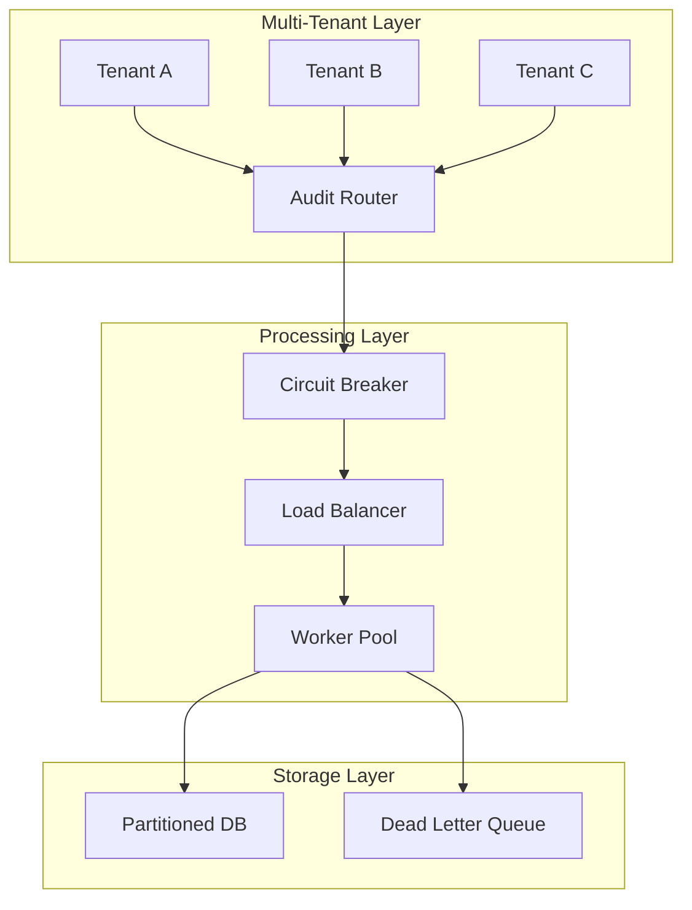

# Advanced Implementation Patterns Tutorial

This tutorial explores advanced patterns for complex healthcare environments, including multi-tenant systems, high-availability configurations, and enterprise integrations.

## 📋 Prerequisites & Overview

### Required Knowledge
- Completion of all previous tutorials
- Understanding of distributed systems concepts
- Experience with enterprise architecture patterns

### What You'll Learn
- ✅ Multi-tenant architecture with organization-based separation
- ✅ High-availability setup with circuit breakers and failover
- ✅ Enterprise EMR and healthcare system integrations
- ✅ Performance optimization for high-volume environments
- ✅ Compliance automation workflows

### Advanced Architecture



## 🔧 Advanced Implementation Patterns

### Pattern 1: Multi-Tenant Architecture

Implement organization-based audit separation:

```typescript
// multi-tenant-audit.ts
export class MultiTenantAuditService {
  private auditServices: Map<string, Audit> = new Map()
  private tenantConfigs: Map<string, TenantConfig> = new Map()

  // Get tenant-specific audit service
  async getAuditService(organizationId: string): Promise<Audit> {
    if (!this.auditServices.has(organizationId)) {
      await this.createTenantAuditService(organizationId)
    }
    return this.auditServices.get(organizationId)!
  }

  // Log with tenant isolation
  async logTenantEvent(organizationId: string, eventDetails: any): Promise<void> {
    const auditService = await this.getAuditService(organizationId)
    const tenantConfig = this.tenantConfigs.get(organizationId)
    
    // Apply tenant-specific enrichment
    const enrichedEvent = {
      ...eventDetails,
      organizationId,
      tenantContext: {
        tenantId: organizationId,
        dataPartition: this.getTenantPartition(organizationId),
        complianceProfile: tenantConfig?.complianceProfile || 'standard'
      }
    }
    
    // Validate tenant permissions
    await this.validateTenantPermissions(organizationId, enrichedEvent)
    
    await auditService.log(enrichedEvent)
  }

  private async createTenantAuditService(organizationId: string): Promise<void> {
    const tenantConfig = await this.loadTenantConfig(organizationId)
    
    const auditService = new Audit(`audit-${organizationId}`, {
      preset: tenantConfig.auditPreset || 'healthcare-default',
      compliance: tenantConfig.complianceRequirements || ['hipaa'],
      database: {
        schema: `tenant_${organizationId}`,
        partitionKey: organizationId
      }
    })

    this.auditServices.set(organizationId, auditService)
    this.tenantConfigs.set(organizationId, tenantConfig)
  }

  private async validateTenantPermissions(organizationId: string, event: any): Promise<void> {
    const config = this.tenantConfigs.get(organizationId)
    
    if (!config?.allowedEventTypes.includes(event.action)) {
      throw new Error(`Tenant ${organizationId} not authorized for event type: ${event.action}`)
    }
  }

  private getTenantPartition(organizationId: string): string {
    return `partition_${organizationId.substring(0, 2)}`
  }

  private async loadTenantConfig(organizationId: string): Promise<TenantConfig> {
    // Load from configuration service
    return {
      tenantName: `Tenant ${organizationId}`,
      auditPreset: 'healthcare-default',
      complianceRequirements: ['hipaa'],
      allowedEventTypes: ['fhir.*', 'auth.*', 'system.*'],
      complianceProfile: 'standard'
    }
  }
}

interface TenantConfig {
  tenantName: string
  auditPreset: string
  complianceRequirements: string[]
  allowedEventTypes: string[]
  complianceProfile: string
}
```

### Pattern 2: High-Availability with Circuit Breakers

Implement resilient audit system with fault tolerance:

```typescript
// circuit-breaker-audit.ts
export class CircuitBreakerAuditService {
  private circuitBreaker: CircuitBreaker
  private deadLetterQueue: DeadLetterQueue

  constructor(
    private primaryAuditService: Audit,
    private fallbackService?: Audit
  ) {
    this.circuitBreaker = new CircuitBreaker({
      failureThreshold: 5,
      timeout: 30000,
      resetTimeout: 60000
    })
    
    this.deadLetterQueue = new DeadLetterQueue()
  }

  // Resilient audit logging
  async logWithResilience(eventDetails: any): Promise<void> {
    try {
      await this.circuitBreaker.execute(async () => {
        await this.primaryAuditService.log(eventDetails)
      })
    } catch (error) {
      await this.handleAuditFailure(eventDetails, error)
    }
  }

  private async handleAuditFailure(eventDetails: any, error: Error): Promise<void> {
    // Try fallback service
    if (this.fallbackService && this.circuitBreaker.isOpen()) {
      try {
        await this.fallbackService.log({
          ...eventDetails,
          fallbackReason: 'primary_service_unavailable'
        })
        return
      } catch (fallbackError) {
        console.error('Fallback service failed:', fallbackError)
      }
    }

    // Send to dead letter queue
    await this.deadLetterQueue.enqueue({
      eventDetails,
      error: error.message,
      timestamp: new Date().toISOString(),
      retryCount: 0
    })
  }
}

class CircuitBreaker {
  private failures = 0
  private state: 'CLOSED' | 'OPEN' | 'HALF_OPEN' = 'CLOSED'
  private nextAttempt = 0

  constructor(private config: {
    failureThreshold: number
    timeout: number
    resetTimeout: number
  }) {}

  async execute<T>(operation: () => Promise<T>): Promise<T> {
    if (this.state === 'OPEN') {
      if (Date.now() < this.nextAttempt) {
        throw new Error('Circuit breaker is OPEN')
      }
      this.state = 'HALF_OPEN'
    }

    try {
      const result = await Promise.race([
        operation(),
        this.timeoutPromise()
      ])

      if (this.state === 'HALF_OPEN') {
        this.reset()
      }

      return result
    } catch (error) {
      this.recordFailure()
      throw error
    }
  }

  private recordFailure(): void {
    this.failures++
    if (this.failures >= this.config.failureThreshold) {
      this.state = 'OPEN'
      this.nextAttempt = Date.now() + this.config.resetTimeout
    }
  }

  private reset(): void {
    this.failures = 0
    this.state = 'CLOSED'
  }

  private timeoutPromise(): Promise<never> {
    return new Promise((_, reject) => {
      setTimeout(() => reject(new Error('Timeout')), this.config.timeout)
    })
  }

  isOpen(): boolean { return this.state === 'OPEN' }
}

class DeadLetterQueue {
  private queue: any[] = []

  async enqueue(item: any): Promise<void> {
    this.queue.push(item)
  }

  async dequeue(): Promise<any | null> {
    return this.queue.shift() || null
  }
}
```

### Pattern 3: Enterprise EMR Integration

Implement comprehensive EMR system integration:

```typescript
// emr-integration.ts
export class EMRIntegrationService {
  private auditService: Audit

  constructor(auditService: Audit) {
    this.auditService = auditService
  }

  // Clinical workflow auditing
  async auditClinicalWorkflow(workflow: ClinicalWorkflow): Promise<void> {
    // Audit workflow initiation
    await this.auditService.log({
      action: 'workflow.clinical.started',
      workflowId: workflow.id,
      workflowType: workflow.type,
      principalId: workflow.initiatedBy,
      patientId: workflow.patientId,
      status: 'success',
      clinicalContext: {
        encounterType: workflow.encounterType,
        department: workflow.department,
        urgency: workflow.urgency
      }
    })

    try {
      // Process workflow steps
      for (const step of workflow.steps) {
        await this.auditWorkflowStep(workflow, step)
      }

      // Audit completion
      await this.auditService.log({
        action: 'workflow.clinical.completed',
        workflowId: workflow.id,
        status: 'success',
        duration: Date.now() - workflow.startTime
      })

    } catch (error) {
      await this.auditService.log({
        action: 'workflow.clinical.failed',
        workflowId: workflow.id,
        status: 'failure',
        outcomeDescription: `Workflow failed: ${error.message}`
      })
    }
  }

  // FHIR operation with comprehensive auditing
  async auditedFHIROperation<T>(
    operation: FHIROperation,
    handler: () => Promise<T>
  ): Promise<T> {
    const operationId = this.generateOperationId()
    
    // Pre-operation audit
    await this.auditService.logFHIR({
      principalId: operation.userId,
      organizationId: operation.organizationId,
      action: `fhir.${operation.resourceType}.${operation.operation}`,
      resourceType: operation.resourceType,
      resourceId: operation.resourceId,
      status: 'attempt',
      fhirContext: {
        operationId,
        version: operation.fhirVersion,
        interaction: operation.operation
      }
    })

    try {
      const result = await handler()

      // Success audit
      await this.auditService.logFHIR({
        principalId: operation.userId,
        organizationId: operation.organizationId,
        action: `fhir.${operation.resourceType}.${operation.operation}`,
        resourceType: operation.resourceType,
        resourceId: operation.resourceId,
        status: 'success',
        fhirContext: { operationId }
      })

      return result
    } catch (error) {
      // Error audit
      await this.auditService.logFHIR({
        principalId: operation.userId,
        organizationId: operation.organizationId,
        action: `fhir.${operation.resourceType}.${operation.operation}`,
        resourceType: operation.resourceType,
        resourceId: operation.resourceId,
        status: 'failure',
        outcomeDescription: error.message,
        fhirContext: { operationId }
      })

      throw error
    }
  }

  private async auditWorkflowStep(workflow: ClinicalWorkflow, step: WorkflowStep): Promise<void> {
    await this.auditService.log({
      action: `workflow.step.${step.type}`,
      workflowId: workflow.id,
      stepId: step.id,
      principalId: workflow.currentUser || workflow.initiatedBy,
      patientId: workflow.patientId,
      status: 'success',
      stepContext: {
        stepType: step.type,
        requiredRole: step.requiredRole
      }
    })
  }

  private generateOperationId(): string {
    return `op_${Date.now()}_${Math.random().toString(36).substr(2, 9)}`
  }
}

interface ClinicalWorkflow {
  id: string
  type: string
  patientId: string
  initiatedBy: string
  currentUser?: string
  encounterType: string
  department: string
  urgency: 'low' | 'medium' | 'high' | 'critical'
  startTime: number
  steps: WorkflowStep[]
}

interface WorkflowStep {
  id: string
  type: string
  requiredRole: string
}

interface FHIROperation {
  userId: string
  organizationId: string
  resourceType: string
  resourceId?: string
  operation: string
  fhirVersion: string
}
```

### Pattern 4: Performance Optimization

Implement high-throughput audit processing:

```typescript
// high-performance-audit.ts
export class HighPerformanceAuditService {
  private batchProcessor: BatchProcessor
  private cacheManager: CacheManager

  constructor(config: PerformanceConfig) {
    this.batchProcessor = new BatchProcessor(config.batchSize, config.flushInterval)
    this.cacheManager = new CacheManager()
  }

  // High-throughput batch processing
  async logBatch(events: AuditLogEvent[]): Promise<void> {
    const partitions = this.partitionEvents(events)
    
    const promises = partitions.map(partition => 
      this.processBatch(partition)
    )

    await Promise.all(promises)
  }

  // Optimized individual logging with caching
  async logOptimized(event: AuditLogEvent): Promise<void> {
    const cacheKey = this.generateCacheKey(event)
    const cached = await this.cacheManager.get(cacheKey)

    if (cached) {
      event.correlationId = cached.correlationId
    }

    await this.batchProcessor.add(event)

    await this.cacheManager.set(cacheKey, {
      correlationId: event.correlationId,
      lastSeen: Date.now()
    }, 300)
  }

  private partitionEvents(events: AuditLogEvent[]): AuditLogEvent[][] {
    const partitionSize = Math.ceil(events.length / 4) // 4 partitions
    const partitions: AuditLogEvent[][] = []
    
    for (let i = 0; i < events.length; i += partitionSize) {
      partitions.push(events.slice(i, i + partitionSize))
    }
    
    return partitions
  }

  private async processBatch(events: AuditLogEvent[]): Promise<void> {
    // Batch database insert logic
    console.log(`Processing batch of ${events.length} events`)
  }

  private generateCacheKey(event: AuditLogEvent): string {
    return `audit:${event.action}:${event.principalId}`
  }
}

class BatchProcessor {
  private batch: AuditLogEvent[] = []

  constructor(
    private batchSize: number,
    private flushInterval: number
  ) {
    setInterval(() => this.flush(), flushInterval)
  }

  async add(event: AuditLogEvent): Promise<void> {
    this.batch.push(event)
    
    if (this.batch.length >= this.batchSize) {
      await this.flush()
    }
  }

  private async flush(): Promise<void> {
    if (this.batch.length === 0) return

    const currentBatch = [...this.batch]
    this.batch = []

    console.log(`Flushing batch of ${currentBatch.length} events`)
  }
}

class CacheManager {
  private cache: Map<string, { value: any; expiry: number }> = new Map()

  async get(key: string): Promise<any> {
    const item = this.cache.get(key)
    if (item && item.expiry > Date.now()) {
      return item.value
    }
    this.cache.delete(key)
    return null
  }

  async set(key: string, value: any, ttlSeconds: number): Promise<void> {
    this.cache.set(key, {
      value,
      expiry: Date.now() + (ttlSeconds * 1000)
    })
  }
}

interface PerformanceConfig {
  batchSize: number
  flushInterval: number
}
```

### Pattern 5: Compliance Automation

Implement automated compliance workflows:

```typescript
// compliance-automation.ts
export class ComplianceAutomationService {
  private auditService: Audit
  private reportGenerator: ReportGenerator
  private scheduler: ComplianceScheduler

  constructor(auditService: Audit) {
    this.auditService = auditService
    this.reportGenerator = new ReportGenerator(auditService)
    this.scheduler = new ComplianceScheduler()
    this.initializeAutomation()
  }

  // Automated HIPAA compliance reporting
  async generateHIPAAReport(organizationId: string, period: DateRange): Promise<HIPAAReport> {
    const auditEvents = await this.getAuditEventsForPeriod(organizationId, period)
    
    const report: HIPAAReport = {
      organizationId,
      period,
      generatedAt: new Date().toISOString(),
      phiAccessEvents: this.filterPHIEvents(auditEvents),
      authenticationEvents: this.filterAuthEvents(auditEvents),
      systemAccessEvents: this.filterSystemEvents(auditEvents),
      integrityVerification: await this.verifyIntegrity(auditEvents),
      complianceScore: this.calculateComplianceScore(auditEvents)
    }

    // Audit report generation
    await this.auditService.log({
      action: 'compliance.hipaa.report.generated',
      organizationId,
      status: 'success',
      outcomeDescription: `HIPAA compliance report generated for period ${period.start} to ${period.end}`,
      complianceContext: {
        reportType: 'HIPAA',
        eventsAnalyzed: auditEvents.length,
        complianceScore: report.complianceScore
      }
    })

    return report
  }

  // Automated data retention management
  async manageDataRetention(): Promise<void> {
    const retentionPolicies = await this.getRetentionPolicies()
    
    for (const policy of retentionPolicies) {
      const expiredEvents = await this.findExpiredEvents(policy)
      
      if (expiredEvents.length > 0) {
        await this.archiveEvents(expiredEvents)
        
        await this.auditService.log({
          action: 'compliance.data.retention.executed',
          status: 'success',
          outcomeDescription: `Archived ${expiredEvents.length} expired events according to ${policy.name}`,
          retentionContext: {
            policyName: policy.name,
            retentionPeriod: policy.retentionDays,
            archivedCount: expiredEvents.length
          }
        })
      }
    }
  }

  private initializeAutomation(): void {
    // Schedule daily compliance checks
    this.scheduler.schedule('daily-compliance-check', '0 2 * * *', async () => {
      await this.performDailyComplianceCheck()
    })

    // Schedule weekly HIPAA reports
    this.scheduler.schedule('weekly-hipaa-report', '0 1 * * 0', async () => {
      await this.generateWeeklyHIPAAReports()
    })

    // Schedule monthly data retention
    this.scheduler.schedule('monthly-retention', '0 0 1 * *', async () => {
      await this.manageDataRetention()
    })
  }

  private async performDailyComplianceCheck(): Promise<void> {
    console.log('Performing daily compliance check')
  }

  private async generateWeeklyHIPAAReports(): Promise<void> {
    console.log('Generating weekly HIPAA reports')
  }

  private filterPHIEvents(events: AuditLogEvent[]): AuditLogEvent[] {
    return events.filter(e => e.dataClassification === 'PHI')
  }

  private filterAuthEvents(events: AuditLogEvent[]): AuditLogEvent[] {
    return events.filter(e => e.action.startsWith('auth.'))
  }

  private filterSystemEvents(events: AuditLogEvent[]): AuditLogEvent[] {
    return events.filter(e => e.action.startsWith('system.'))
  }

  private async verifyIntegrity(events: AuditLogEvent[]): Promise<IntegrityResult> {
    const verifiedCount = events.filter(e => e.hash).length
    return {
      totalEvents: events.length,
      verifiedEvents: verifiedCount,
      integrityScore: verifiedCount / events.length
    }
  }

  private calculateComplianceScore(events: AuditLogEvent[]): number {
    // Compliance scoring logic
    return 0.95 // 95% compliance score
  }

  private async getAuditEventsForPeriod(orgId: string, period: DateRange): Promise<AuditLogEvent[]> {
    // Database query implementation
    return []
  }

  private async getRetentionPolicies(): Promise<RetentionPolicy[]> {
    return [
      { name: 'hipaa-6-years', retentionDays: 2190 },
      { name: 'standard-3-years', retentionDays: 1095 }
    ]
  }

  private async findExpiredEvents(policy: RetentionPolicy): Promise<AuditLogEvent[]> {
    return []
  }

  private async archiveEvents(events: AuditLogEvent[]): Promise<void> {
    console.log(`Archiving ${events.length} events`)
  }
}

class ReportGenerator {
  constructor(private auditService: Audit) {}
}

class ComplianceScheduler {
  schedule(name: string, cron: string, handler: () => Promise<void>): void {
    console.log(`Scheduled ${name} with cron: ${cron}`)
  }
}

interface DateRange {
  start: string
  end: string
}

interface HIPAAReport {
  organizationId: string
  period: DateRange
  generatedAt: string
  phiAccessEvents: AuditLogEvent[]
  authenticationEvents: AuditLogEvent[]
  systemAccessEvents: AuditLogEvent[]
  integrityVerification: IntegrityResult
  complianceScore: number
}

interface IntegrityResult {
  totalEvents: number
  verifiedEvents: number
  integrityScore: number
}

interface RetentionPolicy {
  name: string
  retentionDays: number
}
```

## 🛡️ Complete Advanced Setup

```typescript
// advanced-audit-system.ts
export class AdvancedAuditSystem {
  static async initialize(config: AdvancedConfig): Promise<{
    multiTenant: MultiTenantAuditService
    circuitBreaker: CircuitBreakerAuditService
    emrIntegration: EMRIntegrationService
    highPerformance: HighPerformanceAuditService
    complianceAutomation: ComplianceAutomationService
  }> {
    const baseAuditService = new Audit('advanced-audit-system', {
      preset: 'healthcare-enterprise',
      compliance: ['hipaa', 'gdpr', 'hitech']
    })

    const multiTenant = new MultiTenantAuditService()
    const circuitBreaker = new CircuitBreakerAuditService(baseAuditService)
    const emrIntegration = new EMRIntegrationService(baseAuditService)
    const highPerformance = new HighPerformanceAuditService(config.performance)
    const complianceAutomation = new ComplianceAutomationService(baseAuditService)

    return {
      multiTenant,
      circuitBreaker,
      emrIntegration,
      highPerformance,
      complianceAutomation
    }
  }
}

interface AdvancedConfig {
  performance: PerformanceConfig
}
```

## ✅ Verification & Testing

### Key Advanced Features to Test

- **Multi-Tenancy**: Tenant isolation and data separation
- **Circuit Breaker**: Fault tolerance and failover mechanisms
- **EMR Integration**: Clinical workflow and FHIR operation auditing
- **Performance**: High-throughput batch processing
- **Compliance**: Automated reporting and data retention

### Testing Scenarios

```typescript
// advanced-tests.ts
describe('Advanced Patterns', () => {
  test('multi-tenant isolation', async () => {
    const multiTenant = new MultiTenantAuditService()
    
    await multiTenant.logTenantEvent('org-1', { action: 'test.event' })
    await multiTenant.logTenantEvent('org-2', { action: 'test.event' })
    
    // Verify tenant isolation
  })

  test('circuit breaker functionality', async () => {
    const circuitBreaker = new CircuitBreakerAuditService(mockAuditService)
    
    // Test circuit breaker opening on failures
    // Test fallback mechanism
  })

  test('high-performance batch processing', async () => {
    const highPerf = new HighPerformanceAuditService({ batchSize: 100, flushInterval: 1000 })
    
    const events = Array(1000).fill(null).map(() => ({ action: 'test.event' }))
    await highPerf.logBatch(events)
    
    // Verify batch processing performance
  })
})
```

## ⚠️ Common Pitfalls

1. **Tenant Data Leakage**: Ensure proper isolation between tenants
2. **Circuit Breaker Tuning**: Configure appropriate thresholds for your environment
3. **Performance Optimization**: Monitor memory usage with high-volume processing
4. **Compliance Automation**: Regularly validate automated processes

## 🚀 Next Steps

After implementing advanced patterns:

1. **Performance Monitoring**: Set up comprehensive monitoring for advanced features
2. **Security Hardening**: Implement additional security measures for enterprise environments
3. **Disaster Recovery**: Plan for backup and recovery scenarios
4. **Scaling Strategy**: Prepare for horizontal scaling as needed

## 📚 Additional Resources

### Enterprise Architecture
- [Multi-Tenant Architecture Patterns](https://docs.microsoft.com/en-us/azure/architecture/guide/multitenant/overview)
- [Circuit Breaker Pattern](https://martinfowler.com/bliki/CircuitBreaker.html)
- [Enterprise Integration Patterns](https://www.enterpriseintegrationpatterns.com/)

### Healthcare Standards
- [HL7 FHIR Specification](https://hl7.org/fhir/)
- [HIPAA Compliance Guidelines](https://www.hhs.gov/hipaa/)

### Related Documentation
- [API Reference - Advanced Features](../api-reference/advanced-features.md)
- [Examples - Enterprise Scenarios](../examples/enterprise-examples.md)
- [Troubleshooting - Advanced Issues](../troubleshooting/advanced-issues.md)

---

## 💬 Support

Having issues with advanced patterns? Check the [Troubleshooting Guide](../troubleshooting/index.md) or review [Enterprise Examples](../examples/enterprise-examples.md).