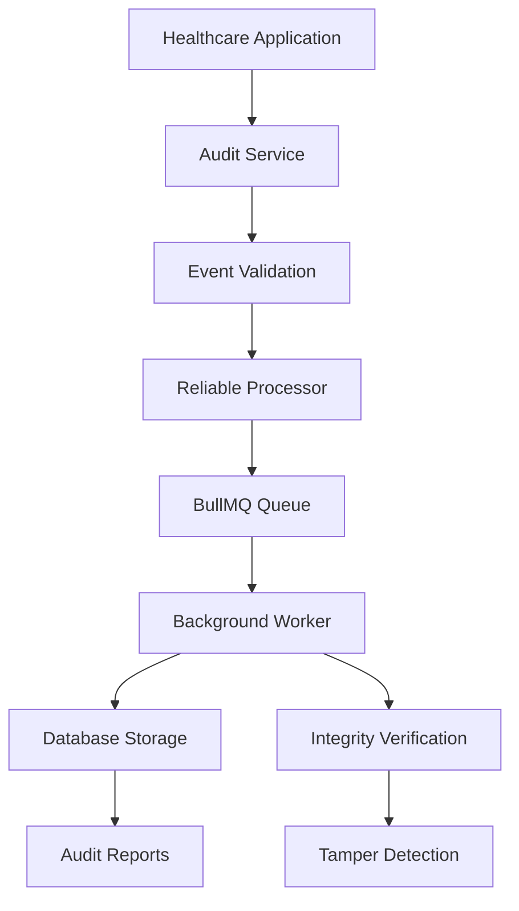

# Basic Implementation Tutorial

This tutorial will guide you through implementing a standard audit logging system for healthcare applications. You'll learn the fundamental patterns and best practices for healthcare audit logging.

## 🎯 Learning Objectives

By the end of this tutorial, you will:

- Understand the basic audit event lifecycle in healthcare systems
- Implement a production-ready audit service configuration
- Create audit events for common healthcare operations
- Set up reliable event processing with queues and retries
- Implement proper error handling and validation
- Understand performance considerations for high-volume environments

## 📋 Prerequisites

- ✅ Completed [Getting Started](../getting-started/) guide
- ✅ PostgreSQL and Redis running
- ✅ Basic TypeScript knowledge
- ✅ Understanding of healthcare workflows

## 🏗️ Architecture Overview

The basic audit implementation follows this architecture:



## 🚀 Step 1: Service Configuration

### Basic Production Configuration

Create a robust configuration suitable for healthcare environments:

```typescript
// src/config/audit-config.ts
import type { AuditConfig } from '@repo/audit'

export const createAuditConfig = (environment: string): AuditConfig => {
  const baseConfig: AuditConfig = {
    version: '1.0',
    environment,
    
    // Reliable event processing
    reliableProcessor: {
      queueName: `healthcare-audit-${environment}`,
      
      // Retry configuration for reliability
      maxRetries: 3,
      retryDelay: 1000,
      exponentialBackoff: true,
      maxRetryDelay: 10000,
      
      // Performance settings
      batchSize: 25,
      concurrency: 3,
      
      // Circuit breaker for resilience
      enableCircuitBreaker: true,
      circuitBreakerThreshold: 10,
      circuitBreakerTimeout: 30000,
      
      // Dead letter queue for failed events
      enableDLQ: true,
      dlqMaxRetries: 2
    },
    
    // Basic security (will enhance in security tutorial)
    security: {
      crypto: {
        algorithm: 'SHA-256'
      },
      enableEncryption: false, // Enable in production
      enableTamperDetection: true
    },
    
    // Basic compliance requirements
    compliance: {
      defaultRetentionDays: 2190, // 6 years for healthcare
      hipaa: {
        enabled: true,
        retentionYears: 6
      }
    },
    
    // Basic observability
    observability: {
      enableMetrics: true,
      metricsInterval: 30000,
      enableHealthChecks: true
    }
  }
  
  // Environment-specific overrides
  if (environment === 'development') {
    baseConfig.reliableProcessor!.concurrency = 1
    baseConfig.observability!.enableMetrics = false
  }
  
  if (environment === 'production') {
    baseConfig.security!.enableEncryption = true
    baseConfig.reliableProcessor!.concurrency = 10
    baseConfig.reliableProcessor!.batchSize = 100
  }
  
  return baseConfig
}
```

### Database Configuration

Ensure your database is optimized for audit workloads:

```typescript
// src/config/database-config.ts
import { drizzle } from 'drizzle-orm/postgres-js'
import postgres from 'postgres'

export const createDatabaseConnection = () => {
  const connectionString = process.env.DATABASE_URL!
  
  // Optimize for audit workloads
  const sql = postgres(connectionString, {
    max: 20,                    // Connection pool size
    idle_timeout: 20,           // Close idle connections
    connect_timeout: 10,        // Connection timeout
    prepare: false,             // Disable prepared statements for flexibility
    transform: postgres.camel,  // Convert snake_case to camelCase
    onnotice: () => {},        // Suppress notices in production
  })
  
  return drizzle(sql)
}
```

## 🚀 Step 2: Audit Service Implementation

### Core Audit Service

Create a wrapper service for your application:

```typescript
// src/services/audit-service.ts
import { Audit, type AuditConfig, type AuditLogEvent } from '@repo/audit'
import { createAuditConfig } from '../config/audit-config'
import { createDatabaseConnection } from '../config/database-config'

export class HealthcareAuditService {
  private audit: Audit
  private config: AuditConfig
  private db: ReturnType<typeof createDatabaseConnection>
  
  constructor(environment: string = process.env.NODE_ENV || 'development') {
    this.config = createAuditConfig(environment)
    this.db = createDatabaseConnection()
    this.audit = new Audit(this.config, this.db)
  }
  
  /**
   * Log a standard audit event with healthcare context
   */
  async logEvent(event: Partial<AuditLogEvent>): Promise<void> {
    // Add healthcare-specific defaults
    const healthcareEvent: AuditLogEvent = {
      ...event,
      timestamp: event.timestamp || new Date().toISOString(),
      organizationId: event.organizationId || process.env.HEALTHCARE_ORG_ID,
      dataClassification: event.dataClassification || 'GENERAL',
      
      // Ensure required fields
      action: event.action!,
      status: event.status!
    }
    
    try {
      await this.audit.log(healthcareEvent)
    } catch (error) {
      // Healthcare systems cannot afford to lose audit events
      console.error('Critical: Audit event failed to log:', error)
      
      // In production, implement fallback storage
      await this.handleAuditFailure(healthcareEvent, error)
      throw error
    }
  }
  
  /**
   * Log patient data access (common healthcare pattern)
   */
  async logPatientAccess(params: {
    principalId: string
    patientId: string
    action: string
    department?: string
    reason?: string
    sessionId?: string
  }): Promise<void> {
    await this.logEvent({
      principalId: params.principalId,
      action: `patient.${params.action}`,
      status: 'success',
      targetResourceType: 'Patient',
      targetResourceId: params.patientId,
      dataClassification: 'PHI',
      sessionContext: {
        sessionId: params.sessionId,
        department: params.department
      },
      outcomeDescription: params.reason || `Patient ${params.action} accessed`,
      details: {
        accessType: 'direct',
        department: params.department
      }
    })
  }
  
  /**
   * Log authentication events
   */
  async logAuthentication(params: {
    userId: string
    action: 'login' | 'logout' | 'password_change' | 'password_reset'
    status: 'success' | 'failure'
    method?: string
    ipAddress?: string
    userAgent?: string
    reason?: string
  }): Promise<void> {
    await this.audit.logAuth({
      principalId: params.userId,
      action: params.action,
      status: params.status,
      authMethod: params.method as any,
      reason: params.reason,
      sessionContext: {
        ipAddress: params.ipAddress,
        userAgent: params.userAgent
      },
      outcomeDescription: `User ${params.action} ${params.status}`
    })
  }
  
  /**
   * Log system events
   */
  async logSystemEvent(params: {
    component: string
    action: string
    status: 'success' | 'failure'
    details?: Record<string, any>
    performedBy?: string
  }): Promise<void> {
    await this.logEvent({
      principalId: params.performedBy || 'system',
      action: `system.${params.action}`,
      status: params.status,
      systemComponent: params.component,
      details: params.details,
      outcomeDescription: `System ${params.action} ${params.status}`
    })
  }
  
  /**
   * Handle audit failures (critical for healthcare)
   */
  private async handleAuditFailure(
    event: AuditLogEvent, 
    error: Error
  ): Promise<void> {
    // In production, implement:
    // 1. Local file backup
    // 2. Alternative queue system
    // 3. Immediate alerting
    console.error('Implementing fallback audit storage:', {
      event: event.action,
      error: error.message,
      timestamp: new Date().toISOString()
    })
  }
  
  /**
   * Get service health status
   */
  async getHealth(): Promise<{
    status: 'healthy' | 'degraded' | 'unhealthy'
    details: Record<string, any>
  }> {
    try {
      const queueStats = await this.audit.getQueueStats()
      const dbHealth = await this.checkDatabaseHealth()
      
      const isHealthy = queueStats.failed < 10 && dbHealth
      
      return {
        status: isHealthy ? 'healthy' : 'degraded',
        details: {
          queue: queueStats,
          database: dbHealth,
          timestamp: new Date().toISOString()
        }
      }
    } catch (error) {
      return {
        status: 'unhealthy',
        details: {
          error: error instanceof Error ? error.message : 'Unknown error',
          timestamp: new Date().toISOString()
        }
      }
    }
  }
  
  private async checkDatabaseHealth(): Promise<boolean> {
    try {
      await this.db.execute('SELECT 1')
      return true
    } catch {
      return false
    }
  }
  
  /**
   * Graceful shutdown
   */
  async shutdown(): Promise<void> {
    try {
      await this.audit.closeConnection()
      console.log('Healthcare audit service shutdown complete')
    } catch (error) {
      console.error('Error during audit service shutdown:', error)
    }
  }
}

// Export singleton instance
export const auditService = new HealthcareAuditService()
```

## 🚀 Step 3: Common Healthcare Patterns

### Patient Chart Access Pattern

```typescript
// src/patterns/patient-chart-access.ts
import { auditService } from '../services/audit-service'

export class PatientChartAudit {
  /**
   * Audit patient chart viewing
   */
  static async logChartView(params: {
    physicianId: string
    patientId: string
    chartSections: string[]
    department: string
    sessionId: string
    ipAddress?: string
  }): Promise<void> {
    await auditService.logEvent({
      principalId: params.physicianId,
      action: 'patient.chart.view',
      status: 'success',
      targetResourceType: 'PatientChart',
      targetResourceId: params.patientId,
      dataClassification: 'PHI',
      sessionContext: {
        sessionId: params.sessionId,
        department: params.department,
        ipAddress: params.ipAddress
      },
      details: {
        chartSections: params.chartSections,
        accessMethod: 'web_interface'
      },
      outcomeDescription: `Physician viewed patient chart sections: ${params.chartSections.join(', ')}`
    })
  }
  
  /**
   * Audit patient chart modifications
   */
  static async logChartUpdate(params: {
    physicianId: string
    patientId: string
    section: string
    changeType: 'add' | 'modify' | 'delete'
    oldValue?: string
    newValue?: string
    reason: string
  }): Promise<void> {
    await auditService.logEvent({
      principalId: params.physicianId,
      action: `patient.chart.${params.changeType}`,
      status: 'success',
      targetResourceType: 'PatientChart',
      targetResourceId: params.patientId,
      dataClassification: 'PHI',
      changes: params.oldValue && params.newValue ? {
        field: params.section,
        oldValue: params.oldValue,
        newValue: params.newValue
      } : undefined,
      details: {
        section: params.section,
        changeType: params.changeType,
        clinicalReason: params.reason
      },
      outcomeDescription: `Chart ${params.section} ${params.changeType}d: ${params.reason}`
    })
  }
}
```

### Medication Management Pattern

```typescript
// src/patterns/medication-audit.ts
import { auditService } from '../services/audit-service'

export class MedicationAudit {
  /**
   * Audit medication prescription
   */
  static async logPrescription(params: {
    prescriberId: string
    patientId: string
    medicationName: string
    dosage: string
    indication: string
    sessionId: string
  }): Promise<void> {
    await auditService.logEvent({
      principalId: params.prescriberId,
      action: 'medication.prescribe',
      status: 'success',
      targetResourceType: 'MedicationOrder',
      targetResourceId: `${params.patientId}-${Date.now()}`,
      dataClassification: 'PHI',
      sessionContext: {
        sessionId: params.sessionId
      },
      details: {
        medication: params.medicationName,
        dosage: params.dosage,
        indication: params.indication,
        prescriptionType: 'new'
      },
      outcomeDescription: `Prescribed ${params.medicationName} ${params.dosage} for ${params.indication}`
    })
  }
  
  /**
   * Audit medication administration
   */
  static async logAdministration(params: {
    nurseId: string
    patientId: string
    medicationOrderId: string
    administeredDose: string
    administrationTime: Date
    notes?: string
  }): Promise<void> {
    await auditService.logEvent({
      principalId: params.nurseId,
      action: 'medication.administer',
      status: 'success',
      targetResourceType: 'MedicationAdministration',
      targetResourceId: params.medicationOrderId,
      dataClassification: 'PHI',
      details: {
        administeredDose: params.administeredDose,
        administrationTime: params.administrationTime.toISOString(),
        notes: params.notes,
        administrationType: 'scheduled'
      },
      outcomeDescription: `Medication administered: ${params.administeredDose} at ${params.administrationTime.toISOString()}`
    })
  }
}
```

## 🚀 Step 4: Application Integration

### Express.js Middleware Integration

```typescript
// src/middleware/audit-middleware.ts
import { Request, Response, NextFunction } from 'express'
import { auditService } from '../services/audit-service'

export interface AuditableRequest extends Request {
  userId?: string
  sessionId?: string
  department?: string
}

/**
 * Middleware to automatically audit API requests
 */
export const auditMiddleware = (options: {
  auditPaths?: RegExp[]
  excludePaths?: RegExp[]
  includeRequestBody?: boolean
  includeResponseBody?: boolean
} = {}) => {
  return async (req: AuditableRequest, res: Response, next: NextFunction) => {
    const startTime = Date.now()
    
    // Check if this path should be audited
    const shouldAudit = shouldAuditRequest(req, options)
    
    if (!shouldAudit) {
      return next()
    }
    
    // Capture response
    const originalSend = res.send
    let responseBody: any
    
    res.send = function(body) {
      responseBody = body
      return originalSend.call(this, body)
    }
    
    // Continue with request
    next()
    
    // Audit after response
    res.on('finish', async () => {
      try {
        await auditAPIRequest({
          req,
          res,
          responseBody,
          duration: Date.now() - startTime,
          includeRequestBody: options.includeRequestBody,
          includeResponseBody: options.includeResponseBody
        })
      } catch (error) {
        console.error('Failed to audit API request:', error)
      }
    })
  }
}

function shouldAuditRequest(
  req: AuditableRequest, 
  options: { auditPaths?: RegExp[], excludePaths?: RegExp[] }
): boolean {
  const path = req.path
  
  // Check exclusions first
  if (options.excludePaths?.some(pattern => pattern.test(path))) {
    return false
  }
  
  // Check inclusions
  if (options.auditPaths?.some(pattern => pattern.test(path))) {
    return true
  }
  
  // Default: audit patient-related endpoints
  return /\/api\/(patients?|charts?|medications?)/.test(path)
}

async function auditAPIRequest(params: {
  req: AuditableRequest
  res: Response
  responseBody?: any
  duration: number
  includeRequestBody?: boolean
  includeResponseBody?: boolean
}): Promise<void> {
  const { req, res, duration } = params
  
  const isSuccess = res.statusCode >= 200 && res.statusCode < 400
  const action = `api.${req.method.toLowerCase()}.${req.route?.path || req.path}`
  
  await auditService.logEvent({
    principalId: req.userId || 'anonymous',
    action,
    status: isSuccess ? 'success' : 'failure',
    sessionContext: {
      sessionId: req.sessionId,
      ipAddress: req.ip,
      userAgent: req.get('User-Agent'),
      department: req.department
    },
    details: {
      method: req.method,
      path: req.path,
      statusCode: res.statusCode,
      duration,
      requestBody: params.includeRequestBody ? req.body : undefined,
      responseBody: params.includeResponseBody ? params.responseBody : undefined
    },
    outcomeDescription: `API ${req.method} ${req.path} completed with status ${res.statusCode}`
  })
}
```

### Application Setup

```typescript
// src/app.ts
import express from 'express'
import { auditMiddleware } from './middleware/audit-middleware'
import { auditService } from './services/audit-service'

const app = express()

// Basic middleware
app.use(express.json())

// Audit middleware with healthcare-specific configuration
app.use(auditMiddleware({
  auditPaths: [
    /\/api\/patients/,
    /\/api\/charts/,
    /\/api\/medications/,
    /\/api\/auth/
  ],
  excludePaths: [
    /\/health/,
    /\/metrics/,
    /\/static/
  ],
  includeRequestBody: false, // Avoid logging PHI in request bodies
  includeResponseBody: false
}))

// Health check endpoint
app.get('/health', async (req, res) => {
  const auditHealth = await auditService.getHealth()
  res.json({
    status: auditHealth.status,
    timestamp: new Date().toISOString(),
    services: {
      audit: auditHealth.details
    }
  })
})

// Graceful shutdown
process.on('SIGTERM', async () => {
  console.log('Shutting down healthcare application...')
  await auditService.shutdown()
  process.exit(0)
})

export default app
```

## 🚀 Step 5: Testing Your Implementation

### Unit Tests

```typescript
// src/__tests__/audit-service.test.ts
import { HealthcareAuditService } from '../services/audit-service'

describe('HealthcareAuditService', () => {
  let auditService: HealthcareAuditService
  
  beforeEach(() => {
    auditService = new HealthcareAuditService('test')
  })
  
  afterEach(async () => {
    await auditService.shutdown()
  })
  
  describe('logPatientAccess', () => {
    it('should log patient access with PHI classification', async () => {
      await expect(auditService.logPatientAccess({
        principalId: 'dr-123',
        patientId: 'patient-456',
        action: 'view',
        department: 'Cardiology',
        reason: 'Annual checkup review'
      })).resolves.not.toThrow()
    })
  })
  
  describe('logAuthentication', () => {
    it('should log successful login', async () => {
      await expect(auditService.logAuthentication({
        userId: 'user-123',
        action: 'login',
        status: 'success',
        method: 'password',
        ipAddress: '192.168.1.100'
      })).resolves.not.toThrow()
    })
    
    it('should log failed login with reason', async () => {
      await expect(auditService.logAuthentication({
        userId: 'user-123',
        action: 'login',
        status: 'failure',
        method: 'password',
        reason: 'Invalid credentials'
      })).resolves.not.toThrow()
    })
  })
  
  describe('getHealth', () => {
    it('should return health status', async () => {
      const health = await auditService.getHealth()
      expect(health).toHaveProperty('status')
      expect(health).toHaveProperty('details')
    })
  })
})
```

### Integration Tests

```typescript
// src/__tests__/integration/audit-flow.test.ts
import { auditService } from '../../services/audit-service'
import { db } from '@repo/audit-db'

describe('Audit Integration Flow', () => {
  it('should process audit events end-to-end', async () => {
    // Log an event
    await auditService.logPatientAccess({
      principalId: 'test-physician',
      patientId: 'test-patient-123',
      action: 'view',
      department: 'Emergency'
    })
    
    // Wait for processing
    await new Promise(resolve => setTimeout(resolve, 2000))
    
    // Verify in database
    const events = await db.select()
      .from(auditLog)
      .where(eq(auditLog.principalId, 'test-physician'))
      .limit(1)
    
    expect(events).toHaveLength(1)
    expect(events[0].action).toBe('patient.view')
    expect(events[0].dataClassification).toBe('PHI')
  })
})
```

## ✅ Verification Steps

Verify your implementation works correctly:

### 1. Database Verification

```sql
-- Check that events are being stored
SELECT 
  principal_id,
  action,
  status,
  data_classification,
  created_at
FROM audit_log 
ORDER BY created_at DESC 
LIMIT 10;
```

### 2. Queue Verification

```typescript
// Check queue health
const health = await auditService.getHealth()
console.log('Queue stats:', health.details.queue)
```

### 3. Performance Testing

```typescript
// Basic performance test
const startTime = Date.now()

// Log 100 events
for (let i = 0; i < 100; i++) {
  await auditService.logEvent({
    principalId: `test-user-${i}`,
    action: 'test.performance',
    status: 'success'
  })
}

const duration = Date.now() - startTime
console.log(`Logged 100 events in ${duration}ms (${100 / (duration / 1000)} events/second)`)
```

## 🔧 Performance Optimization

### Batch Processing for High Volume

```typescript
// For high-volume environments
const highVolumeConfig = {
  reliableProcessor: {
    batchSize: 100,        // Process 100 events at once
    concurrency: 10,       // 10 concurrent workers
    maxRetries: 5,         // Increased retries for reliability
    enableCircuitBreaker: true
  }
}
```

### Database Indexing

```sql
-- Recommended indexes for audit queries
CREATE INDEX CONCURRENTLY idx_audit_log_principal_id ON audit_log (principal_id);
CREATE INDEX CONCURRENTLY idx_audit_log_action ON audit_log (action);
CREATE INDEX CONCURRENTLY idx_audit_log_created_at ON audit_log (created_at);
CREATE INDEX CONCURRENTLY idx_audit_log_patient_lookup ON audit_log (target_resource_type, target_resource_id) WHERE target_resource_type = 'Patient';
```

## 🚨 Common Issues and Solutions

### Issue: Events Not Processing

**Symptoms**: Events logged but not appearing in database

**Debug Steps**:
```typescript
// Check queue stats
const stats = await auditService.getHealth()
console.log('Queue failed jobs:', stats.details.queue.failed)

// Check database connection
try {
  await db.execute('SELECT 1')
  console.log('Database connected')
} catch (error) {
  console.error('Database connection failed:', error)
}
```

### Issue: High Memory Usage

**Cause**: Large event objects or insufficient batch processing

**Solution**:
```typescript
// Optimize event size
const optimizedEvent = {
  principalId: 'user-123',
  action: 'patient.view',
  status: 'success',
  // Avoid large objects in details
  details: {
    patientId: 'patient-456', // Reference, not full object
    summary: 'Chart accessed'  // Summary, not full content
  }
}
```

## 📝 Next Steps

Congratulations! You've implemented a basic healthcare audit system. Next:

1. **[Healthcare Compliance](./healthcare-compliance.md)** - Add HIPAA and GDPR compliance features
2. **[FHIR Integration](./fhir-integration.md)** - Implement FHIR-specific audit patterns
3. **[Security Configuration](./security-configuration.md)** - Add cryptographic security
4. **[Monitoring Setup](./monitoring-setup.md)** - Set up comprehensive monitoring

## 💡 Best Practices Learned

- **Always validate audit events** before processing
- **Use meaningful action names** that reflect healthcare workflows
- **Include sufficient context** for compliance auditing
- **Implement proper error handling** for audit failures
- **Monitor system health** continuously
- **Design for high availability** - audit systems cannot fail
- **Consider PHI protection** in all audit data
- **Plan for compliance reporting** from day one

Your basic audit implementation is now ready for healthcare workloads!