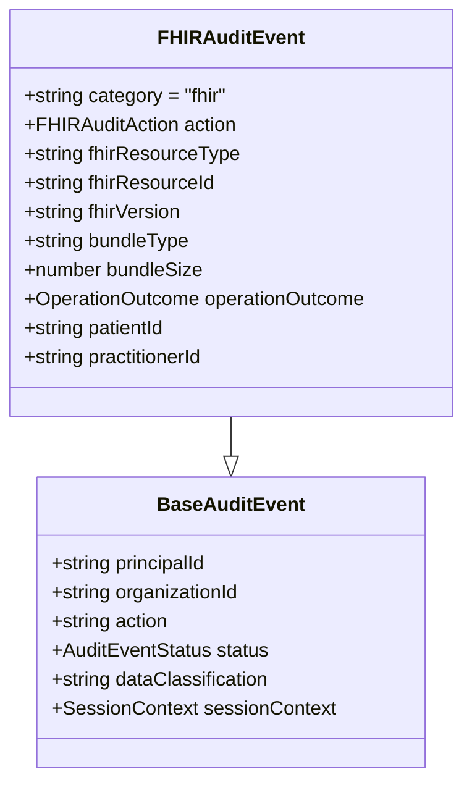

# FHIR Integration Tutorial

This tutorial guides you through implementing FHIR-compliant audit logging for healthcare applications, ensuring proper tracking of FHIR resource access and modifications while maintaining HIPAA and GDPR compliance.

## 📋 Prerequisites & Overview

### Required Knowledge
- Basic understanding of FHIR (Fast Healthcare Interoperability Resources) concepts
- Familiarity with healthcare audit requirements
- Completion of the [Basic Implementation](./basic-implementation.md) tutorial
- Understanding of TypeScript and Node.js development

### What You'll Learn
By the end of this tutorial, you will:
- ✅ Configure FHIR-specific audit logging
- ✅ Implement proper patient data access tracking
- ✅ Set up FHIR resource modification logging
- ✅ Ensure HIPAA compliance for healthcare auditing
- ✅ Handle FHIR bundle operations and versioning

### Healthcare Context
This tutorial focuses on:
- **EMR System Integration**: Electronic Medical Records audit logging
- **FHIR API Gateway**: Tracking all FHIR resource interactions
- **Clinical Workflow Auditing**: Patient care process tracking
- **Regulatory Compliance**: Meeting HIPAA and GDPR requirements

## 🏥 FHIR Event Types Overview

The audit system supports comprehensive FHIR event tracking with healthcare-specific metadata:



### Supported FHIR Actions
- **Patient Operations**: `fhir.patient.read`, `fhir.patient.update`, `fhir.patient.create`
- **Practitioner Actions**: `fhir.practitioner.read`, `fhir.practitioner.update`
- **Observation Logging**: `fhir.observation.create`, `fhir.observation.update`
- **Bundle Processing**: `fhir.bundle.transaction`, `fhir.bundle.batch`

## 🔧 Step-by-Step Implementation

### Step 1: Basic FHIR Audit Setup

First, configure your audit service for FHIR integration:

```typescript
// fhir-audit-service.ts
import { Audit } from '@repo/audit'

export class FHIRAuditService {
  private audit: Audit

  constructor() {
    this.audit = new Audit('fhir-audit-queue', {
      compliance: ['hipaa', 'gdpr'],
      preset: 'healthcare-default'
    })
  }

  // FHIR-specific logging method
  async logFHIREvent(details: FHIREventDetails): Promise<void> {
    await this.audit.logFHIR({
      principalId: details.practitionerId || details.userId,
      organizationId: details.organizationId,
      action: details.action,
      resourceType: details.resourceType,
      resourceId: details.resourceId,
      status: details.status,
      outcomeDescription: details.description,
      sessionContext: details.sessionContext,
      fhirContext: {
        version: details.fhirVersion || '4.0.1',
        interaction: details.interaction,
        compartment: details.compartment
      }
    })
  }
}

interface FHIREventDetails {
  practitionerId?: string
  userId?: string
  organizationId: string
  action: string
  resourceType: string
  resourceId: string
  status: 'attempt' | 'success' | 'failure'
  description?: string
  fhirVersion?: string
  interaction?: string
  compartment?: string
  sessionContext: {
    sessionId: string
    ipAddress: string
    userAgent: string
  }
}
```

### Step 2: Patient Data Access Logging

Implement comprehensive patient data access tracking:

```typescript
// patient-audit.ts
import { FHIRAuditService } from './fhir-audit-service'

export class PatientAuditLogger {
  constructor(private fhirAudit: FHIRAuditService) {}

  // Log patient record access
  async logPatientAccess(details: {
    patientId: string
    practitionerId: string
    organizationId: string
    accessPurpose: 'TREATMENT' | 'PAYMENT' | 'HEALTHCARE_OPERATIONS'
    sessionContext: SessionContext
  }): Promise<void> {
    try {
      await this.fhirAudit.logFHIREvent({
        practitionerId: details.practitionerId,
        organizationId: details.organizationId,
        action: 'fhir.patient.read',
        resourceType: 'Patient',
        resourceId: details.patientId,
        status: 'success',
        description: `Patient record accessed for ${details.accessPurpose}`,
        interaction: 'read',
        compartment: `Patient/${details.patientId}`,
        sessionContext: details.sessionContext
      })
    } catch (error) {
      // Log failed access attempt
      await this.fhirAudit.logFHIREvent({
        practitionerId: details.practitionerId,
        organizationId: details.organizationId,
        action: 'fhir.patient.read',
        resourceType: 'Patient',
        resourceId: details.patientId,
        status: 'failure',
        description: `Failed to access patient record: ${error.message}`,
        sessionContext: details.sessionContext
      })
      throw error
    }
  }

  // Log patient data modification
  async logPatientUpdate(details: {
    patientId: string
    practitionerId: string
    organizationId: string
    changes: Record<string, any>
    sessionContext: SessionContext
  }): Promise<void> {
    await this.fhirAudit.logFHIREvent({
      practitionerId: details.practitionerId,
      organizationId: details.organizationId,
      action: 'fhir.patient.update',
      resourceType: 'Patient',
      resourceId: details.patientId,
      status: 'success',
      description: `Patient record updated. Fields: ${Object.keys(details.changes).join(', ')}`,
      interaction: 'update',
      compartment: `Patient/${details.patientId}`,
      sessionContext: details.sessionContext
    })
  }
}

interface SessionContext {
  sessionId: string
  ipAddress: string
  userAgent: string
  geolocation?: string
}
```

### Step 3: FHIR Resource Modification Tracking

Track all FHIR resource operations comprehensively:

```typescript
// fhir-resource-tracker.ts
export class FHIRResourceTracker {
  constructor(private fhirAudit: FHIRAuditService) {}

  // Track Observation creation/updates
  async logObservationEvent(details: {
    observationId: string
    patientId: string
    practitionerId: string
    organizationId: string
    operation: 'create' | 'update' | 'delete'
    observationType: string
    sessionContext: SessionContext
  }): Promise<void> {
    await this.fhirAudit.logFHIREvent({
      practitionerId: details.practitionerId,
      organizationId: details.organizationId,
      action: `fhir.observation.${details.operation}`,
      resourceType: 'Observation',
      resourceId: details.observationId,
      status: 'success',
      description: `${details.operation} observation: ${details.observationType} for patient ${details.patientId}`,
      interaction: details.operation,
      compartment: `Patient/${details.patientId}`,
      sessionContext: details.sessionContext
    })
  }

  // Track Practitioner operations
  async logPractitionerEvent(details: {
    practitionerId: string
    organizationId: string
    operation: 'read' | 'update'
    sessionContext: SessionContext
    requestorId: string
  }): Promise<void> {
    await this.fhirAudit.logFHIREvent({
      practitionerId: details.requestorId,
      organizationId: details.organizationId,
      action: `fhir.practitioner.${details.operation}`,
      resourceType: 'Practitioner',
      resourceId: details.practitionerId,
      status: 'success',
      description: `Practitioner ${details.operation} operation`,
      interaction: details.operation,
      sessionContext: details.sessionContext
    })
  }

  // Track DiagnosticReport access
  async logDiagnosticReportAccess(details: {
    reportId: string
    patientId: string
    practitionerId: string
    organizationId: string
    reportType: string
    sessionContext: SessionContext
  }): Promise<void> {
    await this.fhirAudit.logFHIREvent({
      practitionerId: details.practitionerId,
      organizationId: details.organizationId,
      action: 'fhir.diagnosticreport.read',
      resourceType: 'DiagnosticReport',
      resourceId: details.reportId,
      status: 'success',
      description: `Accessed ${details.reportType} report for patient ${details.patientId}`,
      interaction: 'read',
      compartment: `Patient/${details.patientId}`,
      sessionContext: details.sessionContext
    })
  }
}
```

### Step 4: FHIR Bundle Operations

Handle complex FHIR bundle transactions with proper audit trails:

```typescript
// fhir-bundle-auditor.ts
export class FHIRBundleAuditor {
  constructor(private fhirAudit: FHIRAuditService) {}

  async logBundleTransaction(details: {
    bundleId: string
    bundleType: 'document' | 'message' | 'transaction' | 'batch' | 'collection'
    practitionerId: string
    organizationId: string
    resourceCount: number
    resources: Array<{
      resourceType: string
      resourceId: string
      operation: string
    }>
    sessionContext: SessionContext
  }): Promise<void> {
    // Log overall bundle operation
    await this.fhirAudit.logFHIREvent({
      practitionerId: details.practitionerId,
      organizationId: details.organizationId,
      action: `fhir.bundle.${details.bundleType}`,
      resourceType: 'Bundle',
      resourceId: details.bundleId,
      status: 'success',
      description: `Processed ${details.bundleType} bundle with ${details.resourceCount} resources`,
      interaction: 'transaction',
      sessionContext: details.sessionContext
    })

    // Log individual resource operations within bundle
    for (const resource of details.resources) {
      await this.fhirAudit.logFHIREvent({
        practitionerId: details.practitionerId,
        organizationId: details.organizationId,
        action: `fhir.${resource.resourceType.toLowerCase()}.${resource.operation}`,
        resourceType: resource.resourceType,
        resourceId: resource.resourceId,
        status: 'success',
        description: `${resource.operation} operation within bundle ${details.bundleId}`,
        interaction: resource.operation,
        sessionContext: details.sessionContext
      })
    }
  }

  async logBundleFailure(details: {
    bundleId: string
    bundleType: string
    practitionerId: string
    organizationId: string
    error: string
    partialSuccess?: boolean
    processedCount?: number
    totalCount: number
    sessionContext: SessionContext
  }): Promise<void> {
    await this.fhirAudit.logFHIREvent({
      practitionerId: details.practitionerId,
      organizationId: details.organizationId,
      action: `fhir.bundle.${details.bundleType}`,
      resourceType: 'Bundle',
      resourceId: details.bundleId,
      status: 'failure',
      description: details.partialSuccess 
        ? `Bundle partially processed: ${details.processedCount}/${details.totalCount} resources. Error: ${details.error}`
        : `Bundle processing failed: ${details.error}`,
      interaction: 'transaction',
      sessionContext: details.sessionContext
    })
  }
}
```

## 🛡️ HIPAA Compliance Integration

### Required HIPAA Fields

Ensure all FHIR audit events include required HIPAA elements:

```typescript
// hipaa-compliant-fhir-audit.ts
export class HIPAACompliantFHIRAudit {
  constructor(private fhirAudit: FHIRAuditService) {}

  async logPHIAccess(details: {
    patientId: string
    practitionerId: string
    organizationId: string
    resourceType: string
    resourceId: string
    action: string
    accessPurpose: 'TREATMENT' | 'PAYMENT' | 'HEALTHCARE_OPERATIONS'
    sessionContext: SessionContext & {
      workstationId?: string
      applicationId?: string
    }
  }): Promise<void> {
    await this.fhirAudit.logFHIREvent({
      practitionerId: details.practitionerId,
      organizationId: details.organizationId,
      action: details.action,
      resourceType: details.resourceType,
      resourceId: details.resourceId,
      status: 'success',
      description: `PHI access for ${details.accessPurpose}: ${details.resourceType}/${details.resourceId}`,
      sessionContext: {
        ...details.sessionContext,
        // HIPAA requires network access point identification
        ipAddress: details.sessionContext.ipAddress,
        // HIPAA requires user identification
        userId: details.practitionerId,
        // Additional HIPAA context
        workstationId: details.sessionContext.workstationId,
        applicationId: details.sessionContext.applicationId
      }
    })

    // Set appropriate data classification and retention
    await this.setHIPAAClassification(details.resourceType)
  }

  private async setHIPAAClassification(resourceType: string): Promise<void> {
    const phiResourceTypes = [
      'Patient', 'Observation', 'DiagnosticReport', 'Condition',
      'MedicationRequest', 'AllergyIntolerance', 'Immunization',
      'Procedure', 'Encounter', 'CarePlan'
    ]

    if (phiResourceTypes.includes(resourceType)) {
      // This would be handled by the audit system's compliance engine
      console.log(`Resource ${resourceType} classified as PHI with 6-year retention`)
    }
  }
}
```

### GDPR Compliance for FHIR

Handle GDPR requirements for European patients:

```typescript
// gdpr-fhir-compliance.ts
export class GDPRFHIRCompliance {
  constructor(private fhirAudit: FHIRAuditService) {}

  async logEuropeanPatientAccess(details: {
    patientId: string
    practitionerId: string
    organizationId: string
    legalBasis: 'consent' | 'vital_interests' | 'public_task' | 'legitimate_interests'
    dataSubjectLocation: string
    sessionContext: SessionContext
  }): Promise<void> {
    await this.fhirAudit.logFHIREvent({
      practitionerId: details.practitionerId,
      organizationId: details.organizationId,
      action: 'fhir.patient.read',
      resourceType: 'Patient',
      resourceId: details.patientId,
      status: 'success',
      description: `GDPR-compliant patient access. Legal basis: ${details.legalBasis}`,
      sessionContext: {
        ...details.sessionContext,
        // GDPR requires legal basis tracking
        legalBasis: details.legalBasis,
        dataSubjectLocation: details.dataSubjectLocation
      }
    })
  }
}
```

## 🔍 Configuration Examples

### Complete FHIR Audit Configuration

```typescript
// fhir-audit-config.ts
import { Audit } from '@repo/audit'

export const createFHIRAuditService = () => {
  return new Audit('fhir-operations', {
    // Healthcare compliance presets
    preset: 'healthcare-fhir',
    compliance: ['hipaa', 'gdpr', 'hitech'],
    
    // FHIR-specific configuration
    config: {
      // Data classification for FHIR resources
      dataClassification: {
        'Patient': 'PHI',
        'Observation': 'PHI',
        'DiagnosticReport': 'PHI',
        'Condition': 'PHI',
        'MedicationRequest': 'PHI',
        'Practitioner': 'CONFIDENTIAL',
        'Organization': 'INTERNAL'
      },
      
      // Retention policies by resource type
      retentionPolicies: {
        'PHI': 'hipaa-6-years',
        'CONFIDENTIAL': 'standard-3-years',
        'INTERNAL': 'minimal-1-year'
      },
      
      // FHIR version tracking
      fhirVersion: '4.0.1',
      
      // Required HIPAA fields
      requiredFields: [
        'principalId',
        'action',
        'targetResourceType',
        'targetResourceId',
        'timestamp',
        'sessionContext.ipAddress',
        'sessionContext.sessionId'
      ]
    }
  })
}
```

### EMR Integration Example

```typescript
// emr-fhir-integration.ts
export class EMRFHIRAuditIntegration {
  private fhirAudit: FHIRAuditService

  constructor() {
    this.fhirAudit = new FHIRAuditService()
  }

  // Middleware for FHIR API endpoints
  async auditFHIRAPICall(req: any, res: any, next: any): Promise<void> {
    const startTime = Date.now()
    
    try {
      // Execute the FHIR operation
      await next()
      
      // Log successful operation
      await this.fhirAudit.logFHIREvent({
        practitionerId: req.user.practitionerId,
        organizationId: req.user.organizationId,
        action: `fhir.${req.params.resourceType}.${req.method.toLowerCase()}`,
        resourceType: req.params.resourceType,
        resourceId: req.params.id,
        status: 'success',
        description: `FHIR ${req.method} operation completed`,
        interaction: req.method.toLowerCase(),
        compartment: req.params.id ? `${req.params.resourceType}/${req.params.id}` : undefined,
        sessionContext: {
          sessionId: req.sessionId,
          ipAddress: req.ip,
          userAgent: req.get('User-Agent'),
          processingTime: Date.now() - startTime
        }
      })
    } catch (error) {
      // Log failed operation
      await this.fhirAudit.logFHIREvent({
        practitionerId: req.user.practitionerId,
        organizationId: req.user.organizationId,
        action: `fhir.${req.params.resourceType}.${req.method.toLowerCase()}`,
        resourceType: req.params.resourceType,
        resourceId: req.params.id,
        status: 'failure',
        description: `FHIR ${req.method} operation failed: ${error.message}`,
        sessionContext: {
          sessionId: req.sessionId,
          ipAddress: req.ip,
          userAgent: req.get('User-Agent'),
          processingTime: Date.now() - startTime
        }
      })
      throw error
    }
  }
}
```

## ✅ Verification & Testing

### Test FHIR Audit Events

Create comprehensive tests for your FHIR audit implementation:

```typescript
// fhir-audit.test.ts
import { FHIRAuditService } from './fhir-audit-service'

describe('FHIR Audit Integration', () => {
  let fhirAudit: FHIRAuditService

  beforeEach(() => {
    fhirAudit = new FHIRAuditService()
  })

  test('should log patient access with all required fields', async () => {
    const mockSessionContext = {
      sessionId: 'sess-123',
      ipAddress: '192.168.1.100',
      userAgent: 'EMR-App/1.0'
    }

    await fhirAudit.logFHIREvent({
      practitionerId: 'prac-123',
      organizationId: 'org-hospital-1',
      action: 'fhir.patient.read',
      resourceType: 'Patient',
      resourceId: 'patient-456',
      status: 'success',
      description: 'Patient chart reviewed for treatment',
      interaction: 'read',
      compartment: 'Patient/patient-456',
      sessionContext: mockSessionContext
    })

    // Verify audit event was logged correctly
    // Implementation depends on your testing framework
  })

  test('should handle FHIR bundle transactions', async () => {
    const bundleAuditor = new FHIRBundleAuditor(fhirAudit)
    
    await bundleAuditor.logBundleTransaction({
      bundleId: 'bundle-789',
      bundleType: 'transaction',
      practitionerId: 'prac-123',
      organizationId: 'org-hospital-1',
      resourceCount: 3,
      resources: [
        { resourceType: 'Patient', resourceId: 'patient-456', operation: 'update' },
        { resourceType: 'Observation', resourceId: 'obs-789', operation: 'create' },
        { resourceType: 'DiagnosticReport', resourceId: 'report-101', operation: 'create' }
      ],
      sessionContext: {
        sessionId: 'sess-456',
        ipAddress: '192.168.1.101',
        userAgent: 'Bundle-Processor/1.0'
      }
    })

    // Verify bundle and individual resource events were logged
  })
})
```

### Verification Checklist

Ensure your FHIR integration meets all requirements:

- [ ] **Patient Access Logging**: All patient data access is logged with proper context
- [ ] **Resource Modification Tracking**: Create, update, delete operations are audited
- [ ] **Bundle Transaction Auditing**: Complex FHIR transactions are properly logged
- [ ] **HIPAA Compliance**: All required fields are captured for PHI access
- [ ] **GDPR Compliance**: Legal basis and data subject rights are tracked
- [ ] **Error Handling**: Failed operations are logged with appropriate detail
- [ ] **Performance**: Audit logging doesn't significantly impact FHIR API performance
- [ ] **Data Classification**: Resources are properly classified (PHI, CONFIDENTIAL, etc.)

## ⚠️ Common Pitfalls & Solutions

### 1. Missing Patient Context

**Problem**: FHIR resource access not properly linked to patient compartments.

**Solution**:
```typescript
// Always include patient compartment for PHI resources
const compartment = isPatientResource(resourceType) 
  ? `Patient/${patientId}` 
  : undefined
```

### 2. Bundle Transaction Complexity

**Problem**: Complex bundle transactions not properly audited.

**Solution**:
- Log overall bundle operation first
- Then log individual resource operations
- Handle partial failures appropriately

### 3. Performance Impact

**Problem**: Audit logging slowing down FHIR operations.

**Solution**:
```typescript
// Use asynchronous logging with queuing
await this.fhirAudit.logFHIREvent(details, { 
  async: true,
  queue: 'fhir-audit-queue' 
})
```

### 4. Compliance Field Missing

**Problem**: Missing required HIPAA or GDPR fields.

**Solution**:
- Use preset configurations for compliance
- Validate required fields before logging
- Implement middleware to automatically capture session context

## 🚀 Next Steps

After completing this tutorial, you're ready for:

1. **[Security Configuration](./security-configuration.md)** - Implement cryptographic security features
2. **[Monitoring Setup](./monitoring-setup.md)** - Add comprehensive monitoring and observability
3. **[Advanced Patterns](./advanced-patterns.md)** - Explore complex healthcare integration patterns

## 📚 Additional Resources

### FHIR Resources
- [FHIR R4 Specification](https://hl7.org/fhir/R4/)
- [FHIR Security](https://hl7.org/fhir/security.html)
- [FHIR Audit Event Resource](https://hl7.org/fhir/auditevent.html)

### Compliance Resources
- [HIPAA Audit Log Requirements](https://www.hhs.gov/hipaa/for-professionals/security/laws-regulations/index.html)
- [GDPR Article 30 - Records of Processing](https://gdpr.eu/article-30-records-of-processing-activities/)

### Related Documentation
- [API Reference - FHIR Methods](../api-reference/audit-core.md#fhir-methods)
- [Examples - Healthcare Scenarios](../examples/healthcare-scenarios.md)
- [Guides - Security Best Practices](../guides/security.md)

---

## 💬 Support

Having issues with FHIR integration? Check the [Troubleshooting Guide](../troubleshooting/index.md) or review [Healthcare Examples](../examples/healthcare-scenarios.md) for additional patterns.