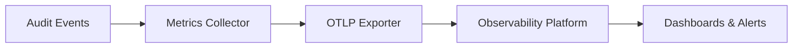

# Monitoring & Observability Tutorial

This tutorial guides you through implementing comprehensive monitoring, metrics collection, and observability for your audit system.

## 📋 Prerequisites & Overview

### What You'll Learn
- ✅ Configure OTLP (OpenTelemetry Protocol) integration
- ✅ Implement metrics collection for performance monitoring
- ✅ Set up distributed tracing across components
- ✅ Create monitoring dashboards and alerts

### Architecture



## 🔧 Step-by-Step Implementation

### Step 1: OTLP Configuration

Configure OpenTelemetry Protocol for different platforms:

```typescript
// observability-config.ts
export interface ObservabilityConfig {
  tracing: {
    enabled: boolean
    serviceName: string
    sampleRate: number
    exporterType: 'otlp'
    exporterEndpoint?: string
    headers?: Record<string, string>
  }
  metrics: {
    enabled: boolean
    collectionInterval: number
    exporterType: 'prometheus'
  }
}

export const createObservabilityConfig = (platform: 'grafana' | 'datadog'): ObservabilityConfig => {
  const baseConfig: ObservabilityConfig = {
    tracing: {
      enabled: true,
      serviceName: 'audit-system',
      sampleRate: 0.1,
      exporterType: 'otlp'
    },
    metrics: {
      enabled: true,
      collectionInterval: 30000,
      exporterType: 'prometheus'
    }
  }

  switch (platform) {
    case 'grafana':
      return {
        ...baseConfig,
        tracing: {
          ...baseConfig.tracing,
          exporterEndpoint: 'https://tempo-us-central1.grafana.net/tempo/v1/traces',
          headers: { 'Authorization': `Basic ${process.env.GRAFANA_TEMPO_AUTH}` }
        }
      }
    case 'datadog':
      return {
        ...baseConfig,
        tracing: {
          ...baseConfig.tracing,
          exporterEndpoint: 'https://trace.agent.datadoghq.com/v1/traces',
          headers: { 'DD-API-KEY': process.env.DATADOG_API_KEY! }
        }
      }
  }
}
```

### Step 2: Metrics Collection

Implement comprehensive metrics collection:

```typescript
// metrics-collector.ts
export class AuditMetricsCollector {
  private metrics: Map<string, MetricData> = new Map()

  // Record audit events
  recordAuditEvent(eventType: string, status: 'success' | 'failure', latency: number): void {
    this.incrementCounter(`audit_events_total`, { event_type: eventType, status })
    this.recordHistogram(`audit_event_duration_ms`, latency, { event_type: eventType })
  }

  // Record FHIR operations
  recordFHIREvent(resourceType: string, operation: string, status: string, latency: number): void {
    this.incrementCounter(`fhir_operations_total`, { resource_type: resourceType, operation, status })
    this.recordHistogram(`fhir_operation_duration_ms`, latency, { resource_type: resourceType })
    
    if (this.isPHIResource(resourceType)) {
      this.incrementCounter(`phi_access_total`, { resource_type: resourceType, operation })
    }
  }

  // Record security events
  recordSecurityEvent(eventType: string, success: boolean): void {
    this.incrementCounter(`security_events_total`, {
      event_type: eventType,
      status: success ? 'success' : 'failure'
    })

    if (eventType === 'tampering_detected' && !success) {
      this.incrementCounter(`security_incidents_total`, { incident_type: 'tampering' })
    }
  }

  // Record system health
  recordSystemHealth(component: string, healthy: boolean, responseTime: number): void {
    this.recordGauge(`system_health_status`, healthy ? 1 : 0, { component })
    this.recordHistogram(`health_check_duration_ms`, responseTime, { component })
  }

  private incrementCounter(name: string, labels: Record<string, string>): void {
    const key = this.getMetricKey(name, labels)
    const current = this.metrics.get(key) || { value: 0, type: 'counter', labels }
    current.value = (current.value as number) + 1
    this.metrics.set(key, current)
  }

  private recordGauge(name: string, value: number, labels: Record<string, string>): void {
    const key = this.getMetricKey(name, labels)
    this.metrics.set(key, { value, type: 'gauge', labels })
  }

  private recordHistogram(name: string, value: number, labels: Record<string, string>): void {
    const key = this.getMetricKey(name, labels)
    const current = this.metrics.get(key) || { value: [], type: 'histogram', labels }
    
    if (Array.isArray(current.value)) {
      current.value.push(value)
      if (current.value.length > 1000) current.value = current.value.slice(-1000)
    }
    
    this.metrics.set(key, current)
  }

  private isPHIResource(resourceType: string): boolean {
    return ['Patient', 'Observation', 'DiagnosticReport', 'Condition'].includes(resourceType)
  }

  private getMetricKey(name: string, labels: Record<string, string>): string {
    const labelStr = Object.entries(labels)
      .sort(([a], [b]) => a.localeCompare(b))
      .map(([k, v]) => `${k}="${v}"`)
      .join(',')
    return `${name}{${labelStr}}`
  }
}

interface MetricData {
  value: number | number[]
  type: 'counter' | 'gauge' | 'histogram'
  labels: Record<string, string>
}
```

### Step 3: Distributed Tracing

Implement tracing across audit operations:

```typescript
// distributed-tracing.ts
export class AuditTracer {
  private tracer: any

  constructor(config: ObservabilityConfig) {
    this.initializeTracer(config)
  }

  // Trace audit event processing
  async traceAuditOperation<T>(
    operationName: string,
    attributes: Record<string, any>,
    operation: () => Promise<T>
  ): Promise<T> {
    const span = this.tracer.startSpan(`audit.${operationName}`, { attributes })

    try {
      const result = await operation()
      span.setStatus({ code: 1 }) // OK
      return result
    } catch (error) {
      span.setStatus({ code: 2, message: error.message }) // ERROR
      throw error
    } finally {
      span.end()
    }
  }

  // Trace FHIR operations
  async traceFHIROperation<T>(
    resourceType: string,
    operation: string,
    handler: () => Promise<T>
  ): Promise<T> {
    return this.traceAuditOperation(
      `fhir.${resourceType.toLowerCase()}.${operation}`,
      { 'fhir.resource.type': resourceType, 'fhir.operation': operation },
      handler
    )
  }

  // Trace security operations
  async traceSecurityOperation<T>(
    operationType: string,
    operation: () => Promise<T>
  ): Promise<T> {
    return this.traceAuditOperation(
      `security.${operationType}`,
      { 'security.operation.type': operationType },
      operation
    )
  }

  private initializeTracer(config: ObservabilityConfig): void {
    console.log(`Initializing tracer: ${config.tracing.serviceName}`)
  }
}
```

### Step 4: Dashboard & Alerts

Configure monitoring dashboards and alerts:

```typescript
// dashboard-config.ts
export class DashboardManager {
  generateGrafanaDashboard() {
    return {
      dashboard: {
        title: 'Audit System Monitoring',
        panels: [
          {
            title: 'Events/sec',
            type: 'stat',
            targets: [{ expr: 'sum(rate(audit_events_total[5m]))' }]
          },
          {
            title: 'Success Rate',
            type: 'stat',
            targets: [{ expr: 'sum(rate(audit_events_total{status="success"}[5m])) / sum(rate(audit_events_total[5m]))' }]
          },
          {
            title: 'Processing Latency',
            type: 'graph',
            targets: [
              { expr: 'histogram_quantile(0.95, rate(audit_event_duration_ms_bucket[5m]))', legendFormat: '95th percentile' },
              { expr: 'histogram_quantile(0.50, rate(audit_event_duration_ms_bucket[5m]))', legendFormat: '50th percentile' }
            ]
          }
        ]
      }
    }
  }

  generateAlertingRules() {
    return {
      groups: [{
        name: 'audit_alerts',
        rules: [
          {
            alert: 'HighFailureRate',
            expr: 'sum(rate(audit_events_total{status="failure"}[5m])) / sum(rate(audit_events_total[5m])) > 0.05',
            for: '10m',
            labels: { severity: 'critical' },
            annotations: { summary: 'High audit failure rate detected' }
          },
          {
            alert: 'SecurityTampering',
            expr: 'increase(security_incidents_total{incident_type="tampering"}[5m]) > 0',
            labels: { severity: 'critical' },
            annotations: { summary: 'SECURITY: Tampering detected' }
          }
        ]
      }]
    }
  }
}
```

### Step 5: Health Monitoring

Implement automated health checks:

```typescript
// health-monitor.ts
export class HealthMonitor {
  private metricsCollector: AuditMetricsCollector

  constructor(metricsCollector: AuditMetricsCollector) {
    this.metricsCollector = metricsCollector
    this.startHealthChecks()
  }

  private startHealthChecks(): void {
    setInterval(async () => {
      await this.checkDatabase()
      await this.checkRedis()
      await this.checkKMS()
    }, 15000)
  }

  private async checkDatabase(): Promise<void> {
    const startTime = Date.now()
    try {
      // Simulate health check
      await new Promise(resolve => setTimeout(resolve, 100))
      this.metricsCollector.recordSystemHealth('database', true, Date.now() - startTime)
    } catch {
      this.metricsCollector.recordSystemHealth('database', false, Date.now() - startTime)
    }
  }

  private async checkRedis(): Promise<void> {
    const startTime = Date.now()
    try {
      await new Promise(resolve => setTimeout(resolve, 50))
      this.metricsCollector.recordSystemHealth('redis', true, Date.now() - startTime)
    } catch {
      this.metricsCollector.recordSystemHealth('redis', false, Date.now() - startTime)
    }
  }

  private async checkKMS(): Promise<void> {
    const startTime = Date.now()
    try {
      await new Promise(resolve => setTimeout(resolve, 200))
      this.metricsCollector.recordSystemHealth('kms', true, Date.now() - startTime)
    } catch {
      this.metricsCollector.recordSystemHealth('kms', false, Date.now() - startTime)
    }
  }
}
```

## 🛡️ Complete Setup Example

```typescript
// complete-monitoring.ts
export class CompleteMonitoringSetup {
  static async initialize() {
    const config = createObservabilityConfig('grafana')
    const metricsCollector = new AuditMetricsCollector()
    const tracer = new AuditTracer(config)
    const healthMonitor = new HealthMonitor(metricsCollector)
    const dashboardManager = new DashboardManager()

    return { metricsCollector, tracer, healthMonitor, dashboardManager }
  }
}

// Usage with audit service
export class MonitoredAuditService {
  constructor(
    private auditService: Audit,
    private metricsCollector: AuditMetricsCollector,
    private tracer: AuditTracer
  ) {}

  async logAuditEvent(eventDetails: any): Promise<void> {
    const startTime = Date.now()
    
    await this.tracer.traceAuditOperation('log_event', eventDetails, async () => {
      try {
        await this.auditService.log(eventDetails)
        this.metricsCollector.recordAuditEvent(eventDetails.action, 'success', Date.now() - startTime)
      } catch (error) {
        this.metricsCollector.recordAuditEvent(eventDetails.action, 'failure', Date.now() - startTime)
        throw error
      }
    })
  }
}
```

## ✅ Verification & Testing

### Key Metrics to Monitor

- **Audit Events**: `audit_events_total`, `audit_event_duration_ms`
- **FHIR Operations**: `fhir_operations_total`, `phi_access_total`
- **Security**: `security_events_total`, `security_incidents_total`
- **System Health**: `system_health_status`, `health_check_duration_ms`

### Critical Alerts

- **High Failure Rate**: >5% events failing
- **Security Tampering**: Any tampering incidents
- **High Latency**: >5s processing time
- **System Unhealthy**: Component health failures

## ⚠️ Common Pitfalls

1. **High Cardinality Metrics**: Limit unique label combinations
2. **Trace Sampling**: Use appropriate sampling rates (0.1 for production)
3. **Alert Fatigue**: Tune thresholds and severity levels

## 🚀 Next Steps

1. **[Advanced Patterns](./advanced-patterns.md)** - Complex implementation patterns
2. **[Troubleshooting Guide](../troubleshooting/index.md)** - Debug monitoring issues

## 📚 Resources

- [Grafana Documentation](https://grafana.com/docs/)
- [Prometheus Documentation](https://prometheus.io/docs/)
- [OpenTelemetry Documentation](https://opentelemetry.io/docs/)
- [API Reference - Observability](../api-reference/observability.md)

---

Having monitoring issues? Check the [Troubleshooting Guide](../troubleshooting/index.md) for solutions.