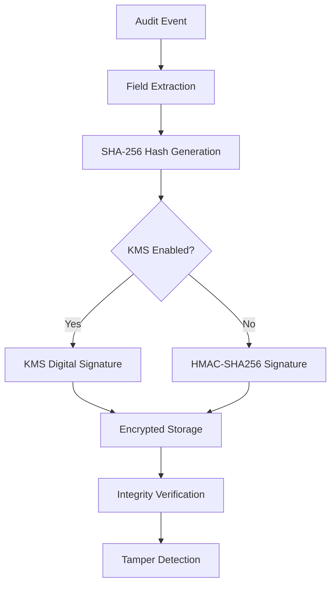

# Security Configuration Tutorial

This tutorial guides you through implementing cryptographic security features, KMS integration, and secure audit trail management for healthcare applications requiring HIPAA and GDPR compliance.

## 📋 Prerequisites & Overview

### Required Knowledge
- Understanding of cryptographic concepts (hashing, digital signatures, HMAC)
- Familiarity with healthcare security requirements
- Completion of [Basic Implementation](./basic-implementation.md) and [FHIR Integration](./fhir-integration.md) tutorials

### What You'll Learn
- ✅ Configure SHA-256 integrity verification for audit events
- ✅ Implement HMAC-SHA256 digital signatures for tamper detection
- ✅ Set up Infisical KMS integration for enterprise key management
- ✅ Configure encrypted configuration management
- ✅ Implement threat mitigation and secure transmission

### Security Architecture Overview



## 🔐 Security Foundation

### Cryptographic Protocols

The audit system implements a two-layer security approach:

1. **Data Integrity Layer**: SHA-256 hashing for tamper detection
2. **Authentication Layer**: HMAC-SHA256 or KMS-based digital signatures

### Supported Signing Algorithms

```typescript
export type SigningAlgorithm = 
    | 'HMAC-SHA256'                    // Local HMAC signing
    | 'RSASSA_PSS_SHA_256'            // RSA PSS with SHA-256
    | 'RSASSA_PSS_SHA_384'            // RSA PSS with SHA-384
    | 'RSASSA_PSS_SHA_512'            // RSA PSS with SHA-512
    | 'RSASSA_PKCS1_V1_5_SHA_256'     // RSA PKCS#1 v1.5 with SHA-256
    | 'RSASSA_PKCS1_V1_5_SHA_384'     // RSA PKCS#1 v1.5 with SHA-384
    | 'RSASSA_PKCS1_V1_5_SHA_512'     // RSA PKCS#1 v1.5 with SHA-512
```

## 🔧 Step-by-Step Implementation

### Step 1: Basic Cryptographic Configuration

Configure core cryptographic settings:

```typescript
// security-config.ts
import { Audit } from '@repo/audit'

export interface SecurityConfig {
  cryptography: {
    hashingEnabled: boolean
    signingEnabled: boolean
    hashAlgorithm: 'SHA-256'
    signingAlgorithm: SigningAlgorithm
  }
  kms?: {
    enabled: boolean
    provider: 'infisical'
    configuration: InfisicalKMSConfig
  }
  threatMitigation: {
    tamperDetection: boolean
    encryptedTransmission: boolean
    secureStorage: boolean
  }
}

export const createSecureAuditService = (config: SecurityConfig) => {
  return new Audit('secure-audit-queue', {
    preset: 'healthcare-secure',
    compliance: ['hipaa', 'gdpr'],
    security: {
      generateHash: config.cryptography.hashingEnabled,
      generateSignature: config.cryptography.signingEnabled,
      hashAlgorithm: config.cryptography.hashAlgorithm,
      signingAlgorithm: config.cryptography.signingAlgorithm,
      kms: config.kms?.enabled ? {
        provider: config.kms.provider,
        config: config.kms.configuration
      } : undefined
    }
  })
}
```

### Step 2: SHA-256 Hash Generation Setup

Implement deterministic hash generation:

```typescript
// hash-integrity-service.ts
import { CryptoService } from '@repo/audit'

export class HashIntegrityService {
  private crypto: CryptoService

  constructor() {
    this.crypto = new CryptoService()
  }

  async generateEventHash(event: AuditLogEvent): Promise<string> {
    const hashableFields = this.extractHashableFields(event)
    const hashInput = this.createHashInput(hashableFields)
    return await this.crypto.sha256(hashInput)
  }

  async verifyEventIntegrity(event: AuditLogEvent, expectedHash: string): Promise<boolean> {
    const computedHash = await this.generateEventHash(event)
    return computedHash === expectedHash
  }

  private extractHashableFields(event: AuditLogEvent): Record<string, any> {
    return {
      timestamp: event.timestamp,
      principalId: event.principalId,
      action: event.action,
      targetResourceType: event.targetResourceType,
      targetResourceId: event.targetResourceId,
      status: event.status,
      organizationId: event.organizationId
    }
  }

  private createHashInput(fields: Record<string, any>): string {
    const sortedEntries = Object.entries(fields)
      .filter(([_, value]) => value !== undefined && value !== null)
      .sort(([a], [b]) => a.localeCompare(b))
      .map(([key, value]) => `${key}:${this.serializeValue(value)}`)
      
    return sortedEntries.join('|')
  }

  private serializeValue(value: any): string {
    if (typeof value === 'object') {
      return JSON.stringify(value, Object.keys(value).sort())
    }
    return String(value)
  }
}
```

### Step 3: HMAC-SHA256 Digital Signatures

Implement HMAC-based signatures:

```typescript
// signature-service.ts
export class SignatureService {
  private crypto: CryptoService
  private secretKey: string

  constructor(secretKey: string) {
    this.crypto = new CryptoService()
    this.secretKey = secretKey
  }

  async generateEventSignature(event: AuditLogEvent): Promise<EventSignatureResponse> {
    const eventHash = await this.generateEventHash(event)
    const signature = await this.generateHMACSignature(eventHash)
    
    return {
      signature,
      algorithm: 'HMAC-SHA256',
      keyId: this.getKeyFingerprint(),
      timestamp: new Date().toISOString()
    }
  }

  async verifyEventSignature(
    event: AuditLogEvent, 
    signatureResponse: EventSignatureResponse
  ): Promise<boolean> {
    try {
      const expectedSignature = await this.generateEventSignature(event)
      return this.constantTimeCompare(
        signatureResponse.signature,
        expectedSignature.signature
      )
    } catch (error) {
      return false
    }
  }

  private async generateHMACSignature(hash: string): Promise<string> {
    const encoder = new TextEncoder()
    const keyData = encoder.encode(this.secretKey)
    const hashData = encoder.encode(hash)

    const cryptoKey = await crypto.subtle.importKey(
      'raw',
      keyData,
      { name: 'HMAC', hash: 'SHA-256' },
      false,
      ['sign']
    )

    const signature = await crypto.subtle.sign('HMAC', cryptoKey, hashData)
    
    return Array.from(new Uint8Array(signature))
      .map(byte => byte.toString(16).padStart(2, '0'))
      .join('')
  }

  private constantTimeCompare(a: string, b: string): boolean {
    if (a.length !== b.length) return false
    
    let result = 0
    for (let i = 0; i < a.length; i++) {
      result |= a.charCodeAt(i) ^ b.charCodeAt(i)
    }
    return result === 0
  }
}

interface EventSignatureResponse {
  signature: string
  algorithm: SigningAlgorithm
  keyId: string
  timestamp: string
}
```

### Step 4: Infisical KMS Integration

Set up enterprise key management:

```typescript
// kms-security-service.ts
import { InfisicalKmsClient } from '@repo/infisical-kms'

export class KMSSecurityService {
  private kmsClient: InfisicalKmsClient
  private crypto: CryptoService

  constructor(kmsConfig: InfisicalKMSConfig) {
    this.kmsClient = new InfisicalKmsClient(kmsConfig)
    this.crypto = new CryptoService()
  }

  async generateKMSSignature(
    event: AuditLogEvent,
    signingAlgorithm: SigningAlgorithm = 'RSASSA_PSS_SHA_256'
  ): Promise<EventSignatureResponse> {
    const eventHash = await this.crypto.generateEventHash(event)
    
    const signatureResult = await this.kmsClient.sign({
      keyId: process.env.AUDIT_SIGNING_KEY_ID!,
      algorithm: signingAlgorithm,
      message: eventHash,
      messageType: 'RAW'
    })

    return {
      signature: signatureResult.signature,
      algorithm: signingAlgorithm,
      keyId: signatureResult.keyId,
      timestamp: new Date().toISOString(),
      kmsProvider: 'infisical'
    }
  }

  async verifyKMSSignature(
    event: AuditLogEvent,
    signatureResponse: EventSignatureResponse
  ): Promise<boolean> {
    try {
      const eventHash = await this.crypto.generateEventHash(event)
      
      const verificationResult = await this.kmsClient.verify({
        keyId: signatureResponse.keyId,
        algorithm: signatureResponse.algorithm,
        message: eventHash,
        signature: signatureResponse.signature,
        messageType: 'RAW'
      })

      return verificationResult.isValid
    } catch (error) {
      return false
    }
  }

  async rotateSigningKeys(): Promise<void> {
    const newKey = await this.kmsClient.createKey({
      type: 'ASYMMETRIC_SIGN',
      algorithm: 'RSASSA_PSS_SHA_256',
      usage: ['SIGN', 'VERIFY'],
      description: `Audit signing key - ${new Date().toISOString()}`
    })

    await this.updateSigningKeyConfiguration(newKey.keyId)
    await this.scheduleKeyDeletion(process.env.AUDIT_SIGNING_KEY_ID!, 30)
  }
}

interface InfisicalKMSConfig {
  clientId: string
  clientSecret: string
  organizationId: string
  environment: string
  apiUrl?: string
}
```

### Step 5: Threat Mitigation Implementation

Implement threat detection and mitigation:

```typescript
// threat-mitigation-service.ts
export class ThreatMitigationService {
  private auditService: Audit
  private integrityService: HashIntegrityService
  private signatureService: SignatureService | KMSSecurityService

  constructor(
    auditService: Audit,
    integrityService: HashIntegrityService,
    signatureService: SignatureService | KMSSecurityService
  ) {
    this.auditService = auditService
    this.integrityService = integrityService
    this.signatureService = signatureService
  }

  async performIntegrityVerification(events: AuditLogEvent[]): Promise<IntegrityReport> {
    const report: IntegrityReport = {
      totalEvents: events.length,
      verifiedEvents: 0,
      failedEvents: 0,
      suspiciousEvents: [],
      timestamp: new Date().toISOString()
    }

    for (const event of events) {
      try {
        const hashValid = await this.integrityService.verifyEventIntegrity(
          event, 
          event.hash!
        )

        const signatureValid = event.signature ? 
          await this.signatureService.verifyEventSignature(event, {
            signature: event.signature,
            algorithm: event.hashAlgorithm as SigningAlgorithm,
            keyId: 'current',
            timestamp: event.timestamp
          }) : true

        if (hashValid && signatureValid) {
          report.verifiedEvents++
        } else {
          report.failedEvents++
          report.suspiciousEvents.push({
            eventId: event.id,
            timestamp: event.timestamp,
            issues: [
              ...(!hashValid ? ['Hash verification failed'] : []),
              ...(!signatureValid ? ['Signature verification failed'] : [])
            ]
          })
        }
      } catch (error) {
        report.failedEvents++
      }
    }

    await this.auditService.logSystem({
      action: 'system.integrity.verification',
      status: report.failedEvents === 0 ? 'success' : 'failure',
      outcomeDescription: `Verified ${report.verifiedEvents}/${report.totalEvents} events`,
      systemComponent: 'integrity-verification-service'
    })

    return report
  }

  async detectTampering(suspiciousEvents: SuspiciousEvent[]): Promise<void> {
    if (suspiciousEvents.length === 0) return

    const severity = this.classifyThreatSeverity(suspiciousEvents)
    
    await this.auditService.logSystem({
      action: 'security.tampering.detected',
      status: 'failure',
      outcomeDescription: `Detected ${suspiciousEvents.length} potentially tampered events. Severity: ${severity}`,
      systemComponent: 'tamper-detection-service',
      alertLevel: severity
    })

    await this.triggerSecurityResponse(severity, suspiciousEvents)
  }

  private classifyThreatSeverity(events: SuspiciousEvent[]): 'LOW' | 'MEDIUM' | 'HIGH' | 'CRITICAL' {
    const eventCount = events.length
    const hasSignatureFailures = events.some(e => 
      e.issues.some(issue => issue.includes('Signature'))
    )

    if (eventCount > 100 || hasSignatureFailures) return 'CRITICAL'
    if (eventCount > 50) return 'HIGH'
    if (eventCount > 10) return 'MEDIUM'
    return 'LOW'
  }

  private async triggerSecurityResponse(severity: string, events: SuspiciousEvent[]): Promise<void> {
    // Implementation based on severity level
    switch (severity) {
      case 'CRITICAL':
        await this.escalateToSecurityTeam(events)
        break
      case 'HIGH':
        await this.enableEnhancedMonitoring()
        break
      default:
        console.log(`${severity} severity tampering detected`)
    }
  }
}

interface IntegrityReport {
  totalEvents: number
  verifiedEvents: number
  failedEvents: number
  suspiciousEvents: SuspiciousEvent[]
  timestamp: string
}

interface SuspiciousEvent {
  eventId: string
  timestamp: string
  issues: string[]
}
```

## 🛡️ Configuration Examples

### Complete Security Configuration

```typescript
// complete-security-setup.ts
export class CompleteSecuritySetup {
  static async createProductionAuditService(): Promise<Audit> {
    const kmsConfig: InfisicalKMSConfig = {
      clientId: process.env.INFISICAL_CLIENT_ID!,
      clientSecret: process.env.INFISICAL_CLIENT_SECRET!,
      organizationId: process.env.INFISICAL_ORG_ID!,
      environment: 'production'
    }

    const securityConfig: SecurityConfig = {
      cryptography: {
        hashingEnabled: true,
        signingEnabled: true,
        hashAlgorithm: 'SHA-256',
        signingAlgorithm: 'RSASSA_PSS_SHA_256'
      },
      kms: {
        enabled: true,
        provider: 'infisical',
        configuration: kmsConfig
      },
      threatMitigation: {
        tamperDetection: true,
        encryptedTransmission: true,
        secureStorage: true
      }
    }

    return createSecureAuditService(securityConfig)
  }
}
```

### Healthcare Security Preset

```typescript
// healthcare-security-preset.ts
export const healthcareSecurityPreset = {
  cryptography: {
    hashingEnabled: true,
    signingEnabled: true,
    signingAlgorithm: 'RSASSA_PSS_SHA_256'
  },
  compliance: ['hipaa', 'gdpr', 'hitech'],
  threatMitigation: {
    tamperDetection: true,
    encryptedStorage: true,
    secureTransmission: true
  }
}
```

## ✅ Verification & Testing

### Test Security Implementation

```typescript
// security-tests.ts
describe('Security Configuration', () => {
  let auditService: Audit
  let integrityService: HashIntegrityService

  beforeEach(async () => {
    auditService = await CompleteSecuritySetup.createProductionAuditService()
    integrityService = new HashIntegrityService()
  })

  test('should generate and verify event hash', async () => {
    const event: AuditLogEvent = {
      timestamp: '2024-01-01T00:00:00.000Z',
      principalId: 'test-user',
      action: 'test.action',
      status: 'success'
    }

    const hash = await integrityService.generateEventHash(event)
    const isValid = await integrityService.verifyEventIntegrity(event, hash)
    
    expect(isValid).toBe(true)
  })

  test('should detect hash tampering', async () => {
    const event: AuditLogEvent = {
      timestamp: '2024-01-01T00:00:00.000Z',
      principalId: 'test-user',
      action: 'test.action',
      status: 'success'
    }

    const originalHash = await integrityService.generateEventHash(event)
    
    // Tamper with event
    event.action = 'tampered.action'
    
    const isValid = await integrityService.verifyEventIntegrity(event, originalHash)
    expect(isValid).toBe(false)
  })
})
```

### Verification Checklist

- [ ] **Hash Generation**: SHA-256 hashes generated for all audit events
- [ ] **Signature Verification**: HMAC or KMS signatures validate correctly
- [ ] **KMS Integration**: External key management working properly
- [ ] **Tamper Detection**: Modified events trigger security alerts
- [ ] **Configuration Encryption**: Sensitive configs encrypted at rest
- [ ] **Key Rotation**: Automated key rotation functioning
- [ ] **Threat Response**: Security incidents trigger appropriate responses

## ⚠️ Common Pitfalls & Solutions

### 1. Hash Field Selection

**Problem**: Including mutable fields in hash calculation

**Solution**: Only hash immutable event fields:
```typescript
const hashableFields = {
  timestamp, principalId, action, targetResourceType, 
  targetResourceId, status, organizationId
}
```

### 2. Signature Verification Timing

**Problem**: Timing attacks on signature comparison

**Solution**: Use constant-time comparison for signatures

### 3. Key Management

**Problem**: Hardcoded secrets in configuration

**Solution**: Use KMS for key management and configuration encryption

## 🚀 Next Steps

After completing this tutorial:

1. **[Monitoring Setup](./monitoring-setup.md)** - Add comprehensive monitoring
2. **[Advanced Patterns](./advanced-patterns.md)** - Explore complex patterns
3. **[Troubleshooting Guide](../troubleshooting/index.md)** - Debug security issues

## 📚 Additional Resources

### Security Standards
- [NIST Cryptographic Standards](https://www.nist.gov/cryptography)
- [OWASP Cryptographic Storage Cheat Sheet](https://cheatsheetseries.owasp.org/cheatsheets/Cryptographic_Storage_Cheat_Sheet.html)

### Healthcare Security
- [HIPAA Security Rule](https://www.hhs.gov/hipaa/for-professionals/security/)
- [GDPR Security Requirements](https://gdpr.eu/article-32-security-of-processing/)

### Related Documentation
- [API Reference - Security Methods](../api-reference/audit-core.md#security-methods)
- [Examples - Security Scenarios](../examples/security-examples.md)
- [Guides - KMS Integration](../guides/kms-integration.md)

---

## 💬 Support

Having security configuration issues? Check the [Troubleshooting Guide](../troubleshooting/index.md) or review [Security Examples](../examples/security-examples.md).